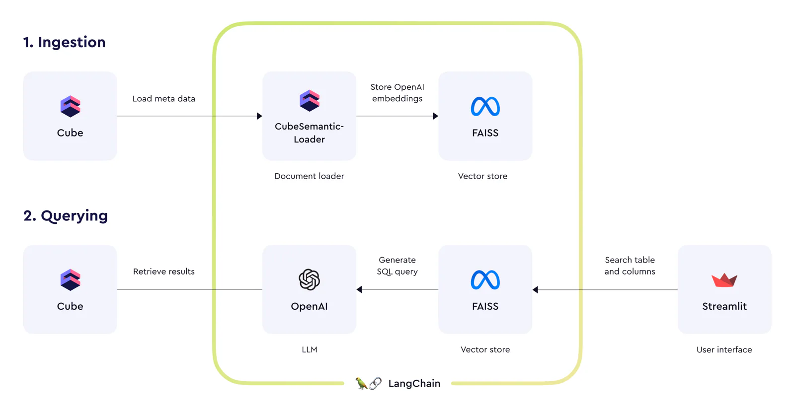
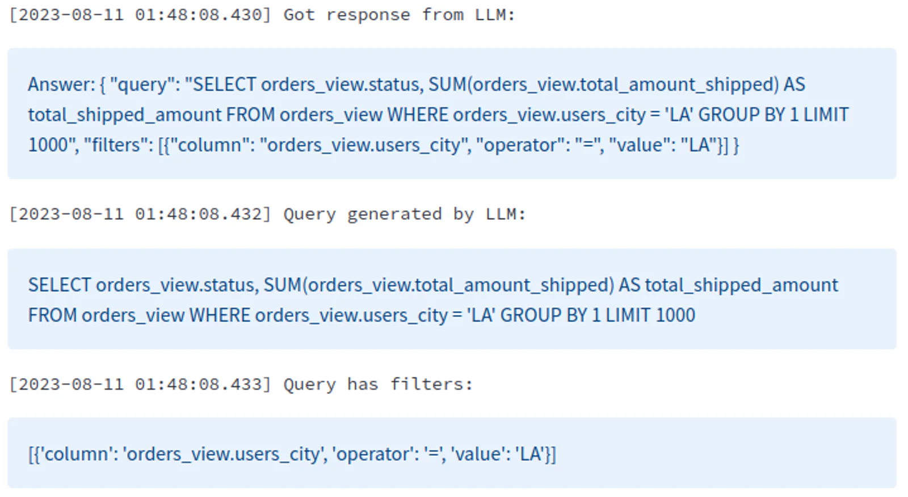

_Editor's Note: This post was written in collaboration with the [Cube](https://cube.dev/?ref=blog.langchain.com) team. The semantic layer plays a key role in ensuring correctness and predictability when building text-to-sql LLM-based applications. Their integration with LangChain makes it really easy to get started with building AI applications on top of the Cube semantic layer._

For many years already, we live in the data-driven world where accessing the data and deriving insights from it efficiently is paramount. This year, we experience an explosion of interest to artificial intelligence (AI) and large language models (LLMs) in particular, fueled by the latest developments in the technology and vast perspectives unfolding.

[LangChain](https://www.langchain.com/?ref=blog.langchain.com), an extensive toolkit for working with LLMs, has become one of the most important building blocks for developers of AI experiences. At Cube, we know that our semantic layer is also an important building block for AI applications because Cube not only centralizes metrics calculations but also serves an [antidote to AI hallucinations](https://cube.dev/blog/semantic-layer-the-backbone-of-ai-powered-data-experiences?ref=blog.langchain.com).

## **Semantic document loader**

Today, we're happy to present Cube's integration with LangChain. It comes as the [document loader](https://python.langchain.com/docs/integrations/document_loaders/cube_semantic?ref=blog.langchain.com) that is intended to be used to populate a vector database with embeddings derived from the data model of the semantic layer. Later, this vector database can be queried to find best-matching entities of the semantic layer. This is useful to match free-form input, e.g., queries in a natural language, with the views and their members in the data model.



We're also providing an chat-based demo application (see [source code](https://github.com/cube-js/cube/tree/master/examples/langchain?ref=blog.langchain.com) on GitHub) with example [OpenAI prompts](https://github.com/cube-js/cube/blob/master/examples/langchain/utils.py?ref=blog.langchain.com#L48,L87) for constructing queries to Cube's [SQL API](https://cube.dev/docs/product/apis-integrations/sql-api?ref=blog.langchain.com). If you wish to create an [AI-powered conversational interface](https://cube.dev/blog/conversational-interface-for-semantic-layer?ref=blog.langchain.com) for the semantic layer, functioning similar to [Delphi](https://www.delphihq.com/?ref=blog.langchain.com), these prompts can be a good starting point.

## **Chat-based demo app, dissected**

Here's what you can build with the all-new document loader for LangChain, a vector database, an LLM by [OpenAI](https://openai.com/?ref=blog.langchain.com), and [Streamlit](https://streamlit.io/?ref=blog.langchain.com) for the user interface:


/

1×

See how the tables, columns, aggregations, and filters in the SQL query generated by an LLM match the human input. Check the [README file on GitHub](https://github.com/cube-js/cube/blob/master/examples/langchain/README.md?ref=blog.langchain.com) for pointers on running this demo application on your machine or skim through the following highlights.

**Ingesting metadata from Cube and populating the vector database.** The `ingest_cube_meta` function in the `ingest.py` file loads the data model from Cube using the all-new `CubeSemanticLoader`. Note that only [views](https://cube.dev/docs/product/data-modeling/reference/view?ref=blog.langchain.com) are loaded as they are considered the ["facade" of the data model](https://cube.dev/blog/complementing-data-graph-with-views?ref=blog.langchain.com). Loaded documents are then embedded and saved in the FAISS vector store, which is subsequently pickled for later use.

```
def ingest_cube_meta():
    ...
    loader = CubeSemanticLoader(api_url, api_token)
    documents = loader.load()
    ...
    with open("vectorstore.pkl", "wb") as f:
        pickle.dump(vectorstore, f)
```

**LLM setup.** In the `main.py` file, dependencies are imported and the environment variables are loaded. The OpenAI model (`llm`) is initialized with the provided API key.

```
import ...
load_dotenv()
llm = OpenAI(
    temperature=0,
    openai_api_key=os.environ.get("OPENAI_API_KEY"),
    verbose=True
)
```

**User input and vector store initialization.** In the same file, Streamlit primitives are utilized to get user input:

```
question = st.text_input(
    "Your question: ",
    placeholder="Ask me anything ...",
    key="input"
)
if st.button("Submit", type="primary"):
    check_input(question)
    vectorstore = init_vectorstore()
```

**Querying the vector store.** The vector store is queried for documents similar to the user's question. The best match's table name is extracted and taken as the best guess to try to create a prompt using the columns from vectorstore:

```
docs = vectorstore.similarity_search(question)
    # take the first document as the best guess
    table_name = docs[0].metadata["table_name"]

    # Columns
    columns_question = "All available columns"
    column_docs = vectorstore.similarity_search(
        columns_question,
        filter=dict(table_name=table_name),
        k=15
    )
```

**Building the prompt and calling OpenAI.**\\* The OpenAI large language model is called with the constructed prompt, and the response is parsed to extract the SQL query and any associated filters:

```
# Construct the prompt
prompt = CUBE_SQL_API_PROMPT.format(
    input_question=question,
    table_info=table_name,
    columns_info=columns,
    top_k=1000,
    no_answer_text=_NO_ANSWER_TEXT,
)
llm_answer = llm(prompt + PROMPT_POSTFIX)
```



## **Wrapping up**

Cube's integration with LangChain provides a seamless interface for querying data using natural language. By abstracting the complexities of SQL and leveraging the power of LLMs, it provides the builders of AI experiences with a user-friendly and error-prone approach to data access.

> It is essential for enterprises to leverage internal knowledge correctly with the power of LLM’s reasoning. Cube’s semantic layer integration with LangChain is a great example of how most product companies will eventually write smart integrations for LLMs to better power these reasoning engines.