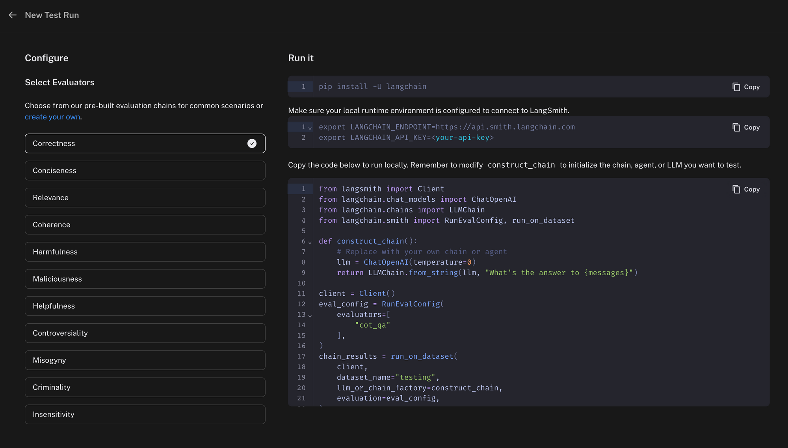
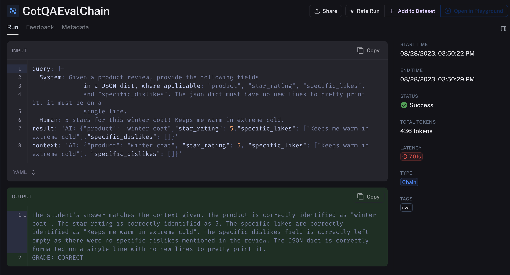
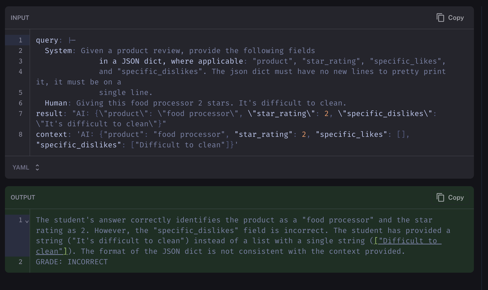
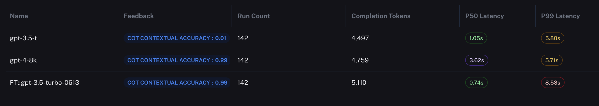
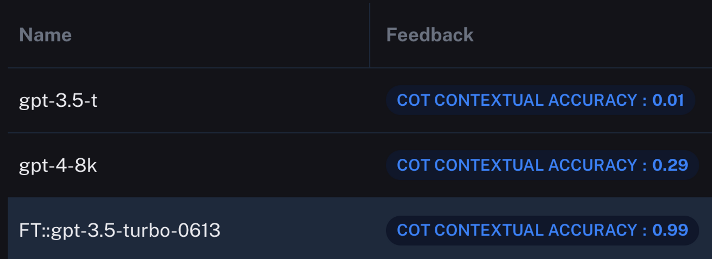

_Editor's Note: This post was written in collaboration with_ Author _Ryan Brandt from_ _the [ChatOpenSource.com](http://chatopensource.com/?ref=blog.langchain.com) team. It's a detailed look at how fine-tuning can meaningfully improve model performance. And how [LangSmith](https://www.langchain.com/langsmith?ref=blog.langchain.com) \+ LangChain can help you experiment with different models and measure and compare results._

Unable to use gpt-3.5-turbo for your most critical AI workflows? Then it’s time to think about fine-tuning. Today, we’ll dive into the perks, prep steps, and cost-cutting advantages, all while putting it to the test with Langchain’s AI evaluator, LangSmith. It’s the next-level upgrade you’ve been searching for.

### **Why Fine-Tuning should interest you**

At [ChatOpenSource.com](http://chatopensource.com/?ref=blog.langchain.com), we see fine-tuning as your next step when out-of-the-box models just don’t cut it. Why keep rephrasing prompts when you can teach your model to grasp context, tone, and complexity? Or those pesky edge cases. Think of it as “showing” rather than “telling” your AI what you need. Trust me, you’ll want to stick around to the end to learn more.

### **Why Fine-Tuning is a Game-Changer**

- Ensure greater consistency in style, tone, or format.
- Amplify the reliability of your desired outputs.
- Improve the model's understanding of complex or highly specific prompts.
- Address unique edge cases more effectively.
- Train your model in tasks that are hard to articulate in a prompt.
- cost savings from shorter overall prompts, and using \`gpt-3.5-turbo\* over using larger prompts with `gpt-4`

### Mastering Data Prep: The Secret Sauce of Fine-Tuning

Before diving into fine-tuning, arm yourself with a robust set of training examples that reflect the dialogues you expect the model to handle. Ensure each dataset aligns with OpenAI's **[Chat completions API](https://platform.openai.com/docs/api-reference/chat/create?ref=blog.langchain.com)** guidelines, as illustrated below.

Our sample training setup feeds the chatbot a directive under the **`System`** role, followed by a **`User`** prompt and the corresponding correct answer.

```python
{
        "messages": [{\
            "role": "system",\
            "content": "Given a product review, provide the following fields in a JSON dict, where applicable: \"product\", \"star_rating\", \"specific_likes\", and \"specific_dislikes\"."\
        },\
            {\
                "role": "user",\
                "content": "This desk chair gets 2 stars from me. It's uncomfortable and the height adjustment is faulty."\
            },\
            {\
                "role": "assistant",\
                "content": """{\
                    "product": "desk chair",\
                    "star_rating": 2,\
                    "specific_likes": [],\
                    "specific_dislikes": ["Uncomfortable", "faulty height adjustment"]\
                }"""\
            }\
        ]
    }
```

Never underestimate the value of edge-case examples, especially when a prompt is missing information crucial for generating structured JSON outputs. OpenAI recommends a baseline of 10 examples for **`gpt-3.5-turbo`** fine-tuning, but the more you include, the more you optimize performance. In this article, we're using only 20 training examples to shine the spotlight on how powerful high quality datasets can be.

### **Cost Efficiency with Fine-Tuning**

Don’t underestimate fine-tuning’s ability to slash both costs and lag time. If `gpt-4` has been good to you, you may discover that a fine-tuned `gpt-3.5-turbo` delivers equal or even better results—plus the perks of speedier and more efficient operations. Next, let’s dive into how the pricing models stack up.

| Model | Training | Input usage | Output usage |
| --- | --- | --- | --- |
| GPT-3.5 Turbo 4K context | N/A | $0.0015 / 1K tokens | $0.002 / 1K tokens |
| GPT-3.5 Turbo 16K context | N/A | $0.003 / 1K tokens | $0.004 / 1K tokens |
| GPT-3.5 Turbo Fine-Tuned | $0.0080 / 1K tokens | $0.0120 / 1K tokens | $0.0160 / 1K tokens |
| GPT-4 8K context | N/A | $0.03 / 1K tokens | $0.06 / 1K tokens |
| GPT-4 32K context | N/A | $0.06 / 1K tokens | $0.12 / 1K tokens |

As you can see, `gpt-4` isn’t cheap, and while relying on larger context windows is currently in vogue, for the moment your wallet won’t be a fan.

### How LangSmith Evaluation Works

Before we unveil each model’s performance, let’s get familiar with our evaluation process. LangSmith provides ready-to-use evaluators, but you’re free to build your own. In our case, we’re leveraging `gpt-4` to assess the outputs from various models, using a chain-of-thought Q&A prompt. If the model’s answer doesn’t match the expected response, it’s labeled INCORRECT. Just like DataDog, you run the code on your end and send the results to LangSmith for logging and comparison.

LangSmith’s pre-built evaluators.

Here’s an example of output from gpt-3.5-turbo-finetunedbeing evaluated. gpt-4 uses the provided context in the input as an example of “correct”. You can see how based on that context, the fine tuned model outputted successfully.

gpt-3.5-turbo Fine tuned on 20 training examples

gpt-4 on the other hand with the same prompt, fails to pass the same bar:

gpt-4-8k incorrectly returning the proper format

### Benchmarking Performance

Now we use LangSmith to determine the efficacy of our fine tuning. We do this by evaluating the baseline **`gpt-3.5-turbo`** , then performing the same evaluation on our **`gpt-3.5-turbo-finetuned`** and comparing the results.

LangSmith allows you to easily compare models on the same dataset

When I evaluate the baseline `gpt-3.5-turbo`on 142 example product reviews, it’s median runtime is roughly a third faster. It’s worth noting that the P99 of our fine tuned model is higher, but that was not the case every time we ran a test run.

However, it’s really the accuracy where things get interesting. LangSmith measures the output accuracy of **`gpt-3.5-turbo-finetuned`** at 99 percent correct. It got only 1 incorrect. Let’s take a look at the other models.



The results are… surprising. Our fine tuned model absolutely destroyed both its baseline self and its upgraded `gpt-4` in output performance. It is true that with larger prompting, `gpt-4` and likely `3.5` might have attained the same performance as the fine tuned model, but our test uses the same prompt for each model to emphasize the difference in outcome.

Let’s plug in the cost numbers from before to show the difference in cost between each run, assuming usage in a low transaction production environment:

| Model | Input Tokens | Output Tokens | Input Cost ($) | Output Cost ($) | Training Cost ($) | Total Cost ($) |
| --- | --- | --- | --- | --- | --- | --- |
| gpt-3.5-t | 3,000,000 | 1,000,000 | 4.5 | 2 | 0 | 6.5 |
| ft:gpt-3.5-turbo-0613 | 3,000,000 | 1,000,000 | 36 | 16 | 0.2 | 52.20 |
| gpt-4-8k | 3,000,000 | 1,000,000 | 90 | 60 | 0 | 150 |

So we can see that while fine tuning is almost 9 times more expensive than the baseline, it’s roughly 3 times cheaper than `gpt-4`, with substantially better accuracy, and a median response time of nearly 4 times faster. These are massive numbers!

### In Conclusion

Fine-tuning is not just an option but a strategic necessity for organizations seeking to optimize their AI models. We've demonstrated through LangSmith that a fine-tuned **`gpt-3.5-turbo`** model can dramatically outperform its baseline and even **`gpt-4`** in terms of accuracy, response time, and cost-efficiency. Don’t miss the opportunity to supercharge your LLMs-It’s the AI boost your company has been waiting for.

At [ChatOpenSource.com](http://chatopensource.com/?ref=blog.langchain.com) we’re the go-to experts in fine-tuning both OpenAI and open-source models like **`llaama-2`**. Don’t let the AI revolution leave your organization in the dust. We’re experts in customizing high-performance, open-source AI models to fit your data—all at a fraction of the cost of building an in-house ML team. Stay ahead of the curve with [www.ChatOpenSource.com](http://www.chatopensource.com/?ref=blog.langchain.com).