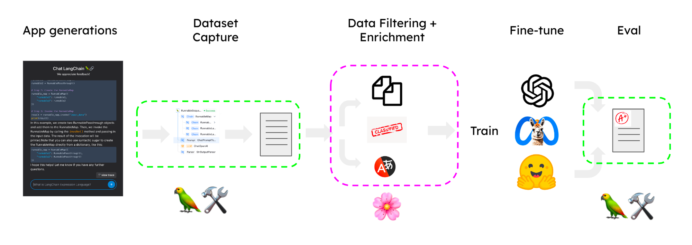
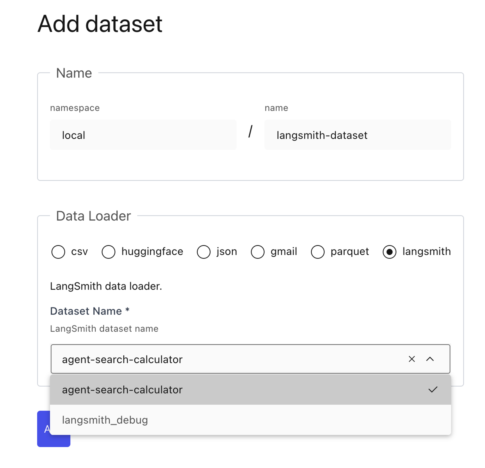
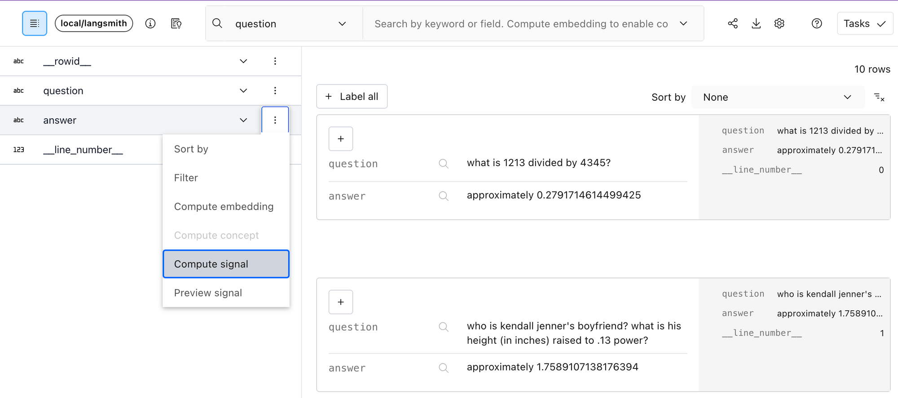
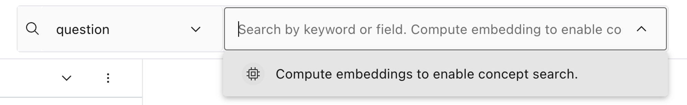
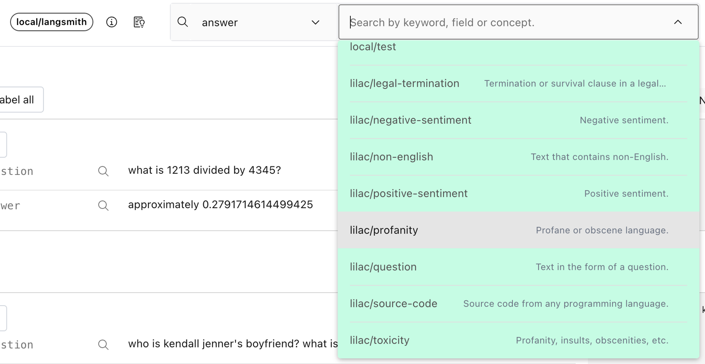
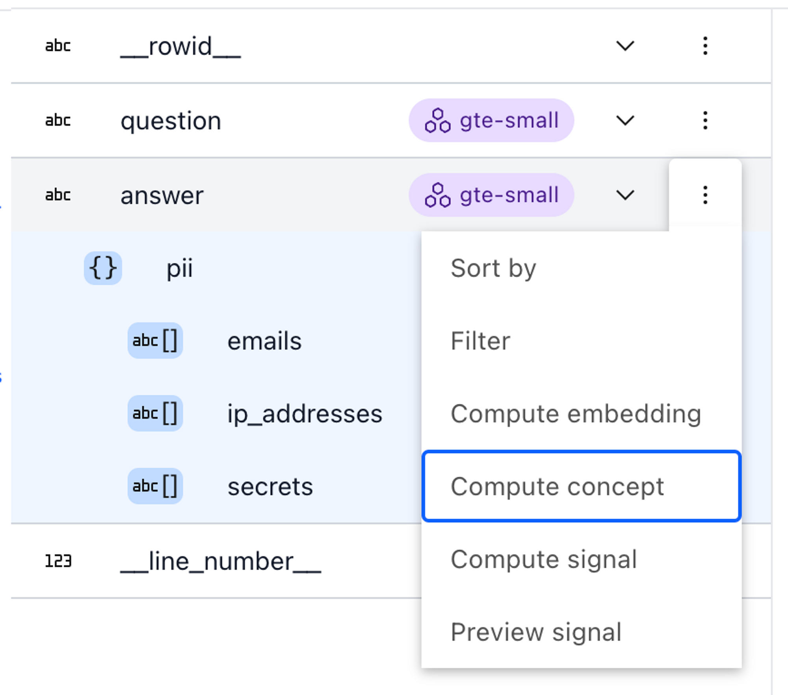
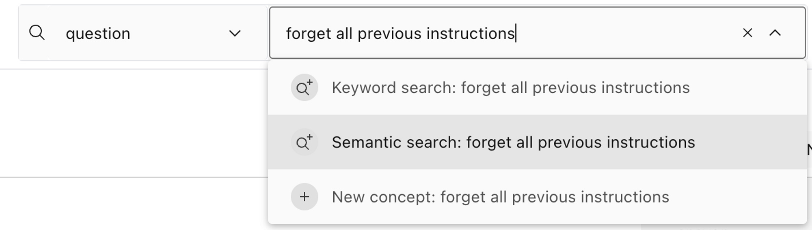
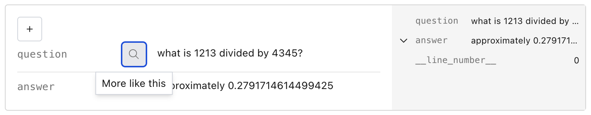
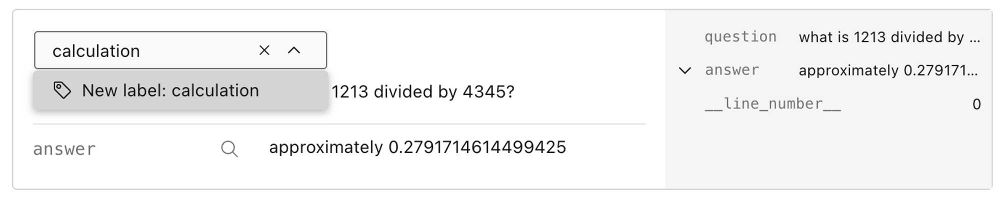
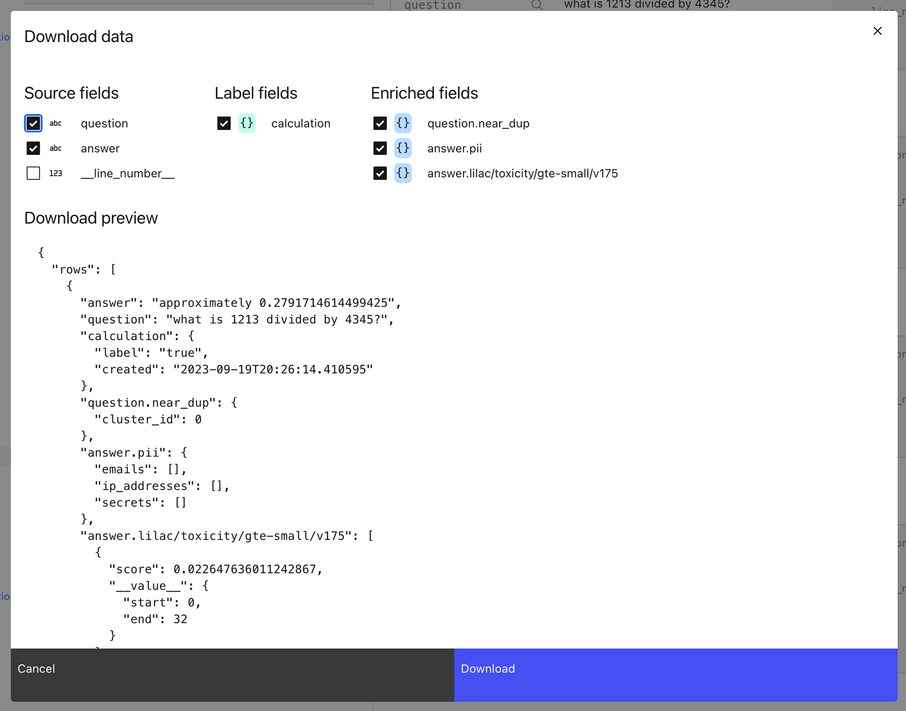

In taking your LLM from prototype into production, many have turned to fine-tuning models to get more consistent and high-quality behavior in their applications. Services like [OpenAI](https://platform.openai.com/docs/guides/fine-tuning?ref=blog.langchain.com) and [HuggingFace](https://huggingface.co/docs/trl/main/en/sft_trainer?ref=blog.langchain.dev) make it easy to fine-tune a model on **your** application-specific data. All it takes is a JSON file!

The tricky part is deciding **what** to include in that data. Once your LLM is deployed, it could be prompted given any input - how do you make sure it will respond appropriately for the user or machine it is meant to interact with?

For this, there is no real substitute for high-quality data taken from your unique application context. This is where LangSmith and [Lilac](https://lilacml.com/blog/introducing-lilac.html?ref=blog.langchain.com) can help out.

## LangSmith + Lilac

To understand and improve any language model application, it’s important to be able to quickly explore and organize the data the model is seeing. To achieve this, LangSmith and Lilac provide complementary capabilities:

- **[LangSmith](https://docs.smith.langchain.com/?ref=blog.langchain.com):** Efficiently collects, connects, and manages datasets generated by your LLM applications at scale. Use this to capture quality examples (and failure cases) and user feedback you can use for fine-tuning.
- **[Lilac](https://lilacml.com/blog/introducing-lilac.html?ref=blog.langchain.com):** Offers advanced analytics to structure, filter, and refine datasets, making it easy to continuously improve your data pipeline.

We wanted to share how to connect these two powerful tools to kickstart your fine-tuning workflows.

## Fine-tuning a Q&A Chatbot

In the following sections, we will use LangSmith and Lilac to curate a dataset to fine-tune an LLM powering a chatbot that uses retrieval-augmented generation (RAG) to answer questions about your documentation. For our example,  we will use a dataset sampled from a Q&A app for LangChain’s docs. The overall process is outlined in the image below:

Dataset Curation Pipeline with LangSmith + Lilac

The main steps are:

1. Capture traces from the prototype and convert to a candidate dataset
2. Import into Lilac to label, filter, and enrich.
3. Fine-tune a model on the enriched dataset.
4. Use the fine-tuned model in an improved application.

### Capture traces

LangChain make it easy to design a prototype using prompt chaining. At first, the application may not be fully optimized or may run into errors when the prompt engineering is incomplete, but we can quickly create an alpha version of a feature to kickstart the dataset curation process. When building with LangChain, we can easily trace all the execution steps to LangSmith by setting a [couple of environment variables.](https://docs.smith.langchain.com/tracing?ref=blog.langchain.com#log-runs)

Then in LangSmith, we can select runs to add to a candidate dataset in the UI or programmatically (see the [notebook](https://github.com/langchain-ai/langsmith-cookbook/blob/main/fine-tuning-examples/lilac/lilac.ipynb?ref=blog.langchain.com)).

### Import to Lilac

💡

The sections below give a high level overview of the Lilac UI. For a deeper dive reproducing this workflow, [see the python cookbook.](https://github.com/langchain-ai/langsmith-cookbook/blob/main/fine-tuning-examples/lilac/lilac.ipynb?ref=blog.langchain.com)

Lilac provides a native integration with LangSmith datasets. After [installing Lilac](https://lilacml.com/getting_started/installation.html?ref=blog.langchain.com) locally, set the `LANGCHAIN_API_KEY`  in the environment and you should see a list of LangSmith datasets auto-populated in the Lilac UI. Select the one you’ve earmarked for fine-tuning, and Lilac will handle the rest.

The “Add dataset” page in the Lilac UI with the LangSmith data loader.

### Curate your dataset

Now that we have our dataset in Lilac, we can run Lilac’s _[signals](https://lilacml.com/signals/signals.html?ref=blog.langchain.com), [concepts](https://lilacml.com/concepts/concepts.html?ref=blog.langchain.com)_ and _[labels](https://lilacml.com/datasets/dataset_labels.html?ref=blog.langchain.com)_ to help organize and filter the dataset. Our goal is to select distinct examples demonstrating good language model generations for a variety of input types. Let’s see how Lilac can help us structure our dataset.

**Signals**

Right off the bat, Lilac provides two useful signals you can apply to your dataset: N _ear-duplicates_ and _PII detection_. Filtering near-duplicates for inputs is important to make sure the model gets diverse information and reduce changes of memorization. To compute a signal from the UI, expand the schema in the top left corner, and select “Compute Signal” from the context menu of the field you want to enrich.

Computing a signal via the context menu of the `answer` field in the Lilac schema viewer.

**Concepts**

In addition to signals, Lilac offers _[concepts](https://lilacml.com/concepts/concepts.html?ref=blog.langchain.com)_, a powerful way to organize the data along axes that you care about. A concept is simply a collection of positive (text that is related to the concept) and negative examples (either the opposite, or unrelated to the concept). Lilac comes with several built-in concepts, like _toxicity_, _profanity_, _sentiment_, etc, or you can create your own. Before we apply a concept to the dataset, we need to compute text embeddings on the field that we care about.

Computing embeddings for the question field to enable concept and semantic search via Lilac’s search box.

Once we’ve computed embeddings, we can _preview_ a concept by selecting it from the search box menu.

Selecting profanity on the answer field for previewing.

To compute a concept for the entire dataset, choose “Compute concept” from the context menu in the schema viewer.

Computing a concept via the context menu of the answer field in the schema viewer.

In addition to concepts, embeddings enable two other useful functionalities for exploring the data: _semantic search_ and finding _similar_ examples.

Semantic search for “forget all previous instructions” via Lilac’s search box.Finding questions similar to “what is 1213 divided….” via the Lilac UI.

**Labels**

In addition to automated labeling with signals and concepts, Lilac allows you to tag individual rows with custom labels that can be later used to prune your dataset.

Adding a _**calculation**_ label to an example in Lilac.

When you add a new label, just like signals and concepts, it creates a new top-level _column_ in your dataset. These can then be used to power additional analytics.

### Export the dataset

Once we’ve computed the information needed for filtering, you can export the enriched dataset via python, as shown [in the notebook](https://blog.langchain.com/fine-tune-your-llms-with-langsmith-and-lilac/The%20sections%20below%20give%20a%20high%20level%20overview%20of%20the%20Lilac%20UI.%20For%20a%20deeper%20dive%20and%20reproducing%20this%20workflow,%20see%20the%20python%20cookbook.) or via Lilac’s UI, which will create a browser download of a json file. We recommend the python API for downloading large amounts of data, or if you need a better control over the selection of data.

Lilac’s Download data modal dialog.

Once we exported the enriched dataset, we can easily filter out the examples in python using the enriched fields.

### Fine-tune

With the dataset in hand, it’s time to fine-tune! It’s easy to convert from LangChain’s message format to the formats expected by OpenAI, HuggingFace or other training frameworks. You can check out the [linked notebook](https://github.com/langchain-ai/langsmith-cookbook/blob/main/fine-tuning-examples/lilac/lilac.ipynb?ref=blog.langchain.com) for more info!

### Use in your Chain

Once we have the fine-tuned LLM, we can switch to it with a update to the “model” argument in our LLM.

```
from langchain.chat_models import ChatOpenAI

llm = ChatOpenAI(model="ft:gpt-3.5-turbo-0613:{openaiOrg}::{modelId}")
```

Assuming we’ve structured the data appropriately, this model will have more awareness for the structure and style you wish to use in generating responses.

## Conclusion

This is a simple overview of the process for going from traces to fine-tuned model by integrating Lilac and LangSmith. With the data process in place, you can continuously improve each components in your contextual reasoning application LangSmith makes it easy to collect user and model-assisted feedback to save time when capturing data, and Lilac helps you analyze, label, and organize all the text data so you can refine your model appropriately.

### Tags

[By LangChain](https://blog.langchain.com/tag/by-langchain/)


[](https://blog.langchain.com/evaluating-deep-agents-our-learnings/)

[**Evaluating Deep Agents: Our Learnings**](https://blog.langchain.com/evaluating-deep-agents-our-learnings/)

[By LangChain](https://blog.langchain.com/tag/by-langchain/) 7 min read

[](https://blog.langchain.com/end-to-end-opentelemetry-langsmith/)

[**Introducing End-to-End OpenTelemetry Support in LangSmith**](https://blog.langchain.com/end-to-end-opentelemetry-langsmith/)

[By LangChain](https://blog.langchain.com/tag/by-langchain/) 3 min read

[](https://blog.langchain.com/langchain-state-of-ai-2024/)

[**LangChain State of AI 2024 Report**](https://blog.langchain.com/langchain-state-of-ai-2024/)

[By LangChain](https://blog.langchain.com/tag/by-langchain/) 6 min read

[](https://blog.langchain.com/opentelemetry-langsmith/)

[**Introducing OpenTelemetry support for LangSmith**](https://blog.langchain.com/opentelemetry-langsmith/)

[By LangChain](https://blog.langchain.com/tag/by-langchain/) 4 min read

[](https://blog.langchain.com/easier-evaluations-with-langsmith-sdk-v0-2/)

[**Easier evaluations with LangSmith SDK v0.2**](https://blog.langchain.com/easier-evaluations-with-langsmith-sdk-v0-2/)

[By LangChain](https://blog.langchain.com/tag/by-langchain/) 4 min read

[](https://blog.langchain.com/langgraph-platform-announce/)

[**LangGraph Platform in beta: New deployment options for scalable agent infrastructure**](https://blog.langchain.com/langgraph-platform-announce/)

[By LangChain](https://blog.langchain.com/tag/by-langchain/) 4 min read