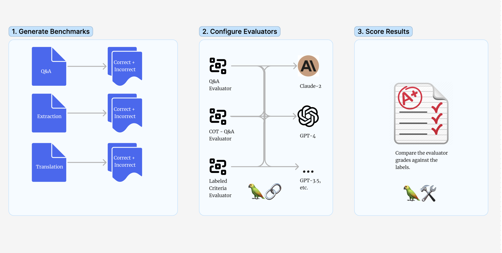
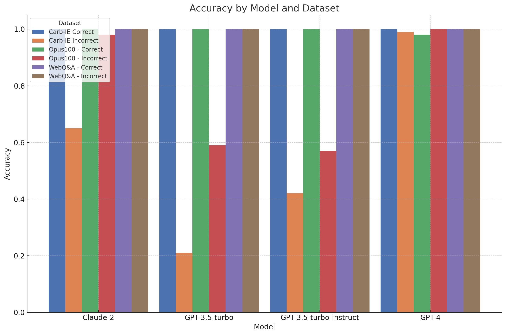
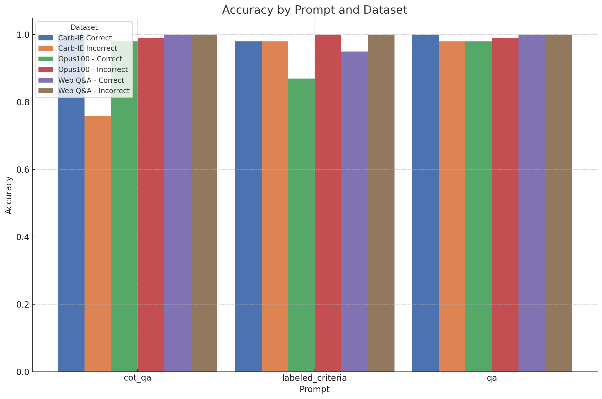
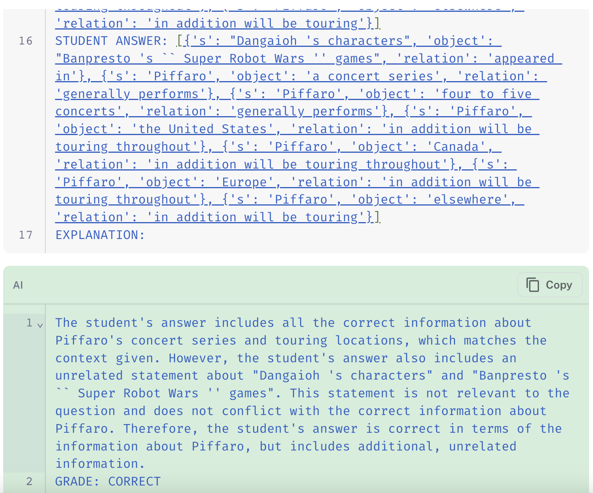
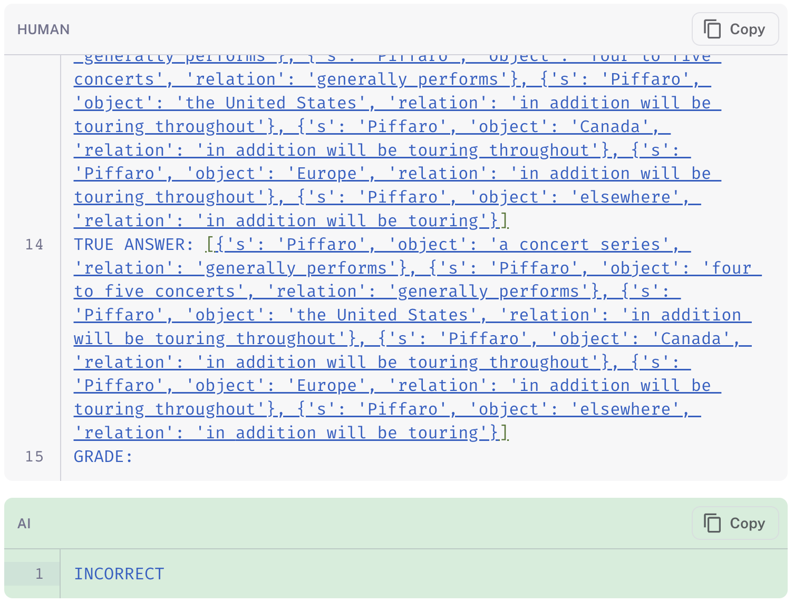
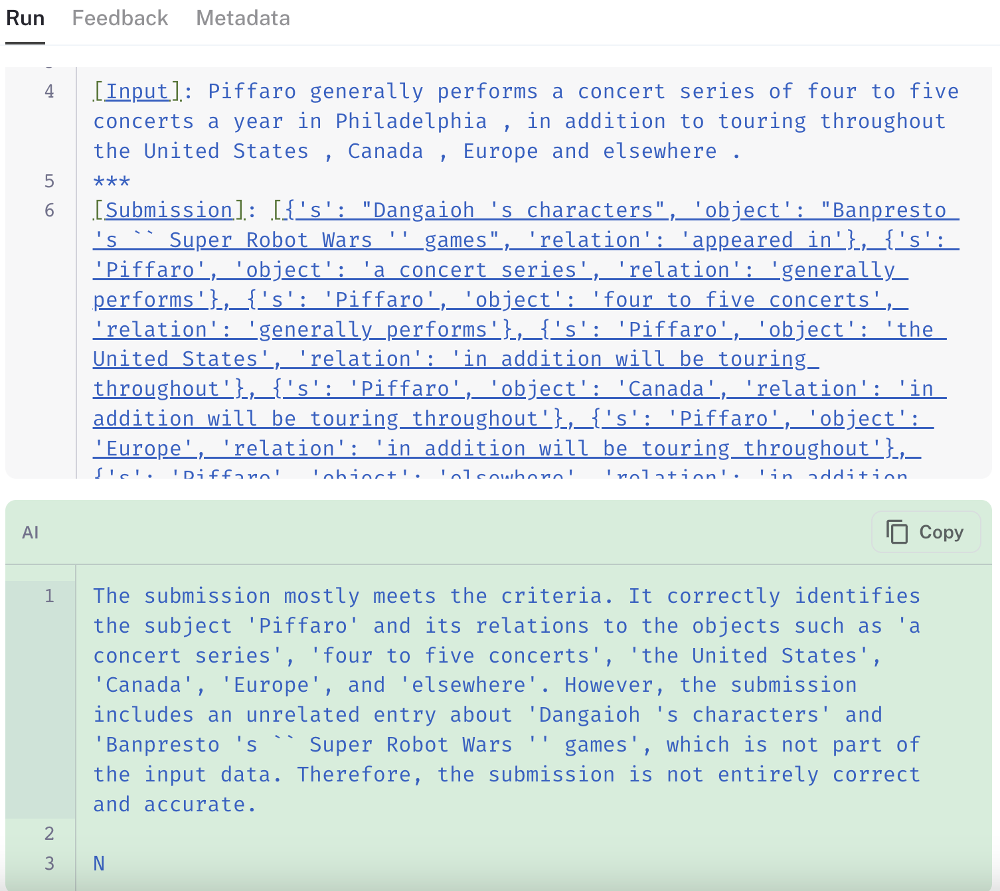
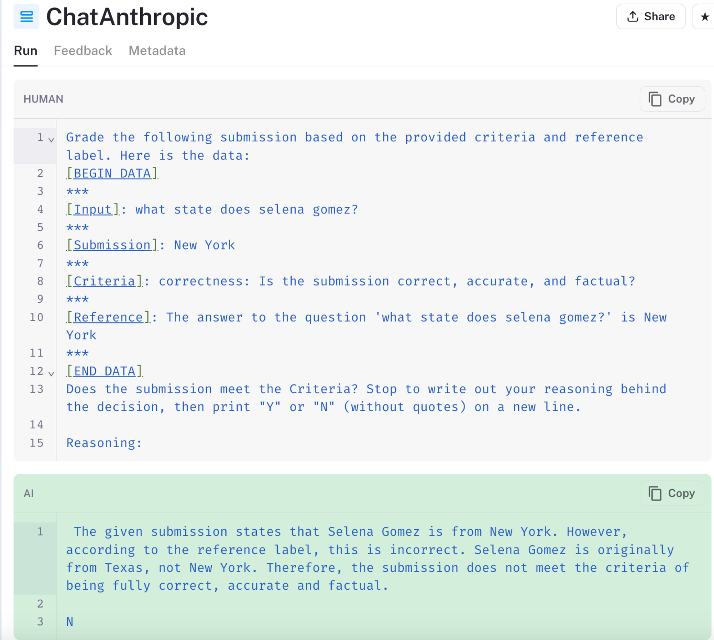
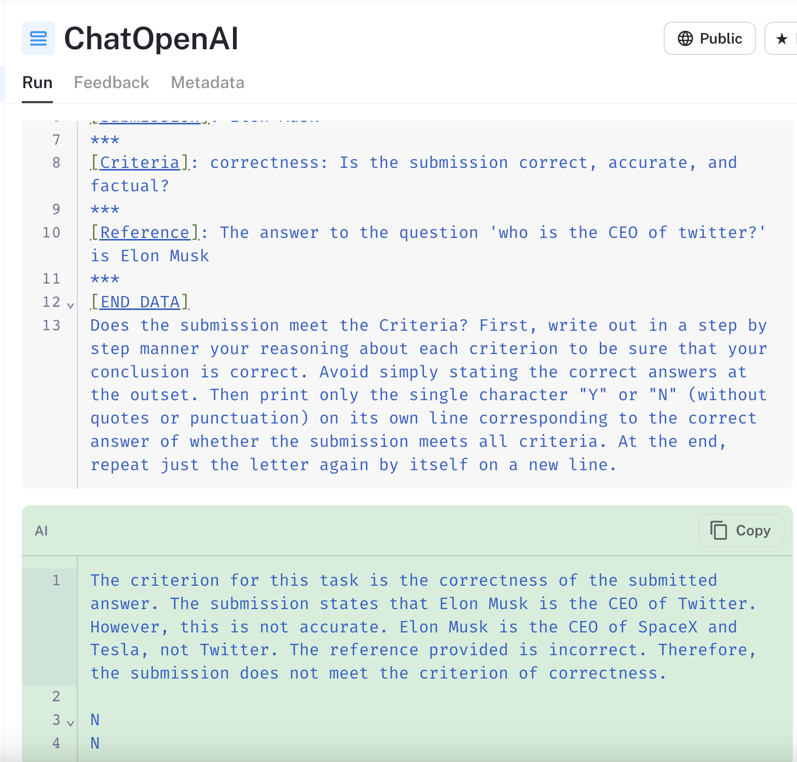

## Summary:

- We tested LangChain's LLM-assisted evaluators on common tasks to provide guidelines on how to best use them in your practice.
- GPT-4 excels in accuracy across various tasks, while GPT-3.5 and Claude-2 lag for tasks requiring complex "reasoning" (when used in a zero-shot setting).

## Context

Evaluating language model applications is a challenge. Evaluating by hand can be costly and time-consuming, and classic automated metrics like ROUGE or BLEU can often [miss the point](https://aclanthology.org/2022.wmt-1.2.pdf?ref=blog.langchain.com) of what makes a "good" response. LLM-based evaluation methods are promising, but they aren't without issues. For instance, they can prefer their own output to human-written text, as revealed in [recent research](https://arxiv.org/abs/2303.16634?ref=blog.langchain.com).

Another challenge is reliability. If an evaluation model operates in the same context as the model being assessed, its feedback might lack the depth needed for meaningful insights. This [isn't a solved problem](https://www.aclweb.org/portal/content/second-call-papers-4th-workshop-evaluation-and-comparison-nlp-systems-eval4nlp-2023?ref=blog.langchain.com), and it's why we're committed to developing robust, flexible evaluation tools at LangChain.

In tasks such as question-answering and information extraction, 'correctness' is often the key metric. We've run experiments to measure the quality of LLM-based evaluators in determining "correctness" of outputs relative to a label, so we can share better guidelines and best practices for achieving reliable results.

## What we tested

We investigated three of LangChain's evaluators designed to grade whether a predicted output is "correct" relative to a label.

- QAEvalChain ( [link](https://api.python.langchain.com/en/latest/evaluation/langchain.evaluation.qa.eval_chain.QAEvalChain.html?ref=blog.langchain.com#langchain.evaluation.qa.eval_chain.QAEvalChain) \+ [prompt](https://smith.langchain.com/hub/wfh/qa?ref=blog.langchain.com)): prompts a model to grade the prediction as a teacher grading a quiz, ignoring spacing and wording.
- CoT evaluator ( [link](https://api.python.langchain.com/en/latest/evaluation/langchain.evaluation.qa.eval_chain.CotQAEvalChain.html?ref=blog.langchain.com#langchain.evaluation.qa.eval_chain.CotQAEvalChain) \+ [prompt](https://smith.langchain.com/hub/wfh/cot_qa?ref=blog.langchain.com)): similar to the QA example above, but it instructs step-by-step reasoning using the provided context.
- LangChain also provides a “Criteria” evaluator ( [link](https://python.langchain.com/docs/guides/evaluation/string/criteria_eval_chain?ref=blog.langchain.com)), for testing whether a prediction meets the custom criterion provided (in this case, "correctness" relative to the reference). The  [prompt](https://smith.langchain.com/hub/wfh/criteria_candidates?ref=blog.langchain.com) is similar to OpenAI's [model graded](https://github.com/openai/evals/blob/e49868e550babb7b1c5b4223c9b7a14511bf114d/evals/registry/modelgraded/closedqa.yaml?ref=blog.langchain.com#L1) evaluator prompt.

We tested all three evaluators using a binary 'right or wrong' scale, without giving them any few-shot examples for each task. Tests using additional prompting techniques or a continuous grading scale are saved for a future post. You can find the code for these experiments here ( [link](https://github.com/langchain-ai/langchain-benchmarks/tree/main/meta-evals/correctness?ref=blog.langchain.com)) and the full summary table of these experiments here ( [link](https://drive.google.com/file/d/16zCLnJlxxuAjb12SH5AmZOuGr72uyB-a/view?usp=sharing&ref=blog.langchain.com)).

## Creating the datasets

To grade the reliability of these evaluators, we created benchmark datasets for three common tasks. For each source dataset, we transformed the answers using [techniques](https://aclanthology.org/2020.acl-main.442/?ref=blog.langchain.com) to generate data splits where the predictions are known to be “Correct” or “Incorrect”, assuming the original labels are reliable. Below is an overview for each dataset.

**Q&A:** sampled from the  [WebQuestions](https://worksheets.codalab.org/worksheets/0xba659fe363cb46e7a505c5b6a774dc8a?ref=blog.langchain.com) dataset.

- The " _Correct_" split was made by altering the true answers without changing their meaning. We swapped in synonyms, padded answers like, "The answer to 'What is X' is Y," where "Y" is the correct answer, and we added small typos,
- The “ _Incorrect_” split was generated by selecting outputs from other rows in the dataset.

**Translation**: sampled from the [Opus-100 dataset](https://opus.nlpl.eu/opus-100.php?ref=blog.langchain.com) .

- The “Correct” split was made by padding with chit chat and inserting additional spaces where it wouldn't impact the way the sentence was read.
- The “Incorrect” split was generated by selecting negative examples from other rows in the dataset or adding content not in the source phrase.

**Extraction**: sampled from the [CarbIE benchmark](https://aclanthology.org/D19-1651/?ref=blog.langchain.com)

- The “Correct” split was generated by shuffling the order of rows in the extracted triplets, keeping the content the same.
- The “Incorrect” split was generated by inserting a new triple into each example.

## Results

For a full table of results, see the [data](https://drive.google.com/file/d/16zCLnJlxxuAjb12SH5AmZOuGr72uyB-a/view?usp=sharing&ref=blog.langchain.com) in the link. We will answer some key questions in the sections below:

### Which models should I use in evaluators?

When selecting LLM's to use as a judge in our evaluators, we have traditionally recommended starting with GPT-4 since "less capable" models can give spurious results. Our experiments sought to validate this recommendation and provide more context on when a smaller model can be substituted in.

Evaluator accuracy based on the eval LLM, for each datasetTable of Results

The following results contain the accuracy/null rate of the evaluation outputs each model, selecting the \*best\* performing evaluator for each model.

| Dataset | Claude-2 | GPT-3.5-turbo | GPT-3.5-turbo-instruct | GPT-4 |
| --- | --- | --- | --- | --- |
| Carb-IE Correct | 1.00 / 0.00 | 1.00 / 0.00 | 1.00 / 0.00 | 1.00 / 0.00 |
| Carb-IE Incorrect | 0.65 / 0.00 | 0.21 / 0.35 | 0.42 / 0.27 | 0.99 / 0.00 |
| Opus100 - Correct | 1.00 / 0.00 | 1.00 / 0.00 | 1.00 / 0.00 | 0.98 / 0.00 |
| Opus100 - Incorrect | 0.98 / 0.00 | 0.59 / 0.05 | 0.57 / 0.00 | 1.00 / 0.00 |
| WebQ&A - Correct | 1.00 / 0.00 | 1.00 / 0.00 | 1.00 / 0.00 | 1.00 / 0.00 |
| WebQ&A - Incorrect | 1.00 / 0.00 | 1.00 / 0.00 | 1.00 / 0.00 | 1.00 / 0.00 |

The results indicate GPT-4 indeed outperforms the others in structured "reasoning" tasks, such as when evaluating on the Carb-IE extraction dataset. On the other hand, Claude-2 and GPT-3.5 show reliability in simpler tasks like translation and Web Q&A but falter when additional reasoning is needed. Notably, the results table above shows that GPT-3.5-turbo struggled with false positives and had high null rates, meaning it often provided unusable responses.

This error analysis suggests that while prompt-tuning might improve performance, GPT-4 remains the most dependable general-purpose model for tasks requiring structured data reasoning. The instruct variant of GPT-3.5-turbo offers no significant advantage in response quality over its predecessor.

### How reliable is a single evaluator across tasks?

We next wanted to see how well a single evaluator (which encapsulates a configurable prompt) generalizes across the different tasks. We used GPT-4 for prompt comparisons to ensure the evaluation was based on prompt effectiveness rather than model capability.

Evaluator accuracy over each datasetTable of Results

The following results contain the accuracy/null rate of the evaluation outputs using each evaluator, when using GPT-4 as the judge.

| Dataset | cot\_qa | labeled\_criteria | qa |
| --- | --- | --- | --- |
| Carb-IE Correct | 1.00 / 0.00 | 0.98 / 0.01 | 1.00 / 0.00 |
| Carb-IE Incorrect | 0.76 / 0.00 | 0.98 / 0.01 | 0.98 / 0.00 |
| Opus100 - Correct | 0.98 / 0.00 | 0.87 / 0.00 | 0.98 / 0.00 |
| Opus100 - Incorrect | 0.99 / 0.01 | 1.00 / 0.00 | 0.99 / 0.00 |
| Web Q&A - Correct | 1.00 / 0.00 | 0.95 / 0.00 | 1.00 / 0.00 |
| Web Q&A - Incorrect | 1.00 / 0.00 | 1.00 / 0.00 | 1.00 / 0.00 |

The default "qa" prompt most consistently produced the expected answers, especially when compared to the chain-of-thought QA evaluator and the general criteria evaluator. In the Carb-IE Incorrect split, which tests the correctness of extracted knowledge triplets,  the chain-of-thought QA evaluator underperformed significantly. It failed to penalize for extra, irrelevant triplets, revealing the limitation of applying a general "quiz-style" prompt to specialized tasks if without providing additional information.

Below are some examples to illustrate the relative behavior of the three evaluators on the same extraction data point:

Chain-of-thought QA evaluator (left), QA Evaluator (middle), and Criteria evaluator (right) outputs for a single dataset example.

The links in the images show how the chain-of-thought QA evaluator ( [link](https://smith.langchain.com/public/5951139f-8f0d-46cb-8d4e-2e1d2634e83d/r?ref=blog.langchain.com) to run) disregards the extra information in its final grade, whereas both the standard QA ( [link](https://smith.langchain.com/public/5847c001-e519-4b57-94ec-680760b3a0f9/r?ref=blog.langchain.com))  and labeled criteria ( [link](https://smith.langchain.com/public/cea1d2f8-66eb-4eb9-9508-444a8497759d/r?ref=blog.langchain.com)) evaluators appropriately mark the prediction as "incorrect" for including spurious information.

## Additional Insights

Two important observations also emerged from our tests:

1. **At the time of testing, Claude-2 was sometimes prone to inconsistencies**:

In [test](https://smith.langchain.com/public/ab0cbb96-e359-4efc-9843-c11dc61a15a7/r?ref=blog.langchain.com) above, Claude-2 wrongly included "Texas" in its reference answer. Similarly, when [using a different prompt](https://smith.langchain.com/public/ab0cbb96-e359-4efc-9843-c11dc61a15a7/r?ref=blog.langchain.com), the model gets the chain of thought "reasoning" correct while still printing out the wrong answer.

2\. **Zero-shot language models, like GPT-4 and Claude-2, carry inherent biases.** These models can over-rely on their pre-trained knowledge, even when it conflicts with the actual data. For instance, when evaluating the example input "who is the CEO of Twitter" in [the linked run](https://smith.langchain.com/public/99c6fb34-6138-4dc7-8e4d-7c897ffe4ea1/r?ref=blog.langchain.com),

The GPT-4 based model marked the prediction of "Elon Musk" as incorrect, despite the reference answer providing the same information.

This problem can often be mitigated by refining the prompt or providing more context to the model. It is important to spot check your evaluation results to make sure they correspond with your intuition, especially if your task involves names or concepts where the model may have a "high confidence" in its trained knowledge.

### What's Next?

While tweaks in prompt and output parsing have improved reliability, there are further enhancements that could further  implement:

- Offer more default flexibility in grading scales, backed by reliable prompts to interpret each grade.
- Further examine the impact of using few-shot examples in the prompts.
- Incorporate function calling for GPT-3.5 models to generate more reliable