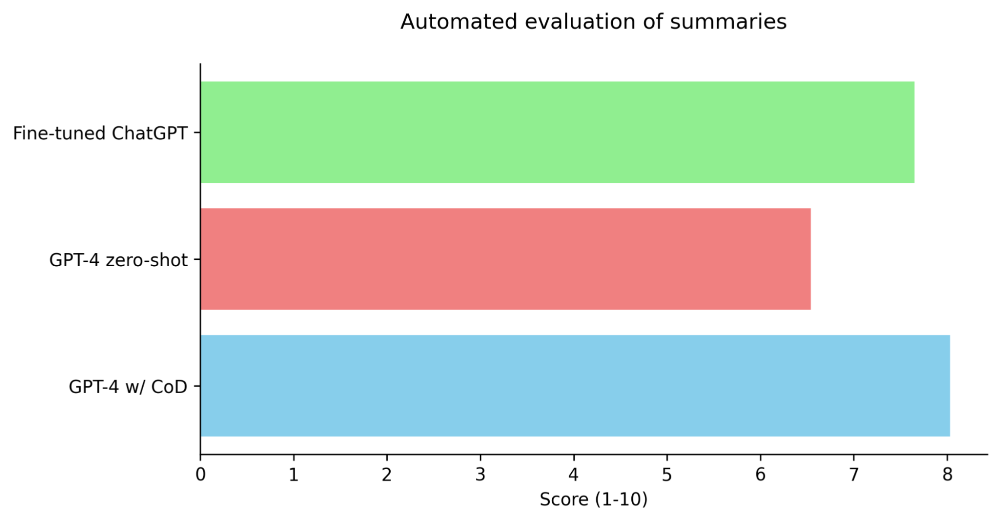
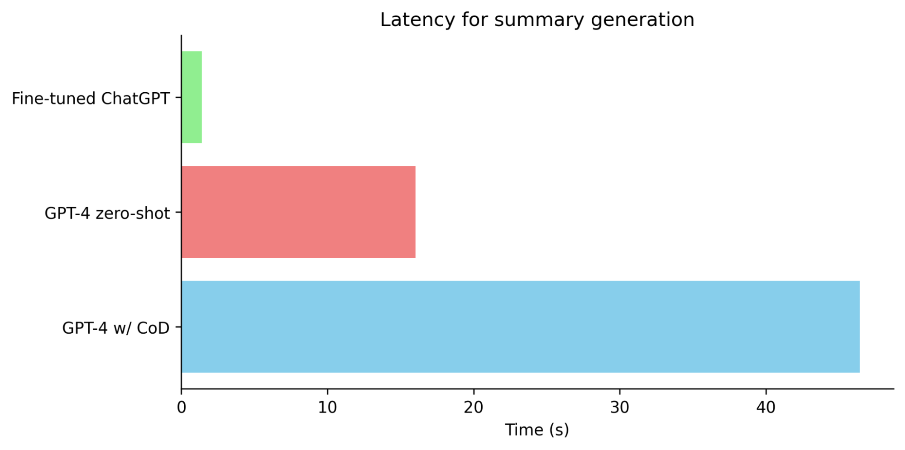
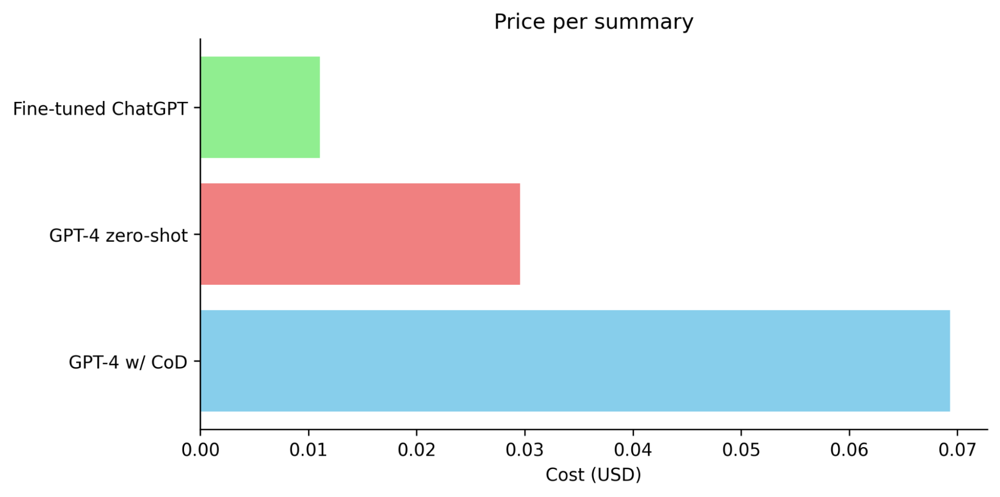

_Editor's Note: This post was written by [_Charlie George_](https://twitter.com/__Charlie_G?ref=blog.langchain.com), machine learning engineer at [_Elicit_](https://elicit.com/?ref=blog.langchain.com)._

### Summary

- Fine-tuned ChatGPT beats GPT-4 for news article summarization using only synthetic data.
- We quantify this improvement using human-level automated evaluation using the [ScoreStringEvalChain](https://python.langchain.com/docs/guides/evaluation/string/scoring_eval_chain?ref=blog.langchain.com) and improved [PairwiseStringEvalChain](https://python.langchain.com/docs/guides/evaluation/comparison/pairwise_string?ref=blog.langchain.com).

### Context

GPT-4 is widely regarded as the world’s best language model, often capable of outperforming the average human in tasks that can be described in under 1000 words. This makes it an attractive tool for developing AI-first applications in fields like law, medicine, and scientific research, where complex reasoning and understanding of nuanced topics are required.

The near AGI model is not without its challenges. Many developers create impressive demonstrations using GPT-4, only to encounter obstacles when it comes to deploying the model in a real-world setting. These obstacles include low rate limits, high costs, and latency. For instance, latency for GPT-4 is often measured in minutes which makes for a poor user experience.

To overcome these challenges, some developers opt to use smaller models like ChatGPT, Claude, or LLama. However, these models usually do not perform as well as GPT-4 and because of the challenges of LLM evaluation, this can lead to unexpectedly poor performance.

One potential solution to these issues is fine-tuning, a process that involves adjusting the model weights to better fit the specific task at hand. This can help improve performance while keeping costs and latency down. However, collecting human data can be both expensive and time-consuming. Furthermore, traditional ML metrics like perplexity or BLEU score do not accurately reflect the user experience, making assessing the effectiveness of the fine-tuned model difficult.

### Synthetic data generation

The simplest way to synthetic data generation is to train a weaker student model on the output of a more powerful teacher. However, this limits the fine-tuned to be at best just as good but probably slightly worse than the teacher model.

A more interesting approach is to take the data from the teacher model to filter it or improve it in some way before fine-tuning. Filtering could for example involve detecting obviously false answers with some simple rules or using [self-consistency](https://arxiv.org/abs/2203.11171?ref=blog.langchain.com).

In this post, we’ll explore using the teacher model to improve the data before fine-tuning. Specifically, we’ll use [chain of density](https://arxiv.org/pdf/2309.04269.pdf?ref=blog.langchain.com)(CoD) prompting. This technique asks GPT-4 to iteratively improve its answer (in this case summaries) step by step. The summaries become more information-dense and are preferred by humans.

### Creating the dataset with LangSmith

This part is relatively straightforward. We define a CoD news article summarization chain. We then run it over several hundred articles taking the final summary using the [dataset](https://python.langchain.com/docs/guides/langsmith/walkthrough?ref=blog.langchain.com) method to send the results to LangSmith. You can then export it for fine-tuning from the LangSmith UI. The details for fine-tuning ChatGPT can be found [here](https://platform.openai.com/docs/guides/fine-tuning?ref=blog.langchain.com). Because this is a generation rather than classification task, it’s better to use 1 epoch to avoid overfitting.

### Evaluation

For final evaluation traditional metrics such as BLEU and ROUGE, while useful, often fall short of accurately capturing the nuances of modern language models. On the other hand, human evaluation, though generally more reliable, is time-consuming and costly. Designing an automated evaluation system seems like an ideal solution, but it too requires human validation to ensure its effectiveness. Thankfully, researchers have already developed automated testing solutions validated against real humans.

As part of this project, the [PairwiseStringEvalChain](https://python.langchain.com/docs/guides/evaluation/comparison/pairwise_string?ref=blog.langchain.com) has been revamped to more closely follow the [LLM-as-a-judge paper](https://arxiv.org/pdf/2306.05685.pdf?ref=blog.langchain.com). This paper introduced the automated ranking framework for [Chatbot Arena](https://chat.lmsys.org/?ref=blog.langchain.com). We’ve also added the 1-10 scoring method from the paper (see [ScoreStringEvalChain](https://python.langchain.com/docs/guides/evaluation/string/scoring_eval_chain?ref=blog.langchain.com)). Both chains achieved 85% agreement with humans in the paper when using GPT-4. This is higher than the agreement between different humans. We test GPT-4 zero-shot, GPT-4 w/ CoD and ChatGPT fine-tuned on chain of density summaries. We used the same zero-shot prompt as the chain of density paper.

### Results

Caption: _Fine-tuned ChatGPT surpasses GPT-4 zero-shot and is close to GPT-4 w/ CoD_Caption: _Fine-tuned ChatGPT is over 11x faster than GPT-4 zero-shot and 33x faster than GPT-4 w/ CoD_Caption: _Fine-tuned ChatGPT is 63% cheaper than GPT-4 zero-shot and 84% cheaper than GPT-4 w/ CoD_

Fine-tuned ChatGPT also achieves a win rate of 96% against GPT-4 zero-shot in pairwise evaluation. In summary, while the performance of fine-tuned ChatGPT is still slightly below that of GPT-4 with chain of density prompting for summarization it far surpasses zero-shot GPT-4 while being 63% cheaper and 11x faster.

### A LangChain to production workflow

- Quickly spin up an app for an MVP using LangChain. You could RAG, multiple chains, few-shot prompts, agents, … Don’t worry about cost or latency.
- Validate that this MVP meets your user needs. If not, keep iterating quickly using LangSmith for debugging.
- Once, you are happy with the performance you now distil again using LangSmith into ChatGPT or Llama using the existing outputs from your app.
- Evaluate this against the original app using eval chains like [ScoreStringEvalChain](https://python.langchain.com/docs/guides/evaluation/string/scoring_eval_chain?ref=blog.langchain.com) and [PairwiseStringEvalChain](https://python.langchain.com/docs/guides/evaluation/comparison/pairwise_string?ref=blog.langchain.com).
- Deploy the fast and scalable version to production.

### Conclusion

The results from our study indicate that synthetic data, when used effectively, is an extremely powerful tool in enhancing the capabilities of language models. The use of chain of density prompting to fine-tune ChatGPT, yielded significant improvements in performance surpassing GPT-4. The fine-tuned version of ChatGPT also outperformed GPT-4 in terms of cost and latency making it a realistic option for real-world deployment.

It is worth noting that there’s nothing special about this particular summarization approach. This method could be applied to distill any complicated set of GPT-4 steps. LangChain is the ideal tool for creating complex chains, distilling them into smaller models with LangSmith and finally doing automated evaluations as described above.

Utilizing automated human-level evaluation in LangChain, particularly with the revamped PairwiseStringEvalChain and the newly added ScoreStringEvalChain, provides a fast, reliable and cost-effective assessment of real-world performance.

In conclusion, fine-tuning ChatGPT using synthetic data exhibits great potential in yielding high-performing yet fast and cost-effective language models. This approach opens pathways for the next generation of AI-first apps to scale millions of users while maintaining performance.