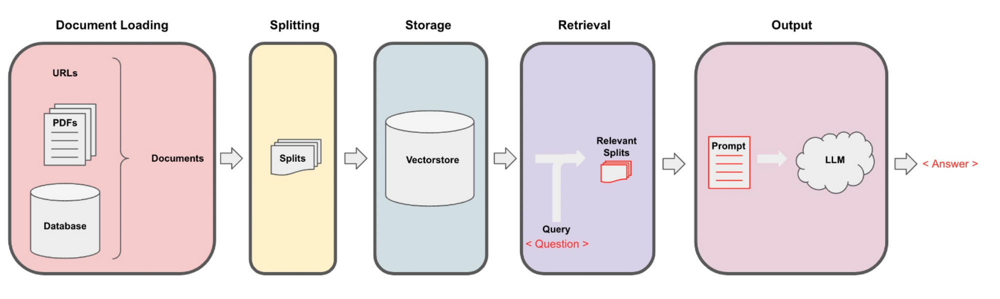
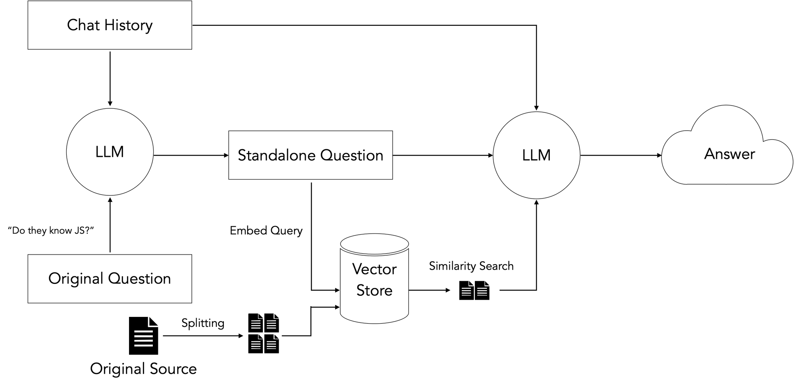
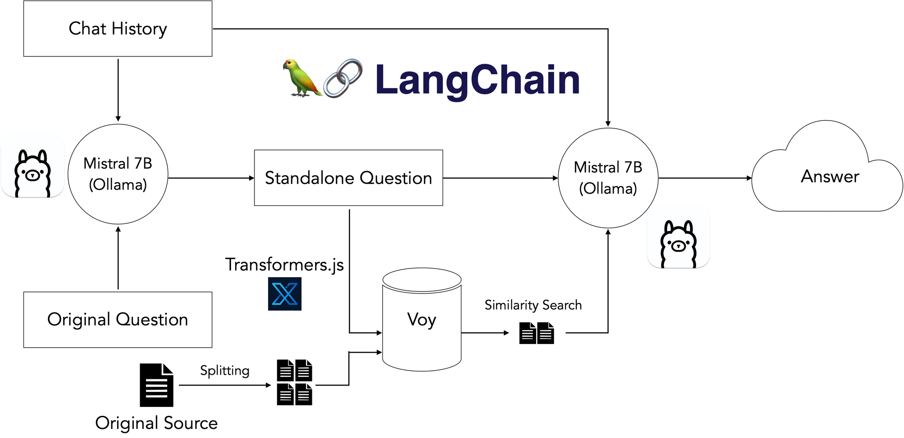
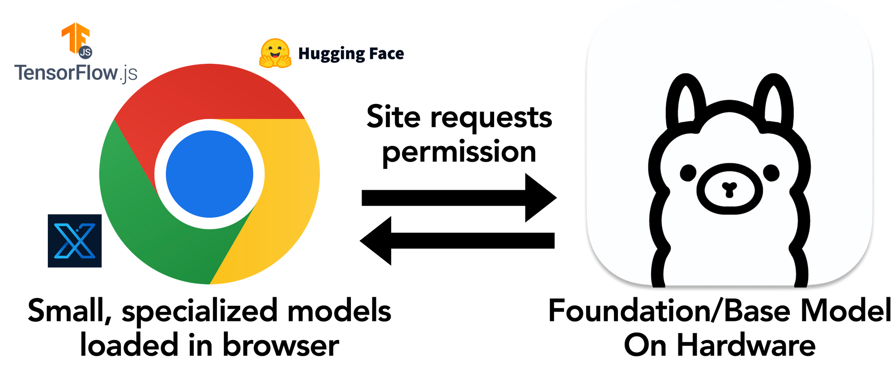

**The initial version of this blog post was a talk for Google’s internal WebML Summit 2023, which you can check out here.**

It’s no secret that for a long time machine learning has been mostly a Python game, but the recent surge in popularity of ChatGPT has brought many new developers into the field. With JavaScript being the most widely-used programming language, it’s no surprise that this has included many web developers, who have naturally tried to build web apps.

There’s been a ton of ink spilled on building with LLMs via API calls to the likes of OpenAI, Anthropic, Google, and others, so I thought I’d try a different approach and try to build a web app using exclusively local models and technologies, preferably those that run in the browser!

## Why?

Some major advantages to building this way are:

1. Cost. Since all compute and inference would be done client-side, there would be no additional cost to the developer building the app other than (very cheap) hosting.
2. Privacy. Nothing needs to leave the user’s local machine!
3. Potential speed increases due to no HTTP call overhead.
1. This may be offset by slower inference due to user hardware limitations.

## The Project

I decided to try recreating one of the most popular LangChain use-cases with open source, locally running software: a chain that performs Retrieval-Augmented Generation, or RAG for short, and allows you to “chat with your documents”. This allows you to glean information from data locked away in a variety of unstructured formats.



## Data Ingestion

The first steps are to load our data and format it in a way that is later queryable using natural language. This involves the following:

1. Split a document (PDF, webpages, or some other data) into semantic chunks
2. Create a vector representation of each chunk using an embeddings model
3. Load the chunks and vectors into a specialized database called a vector store

These first steps required a few pieces: text splitters, an embeddings model, and a vectorstore. Fortunately, these all already existed in browser-friendly JS!

LangChain took care of the document loading and splitting. For embeddings, I used a small HuggingFace embeddings model quantized to run in the browser using Xenova’s [Transformers.js package](https://huggingface.co/docs/transformers.js/index?ref=blog.langchain.com), and for the vectorstore, I used a really neat Web Assembly vectorstore called [Voy](https://github.com/tantaraio/voy?ref=blog.langchain.com).

## Retrieval and Generation

Now that I had a pipeline set up for loading my data, the next step was to query it:



The general idea here is to take the user’s input question, search our prepared vectorstore for document chunks most semantically similar to the query, and use the retrieved chunks plus the original question to guide the LLM to a final answer based on our input data.

There’s an additional step required for followup questions, which may contain pronouns or other references to prior chat history. Because vectorstores perform retrieval by semantic similarity, these references can throw off retrieval. Therefore, we add an additional dereferencing step that rephrases the initial step into a “standalone” question before using that question to search our vectorstore.

Finding an LLM that could run in the browser proved difficult - powerful LLMs are massive, and the ones available via HuggingFace failed to generate good responses. There is also the [Machine Learning Compilation’s WebLLM project](https://webllm.mlc.ai/?ref=blog.langchain.com), which looked promising but required a massive, multi-GB download on page load, which added a ton of latency.


I had experimented with Ollama as an easy, out-of-the-box way to run local models in the past, and was pleasantly surprised when I heard there was support for exposing a locally running model to a web app via a shell command. I plugged it in and it turned out to be the missing piece! I spun up the more recent, state-of-the-art Mistral 7B model, which ran comfortably on my 16GB M2 Macbook Pro, and ended up with the following local stack:



## Results

You can try out a live version of the Next.js app on Vercel [here](https://webml-demo.vercel.app/?ref=blog.langchain.com).

You’ll need to have a Mistral instance running via Ollama on your local machine and make it accessible to the domain in question by running the following commands to avoid CORS issues:

```
$ ollama run mistral
$ OLLAMA_ORIGINS=https://webml-demo.vercel.app OLLAMA_HOST=127.0.0.1:11435 ollama serve
```

Another of its differential aspects is that it uses [confidential computing](https://en.wikipedia.org/wiki/Confidential_computing?ref=blog.langchain.com) which means that not even their anonymization service can access the original data; a great feature for privacy seeking users. Finally, it will deanonymize the data after getting the response from the LLM so the user will get an answer that contains the original entities that they mentioned / requested.

Here are some example traces in [LangSmith](https://smith.langchain.com/?ref=blog.langchain.com), our observability and tracing platform, for a few questions. I used my personal resume as an input document:

1. "Who is this about?”
1. [https://smith.langchain.com/public/2386b1de-7afb-48a2-8c83-205162bfcac0/r](https://smith.langchain.com/public/2386b1de-7afb-48a2-8c83-205162bfcac0/r?ref=blog.langchain.com)
2. "Do they know JavaScript?”
1. [https://smith.langchain.com/public/18cec162-d12c-4034-aa9a-39b1cd2011ea/r](https://smith.langchain.com/public/18cec162-d12c-4034-aa9a-39b1cd2011ea/r?ref=blog.langchain.com)

## Conclusions

Overall, this worked out well. A few observations:

- Open source models are advancing rapidly - I built the initial version of this app with Llama 2, and Mistral was announced just weeks later.
- More and more consumer hardware manufacturers are including GPUs in their products.
- As OSS models get smaller and faster, running these models on local hardware with tools like Ollama becomes will become more and more common.
- While browser-friendly tech for vectorstores, embeddings, and other task-specific models has undergone some incredible advancements in the last few months, LLMs are still far too large to feasibly ship bundled in web apps.

The only feasible solution for web apps to take advantage of local models seems to be the flow I used above, where a powerful, pre-installed LLM is exposed to the app.

## A New Browser API?

Since non-technical web end-users will not be comfortable running a shell command, the best answer here seems to be a new browser API where a web app can request access to a locally running LLM, e.g. via a popup, then use that power alongside other in-browser task-specific models and technologies.



## Thanks for reading!

I’m extremely excited for the future of LLM-powered web apps and how tech like Ollama and LangChain can facilitate incredible new user interactions.

Here are some links for the various pieces used in the app:

- Demo app: [https://webml-demo.vercel.app/](https://webml-demo.vercel.app/?ref=blog.langchain.com)
- Demo app GitHub repo: [https://github.com/jacoblee93/fully-local-pdf-chatbot](https://github.com/jacoblee93/fully-local-pdf-chatbot?ref=blog.langchain.com)
- Voy: [https://github.com/tantaraio/voy](https://github.com/tantaraio/voy?ref=blog.langchain.com)
- Ollama: [https://github.com/jmorganca/ollama/](https://github.com/jmorganca/ollama/?ref=blog.langchain.com)
- LangChain.js: [https://js.langchain.com/](https://js.langchain.com/?ref=blog.langchain.com)
- Transformers.js: [https://huggingface.co/docs/transformers.js/index](https://huggingface.co/docs/transformers.js/index?ref=blog.langchain.com)

If you’d like to keep in touch, you can follow me [@Hacubu](https://twitter.com/Hacubu?ref=blog.langchain.com) on X, formerly Twitter, and LangChain [@LangChainAI](https://twitter.com/LangChainAI?ref=blog.langchain.com).

### Tags

[By LangChain](https://blog.langchain.com/tag/by-langchain/)


[](https://blog.langchain.com/evaluating-deep-agents-our-learnings/)

[**Evaluating Deep Agents: Our Learnings**](https://blog.langchain.com/evaluating-deep-agents-our-learnings/)

[By LangChain](https://blog.langchain.com/tag/by-langchain/) 7 min read

[](https://blog.langchain.com/end-to-end-opentelemetry-langsmith/)

[**Introducing End-to-End OpenTelemetry Support in LangSmith**](https://blog.langchain.com/end-to-end-opentelemetry-langsmith/)

[By LangChain](https://blog.langchain.com/tag/by-langchain/) 3 min read

[](https://blog.langchain.com/langchain-state-of-ai-2024/)

[**LangChain State of AI 2024 Report**](https://blog.langchain.com/langchain-state-of-ai-2024/)

[By LangChain](https://blog.langchain.com/tag/by-langchain/) 6 min read

[](https://blog.langchain.com/opentelemetry-langsmith/)

[**Introducing OpenTelemetry support for LangSmith**](https://blog.langchain.com/opentelemetry-langsmith/)

[By LangChain](https://blog.langchain.com/tag/by-langchain/) 4 min read

[](https://blog.langchain.com/easier-evaluations-with-langsmith-sdk-v0-2/)

[**Easier evaluations with LangSmith SDK v0.2**](https://blog.langchain.com/easier-evaluations-with-langsmith-sdk-v0-2/)

[By LangChain](https://blog.langchain.com/tag/by-langchain/) 4 min read

[](https://blog.langchain.com/langgraph-platform-announce/)

[**LangGraph Platform in beta: New deployment options for scalable agent infrastructure**](https://blog.langchain.com/langgraph-platform-announce/)

[By LangChain](https://blog.langchain.com/tag/by-langchain/) 4 min read