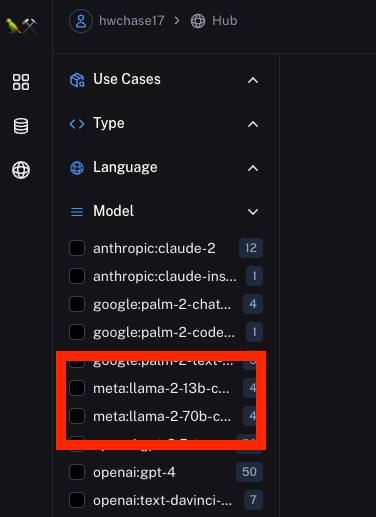
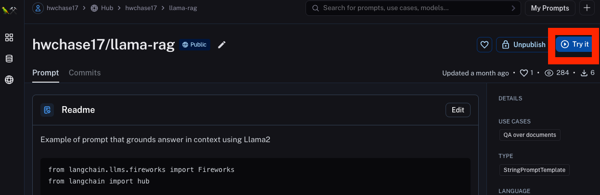
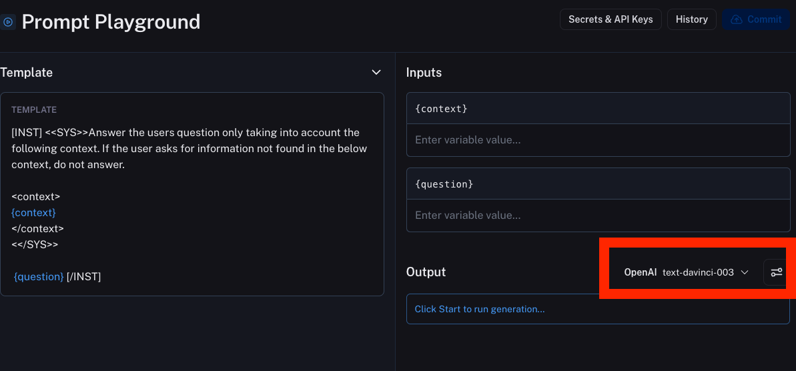
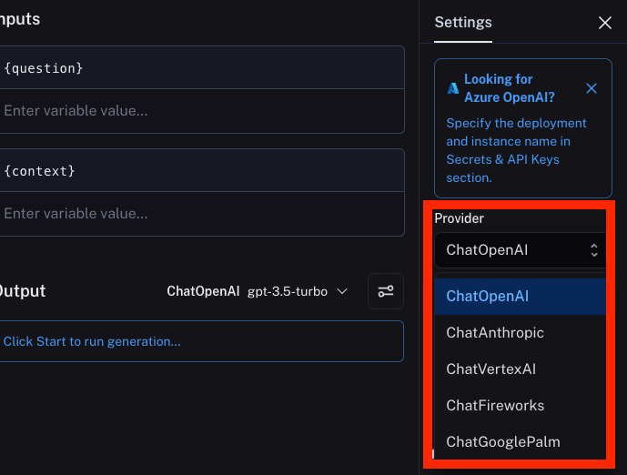
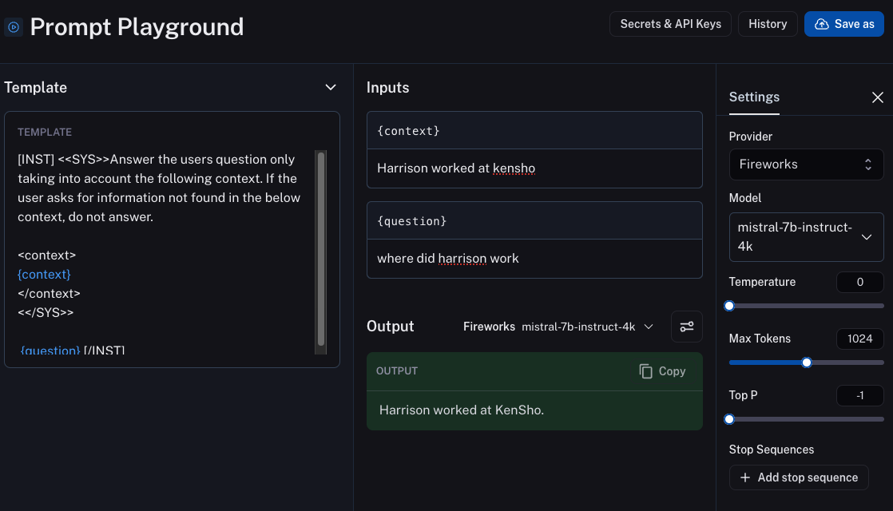

A year ago, the only real LLM people were using was OpenAI's GPT-3. Fast forward to now, and there are a multitude of models to choose from - including a wide variety of open source models. These open source models have seen large performance gains over the past six months in particular. As these models get better, we've seen more and more people wanting to try them out. We've teamed up with [Fireworks AI](https://app.fireworks.ai/?ref=blog.langchain.com) to bring these models to the LangSmith playground - completely free of cost (for now, we'll see how expensive this gets).

What does mean exactly?

Concretely, we have integrated [Fireworks AI](https://app.fireworks.ai/?ref=blog.langchain.com) into the playground, joining the ranks of OpenAI, Anthropic and Vertex AI as supported model providers. Read more about Fireworks AI below, but at a high level they provide API access to a plethora of OSS models. While other model providers in the playground require an API key to use, we've worked with Fireworks AI to enable anyone to use this integration regardless of whether they have an API key or not (note: you need to be signed into the LangSmith platform in order for this to work).

This now means it is easier than ever to try out prompts with an OSS model. Let's walk through an example of this!

First, let's go the [LangSmith Hub](https://smith.langchain.com/hub?ref=blog.langchain.com). We can filter existing prompts in the hub to ones that are meant for Llama-2. Note: this is a manual tagging, so it could be incorrect, but it's a good start.

Let's choose the [`hwchase17/llama-rag` prompt](https://smith.langchain.com/hub/hwchase17/llama-rag?ref=blog.langchain.com). Once on this page, we can click on "Try it" to open it in the playground.

The playground defaults to OpenAI, but we can click on the model provider to change it up.

From here, we can select the Fireworks option.

We can now select the model we want to use, and then plug in some inputs and hit run!

## What is Fireworks?

[Fireworks.ai](https://app.fireworks.ai/?ref=blog.langchain.com) provides a platform to enable developers to run, fine-tune, and share large language models (LLMs) to best solve product problems.

The Fireworks.ai Generative AI platform provides developers access to lightning-fast OSS models, LLM inference, and state-of-the-art foundation models for fine-tuning. The platform provides state-of-the-art machine performance for latency-optimized and throughput-optimized settings and cost reduction (up to 20–120x lower) for affordable serving.

Integrating Fireworks.ai models in the LangChain Playground means giving the developer community easy access to the best high-performing open-source and fine-tuned models.

The LangChain Prompt Hub already makes it simple to try different prompts, models, and parameters without any coding. The availability of faster inference or faster LLMs helps to further boost productivity in building LLM workflows.

A big part of the LLM workflow requires testing and optimizing prompts which is a highly iterative and time-consuming process. This integration makes it possible for LangChain Prompt Hub users to more efficiently test and optimize prompts for state-of-the-art open-source and fine-tuned LLMs like Llama 2 70B.

**Trying Fireworks in the Playground:**

- Logged-in users can try Fireworks in the playground without an API key, for free!
- If you’re not logged in or don’t have an account, but want to try Fireworks, you can get one directly from Fireworks

**Below are the instructions to set up an account with Fireworks.ai:**

- Step 1: Visit [app.fireworks.ai](https://app.fireworks.ai/?ref=blog.langchain.com).
- Step 2: Click the "Sign In" button in the top navigation bar.
- Step 3: Click "Continue with Google" and authenticate with your Google account. A new Fireworks developer account will be provisioned for you the first time you sign in.
- Step 4: Next, we'll provision a new API key. Click on "API Keys" in the left navigation bar then Click on "New API Key" and give your new API key a name.
- Step 5: Now open-source models like Llama 2 13B Chat are ready to be used in the LangChain Playground.
- Step 6: You can enter you API key in the `Secrets & API Keys` section in the playground