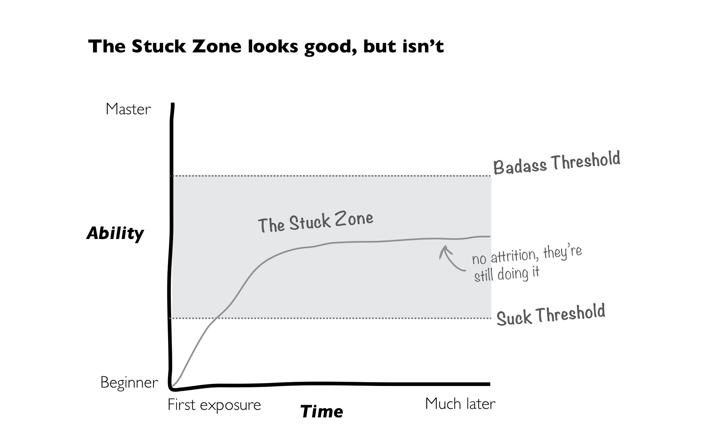
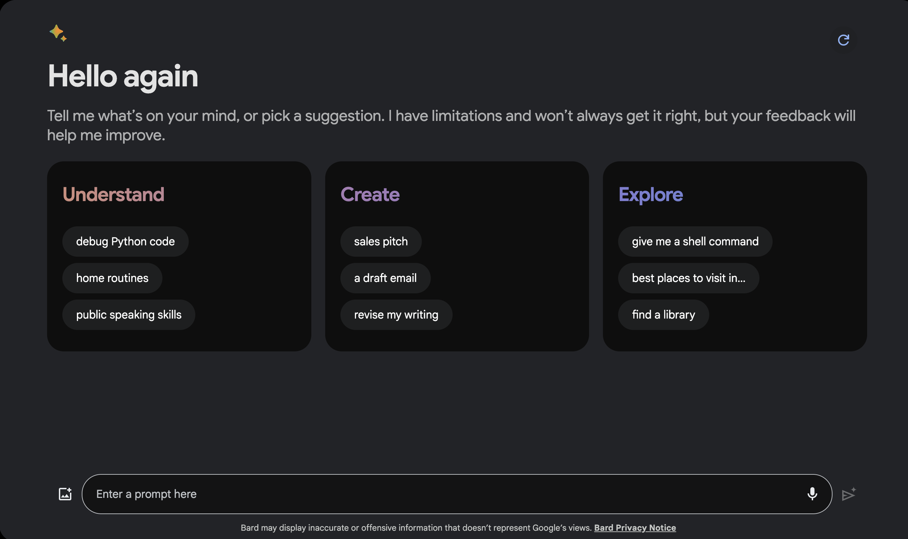

_Editor's Note: This post was written by [_Andres Torres_](https://www.linkedin.com/in/andres-torres-360248b1/?ref=blog.langchain.com) and [_Dylan Brock_](https://www.linkedin.com/in/dylan-brock-b8926760/?ref=blog.langchain.com) from [_Norwegian Cruise Line_](https://www.ncl.com/?ref=blog.langchain.com). Building UI/UX for AI applications is hard and there's lot of subtleties. This is a fantastic deep dive into the issues and concerns they are thinking about._

Everyone loves having some vacation and time to enjoy with their loved ones. At Norwegian Cruise Line, our team mission is to provide exceptional vacation experiences through a commitment to world-class hospitality and innovation. This experience starts with their first digital touch point and extends all the way past their disembark date. It’s imperative that we create a seamless and enjoyable planning experience.

Our team believes that GenAI will make it easier for our guests to build and plan their dream vacation. In developing our vision, it became clear how sizable the gap is between those comfortable with AI applications and our average consumer. Most of the GenAI products in the marketplace are not built to inspire and immerse their consumers. Our guests won’t accept that. So, we made a focal point of our journey about bridging the gap between traditional LLM user interfaces and immersive, easy to use, and capable experiences. The following outlines many of the UX/UI lessons we’ve learned along the way. These are easily replicated and can help with nearly any use case seeking to leverage LLMs. In future posts, we will do a deeper dive into just how we integrate our UX/UI using Langchain and how you can make it work for your use case.

### **Introduction**

It is hard to discuss GenAI applications and not picture a chat-based UI. The general population is extremely comfortable with chat bubbles through text messaging, service agents, and work-collaboration applications. This format remains the quickest UX path today. Booking.com, ChatGPT, Bard, etc., all use some form of basic chat window.

But LLMs are not yet replacements for the personal touch of true human interaction. They tend to overexplain, creating a completely different experience from traditional service agents. So, if GenAI is the next great paradigm shift in digital interactions, it is crucial to solve for the UX/UI. Consumers reject complexity, even in the face of evolution. By nature, LLMs require reading and writing. Until we can advance the integration between LLM output and traditional UX interaction, the majority of your users will fall into the “stuck” zones.

Furthermore, utilizing prompting as our primary interaction method relies on the customer to get it right. This path reduces development effort at the sacrifice of adoption and accessibility. In the early stages of advancement this was widely acceptable. ChatGPT was used by everyone but has since seen a steady decline. It’s not as if the model is somehow producing extra errors. The newness has worn off, and users feel more like, “OK, but what’s next?”. The outlook becomes even more troubling when you consider [literacy rates are in decline.](https://www.npr.org/2023/06/22/1183653578/u-s-reading-and-math-scores-drop-to-their-lowest-levels-in-decades?ref=blog.langchain.com) How can such a complex product that requires reading and writing at higher levels than standard web practice become the next great revolution?

This post outlines a few UX strategies to help empower your users and bridge the gap between standard UX and LLM interfaces. None of these will break your roadmap in terms of effort, but they can go a long way in creating a more accessible, usable product. We will cover:

- Helping your users get up to speed faster
- Accounting for Anthropomorphism
- User Feedback and testing

### **Preventing the Blank Canvas Problem**

The art world has a well-known concept of a blank canvas. Picture an artist with an empty easel, endlessly wondering where or how to start. The canvas will feel different for different artists. It can represent fear of the unknown or endless, infinite, possibilities. How an artist feels about the canvas will depend on factors such as skill set, experience, environment, intention, deadlines, or expectations. Users attempting to engage with a chat tool will feel like these artists. A blank canvas with unlimited possibilities, one that feels either impossible to start or exciting and rewarding.

How can we increase comfortability and reduce the barrier to entry for the average user? We believe the best way to account for this is via shortcuts or recommendations. When building these shortcuts, there are a few factors to consider:

- Keep the Prompts Short and friendly
- Embed the shortcuts
- Make it one-click

**Keep the Prompts Short and Friendly**

When shortcuts are presented in traditional call-to-action buttons, the gap between conventional UX and natural language interactions is bridged. The prompts must be written in the most friendly language possible. Think “Debug my Python code” vs. “Using the below input, review and debug the Python code to improve quality”. Google does a phenomenal job of this in their latest version of Bard.

Bard is designed to be capable of nearly anything. Through this shortcut process, we can avoid the blank canvas issue. Both generic and advanced users can learn just enough from the three categories, all of which are written in short format. Consider why users would want to use your tool when designing for your use case. Go beyond the confines of the regular web UX, and use illustrative words like “imagine”, “dream”, and “engage” to pull the user's mind into the power of natural language.

**Embed the Shortcuts**

Embedding the components in the same area as the prompt input and output helps orient the user to the end experience. In line components keep the user focused on capabilities over the endless unknown. It helps maintain the separation of value created by the tool (responses in the window), and the input from the user.

**Make it One Click**

Regardless of the level of your temperature, or the tightness of your system prompt, there exists a degree of randomness to any response. Embedding shortcuts as a one-click experience is the fastest way to improve your users' skills. A user clicking the shortcuts will send a pre-defined prompt to the LLM. This creates more deterministic experiences.

Your designers can explicitly account for these scenarios in unique ways. For example, a call-to-action "Show me a code snippet" leaves a lot of room for context interpretation, "what code language?", "a code snippet for what?", etc. If this call-to-action was part of a GenAI solution to help web developers build quick UIs in React, the user would expect a specific context-aware response from the assistant. While the title of the call-to-action could stay the same, "Show me a code snippet," the prompt that is executed behind the scenes could be more complex. The prompt can provide more context to the agent, ensuring the experience matches and delivers value to the user:

"You are an expert React JS developer who creates beautiful UIs. Show a snippet of code for a UI component following Material Guidelines. Make sure the component can be reused in different settings. Suggest the user for alternative versions of the component."

We recommend utilizing these shortcuts as fast mini-tutorials. An average user will acclimate to the new UX paradigm much faster when shown what their effort rewards.

### **The Human Touch: Exploring Anthropomorphism in GenAI Interfaces**

The majority of GenAI applications make it seem like the user can openly converse with it. This causes users to attribute human-like qualities, characteristics, or emotions to the application. This is called Anthropomorphism.

To borrow concepts from Don Norman's book The Design of Everyday Things, we must ensure that our system signifiers match its affordances. This means that the application must clearly communicate what it can do.

Since users are already susceptible to anthropomorphizing chat systems, adding characteristics that reinforce this human persona (name, avatar, empathy, etc.) might be signifying capabilities our system will not perform. This will frustrate users when they realize their expectations are falling short.

Anthropomorphism is not an absolute. There are various shades of grey we must apply to signify the right affordances and set the correct expectations for our users. The name, avatar, pronouns it uses, personality traits, and communication style can be combined to make it more human or machine-like. These characteristics must match closely with what the system can do. The more human-like, the more the user will believe the system is, in fact, a human and will expect it to behave as such (know current events, weather, contextual information, be empathic, fewer errors, etc.)

### **The Value of User Feedback in GenAI: A Win-Win for Users and Designers**

When designing a high-quality user experience, constant feedback and iteration are necessary to build a high-quality digital platform. With the young nature of LLM-based interfaces, the silver bullet has yet to be discovered. This means we have a due diligence to test and test and test, until we find a reliable method. [Paul Thomson does a great job writing about this in another Langsmith blog post](https://blog.langchain.com/peering-into-the-soul-of-ai-decision-making-with-langsmith/) where you can see how this is like evaluating the quality, accuracy or relevancy of our LLMs. We don’t know what we don’t know, and we require our users to help us figure that out.

Integrating a feedback system into the LLM must be seamless and easily accessible for the users. The benefit of LLMs over traditional UX is your feedback loop, “we got your feedback, and we’re implementing it,” can be immediate. If you don’t like the response, or the answer is just wrong, you can correct the agent and trigger an automatic re-try. If the response is too wordy, short, contrived, or ineffectively formatted, the user can respond in both natural language and traditional UX buttons to signal this.

There are many ways to provide feedback to the system. We break these down into two forms: **direct** and **indirect**.

Direct feedback requires formal input from the user with the intention of improving the product. ChatGPT gives the user a thumbs up or down when providing an output. The user knows what it means to interact with these buttons and does so with intent. Indirect, however, operates more in the grey. Users don't intentionally provide feedback. Instead, feedback is provided through the UX design. Examples such as accepting a suggestion on Github Copilot or selecting a generated image in Midjourney before being able to download it both provide us with successful feedback that the model makes a good recommendation.

It's essential to try a variety of options. The more badass the user, the more likely they will give you specific natural language feedback. For the public, it’s vital to account for one-click feedback buttons.

We recommend starting with something, even if you’re unsure what the final list will look like. Feedback is better than none, and you will see quickly what you are missing. Utilizing Langsmith’s evaluation capabilities, you can see immediately how the LLM is being asked to improve and what new feedback mechanisms you need to include.

### **In Conclusion**

The paradigm shift in digital UX/UI is upon us. As technology advances and more and more consumers are faced with GenAI applications, the responsibility of designers to account for the unknown paths grows. Consumers need our help to bridge the gap between “Wow, this is cool” and “I seek it out and can’t live without it”. As it’s our job to make this happen, we can empower our users by setting the right expectations, creating feedback mechanisms, and embedding shortcuts. These are not exhaustive and guarantees. As the industry experiments with new and innovative ways to form inputs and outputs, we will constantly revisit how we set up these mechanisms.

If you like this blog, drop us a line and let us know! This is only the beginning of our deeper dive into Large Language Model User Interfaces.