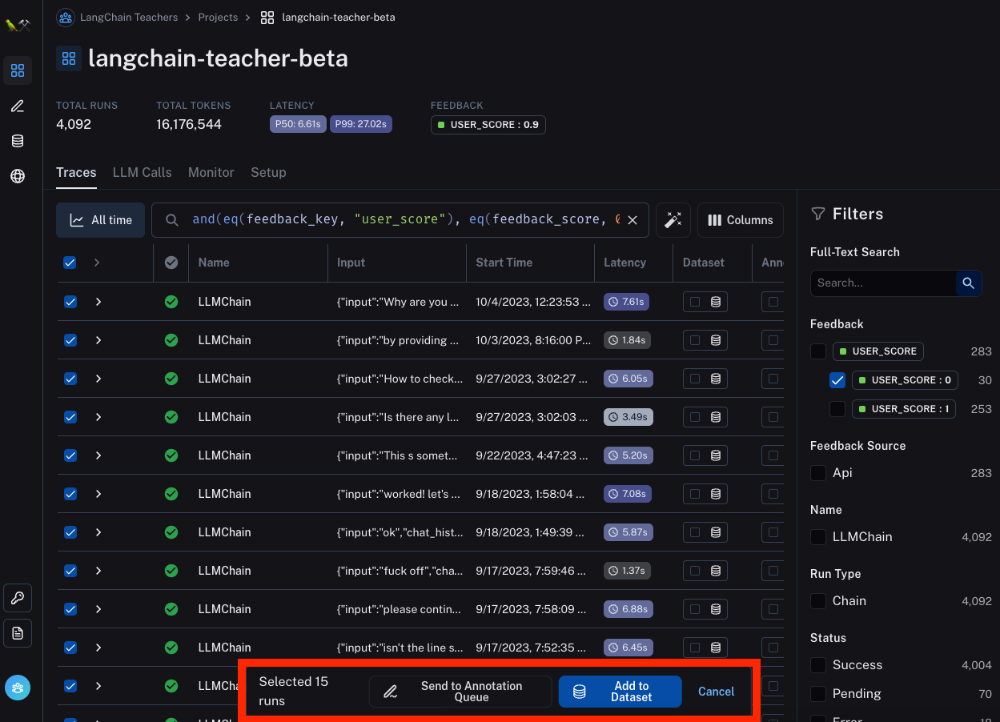
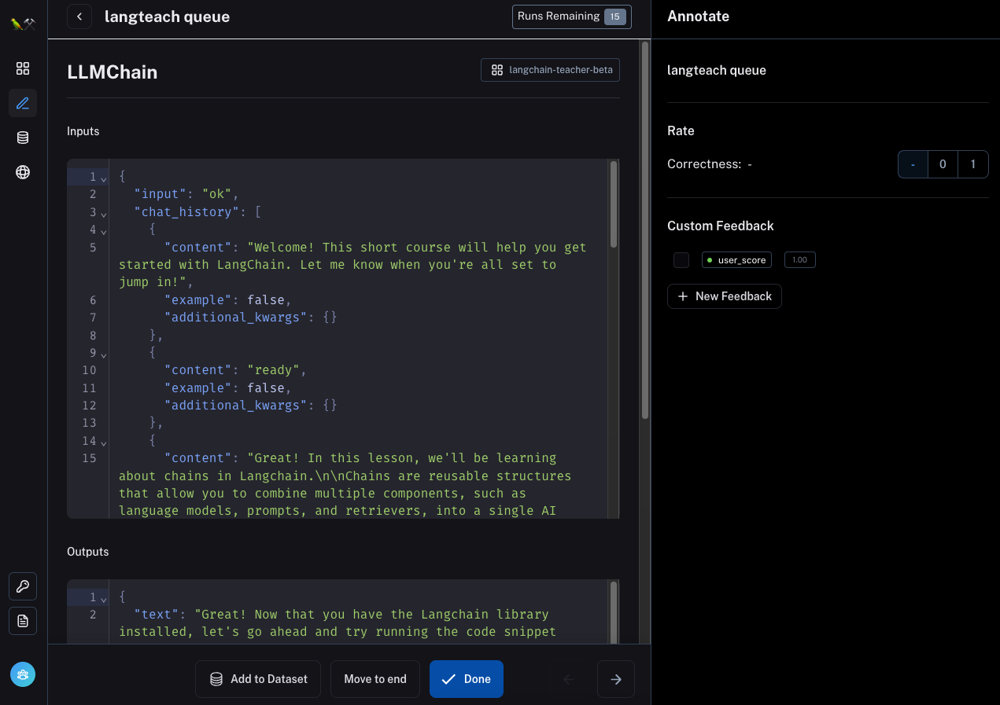

💡

Data Annotation Queues are a new feature in LangSmith, our developer platform aimed at helping bring LLM applications from prototype to production. Sign up for the beta [here](https://smith.langchain.com/?ref=blog.langchain.com).

[LangSmith](https://blog.langchain.com/announcing-langsmith/) was launched with the goal of making it easier to take an LLM application from prototype to production. One of the main blockers here is improving the performance of your application and making it more reliable than just a Twitter.

There are several ways to do that. At the most basic, it's useful to look carefully at the data and build up intuition for where the chain is not performing well.

💡

**One pattern I noticed is that great AI researchers are willing to manually inspect lots of data. And more than that, they build infrastructure that allows them to manually inspect data quickly. Though not glamorous, manually examining data gives valuable intuitions about the problem.**

[\- Jason Wei, OpenAI](https://twitter.com/_jasonwei/status/1708921475829481683?s=20&ref=blog.langchain.dev)

Beyond that, it's helpful to have a dataset of test cases you can run your chain over to measure its performance. Next, you can use techniques like few-shot prompting to do in-context learning to improve the model's performance. As an even more advanced step, you could finetune the model on some examples.

Notice that all these techniques require having datapoints specific to your application. Which most people often don't have to start! One of the main benefits of LLMs is that they make it incredibly easy to get started building an application compared to traditional machine learning - you don't need to have a dataset to train a model, you can just start using an API. This is great for getting started, but presents some challenges when you start diving deep and you want to improve your chain.

To help solve some of those problems, we're releasing a new feature of LangSmith: Data Annotation Queues. This is designed to make it easy to review logs, give feedback on those logs, and create datasets from those logs. In parallel, we're excited to highlight [langfree](https://langfree.parlance-labs.com/?ref=blog.langchain.com), an OSS package from [Hamel Husain](https://hamel.dev/?ref=blog.langchain.com) aimed at doing some of this functionality locally.

## Data Annotation Queue

The idea of a data annotation is to create an ideal UX for reviewing logs from chains, with the purpose of either annotating them (marking them as correct or incorrect) or adding them to a dataset (for downstream usage).

We've made this easy to do by adding an action to add to a data annotation queue from the logs page. With this, you can easily query for datapoints according to some filter and then add them to a queue. For example, you could filter to all datapoints that got negative feedback from the user (because you want to examine what is going on).

Once in the annotation queue, you can easily view each datapoint. We imagine two common actions:

1. Leave some annotation on the datapoint. This could be some label (good/bad), some classification (english/spanish/etc) or really anything.
2. Add this datapoint to a dataset. When doing this, you may want to edit the datapoint before adding - for example, if a datapoint was incorrectly answered, you probably want to change the answer to the correct answer before adding.

To support these action items, we've given prime real estate to the feedback panel (on the right) and made the text of the datapoint directly editable. Not that if you edit the text, you still have to click "Add to Dataset" to add it to a dataset.

Additionally, you can use the buttons on the bottom to do a few more things:

- "Move to end" - move this datapoint to the end of queue, essentially ignoring it for now but saying you want to come back to it
- "Done" - mark that you are finished reviewing a particular datapoint

## Langfree

In parallel with releasing the Data Annotation Queue, we're also excited to share [langfree](https://langfree.parlance-labs.com/?ref=blog.langchain.com), an open source package in a similar direction by [Hamel Husain](https://hamel.dev/?ref=blog.langchain.com).

💡

langfree helps you extract, transform and curate [ChatOpenAI](https://api.python.langchain.com/en/latest/chat_models/langchain.chat_models.openai.ChatOpenAI.html?ref=blog.langchain.com) runs from [traces](https://js.langchain.com/docs/modules/agents/how_to/logging_and_tracing?ref=blog.langchain.com) stored in [LangSmith](https://www.langchain.com/langsmith?ref=blog.langchain.com), which can be used for fine-tuning and evaluation.

With similar goals as Data Annotation Queue, this provides an open source alternative which can be helpful if you want to customize the annotation or dataset curation workflow in any way. We are very excited to share this, because we recognize that it's incredibly early on in this journey, and having open-source and customizable tooling for doing these tasks is invaluable - thank you to Hamel for adding this!

Hamel has been a fantastic resource to work with, providing a lot of feedback for Data Annotation Queue along the way! Hamel also runs Parlance Labs - [one of our favorite partners](https://www.langchain.com/partners?ref=blog.langchain.com) \- and we'd highly recommend working with him.

## Conclusion

Data Annotation Queue is aimed at making it easy for teams to explore data, annotate example, and create datasets. This type of data exploration and dataset curation is invaluable when looking to bring an LLM application from prototype to production.

It also doesn't take that many datapoints to get started! We've seen teams build up valuable benchmarks with only a few examples. The key is that it's (1) specific to your use case, and (2) a high quality data point. If you want help embarking on this journey, please also feel free to [reach out directly](https://airtable.com/appwQzlErAS2qiP0L/shrGtGaVBVAz7NcV2?ref=blog.langchain.com)!