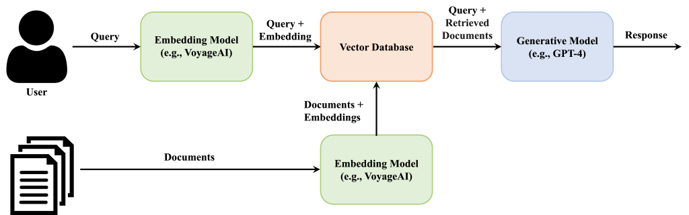
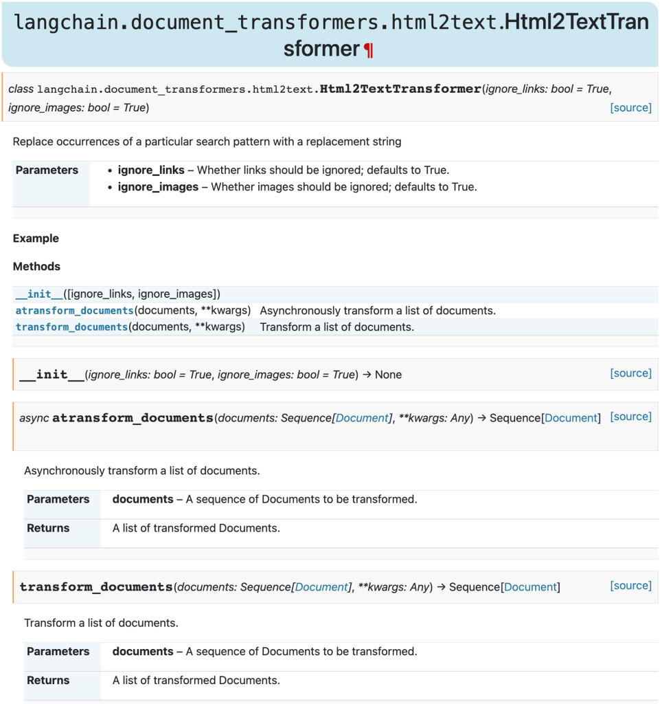
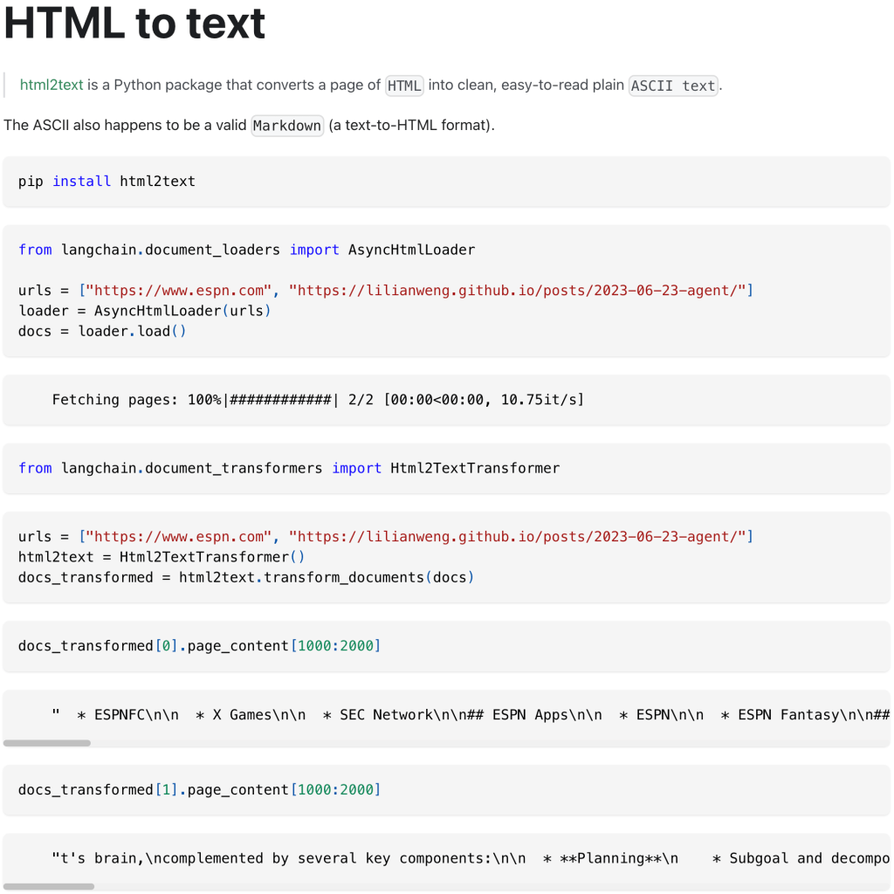
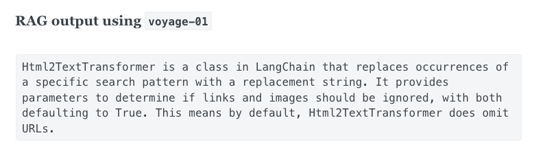
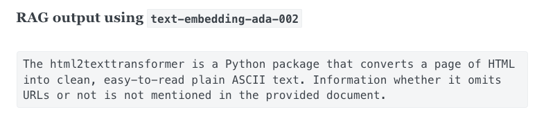
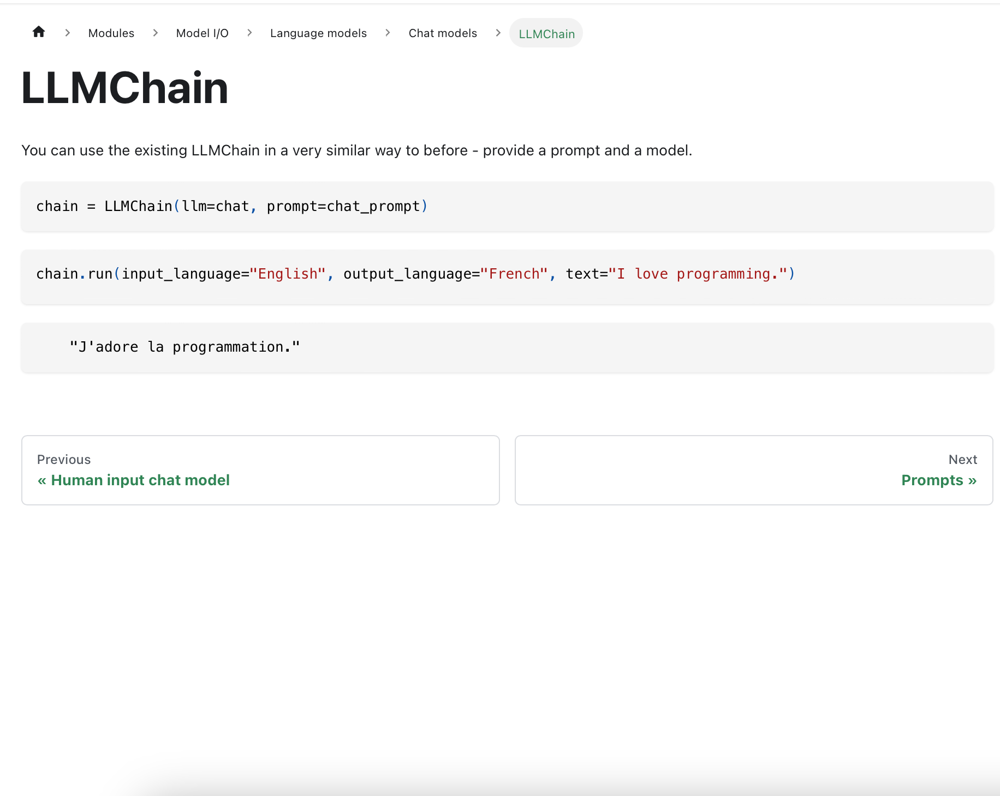
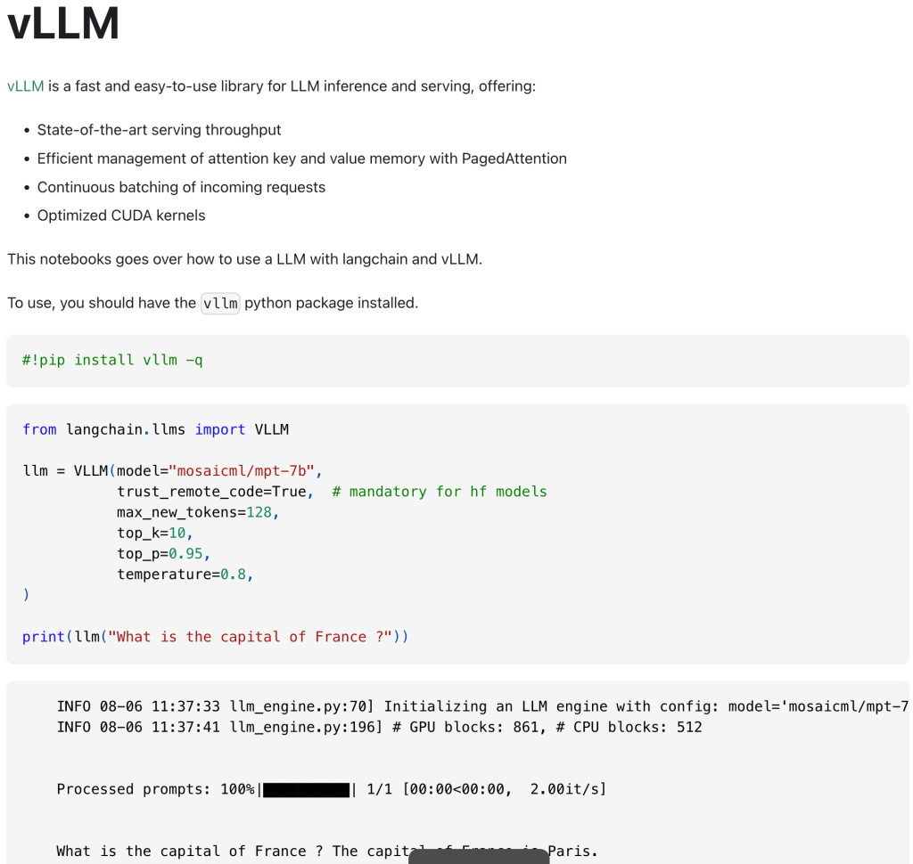
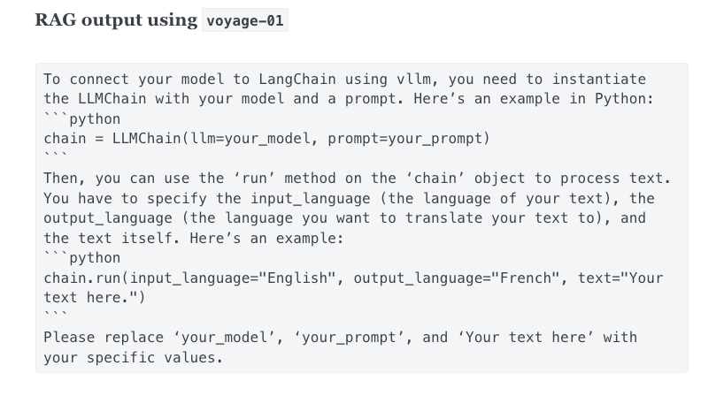
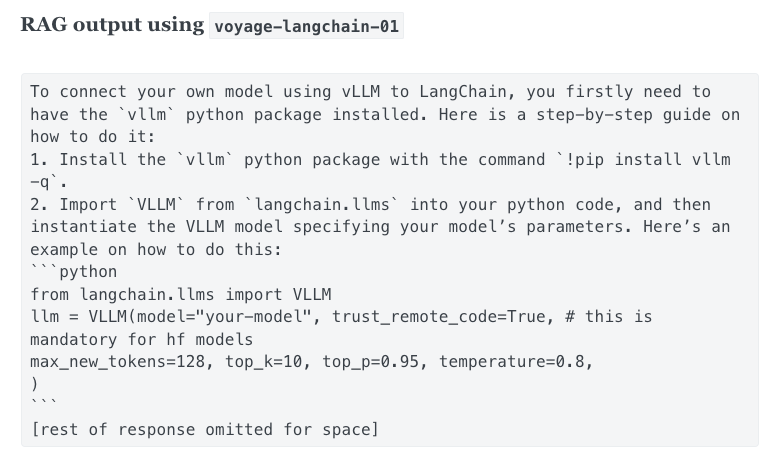

_Editor's Note: This post was written by the [_Voyage AI_](https://www.voyageai.com/?ref=blog.langchain.com) team._

This post demonstrates that the choice of embedding models significantly impacts the overall quality of a chatbot based on [Retrieval-Augmented Generation (RAG)](https://www.pinecone.io/learn/retrieval-augmented-generation/?ref=blog.langchain.com). We focus on the case of [Chat LangChain](https://chat.langchain.com/?ref=blog.langchain.com), the LangChain chatbot for answering questions about LangChain documentation, which currently uses fine-tuned Voyage embeddings in production. We finish by showing how to access general Voyage embedding models via LangChain.

## Brief background on RAG, retrieval system, and embeddings

**Retrieval-augmented generation**, commonly called RAG, is a powerful design pattern for chatbots where a **retrieval system** fetches validated sources/documents that are pertinent to the query, in real-time, and inputs them to a generative model (e.g., GPT-4) to generate a response. With high-quality retrieved data, RAG can ensure that generated responses are not just intelligent, but also contextually accurate and informed.

Modern retrieval system are empowered by semantic search using dense-vector representations of the data. **Embedding models,** which are neural nets models, transform the queries and documents into vectors, which are called embeddings. Then, the documents whose embeddings are closest to the embedding of the query are retrieved. The quality of the retrieval is thus solely decided by how the data are represented as vectors; vice versa, the effectiveness of embedding models is evaluated based on their accuracy in retrieving relevant information.

Please check out this introduction post to [RAG](https://www.pinecone.io/learn/retrieval-augmented-generation/?ref=blog.langchain.com) for more details.



## Evaluating the effect of embeddings in the RAG stack

**Methodology.** RAG has two main AI components, embedding models and generative models. We ablate the effect of embedding models by keeping the generative model component to be the state-of-the-art model, GPT-4. We measure two metrics, (1) the retrieval quality, which is a modular evaluation of embedding models, and (2) the end-to-end quality of the response of the RAG. We will show that retrieval quality directly affects end-to-end response quality.

**Evaluation scenarios.** In this post, we focus on the scenario of the Chat LangChain bot that answers questions about [LangChain](https://python.langchain.com/?ref=blog.langchain.com) documentation. The [open-source](https://github.com/langchain-ai/chat-langchain?ref=blog.langchain.com) chatbot uses a RAG stack with a pool of 6,522 documents sourced directly from the LangChain docs. From the partnership with [LangChain](https://www.langchain.com/?ref=blog.langchain.com), we obtained a collection of 50 pairs of queries and corresponding gold standard answers, which are the main dataset for evaluating the response quality.

**Models.** We consider three embedding models, OpenAI’s industry-leading embedding model [`text-embedding-ada-002`](https://openai.com/blog/new-and-improved-embedding-model?ref=blog.langchain.com) , Voyage’s generalist model [`voyage-01`](https://docs.voyageai.com/embeddings/?ref=blog.langchain.com) , and an enhanced version fine-tuned on LangChain docs , `voyage-langchain-01`.

**Measuring response quality.** To evaluate the response’s quality, we compare the semantic similarity between the generated responses and the gold standard responses by asking GPT-4 to evaluate the similarity with a score out of 10. A score of 1 indicates that the generated answer is incorrect and bears no relevance to the gold standard answer, while a score of 10 signifies a perfect alignment with the gold standard answer.

**Measuring retrieval quality.** For the 50 queries, we manually curate the gold-standard documents that are most relavent to the queries. We retrieve 10 documents for each queries, and use the standard [NDCG@10](https://en.wikipedia.org/wiki/Discounted_cumulative_gain?ref=blog.langchain.com) metric to calculate the relevance of the retrieve docs to the gold-stand document.

**Results.** The table below shows that `voyage-01` surpasses OpenAI’s `text-embedding-ada-002` in both the retrieval quality and response quality. Furthermore,  `voyage-langchain-01`, which was specifically fine-tuned on LangChain documents, has the highest retrieval and response quality. The data suggest that indeed the quality of the final response is highly correlated with the retrieval quality, and `voyage-01` and `voyage-langchain-01` improve the final response’s quality by improving the retrieval quality.

| Model Name | Response quality(1-10) ↑ | Retrieval quality ↑ |
| --- | --- | --- |
| Voyage (`voyage-langchain-01`) | 6.25 | 52.40 |
| Voyage (`voyage-01`) | 5.08 | 47.55 |
| OpenAI (`text-embedding-ada-002`) | 4.34 | 45.81 |

## Demonstrating examples

We support the quantitive results above by showcasing a few intuitive examples where more accurate retrieval with Voyage’s embeddings enables more accurate responses.

### **Example 1:  `voyage-01` vs [**`text-embedding-ada-002`**](https://openai.com/blog/new-and-improved-embedding-model?ref=blog.langchain.com)**

**Query** _: “What is html2texttransformer? Does it omit urls?”_

Given the query above, `voyage-01` (left) fetches the correct document, the detailed description of the `html2texttransformer` function, whereas `text-embedding-ada-002` (right) retrieves a less relavent document, the documentation of `html2text` which contains `html2texttransformer` as a method. The latter document does contain the string `html2texttransformer` but only in an exemplar code block.





**Left**: Top-1 doc retrieved by `voyage-01`. **Right**: Top-1 doc retrieved by `text-embedding-ada-002`.

Consequently, the response generated by RAG using the `voyage-01` (left) is accurate, whereas the response with `text-embedding-ada-002` (right) confuses `html2texttransformer` with the class that contains it.





### **Example 2:  `voyage-01` vs `voyage-langchain-01`**

The fine-tuned model `voyage-langchain-01` has a superior retrieval quality and response quality than `voyage-01`. The examples below demonstrate how `voyage-langchain-01` can fetch documents with more pertinent information given the query below.

**Query**: _“I’m running my own model using vllm. How do I connect it to LangChain?”_

As we can see below, `voyage-01` (left) doesn’t give a document that is relevant to vLLM, whereas `voyage-langchain-01` (right) retrieves the correct document. Here the reason is that vLLM is a highly specialized concept that a generalist embedding model is difficult to grasp; but a fine-tuned model has seen the LangChain documentation and thus can catch up with the terminology and concept.





**Left**: Top-1 doc retrieved by `voyage-01`. **Right**: Top-1 doc retrieved by `voyage-langchain-01`.

Not surprisingly, the RAG with `voyage-langchain-01` (right) accurately answers the question. On the other hand, without retrieving the correct document, RAG with `voyage-01` (left) hallucinates an answer.





## Using Voyage in LangChain

As of `langchain >= 0.0.327`, Voyage is integrated into the LangChain Python package, allowing anyone to access the `voyage-01` model for their own applications.

You can get a Voyage API key [here](https://www.voyageai.com/?ref=blog.langchain.com), which should be set as an environment variable:

```bash
export VOYAGE_API_KEY="..."
```

Install the latest version of LangChain:

```bash
pip install -U langchain
```

And you can start using `VoyageEmbeddings` . Here's a simple example of how to use Voyage to power KNN retrieval:

```python
from langchain.embeddings import VoyageEmbeddings
from langchain.retrievers import KNNRetriever

texts = [\
  "Caching embeddings enables the storage or temporary caching of embeddings, eliminating the necessity to recompute them each time.",\
  "The agent executor is the runtime for an agent. This is what actually calls the agent and executes the actions it chooses",\
  "A Runnable represents a generic unit of work that can be invoked, batched, streamed, and/or transformed."\
]

embeddings = VoyageEmbeddings(model="voyage-01", batch_size=8)
retriever = KNNRetriever.from_texts(texts, embeddings, k=1)

result = retriever.get_relevant_documents(
  "How do I build an agent?"
)
print(result[0].page_content)
```

```output
The agent executor is the runtime for an agent. This is what actually calls the agent and executes the actions it chooses
```

You can find the full [LangChain integration docs](https://python.langchain.com/docs/integrations/text_embedding/voyageai?ref=blog.langchain.com) [here](https://python.langchain.com/docs/integrations/text_embedding/voyageai?ref=blog.langchain.com) and the [Voyage docs here](http://docs.voyageai.com/?ref=blog.langchain.com).

## Takeaways

The retrieval quality of the embedding models is highly correlated with the quality of the final responses — to make your RAG more successful, you should consider improving your embeddings! Try Voyage embeddings `voyage-01` or contact us for early access to the fine-tuned models at  [contact@voyageai.com](mailto:contact@voyagei.com). Follow up on [twitter](https://twitter.com/voyage_ai_?ref=blog.langchain.com) and/or [linkedin](https://www.linkedin.com/company/voyageai?ref=blog.langchain.com) for more updates!