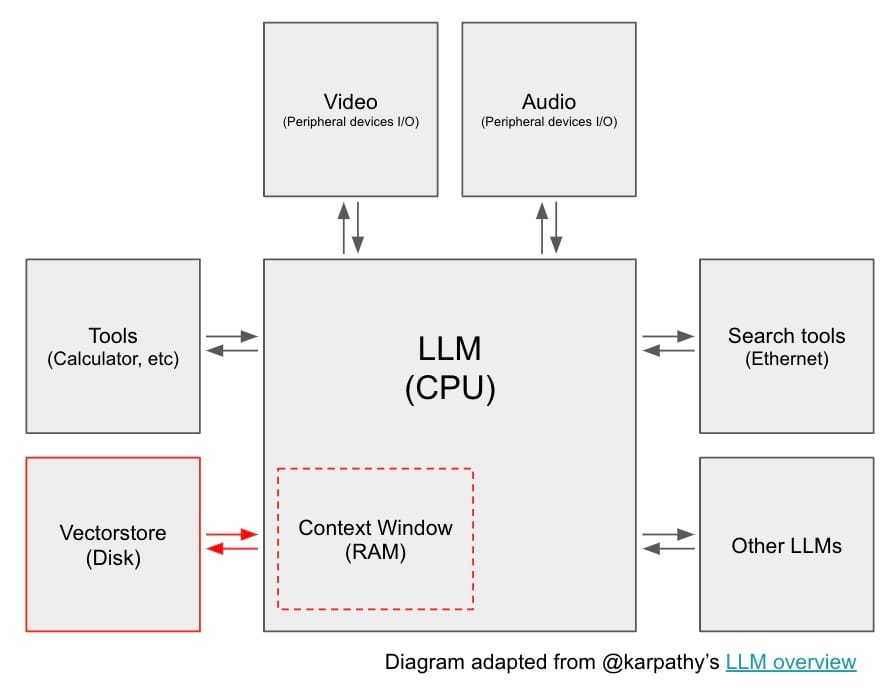
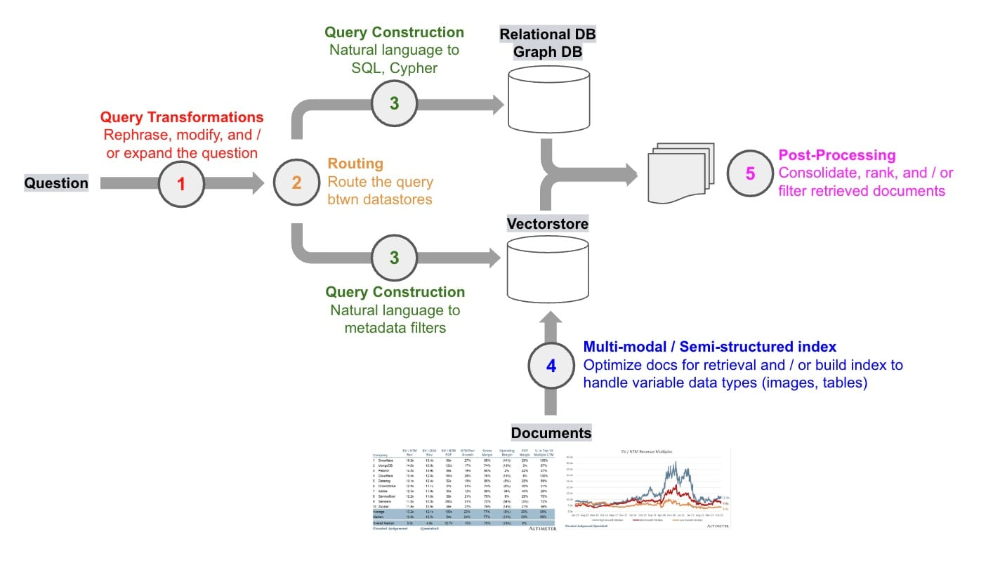
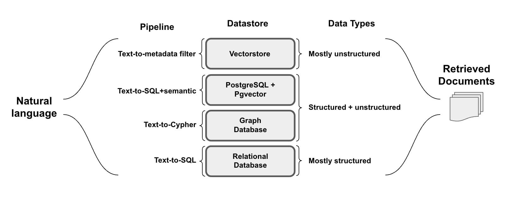
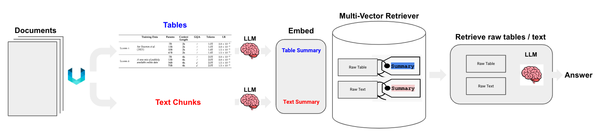
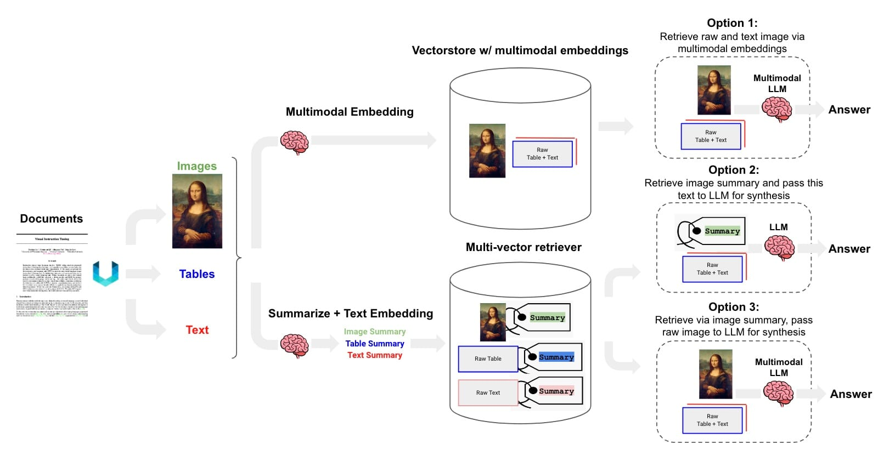

### Context

In a [recent overview](https://www.youtube.com/watch?v=zjkBMFhNj_g&ref=blog.langchain.com) on the state of large language models (LLMs), [Karpathy](https://x.com/karpathy/status/1727731541781152035?s=20&ref=blog.langchain.com) described LLMs as the kernel process of a new kind of operating system. Just as modern computers have RAM and access to files, LLMs have a context window that can be loaded with information retrieved from numerous data sources.

Retrieval is a core component of the new LLM operating system

This retrieved information is loaded into the context window and used in LLM output generation, a process typically called retrieval augmented generation (RAG). RAG is one of the most important concepts in LLM app development because it is an easy way to pass external information to an LLM with advantages over more complex / complex fine-tuning on problems that [require](https://www.youtube.com/watch?v=hhiLw5Q_UFg&ref=blog.langchain.com) [factual](https://github.com/openai/openai-cookbook/blob/main/examples/Question_answering_using_embeddings.ipynb?ref=blog.langchain.dev) [recall](https://www.anyscale.com/blog/fine-tuning-is-for-form-not-facts?ref=blog.langchain.dev).

Typically, RAG systems involve: a question (often from a user) that determines what information to retrieve, a process of retrieving that information from a data source (or sources), and a process of passing the retrieved information directly to the LLM as part of the prompt (see an example prompt in LangChain hub [here](https://smith.langchain.com/hub/rlm/rag-prompt?ref=blog.langchain.com)).

## Challenge

The landscape of RAG methods has expanded greatly in recent months, resulting in some degree of overload or confusion among users about where to start and how to think about the various approaches. Over the past few months, we have worked to group RAG concepts into a few categories and have released guides for each. Below we'll provide a round-up of these concepts and present some future work.

Major RAG themes

* * *

## Query Transformations

A first question to ask when thinking about RAG: _how can we make retrieval robust to variability in user input?_ For example, user questions may be poorly worded for the challenging task of retrieval. Query transformations are a set of approaches focused on modifying the user input in order to improve retrieval.

### **Query expansion**

Consider the question _"Who won a championship more recently, the Red Sox or the Patriots?"_ Answering this can benefit from asking two specific sub-questions:

- _"When was the last time the Red Sox won a championship?"_
- _"When was the last time the Patriots won a championship?"_

Query expansion decomposes the input into sub-questions, each of which is a more narrow retrieval challenge. The m [ulti-query retriever](https://python.langchain.com/docs/modules/data_connection/retrievers/MultiQueryRetriever?ref=blog.langchain.dev) performs sub-question generation, retrieval, and returns the unique union of the retrieved docs. [RAG fusion](https://github.com/langchain-ai/langchain/blob/master/cookbook/rag_fusion.ipynb?ref=blog.langchain.dev) builds on by ranking of the returned docs from each of the sub-questions. [Step-back prompting](https://github.com/langchain-ai/langchain/blob/master/cookbook/stepback-qa.ipynb?ref=blog.langchain.dev) offers a third approach in this vein, generating a step-back question to ground an answer synthesis in higher-level concepts or principles (see [paper](https://arxiv.org/pdf/2310.06117.pdf?ref=blog.langchain.dev)). For example, a question about physics can be stepped-back into a question (and LLM-generated answer) about the physical principles behind the user query.

### **Query re-writing**

To address poorly framed or worded user inputs, Rewrite-Retrieve-Read (see [paper](https://arxiv.org/pdf/2305.14283.pdf?ref=blog.langchain.dev)) is an approach [re-writes user questions](https://github.com/langchain-ai/langchain/blob/master/cookbook/rewrite.ipynb?ref=blog.langchain.dev) in order to improve retrieval.

### **Query compression**

In some RAG applications, such as [WebLang](https://blog.langchain.com/weblangchain/) (our open source research assistant), a user question follows a broader chat conversation. In order to properly answer the question, the full conversational context may be required. To address this, we use [this prompt](https://smith.langchain.com/hub/langchain-ai/weblangchain-search-query?ref=blog.langchain.dev&organizationId=1fa8b1f4-fcb9-4072-9aa9-983e35ad61b8) to compress chat history into a final question for retrieval.

### **Further reading**

- See our blog post on [query transformations](https://blog.langchain.com/query-transformations/)
- See our blog post on OpenAI's [RAG strategies](https://blog.langchain.com/applying-openai-rag/)

* * *

## Routing

A second question to ask when thinking about RAG: _where does the data live?_ In many RAG demos, data lives in a single vectorstore but this is often not the case in production settings. When operating across a set of various datastores, incoming queries need to be routed. LLMs can be used to support dynamic query routing effectively (see [here](https://python.langchain.com/docs/expression_language/how_to/routing?ref=blog.langchain.dev)), as discussed in our recent review of OpenAI's [RAG strategies](https://blog.langchain.com/applying-openai-rag/).

* * *

## Query Construction

A third question to ask when thinking about RAG: _what syntax is needed to query the data?_ While routed questions are in natural language, data is stored in sources such as relational or graph databases that require specific syntax to retrieve. And even vectorstores utilize structured metadata for filtering. In all cases, natural language from the query needs to be converted into a query syntax for retrieval.

### **Text-to-SQL**

Considerable effort has focused on translating natural language into SQL requests. Text-to-SQL can be done easily ( [here](https://python.langchain.com/docs/expression_language/cookbook/sql_db?ref=blog.langchain.com)) by providing an LLM the natural language question along with relevant table information; open source LLMs have proven effective at this task, enabling data privacy (see our templates [here](https://github.com/langchain-ai/langchain/tree/master/templates/sql-ollama?ref=blog.langchain.com) and [here](https://github.com/langchain-ai/langchain/tree/master/templates/sql-llama2?ref=blog.langchain.com)).

Mixed type (structured and unstructured) data storage in relational databases is increasingly common (see [here](https://www.youtube.com/watch?v=MDxEXKkxf2Q&ref=blog.langchain.dev)); an embedded document column can be included using the [open-source](https://github.com/pgvector/pgvector?ref=blog.langchain.dev) pgvector extension for PostgreSQL. It's also possible to interact with this semi-structured data using natural language, marrying the expressiveness of SQL with semantic search (see our [cookbook](https://github.com/langchain-ai/langchain/blob/master/cookbook/retrieval_in_sql.ipynb?ref=blog.langchain.dev) and [template](https://github.com/langchain-ai/langchain/tree/master/templates/sql-pgvector?ref=blog.langchain.dev)).

### **Text-to-Cypher**

While vector stores readily handle unstructured data, they don't understand the relationships between vectors. While SQL databases can model relationships, schema changes can be disruptive and costly. Knowledge graphs can address these challenges by modeling the relationships between data and extending the types of relationships without a major overhaul. They are desirable for data that has many-to-many relationships or hierarchies that are difficult to represent in tabular form.

Like relational databases, graph databases benefit from a natural language interface using text-to-Cypher, a structured query language [designed to provide a visual way of matching patterns and relationships](https://blog.langchain.com/using-a-knowledge-graph-to-implement-a-devops-rag-application/) (see templates [here](https://github.com/langchain-ai/langchain/tree/master/templates/neo4j-cypher?ref=blog.langchain.com) and [here](https://github.com/langchain-ai/langchain/tree/master/templates/neo4j-advanced-rag?ref=blog.langchain.com)).

### **Text-to-metadata filters**

Vectorstores equipped with [metadata filtering](https://docs.trychroma.com/usage-guide?ref=blog.langchain.dev#filtering-by-metadata) enable structured queries to filter embedded unstructured documents. The [self-query retriever](https://python.langchain.com/docs/modules/data_connection/retrievers/self_query/?ref=blog.langchain.dev#constructing-from-scratch-with-lcel) can translate natural language into these structured queries with metadata filters using a specification for the metadata fields present in the vectorstore (see our self-query [template](https://github.com/langchain-ai/langchain/tree/master/templates/rag-self-query?ref=blog.langchain.com)).

### **Further reading**

- See our blog post on [query construction](https://blog.langchain.com/query-construction/)

* * *

## Indexing

A fourth question to ask when thinking about RAG: _how to design my index?_ For vectorstores, there is considerable opportunity to tune parameters like the chunk size and / or the document embedding strategy to support variable data types.

### **Chunk size**

In our review of OpenAI's [RAG strategies](https://blog.langchain.com/applying-openai-rag/), we highlight the notable boost in performance that they saw simply from experimenting with the chunk size during document embedding. This makes sense, because chunk size controls how much information we load into the context window (or "RAM" in our LLM OS analogy).

Since this is a central step in index building, we have an [open source](https://github.com/langchain-ai/text-split-explorer?ref=blog.langchain.dev) [Streamlit app](https://x.com/hwchase17/status/1689015952623771648?s=20&ref=blog.langchain.dev) where you can test various chunk sizes to gain some intuition; in particular, it's worth examining where the document is split using various split sizes or strategies and whether semantically related content is unnaturally split.

### **Document embedding strategy**

One of the simplest and most useful ideas in index design is to decouple what you embed (for retrieval) from what you pass to the LLM (for answer synthesis). For example, consider a large passage of text with lots of redundant detail. We can embed a few different representations of this to improve retrieval, such as a _summary_ or _small chunks to narrow the scope of information that is embedded_. In either case, we can then retrieve the _full text_ to pass to the LLM. These can be implemented using [multi-vector](https://blog.langchain.com/semi-structured-multi-modal-rag/) and [parent-document](https://python.langchain.com/docs/modules/data_connection/retrievers/parent_document_retriever?ref=blog.langchain.com) retriever, respectively.

The multi-vector retriever also works well for semi-structured documents that contain a mix of text and tables (see our [cookbook](https://github.com/langchain-ai/langchain/blob/master/cookbook/Semi_Structured_RAG.ipynb?ref=blog.langchain.dev) and [template](https://github.com/langchain-ai/langchain/tree/master/templates/rag-semi-structured?ref=blog.langchain.com)). In these cases, it's possible to extract each table, produce a summary of the table that is well suited for retrieval, but return the raw table to the LLM for answer synthesis.

We can take this one step further: with the advent of [multi-modal LLMs](https://openai.com/research/gpt-4v-system-card?ref=blog.langchain.com), it's possible to use generate and embed image summaries as one means of image retrieval for documents that contain text and images (see diagram below).

This may be appropriate for cases where multi-modal embeddings are not expected to reliably retrieve the images, as may be the case with complex figures or table. As an example, in our [cookbook](https://github.com/langchain-ai/langchain/blob/master/cookbook/Multi_modal_RAG.ipynb?ref=blog.langchain.com) we use this approach with figures from a financial analysis blog ( [@jaminball](https://twitter.com/jaminball?ref=blog.langchain.com)'s Clouded Judgement). However, we also have another [cookbook](https://github.com/langchain-ai/langchain/blob/master/cookbook/multi_modal_RAG_chroma.ipynb?ref=blog.langchain.com) using open source ( [OpenCLIP](https://github.com/mlfoundations/open_clip?ref=blog.langchain.com)) multi-modal embeddings for retrieval of images based on more straightforward visual concepts.

### **Further reading**

- See our blog post on [multi-vector retriever](https://blog.langchain.com/semi-structured-multi-modal-rag/)

* * *

## Post-Processing

A final question to ask when thinking about RAG: _how to combine the documents that I have retrieved?_ This is important, because the context window has limited size and redundant documents (e.g., from different sources) will utilize tokens without providing unique information to the LLM. A number of approaches for document post-processing (e.g., to improve diversity or filter for recency) have emerged, some of which we discuss in our blog post on OpenAI's [RAG strategies](https://blog.langchain.com/applying-openai-rag/).

### **Re-ranking**

The [Cohere ReRank](https://python.langchain.com/docs/integrations/retrievers/cohere-reranker?ref=blog.langchain.dev) endpoint can be used for document compression (reduce redundancy) in cases where we are retrieving a large number of documents. Relatedly, RAG-fusion uses reciprocal rank fusion (see [blog](https://towardsdatascience.com/forget-rag-the-future-is-rag-fusion-1147298d8ad1?ref=blog.langchain.dev) and [implementation](https://github.com/langchain-ai/langchain/blob/master/cookbook/rag_fusion.ipynb?ref=blog.langchain.dev)) to ReRank documents returned from a retriever (similar to [multi-query](https://github.com/langchain-ai/langchain/blob/master/cookbook/rag_fusion.ipynb?ref=blog.langchain.dev)).

### **Classification**

OpenAI classified each retrieved document based upon its content and then chose a different prompt depending on that classification. This marries [tagging](https://python.langchain.com/docs/modules/chains/how_to/openai_functions?ref=blog.langchain.dev) [of](https://github.com/langchain-ai/langchain/tree/master/templates/extraction-openai-functions?ref=blog.langchain.dev) [text](https://python.langchain.com/docs/modules/chains/how_to/openai_functions?ref=blog.langchain.dev) for classification with [logical routing](https://python.langchain.com/docs/expression_language/how_to/routing?ref=blog.langchain.dev) (in this case, for the prompt) based on a tag.

* * *

## Future Plans

Going forward, we will focus on at least two areas that extend these themes.

### Open source

Many of these tasks to improve RAG are narrow and well-defined. For example, query expansion (sub-question generation) or structured query construction for metadata filtering are narrow, well-defined tasks that also may be done repeatedly. In turn, they may not require large (and most costly) generalist models to achieve acceptable performance. Instead, smaller open source models (potentially with fine-tuning) may be sufficient. We will be releasing a series of templates that showcases how to use open source models into the RAG stack where appropriate.

### Benchmarks

Hand-in-hand with our effort to test open source LLMs, we recently launched [public datasets](https://blog.langchain.com/public-langsmith-benchmarks/) that can serve ground truth for evaluation. We will be expanding these to include some more specific RAG challenges and using them to assess the merits of the above approaches as well as the incorporation of open source LLMs.