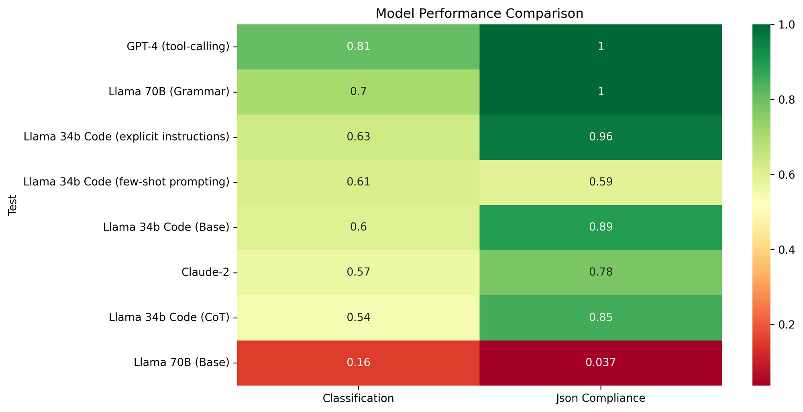
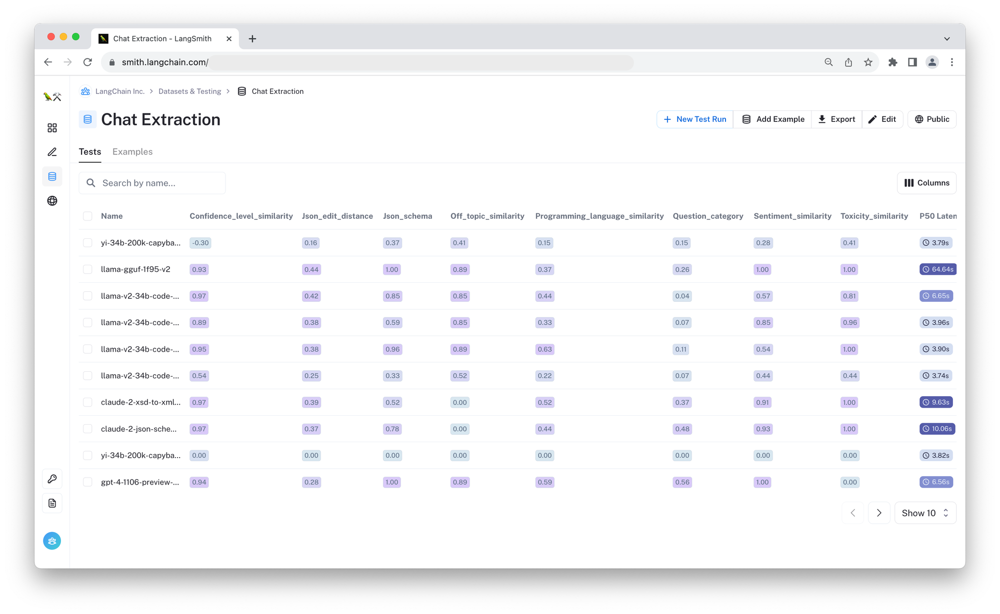
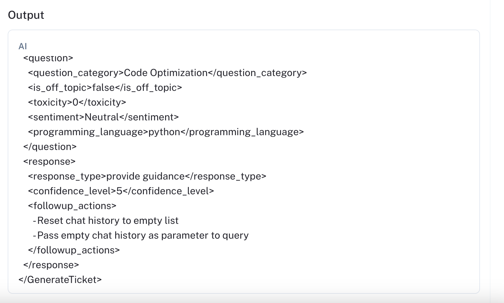
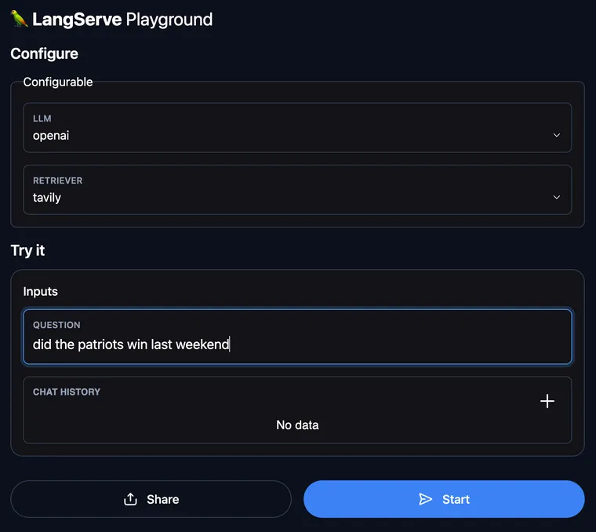
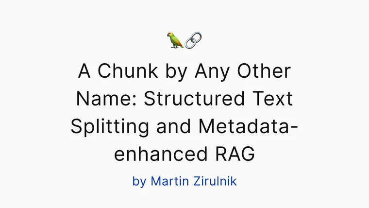

Two weeks ago, we launched the [`langchain-benchmarks`](https://github.com/langchain-ai/langchain-benchmarks?ref=blog.langchain.com) package, along with a [Q&A dataset](https://blog.langchain.com/public-langsmith-benchmarks/) over the LangChain docs. Today we’re releasing a new [extraction dataset](https://smith.langchain.com/public/00f4444c-9460-4a82-b87a-f50096f1cfef/d?ref=blog.langchain.com) that measures LLMs' ability to infer the correct structured information from chat logs.

The new dataset offers a practical environment to test common challenges in LLM application development like classifying unstructured text, generating machine-readable information, and reasoning over multiple tasks with distracting information.

In the rest of this post, I'll walk through how we created the dataset and share some initial benchmark results. We hope you find this useful for your own conversational app development and would love your feedback!

Selected metric comparison

## Motivation for the dataset

We wanted to design the dataset schema around a real-world problem: gleaning structured insights from chat bot interactions.

Over the summer, our excellent intern [Molly](https://twitter.com/mollycantillon?ref=blog.langchain.com) helped us refresh [Chat LangChain](https://chat.langchain.com/?ref=blog.langchain.com) ( [repo](https://github.com/langchain-ai/chat-langchain?ref=blog.langchain.com)), a retrieval-augmented generation (RAG) application over LangChain's python docs. It’s an “LLM with a search engine”, so you can ask it questions like "How do I add memory to an agent?”, and it will tell you an answer based on whatever it can find in the docs.

The real test of [such](https://templates.langchain.com/?integration_name=rag-conversation&ref=blog.langchain.com) a [project](https://github.com/langchain-ai/weblangchain?ref=blog.langchain.com) begins post-deployment, when you begin to observe how it's used and refine it further. Typically, users won't provide explicit feedback, but their conversations reveal a lot, and while you can try just “ [putting the logs into an LLM”](https://docs.smith.langchain.com/tracing/use-cases/summarize-usage?ref=blog.langchain.com) to summarize it, you can also often benefit from extracting structured content to monitor and analyze. This could help drive analytic dashboards or fine-tuning data collection pipelines, since the structured values can easily be used by traditional software.

The [Chat Extraction](https://smith.langchain.com/public/00f4444c-9460-4a82-b87a-f50096f1cfef/d?ref=blog.langchain.com) dataset is designed around testing how well today's crop of LLMs are able to extract and categorize relevant information from this type of data. In the following section, I’ll walk through how we created the dataset. If you just want to see the results, check out the summary graph below. You can feel free to jump to the experiments section for an analysis of the results.

Screenshot of the benchmark results

## Creating the Dataset

The main steps for creating the dataset were:

1. Settle on a data model to represent the structured output.
2. Seed with Q&A pairs.
3. Generate candidate answers using an LLM.
4. Manually review the results in the annotation queue, updating the taxonomy where necessary.

LangChain has long had [synthetic](https://python.langchain.com/docs/use_cases/data_generation?ref=blog.langchain.com) dataset [generation](https://github.com/langchain-ai/langchain/blob/700428593a86531ae0c891096c0d02aabcbc72af/libs/langchain/langchain/chains/qa_generation/base.py?ref=blog.langchain.com#L17) utilities that help you bootstrap some initial data, but the final version should always involve some amount of human review to ensure proper quality. That’s why we’ve added [data annotation queue](https://blog.langchain.com/announcing-data-annotation-queue/)’s to LangSmith and will continue to improve our tooling to help you build your data flywheel.

Once you have an initial dataset, you can use the labeled data as few-shot examples within the seed-generation model to improve the quality of data given to humans for review. This can help reduce the amount of work and changes needed when updating the ground truth.

## **Extraction Schema**

We wanted the task to be tractable while still offering a challenge for many common models today. We defined the schema using [this linked pydantic model](https://github.com/langchain-ai/langchain-benchmarks/blob/4ddbbc0ff87fb4dfac3cb457dba56e64d8cbc9c6/langchain_benchmarks/extraction/tasks/chat_extraction/schema.py?ref=blog.langchain.com#L7). An example extracted value is below:

```json
{
  "GenerateTicket": {
    "question": {
      "toxicity": 0,
      "sentiment": "Neutral",
      "is_off_topic": false,
      "question_category": "Function Calling",
      "programming_language": "unknown"
    },
    "response": {
      "response_type": "provide guidance",
      "confidence_level": 5,
      "followup_actions": [\
        "Check with API provider for function calling support."\
      ]
    },
    "issue_summary": "Function Calling Format Validation"
  }
}
```

Example Extracted Output

Many of these values could be useful in monitoring an actual production chat bot. We made the schema challenging in a few ways to make the benchmark results more useful in separating model capacity and functionality. Some challenges about this schema include:

1. It includes a couple fairly long Enum values. Even OpenAI's function calling/tool usage API [can be imperfect](https://community.openai.com/t/function-api-returns-value-that-are-not-in-enum/274544?ref=blog.langchain.com) in generating these.
2. The object is nested - nesting can make it harder for LLMs to stay coherent if they aren't trained on code.
3. The values in each nested component are meant to be inferred only from the corresponding sections of input (response or question).
4. It combines classification, summarization, and structured output generation in a single task.

If "attention is all you need", by splitting the attention of the model, this multi-task objective can be challenging for an LLM to address in a single generation.

## Evaluation

This benchmark is focused on structure and classification, and as such, we don't need to use any LLM-as-judge metrics. Instead, we wrote custom LangSmith evaluators (see the [code definition here](https://github.com/langchain-ai/langchain-benchmarks/blob/4ddbbc0ff87fb4dfac3cb457dba56e64d8cbc9c6/langchain_benchmarks/extraction/tasks/chat_extraction/evaluators.py?ref=blog.langchain.com#L1)). Below is what we measured:

1. Structure verification
1. `json_schema` : 1 if correct, 0 if not. We validate the parsed output for each model using the task schema.
2. Classification tasks

1. `question_category`: classification accuracy over the 25 valid enum values.
2. `off_topic_similarity`: binary classification accuracy of whether the LLM considered the question off-topic
3. `toxicity_similarity`: normalized difference in predicted level of "toxicity" of the user question.
4. `programming_language_similarity` \- classification accuracy of the predicted programming language the user's question references. In most cases, this is "unknown".
5. `confidence_level_similarity` the normalized similarity between the predicted "confidence" of the response and the labeled confidence.
6. `sentiment_similarity` \- Normalized difference between the prediction and label. Sentiment is scored as 0/1/2 for negative/neutral/positive.
3. Overall difference
1. `json_edit_distance`: this is a bit of a catch-all that first canonicalizes the predicted json and label json and then computes the Damerau-Levenshtein string distance between the two serialized forms.

## Experiments

In making this dataset, we wanted to answer a few questions:

1. How do the most popular closed-source LLMs compare?
2. How well do off-the-shelf open source LLMs perform relative to the closed-source models?
3. How effective are simple prompting strategies improving extraction performance?
4. If we control the LLM grammar to output a valid record, how significant is this for the individual classification metrics?

We evaluated the following LLMs:

- `gpt-4-1106-preview` the recent long-context, distilled version of GPT-4.
- `claude-2` \- an LLM from Anthropic.
- `llama-v2-34b-code-instruct` \- a 34b parameter variant of [Code Llama](https://github.com/facebookresearch/codellama?ref=blog.langchain.com) 2 fine-tuned on an instruction dataset.
- `llama-v2-chat-70b` \- a 70b parameter variant of Llama 2 fine-tuned for chat.
- `yi-34b-200k-capybara` \- a 34b [parameter model](https://huggingface.co/NousResearch/Nous-Capybara-34B?ref=blog.langchain.com) from [Nous Research](https://nousresearch.com/?ref=blog.langchain.com).

#### Experiment 1: GPT vs. Claude

We first compared Claude-2 and GPT-4, both closed-source LLMs. For GPT-4, we used its too-calling API, which lets you provide a JSON schema for it to populate.  Since Anthropic has yet to release a similar tool-calling API, we tested two different ways of specifying the schema:

1. Directly as a Json schema.
2. As an XSD (XML schema)

You can review the individual predictions side-by-side at the [linked tests](https://smith.langchain.com/public/00f4444c-9460-4a82-b87a-f50096f1cfef/d/compare?selectedSessions=dc7656d8-00ef-4048-9ce5-38ef72af593c%2C3f590999-a9d1-48be-83dd-e84acb99a195%2C0c022691-a7ac-4545-b2bc-58aab2d476e8&ref=blog.langchain.com). You can also check out the summary graph and table below:

confidence\_level\_similarityjson\_edit\_distancejson\_schemaoff\_topic\_similarityprogramming\_language\_similarityquestion\_categorysentiment\_similaritytoxicity\_similarity00.20.40.60.81

Test[claude-2-xsd-to-xml-5689](https://smith.langchain.com/public/00f4444c-9460-4a82-b87a-f50096f1cfef/d/compare?selectedSessions=dc7656d8-00ef-4048-9ce5-38ef72af593c)[claude-2-json-schema-to-xml-5689](https://smith.langchain.com/public/00f4444c-9460-4a82-b87a-f50096f1cfef/d/compare?selectedSessions=3f590999-a9d1-48be-83dd-e84acb99a195)[gpt-4-1106-preview-5689](https://smith.langchain.com/public/00f4444c-9460-4a82-b87a-f50096f1cfef/d/compare?selectedSessions=0c022691-a7ac-4545-b2bc-58aab2d476e8)Comparing GPT-4 and ClaudeMetricValue


Comparing GPT-4 and Claude

Show 102550100 entries

Search:

| Test | confidence\_level\_similarity | json\_edit\_distance | json\_schema | off\_topic\_similarity | programming\_language\_similarity | question\_category | sentiment\_similarity | toxicity\_similarity |
| --- | --- | --- | --- | --- | --- | --- | --- | --- |
| [claude-2-xsd-to-xml-5689](https://smith.langchain.com/public/00f4444c-9460-4a82-b87a-f50096f1cfef/d/compare?selectedSessions=dc7656d8-00ef-4048-9ce5-38ef72af593c&ref=blog.langchain.com) | 0.97 | 0.39 | 0.52 | 0.00 | 0.52 | 0.37 | 0.91 | 1.0 |
| [claude-2-json-schema-to-xml-5689](https://smith.langchain.com/public/00f4444c-9460-4a82-b87a-f50096f1cfef/d/compare?selectedSessions=3f590999-a9d1-48be-83dd-e84acb99a195&ref=blog.langchain.com) | 0.97 | 0.37 | 0.78 | 0.00 | 0.44 | 0.48 | 0.93 | 1.0 |
| [gpt-4-1106-preview-5689](https://smith.langchain.com/public/00f4444c-9460-4a82-b87a-f50096f1cfef/d/compare?selectedSessions=0c022691-a7ac-4545-b2bc-58aab2d476e8&ref=blog.langchain.com) | 0.94 | 0.28 | 1.00 | 0.89 | 0.59 | 0.56 | 1.00 | 0.0 |

Showing 1 to 3 of 3 entries

Previous1Next

As expected, GPT-4 performs better across almost all metrics, and we were unable to get Claude to perfectly output the desired schema in a single shot. Interestingly enough, the Claude model prompted with a JSON schema does slightly better than the one prompted with the same information provided in an XSD (XML schema), indicating that at least in this case, consistent formatting of the schema isn't that important.

It's easy to see some common schema issues; for instance, in [this run](https://smith.langchain.com/public/ad7ec13a-2e10-45f8-8e4f-9e46ca4c6595/r/7b340495-8a08-4805-81d7-a28050c94a97?ref=blog.langchain.com) and [this run](https://smith.langchain.com/public/ab543c3f-894d-4d30-aba4-5a3629a76d23/r/0c99e258-afd4-4b61-9d33-63e07927edc3?ref=blog.langchain.com), the model outputs a bullet-point list for the follow-up actions rather than properly tagged elements, which was parsed as a string rather than a list. Below is an example image of this:

Schema Error

While we can fix these parsing errors on a case-by-case basis, the unpredictability hinders the overall development experience. There's more overhead in adapting one extraction chain to another task since the parser and other behavior is less consistent. The XML syntax also increases the overall token usage of Claude relative to GPT. Though "tokens" aren't directly comparable, verbose syntaxes will likely lead to slower response times and higher costs.

#### Experiment 2: Open-Source Models

We next wanted to benchmark popular open-source models off-the shelf, and started out by comparing the same basic prompt across three models:

- `llama-v2-34b-code-instruct` \- a 34b parameter variant of [Code Llama](https://github.com/facebookresearch/codellama?ref=blog.langchain.com) 2 fine-tuned on an instruction dataset.
- `llama-v2-chat-70b` \- a 70b parameter variant of Llama 2 fine-tuned for chat.
- `yi-34b-200k-capybara` \- a 34b [parameter model](https://huggingface.co/NousResearch/Nous-Capybara-34B?ref=blog.langchain.com) from [Nous Research](https://nousresearch.com/?ref=blog.langchain.com).

Check out the [linked comparisons](https://smith.langchain.com/public/00f4444c-9460-4a82-b87a-f50096f1cfef/d/compare?selectedSessions=fe0a7d34-ac77-4674-97ab-11cf3b999f7c%2C2bb03041-c9e5-4040-bf4f-81b19e5c2ad4%2Ccd595a34-012c-4df2-849e-a7e2908d4c81&ref=blog.langchain.com) to see the outputs in LangSmith, or reference the aggregate metrics below:

confidence\_level\_similarityjson\_edit\_distancejson\_schemaoff\_topic\_similarityprogramming\_language\_similarityquestion\_categorysentiment\_similaritytoxicity\_similarity00.51

Test[yi-34b-200k-capybara-5d76-v1](https://smith.langchain.com/public/00f4444c-9460-4a82-b87a-f50096f1cfef/d/compare?selectedSessions=fe0a7d34-ac77-4674-97ab-11cf3b999f7c)[llama-v2-70b-chat-28a7-v1](https://smith.langchain.com/public/00f4444c-9460-4a82-b87a-f50096f1cfef/d/compare?selectedSessions=cd595a34-012c-4df2-849e-a7e2908d4c81)[llama-v2-34b-code-instruct-bcce-v1](https://smith.langchain.com/public/00f4444c-9460-4a82-b87a-f50096f1cfef/d/compare?selectedSessions=2bb03041-c9e5-4040-bf4f-81b19e5c2ad4)Compare Baseline OSS ModelsMetricValue


Compare Baseline OSS Models

Show 102550100 entries

Search:

| Test | confidence\_level\_similarity | json\_edit\_distance | json\_schema | off\_topic\_similarity | programming\_language\_similarity | question\_category | sentiment\_similarity | toxicity\_similarity |
| --- | --- | --- | --- | --- | --- | --- | --- | --- |
| [yi-34b-200k-capybara-5d76-v1](https://smith.langchain.com/public/00f4444c-9460-4a82-b87a-f50096f1cfef/d/compare?selectedSessions=fe0a7d34-ac77-4674-97ab-11cf3b999f7c&ref=blog.langchain.com) | -0.30 | 0.16 | 0.37 | 0.41 | 0.15 | 0.15 | 0.28 | 0.41 |
| [llama-v2-70b-chat-28a7-v1](https://smith.langchain.com/public/00f4444c-9460-4a82-b87a-f50096f1cfef/d/compare?selectedSessions=cd595a34-012c-4df2-849e-a7e2908d4c81&ref=blog.langchain.com) | 0.30 | 0.43 | 0.04 | 0.30 | 0.15 | 0.04 | 0.30 | 0.00 |
| [llama-v2-34b-code-instruct-bcce-v1](https://smith.langchain.com/public/00f4444c-9460-4a82-b87a-f50096f1cfef/d/compare?selectedSessions=2bb03041-c9e5-4040-bf4f-81b19e5c2ad4&ref=blog.langchain.com) | 0.93 | 0.41 | 0.89 | 0.89 | 0.44 | 0.07 | 0.59 | 1.00 |

Showing 1 to 3 of 3 entries

Previous1Next

Despite its larger model size, the 70B variant of Llama 2 did not reliably output JSON, since the amount of code included in its pretraining and SFT corpus was low. Yi-34b was more reliable in this regard, but it still only matched the required schema 37% of the time. It also performs better on the hardest of the classification tasks, the `question_category` classification.

The 34B Code Llama 2 was able to output valid JSON and did a decent job for the other metrics, so we will use it as the baseline for the following prompt experiments.

#### Experiment 3: Prompting for Schema Compliance

Of the three open model baselines, the 34B Code Llama 2 variant performed the best. Because of this, we selected it to answer the question "how well do simple prompting techniques work in getting the model to output reliably structured JSON" (hint: not very well). You can re-run the experiments using [this notebook](https://github.com/hinthornw/llama-extraction/blob/main/llama_extraction.ipynb?ref=blog.langchain.com).

In the baseline experiments, the most common failure mode was hallucination of invalid Enum values (see for example, this [run](https://smith.langchain.com/public/c653ce8d-dedd-41cf-828c-00dcd0403a8e/r/e7a38f0c-af73-492f-930b-d6b0ba256f41?ref=blog.langchain.com)), as well as poor classification performance for simple things like question sentiment.

We tested three prompting strategies to see how they impact the aggregate performance:

1. Adding additional task-specific instructions: the schema already has descriptions for each value, but we wanted to see if additional instructions to e.g., carefully select a valid Enum values from the list, would help. We had tested this approach on a couple of playground examples and saw that it could occasionally help.
2. Chain-of-thought: Ask the model to think step by step about the schema structure before generating the final output.
3. Few-shot examples: We hand-crafted expected input-output pairs for the model to follow, in addition to the explicit instructions and schema. Sometimes LLMs (like people) learn better by seeing a few examples rather than from instructions.

Below are the results:

confidence\_level\_similarityjson\_edit\_distancejson\_schemaoff\_topic\_similarityprogramming\_language\_similarityquestion\_categorysentiment\_similaritytoxicity\_similarity00.20.40.60.81

Testbaselineinstructionsfew-shotCoTCompare Prompt Strategies for OSS ModelsMetricValue


Compare Prompt Strategies for OSS Models

Show 102550100 entries

Search:

| Test | Prompt | confidence\_level\_similarity | json\_edit\_distance | json\_schema | off\_topic\_similarity | programming\_language\_similarity | question\_category | sentiment\_similarity | toxicity\_similarity |
| --- | --- | --- | --- | --- | --- | --- | --- | --- | --- |
| [llama-v2-34b-code-instruct-bcce-v1](https://smith.langchain.com/public/00f4444c-9460-4a82-b87a-f50096f1cfef/d/compare?selectedSessions=2bb03041-c9e5-4040-bf4f-81b19e5c2ad4&ref=blog.langchain.com) | baseline | 0.93 | 0.41 | 0.89 | 0.89 | 0.44 | 0.07 | 0.59 | 1.00 |
| [llama-v2-34b-code-instruct-e20e-v1](https://smith.langchain.com/public/00f4444c-9460-4a82-b87a-f50096f1cfef/d/compare?selectedSessions=0dbfb2d9-f53c-4d73-9eb7-db3bd2c1a0c8&ref=blog.langchain.com) | instructions | 0.95 | 0.38 | 0.96 | 0.89 | 0.63 | 0.11 | 0.54 | 1.00 |
| [llama-v2-34b-code-instruct-34b8-v2](https://smith.langchain.com/public/00f4444c-9460-4a82-b87a-f50096f1cfef/d/compare?selectedSessions=379cfcd2-ddc1-4866-9d41-9d59733ddfc1&ref=blog.langchain.com) | few-shot | 0.89 | 0.38 | 0.59 | 0.85 | 0.33 | 0.07 | 0.85 | 0.96 |
| [llama-v2-34b-code-instruct-d3a3-v2](https://smith.langchain.com/public/00f4444c-9460-4a82-b87a-f50096f1cfef/d/compare?selectedSessions=f085918d-085e-41f1-8ce1-b80382a1d291&ref=blog.langchain.com) | CoT | 0.97 | 0.42 | 0.85 | 0.85 | 0.44 | 0.04 | 0.57 | 0.81 |

Showing 1 to 4 of 4 entries

Previous1Next

None of the prompting strategies demonstrate meaningful improvements on the metrics in question. The few-shot examples technique even decreases performance of the model on the JSON Schema test (see: [example](https://smith.langchain.com/public/dd49c66e-e0e7-4aaf-ab6a-c80b55764698/r/1f225651-1a54-4c33-8d30-752677f5c430?ref=blog.langchain.com)). This may be because we are increasing the amount of content in the prompt that distracts from the raw schema. Making the instructions explicit does seem to improve the performance of the programming language classification, since the model is instructed to focus on the question. The contribution is minor, however, and for the sentiment classification metric, the model continues to get distracted by the _response_ sentiment.

#### Experiment 4: Structured Decoding

Since none of the prompting techniques offer a significant boost to the structure of the model output, we wanted to test other ways to reliably generate schema-compliant JSON. Specifically, we wanted to apply structured decoding techniques such as logit biasing / [constraint-based](https://github.com/ggerganov/llama.cpp/pull/1773?ref=blog.langchain.com) sampling. For a survey on guided text generation, check out Lilian Weng's [excellent post.](https://lilianweng.github.io/posts/2021-01-02-controllable-text-generation/?ref=blog.langchain.com)

In this experiment, we test [Llama 70B](https://replicate.com/andreasjansson/llama-2-70b-chat-gguf?ref=blog.langchain.com) using Llama.cpp's grammar-based [decoding mechanism](https://github.com/ggerganov/llama.cpp/blob/master/grammars/README.md?ref=blog.langchain.com) to guarantee a valid JSON schema. See the comparison with the baseline [here](https://smith.langchain.com/public/00f4444c-9460-4a82-b87a-f50096f1cfef/d/compare?selectedSessions=d522dbfc-c09b-45a9-b11e-26aa95a3555a%2Ccd595a34-012c-4df2-849e-a7e2908d4c81&ref=blog.langchain.com) and in the table below.

confidence\_level\_similarityjson\_edit\_distancejson\_schemaoff\_topic\_similarityprogramming\_language\_similarityquestion\_categorysentiment\_similaritytoxicity\_similarity00.20.40.60.81

Test[llama-v2-70b-chat-28a7-v1](https://smith.langchain.com/public/00f4444c-9460-4a82-b87a-f50096f1cfef/d/compare?selectedSessions=cd595a34-012c-4df2-849e-a7e2908d4c81)[llama-gguf-1f95-v2](https://smith.langchain.com/public/00f4444c-9460-4a82-b87a-f50096f1cfef/d/compare?selectedSessions=d522dbfc-c09b-45a9-b11e-26aa95a3555a)Compare Baseline vs. Grammar-based DecodingMetricValue


Compare Baseline vs. Grammar-based Decoding

Show 102550100 entries

Search:

| Test | Decoding | confidence\_level\_similarity | json\_edit\_distance | json\_schema | off\_topic\_similarity | programming\_language\_similarity | question\_category | sentiment\_similarity | toxicity\_similarity |
| --- | --- | --- | --- | --- | --- | --- | --- | --- | --- |
| [llama-v2-70b-chat-28a7-v1](https://smith.langchain.com/public/00f4444c-9460-4a82-b87a-f50096f1cfef/d/compare?selectedSessions=cd595a34-012c-4df2-849e-a7e2908d4c81&ref=blog.langchain.com) | baseline | 0.30 | 0.43 | 0.04 | 0.30 | 0.15 | 0.04 | 0.3 | 0.0 |
| [llama-gguf-1f95-v2](https://smith.langchain.com/public/00f4444c-9460-4a82-b87a-f50096f1cfef/d/compare?selectedSessions=d522dbfc-c09b-45a9-b11e-26aa95a3555a&ref=blog.langchain.com) | structured | 0.93 | 0.44 | 1.00 | 0.89 | 0.37 | 0.26 | 1.0 | 1.0 |

Showing 1 to 2 of 2 entries

Previous1Next

The most noticeable (and expected) improvement is that the `json_schema` correctness went from almost never correct to 100% validity. This means that the other values also could be reliably parsed, leading to fewer 0's in these fields. Since the base Llama 70B chat model is also larger and more capable than our previous 34B model experiments, we can see improvements in the sentiment similarity and question category as well. However, the absolute performance in these metrics is still low. Grammar-based decoding makes the output structure guaranteed, but it alone is insufficient to guarantee the quality of the values themselves.

#### Full Results

For the full results for the above experiments, check out the [LangSmith test link](https://smith.langchain.com/public/00f4444c-9460-4a82-b87a-f50096f1cfef/d?ref=blog.langchain.com). You can also run any of these benchmarks against your own model by following the notebook [here](https://langchain-ai.github.io/langchain-benchmarks/notebooks/extraction/chat_extraction.html?ref=blog.langchain.com).

### Tags


[](https://blog.langchain.com/applying-openai-rag/)

[**Applying OpenAI's RAG Strategies**](https://blog.langchain.com/applying-openai-rag/)


[](https://blog.langchain.com/langserve-playground-and-configurability/)

[**LangServe Playground and Configurability**](https://blog.langchain.com/langserve-playground-and-configurability/)


[](https://blog.langchain.com/a-chunk-by-any-other-name/)

[**A Chunk by Any Other Name: Structured Text Splitting and Metadata-enhanced RAG**](https://blog.langchain.com/a-chunk-by-any-other-name/)


[**The Prompt Landscape**](https://blog.langchain.com/the-prompt-landscape/)


[](https://blog.langchain.com/building-chat-langchain-2/)

[**Building Chat LangChain**](https://blog.langchain.com/building-chat-langchain-2/)