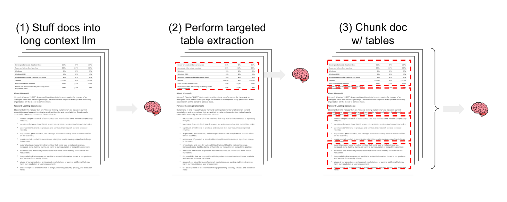
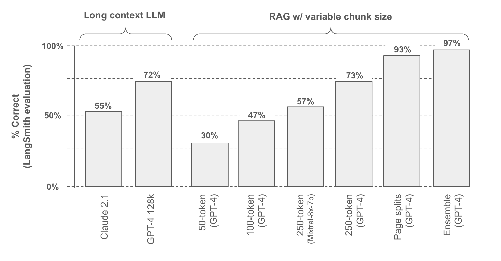
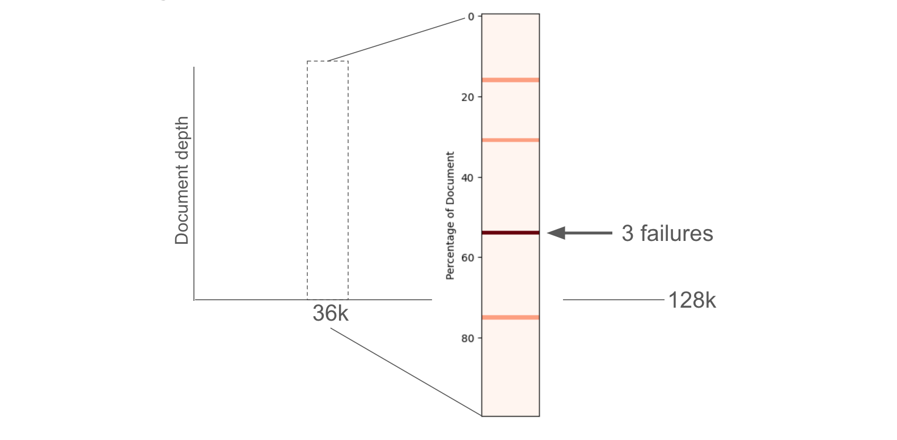
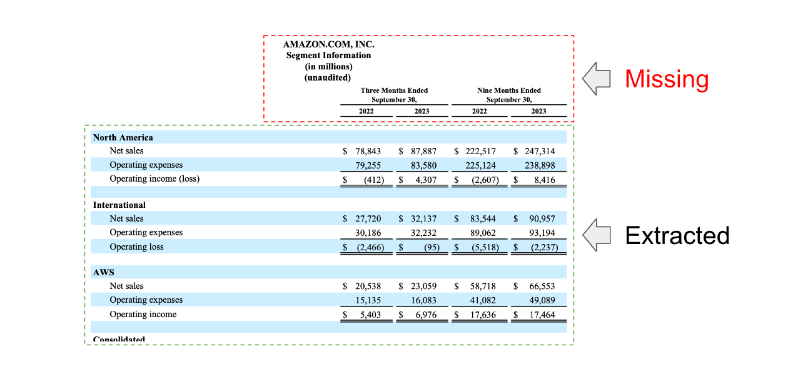
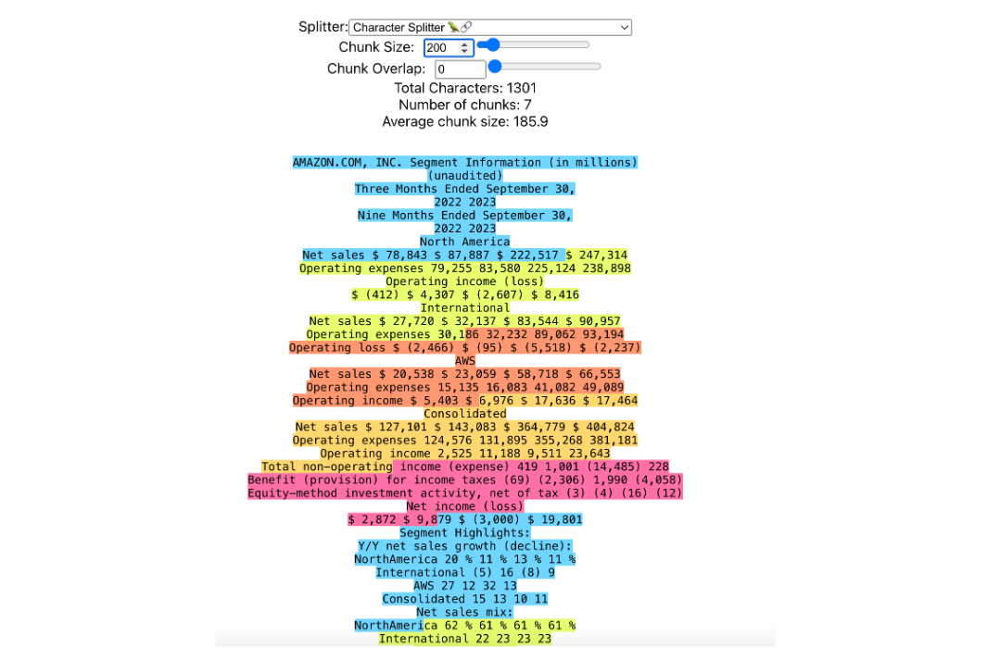
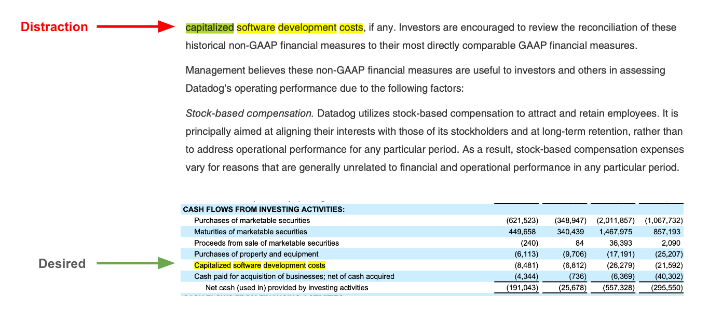
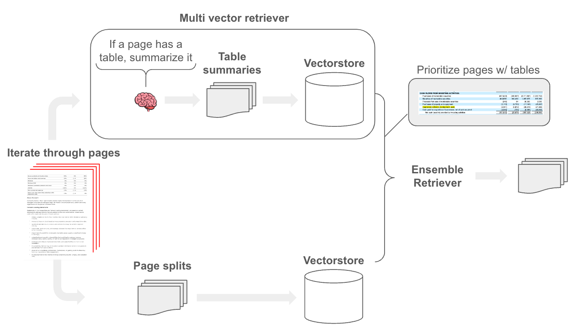

## Key links

LangChain public benchmark evaluation notebooks:

- Long context LLMs [here](https://langchain-ai.github.io/langchain-benchmarks/notebooks/retrieval/semi_structured_benchmarking/ss_eval_long_context.html?ref=blog.langchain.com)
- Chunk size tuning [here](https://langchain-ai.github.io/langchain-benchmarks/notebooks/retrieval/semi_structured_benchmarking/ss_eval_chunk_sizes.html?ref=blog.langchain.com)
- Multi vector with ensemble [here](https://langchain-ai.github.io/langchain-benchmarks/notebooks/retrieval/semi_structured_benchmarking/ss_eval_multi_vector.html?ref=blog.langchain.com)

## Motivation

Retrieval augmented generation (RAG) is one of the most important concepts in LLM app development. Documents of [many types](https://www.youtube.com/watch?v=O8sQxPgw8Ws&ref=blog.langchain.dev) can be [passed into the context window](https://blog.langchain.com/deconstructing-rag/) of an LLM, enabling interactive chat or Q+A assistants. Reasoning over information in tables is an important application of RAG since tables are common in documents such as white papers, financial reports, and / or technical manuals.

## Approaches

At least 3 strategies for semi-structured RAG over a mix of unstructured text and structured tables are reasonable to consider. **(1)** Pass semi-structured documents including tables, into the LLM context window (e.g, using long-context LLMs like [GPT-4 128k](https://openai.com/blog/new-models-and-developer-products-announced-at-devday?ref=blog.langchain.com) or [Claude2.1](https://www.anthropic.com/index/claude-2-1?ref=blog.langchain.com)). **(2)** Use a targeted approach to detect and extract tables from documents (e.g., models to [detect](https://github.com/microsoft/table-transformer?ref=blog.langchain.com) tables for extraction). **(3)** Split documents (e.g., using a text splitting) so that table elements are preserved inside text chunks. For approaches 2 and 3, extracted tables or document splits that contain tables can be embedded and stored for semantic retrieval in a [RAG application](https://blog.langchain.com/deconstructing-rag/).

## Benchmarking

To test these approaches, we build a public LangSmith benchmark with 30 questions from 6 documents (2 white papers and 4 earnings reports); 25 of the questions are derived specifically from table elements in these documents.

We tested two different long context LLMs along with various approaches for chunking documents. We use [LangSmith to grade](https://docs.smith.langchain.com/evaluation/evaluator-implementations?ref=blog.langchain.com#correctness-qa-evaluation) the responses relative to the ground truth answer presented in the benchmark (chart below, runs [here](https://smith.langchain.com/public/8d99760c-8f2c-4cd4-aca0-8d72dc23c61d/d?ref=blog.langchain.com)).

## Approach 1: Long Context LLMs

Directly passing documents that contain tables into the a long context LLM context window has considerable appeal: it is simple. But the challenges are two-fold: (1) this approach does not scale to a very large corpus; 128k tokens is > 100 pages, but this is still small relative to the size of many datasets. (2) These LLMs exhibit some degradation in performance with respect to the size of the input and the placement of details within the inputs, as Greg Kamradt has nicely shown [here](https://twitter.com/GregKamradt/status/1722386725635580292?ref=blog.langchain.com) and [here](https://twitter.com/GregKamradt/status/1727018183608193393?ref=blog.langchain.com).

Figure credit to Greg Kamradt ( [here](https://twitter.com/GregKamradt/status/1722386725635580292?ref=blog.langchain.com))

The concatenated text from all 6 documents is only ~36,000 tokens, far fewer than the 128k token context limit for GPT-4. Following the above report, we also looked at failures with respect to document depth (see results [here](https://langchain-ai.github.io/langchain-benchmarks/notebooks/retrieval/semi_structured_benchmarking/ss_eval_long_context.html?ref=blog.langchain.com) and shown below). This would would benefit from more careful examination to better understand why and when long context LLMs fail to recover information in tables.

## Approach 2: Targeted table extraction

Directly extracting tables from documents is appealing: it would allow us to use methods like the [multi-vector retriever](https://blog.langchain.com/semi-structured-multi-modal-rag/) to index each one. A few approaches [to detect tables](https://github.com/microsoft/table-transformer?ref=blog.langchain.com) in documents are available and packages such as [Unstructured](https://unstructured-io.github.io/unstructured/introduction.html?ref=blog.langchain.com#tables) or Docugami. We'll be following up with some specific analyses focused on these packages. However, it is worth flagging that table extraction is challenging due to variable representation of tables. For example, in our evaluation we saw cases where the table header was not correctly extracted using some of these methods (below). While challenging, these methods probably high the highest performance ceiling, especially for complex table types, and are worth examining carefully.

## Approach 3: Chunking

While targeting table extraction focuses specifically on finding and extracting tables, document chunking naively splits documents based upon a specified token limit. The challenge here is straightforward: if we chunk a document in a way that disrupts table structure, then we will not be able to answer questions about it. As an example, we saw lowest performance with 50 token chunk size (30% accuracy) and we can visualize this using [chunkviz](https://www.chunkviz.com/?ref=blog.langchain.com) from Greg Kamradt: this obviously breaks up one of our examples tables in a problematic way and degrades performance.

50 token chunk size applied to a table

So, the question is: how can we set chunk size to maximize the likelihood that we preserve tables? Performance improves with respect to chunk size, as expected, since tables are more likely to be preserved in larger chunks. We also tested both GPT-4 and Mixtral-8x-7b (via [Fireworks.ai](https://x.com/thefireworksai/status/1733309517583302700?s=20&ref=blog.langchain.com)), which shows that choice of LLM will impact performance by varying answer quality (see details [here](https://smith.langchain.com/public/8d99760c-8f2c-4cd4-aca0-8d72dc23c61d/d?ref=blog.langchain.com)).

Ultimately, we found an obvious chunk strategy worked well: _split documents along pages_. Many document tables are designed to respect page boundaries to improve human read-ability. Of course, this approach will break down in cases where tables span page boundaries (motivating targeted extraction methods).

However, we found another problem: chunks from tables, which contain our most valuable information, can compete with chunks from the text body of documents. Here is a [trace](https://smith.langchain.com/public/9c7c354f-2f39-4398-964c-d40cfcb8aeb6/r?ref=blog.langchain.com) that highlights the problem: we want the _capitalized software expense_ for Datadog in one of our docs but fail to retrieve the table chunks because this keyword is present in much of the text body, acting as a distraction.

To combat this, we found a simple approach worked well: build a retriever that focuses on tables. To do this, we use an LLM to scan each page and summarize any tables within the page. We then index those summaries for retrieval and store the raw page text containing the table with [multi-vector retriever](https://blog.langchain.com/semi-structured-multi-modal-rag/). Finally, we [ensemble](https://python.langchain.com/docs/modules/data_connection/retrievers/ensemble?ref=blog.langchain.com) retrieved table chunks with the raw text chunks. The nice thing about ensemble retriever is that we can prioritize certain sources, which allows use to ensure that any relevant tables chunks are passed to the LLM.

In short, the [ensemble retriever](https://python.langchain.com/docs/modules/data_connection/retrievers/ensemble?ref=blog.langchain.com) combines the rankings from different retrievers into a single, unified ranking. Each retriever provides a list of documents (or search results) ranked based on their relevance to the query. We can apply weights to scale the contribution of each retriever to the final combined ranking. Here, we simply gives table-derived chunks a higher weight to ensure their retrieval.

## Conclusion

While long context LLMs offer simplicity, factual recall can be challenged by both context length and table placement within documents. Targeted table extraction may have the highest performance ceiling, especially for complex table types, but requires specific packages that can add complexity and may suffer from failure modes on recognition of diverse of table types. Follow-up work will examine these methods in detail. Chunking is a simple approach, but chunk size selection is a challenge. For this use case, we found that chunking along page boundaries is a reasonable way to preserve tables within chunks but acknowledge that there are failure modes such as multi-page tables. We also found that tricks sich as ensembling can prioritize table-derived text chunks to improve performance.