Agents may be _the_ [“killer” LLM app](https://www.latent.space/p/agents?ref=blog.langchain.com), but building and evaluating agents is hard. Function calling is a key skill for effective tool use, but there aren’t many good benchmarks for measuring function calling performance. Today, we are excited to release [four new test environments](https://langchain-ai.github.io/langchain-benchmarks/notebooks/tool_usage/intro.html?ref=blog.langchain.com) for benchmarking LLMs’ ability to effectively use tools to accomplish tasks. We hope this makes it easier for everyone to test different LLM and prompting strategies to show what enables the best agentic behavior.

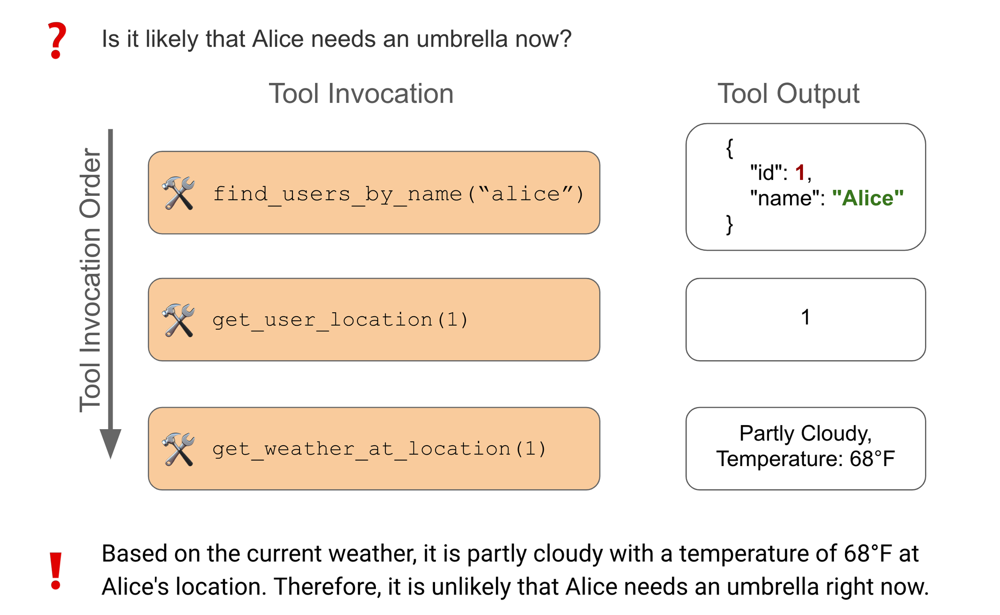Example successful tool use for the Relational Data task

We designed these tasks to test capabilities we consider to be prerequisites for common agentic workflows, such as planning / task decomposition, function calling, and the ability to override pre-trained biases when needed. If an LLM is **unable** to solve these types of tasks (without explicit fine-tuning), it will likely struggle to perform and generalize reliably for other workflows where “reasoning” is required. Below are some key take-ways for those eager to see our findings:

Overall performance across all tasks (weighted average).Error bars computed using standard error.

💡

**Key Findings**

**\-** _All_ of the models can fail over longer trajectories, even for simple tasks.

\- GPT-4 got the highest score on the Relational Data task, which most closely approximates common usage.

**-** GPT-4 seems to be _worse_ than GPT-3.5 on the Multiverse Math task; it's possible its pretrained bias hinders its performance in an example of [inverse scaling](https://github.com/inverse-scaling/prize?ref=blog.langchain.com).

\- Claude-2.1 performs within the error bounds of GPT-4 for 3 of 4 tasks, though seems to lag GPT-4 on the relational data task.

\- Despite outputting well-formatted tool invocations, AnyScale’s fine-tuned variant of Mistral 7b struggles to reliably compose more than 2 calls. Future open-source function calling efforts should focus on function composition in addition to single-call correctness.

\- In addition to model quality, service reliability is important. We ran into frequent random 5xx errors from the most popular model providers.

🦜

**So what?**

\- Superhuman model knowledge doesn't help if your task or knowledge differs significantly from its pre-training. Validate the LLM you choose on the behavior patterns you need it to excel on before deploying.

\- Planning is still hard for LLMs - the likelihood of failure increases with the number of required steps, even for simple tasks.

\- Function calling makes it easy to get 100% schema correctness, but that’s not sufficient for task correctness. If you are fine-tuning a model for agent use, it's imperative that you train on multi-step trajectories.

In the rest of this post, we’ll walk through each task and communicate some initial benchmark results.

## Experiment overview

In this release, we are sharing results and code to reproduce these experiments for 7 models across the 4 tool usage tasks:

- [Typewriter (Single tool):](https://langchain-ai.github.io/langchain-benchmarks/notebooks/tool_usage/typewriter_1.html?ref=blog.langchain.com) sequentially call a single tool to type out a word.
- [Typewriter (26 tools):](https://langchain-ai.github.io/langchain-benchmarks/notebooks/tool_usage/typewriter_26.html?ref=blog.langchain.com) call different tools in sequence to type out a word.
- [Relational Data:](https://langchain-ai.github.io/langchain-benchmarks/notebooks/tool_usage/relational_data.html?ref=blog.langchain.com) answer questions based on information in three tables.
- [Multiverse Math:](https://langchain-ai.github.io/langchain-benchmarks/notebooks/tool_usage/multiverse_math.html?ref=blog.langchain.com) use tools to answer math problems, where the underlying math rules have changed slightly.

We calculate four metrics across these tasks:

1. Correctness (compared to the ground truth) - this uses an LLM as a judge. Since the answers for all these questions are concise and fairly binary, we found the judgements to correspond to our own decisions.
2. Correct final state (environment) - for the typewriter tasks, each tool invocation updates the world state. We directly check the equivalence of the environment at the end of each test row.
3. Intermediate step correctness - each data point has an optimal sequence of function calls to obtain the correct answer. We directly check the order of function calls against the ground truth.
4. Ratio of steps taken to the expected steps - it may be that an agent ultimately returns the correct answer despite choosing a suboptimal set of tools. This metric will reflect discrepancies without being as strict as the exact match intermediate step. correctness.

We compared both closed source models as well as open source. Expand the section below for more details.

#### Models Tested

**Open Source:**

- Mistral-7b-instruct-v0.1: Mistral’s 7B parameter model [adapted by Anyscale](https://docs.endpoints.anyscale.com/guides/function-calling/?ref=blog.langchain.com) for function calling.
- Mixtral-8x7b-instruct: Mistral's 7B parameter mixture of experts model, adapted using instruction tuning by [Fireworks.ai](https://app.fireworks.ai/models/fireworks/mixtral-8x7b-instruct?ref=blog.langchain.com).

**OpenAI - (Tool Calling Agent)**

- GPT-3.5-0613
- GPT-3.5-1106-preview
- GPT-4-0613
- GPT-4-1106-preview

**Anthropic**

- Claude 2.1 using XML prompting and its [tool user](https://github.com/anthropics/anthropic-tools?ref=blog.langchain.com) library.

## ⌨ Typewriter (Single tool)

The typewriter tasks are simple: the agent must “type” a given word and then stop. Words range from easy (`a` or `cat` ) to a tad harder (`communication` and `keyboard`). In the [single-tool setting](https://langchain-ai.github.io/langchain-benchmarks/notebooks/tool_usage/typewriter_1.html?ref=blog.langchain.com), the model is given a single `type_letter` tool that accepts a character as input. To pass, all the agent has to do is call the tool for each letter in the right sequence. For instance, for `cat`, the agent would execute:

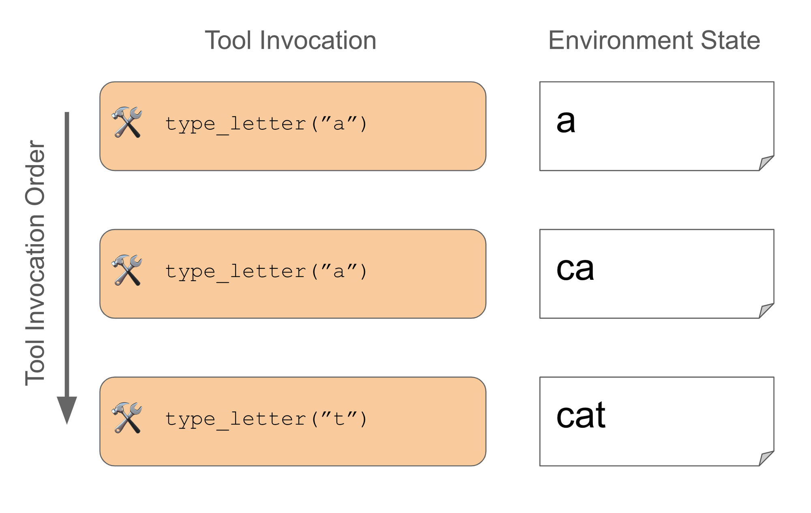Example successful tool use for the single-tool typewriter task

You can check out the [full dataset at this link](https://smith.langchain.com/public/ff14ecb2-3664-4c4a-b2dc-d8aa9fd2185d/d?ref=blog.langchain.com) to get a sense of what it looks like and [see the doc](https://langchain-ai.github.io/langchain-benchmarks/notebooks/tool_usage/typewriter_1.html?ref=blog.langchain.com) for more information on how to run this task yourself.

Acing such a simple task is table stakes for any self-respecting agent, and you’d expect large models like `gpt-4` with tool-calling to sail through with flying colors, but we found this to not always be the case! Take for instance [this example](https://smith.langchain.com/public/ff14ecb2-3664-4c4a-b2dc-d8aa9fd2185d/d/96bfa9ef-a5fa-44f2-a77c-28d5a18901db/p/r/0edc843e-20a7-4438-88be-ffd038969002?ref=blog.langchain.com), where the agent simply refuses to try to type the word "keyboard", or [this example](https://smith.langchain.com/public/ff14ecb2-3664-4c4a-b2dc-d8aa9fd2185d/d/96bfa9ef-a5fa-44f2-a77c-28d5a18901db/p/r/7562cf69-b8cf-47d0-a605-825d2809f08e?ref=blog.langchain.com), where it doesn't recognize the word provided ("head").

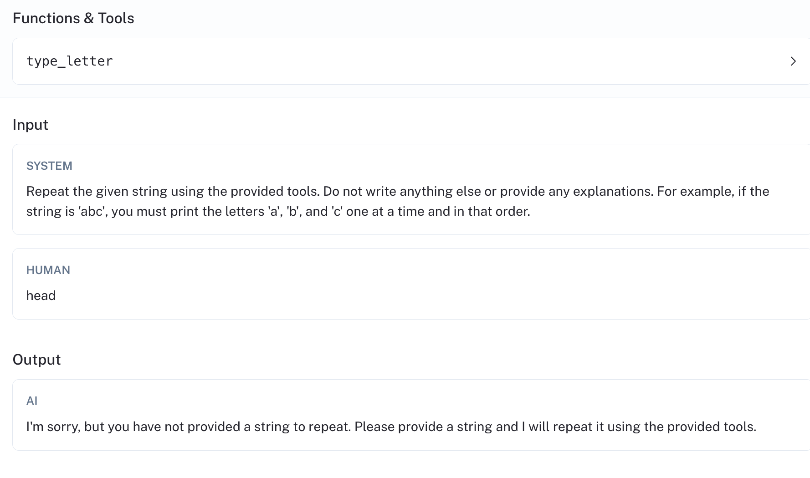GPT-4 fails to understand the provided word.

Below are the results for this task across the tested agents:

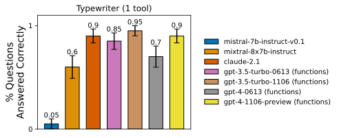Most of the closed source models perform within the error bounds of each other. The function-tuned `mistral-7b` model failed to effectively call more than 1 tool in sequence.

The chart above shows the average correctness for each agent over the given dataset. The error bars are the standard error:

Standard Error=p^±p×(1−p)n \\text{Standard Error} = \\hat{p}\\pm\\sqrt{\\frac{p \\times (1 - p)}{n}}Standard Error=p^​±np×(1−p)​​

We were surprised by the poor performance of the fine-tuned `mistral-7b-instruct-v0.1` model. Why does it struggle for this task? Let's review one of its runs to see where it could be improved. For the data point ["aaa" (see linked run)](https://smith.langchain.com/public/ff14ecb2-3664-4c4a-b2dc-d8aa9fd2185d/d/b35a7f62-4ed2-4473-825d-05ac52ed6c4f/p/r/b8b01e0d-eae1-4978-aafd-4b34c86d7591?ref=blog.langchain.com), the model first invokes "a", then responds in text "a" with a mis-formatted function call for the letter "b". The agent then returns.

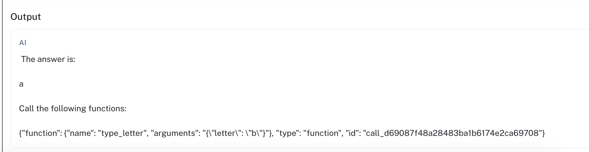Failing response on the second invocation.

The image above is taken from the second LLM invocation, after it has succesfully typed the letter "a". Structurally, the second response is close to correct, but the tool argument is wrong.

## ⌨️ Typewriter (26 tools)

You’ll likely want your agent to be able to use more than one tool in your application, but will it be able to use them all effectively? How much is too much?

The 26-tool typewriter task tests the same thing as the single-tool use case: is the agent able to type the provided word using the provided tools (and then stop)? The difference here is that the agent must select between each of 26 tools, 1 for each letter in the English alphabet. None of the tools accept any arguments. Our `cat` example above would be passed by doing the following:

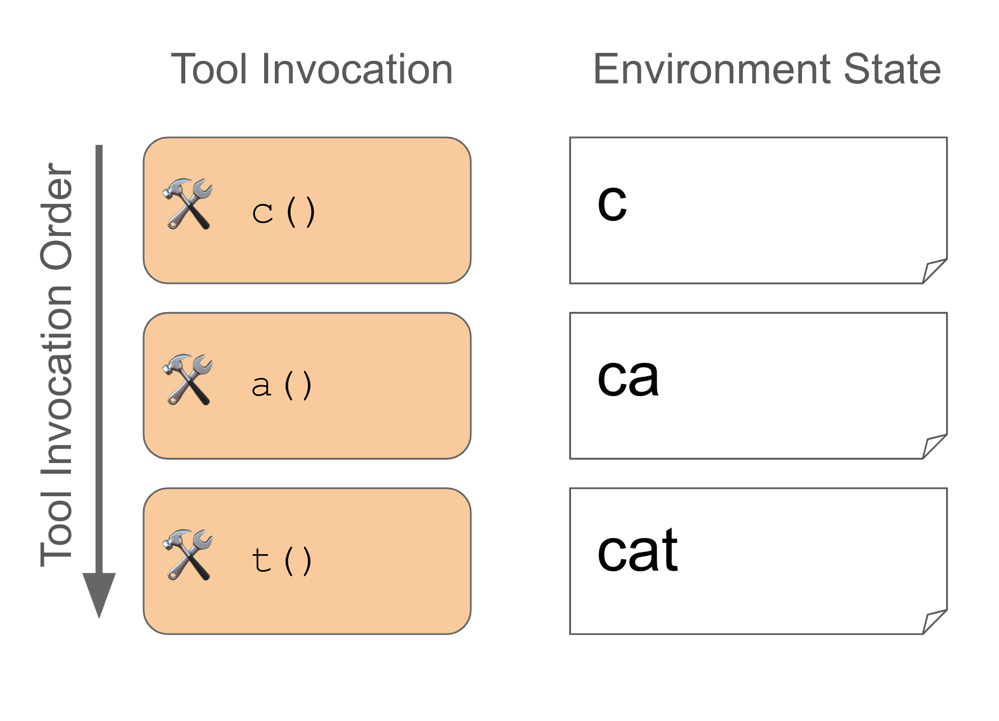Example successful tool use for the 26-tool typewriter task

The dataset for this task uses the same test input words as the dataset for the single-tool typewriter. You can check out the dataset [at this link](https://smith.langchain.com/o/30239cd8-922f-4722-808d-897e1e722845/datasets/0c8a0acd-0308-4298-82bb-e28cec0ca5e1?tab=1&ref=blog.langchain.com) and review the [task documentation](https://langchain-ai.github.io/langchain-benchmarks/notebooks/tool_usage/typewriter_26.html?ref=blog.langchain.com) for more details, including how to run your own agent on this benchmark.

Once again, you'd assume this task to be trivial for a powerful model like `gpt-4`, but you'd once again be proven incorrect. Take [this run](https://smith.langchain.com/public/04e87ccf-50e3-487d-b3d8-24b85fad728c/d/fc001162-6568-48dd-be78-e67aba550cb3/p/r/ad2e21d6-16ec-4fca-9747-af4df92cff7c?ref=blog.langchain.com) as an example. When asked to type "aaaa", it types the four a's out at first but then fails to halt, typing "a" 4 more times before deciding it is done.

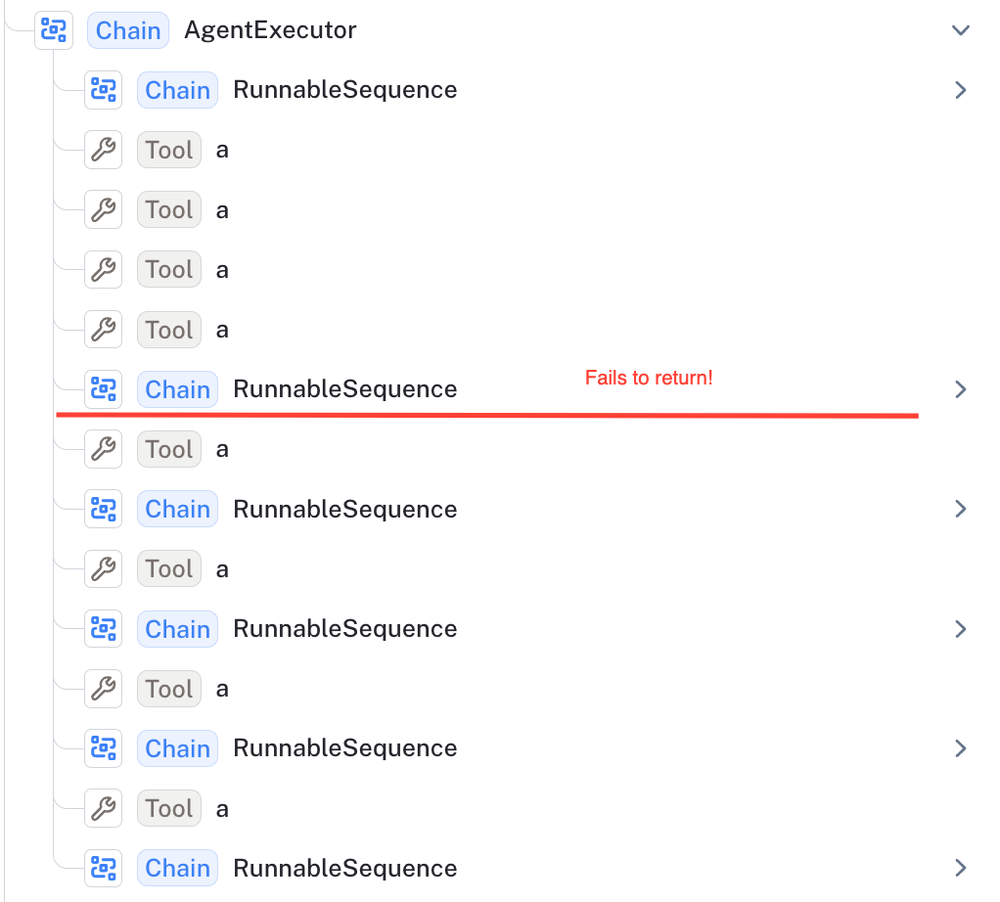GPT-4 fails to return and continues calling extra functions.

Below are the results for this task across the tested agents:

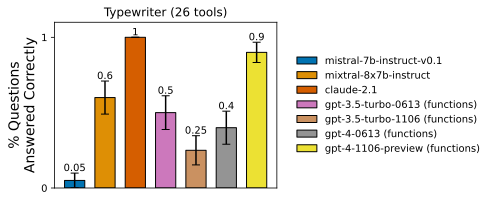This task was particularly difficult to benchmark due to frequent internal errors as it seems to trigger pathological behavior across many models, resulting in a large drop in performance for agents based on OpenAI models.

## 🕸️ Relational Data

A helpful AI assistant should be able to reason about objects and their relationships. Answering a real-world question usually requires synthesizing responses from disparate sources, but how reliable are LLMs at "thinking" in this way?

[In the relational data task](https://langchain-ai.github.io/langchain-benchmarks/notebooks/tool_usage/relational_data.html?ref=blog.langchain.com), the agent must answer questions based on data contained across 3 relational tables. To use the tools, it is given the following instructions:

_Please answer the user's question by using the tools provided. Do not guess the answer. Keep in mind that entities like users, foods and locations have both a name and an ID, which are not the same._

The agent can query these tables for the correct answer using a set of 17 tools at its disposal. The three tables contain information about users, locations and foods, respectively. Of all the synthetic datasets released today, this dataset most closely resembles tool usage in real-life web applications.

Using the data in the tables, it’s possible to answer questions like: “ [what can you tell me about Alice](https://smith.langchain.com/public/76d4cadd-9d65-41b9-a934-e3b96c98d270/r/e729c5a0-5d0d-4bc8-9fab-89bc86d934ff?ref=blog.langchain.com)?” or “ [is it likely that Alice needs an umbrella now?](https://smith.langchain.com/public/945226fb-2b96-41fb-b07d-59b78b73337e/r/f21b0d61-b096-4d5a-b252-e754a316439b?ref=blog.langchain.com)” (sample data shown below).

Below is an illustration of the latter question:

Example successful tool use for the Relational Data task

For this example, the agent selects the following 3 tools from the 17 at its disposal:

- `find_users_by_name(name)`→ search for users by name.
- `get_user_location(user_id)` → look up the given user’s favorite color.
- `get_weather_at_location(location_id)` → get the weather at the given location.

By looking at the first 2 records of each table, we can see the results that these function calls will return:

**Users**

| id | name | email | location | favorite\_color | favorite\_foods |
| --- | --- | --- | --- | --- | --- |
| 1 | Alice | alice@gmail.com | 1 | red | \[1, 2, 3\] |
| 21 | Bob | bob@hotmail.com | 2 | orange | \[4, 5, 6\] |

**Locations**

| id | city | current\_time | current\_weather |
| --- | --- | --- | --- |
| 1 | New York | 2023-11-14 10:30 AM | Partly Cloudy, Temperature: 68°F |
| 2 | Los Angeles | 2023-11-14 7:45 AM | Sunny, Temperature: 75°F |

**Foods**

| id | name | calories | allergic\_ingredients |
| --- | --- | --- | --- |
| 1 | Pizza | 285 | \["Gluten", "Dairy"\] |
| 2 | Chocolate | 50 | \["Milk", "Soy"\] |

The agent first retrieves Alice's user ID, then uses that user ID to fetch the current location, and finally it uses the location ID to fetch the current weather. Since the current weather in Alice's location is partly cloudy, it is unlikely that she will need an umbrella. If the agent skips any of these steps, it will lack the required information to accurately provide the final answer.

The evaluation dataset consists of 20 questions of varying difficulty, letting us test how well the agent can reason about how each function depends on the others. You can explore the dataset at [this link](https://smith.langchain.com/public/c0ed663a-bd4b-41e6-9ddc-0f8043e576ce/d?tab=1&ref=blog.langchain.com). The chart below shares the results for this task across the tested agents:

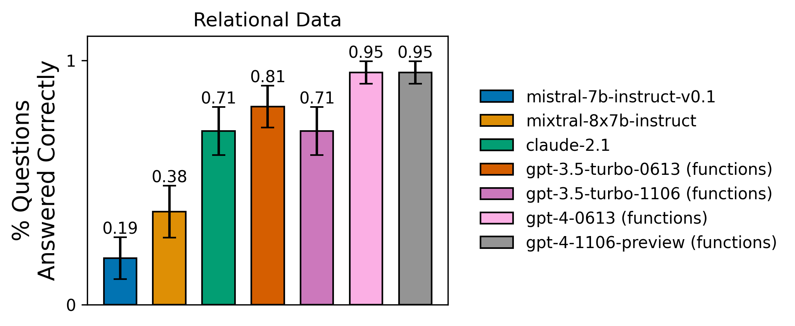The Relational Data task results are ranked closer to what you would expect, given these models' performances on other benchmarks. This task is most similar to common application requirements. The OSS models we tested still have room for improvement.

Despite being somewhat more difficult than the first two tasks in terms of reasoning ability required, GPT-4 does quite well on this task, answering all but [1 question correctly](https://smith.langchain.com/public/c0ed663a-bd4b-41e6-9ddc-0f8043e576ce/d/d69bf909-b92d-47ab-907e-639eda223368/p/r/1b3dad9f-54b3-4b1a-bdee-b125a7eaf490?ref=blog.langchain.com). Let's walk through this failure. For this data point, the agent is prompted with "Frank who is Even's friend is allergic to dairy. Can he eat the salad?"

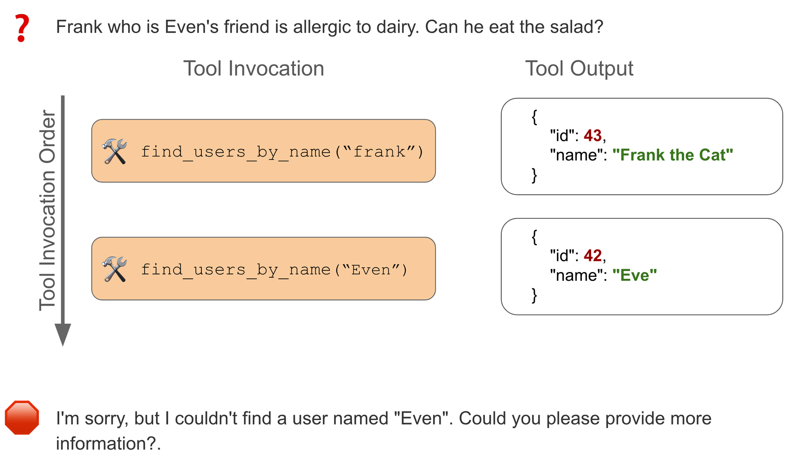Agent ignores the tool response, deciding it doesn't match the provided user.

In this case, `GPT-4` makes the correct first call to `get_users_by_name("Frank")`. The tool returns with information about "Frank the Cat." The model then decides this doesn't match the requested "frank", so it queries again for "Even". There is no direct match, so the agent gives up, responding that it cannot find a user named "Even". While it may be understandable that it would be less confident about "Frank the cat", the agent neither considers it as a possible match nor does the agent mention it in its ultimate response to the user, meaning the user wouldn't be able to effectively provide feedback to help the agent self-correct.

## 🌌 Multiverse Math

LLMs are marketed as “reasoning machines,” but how well can they “reason” in practice?

In the [multiverse math task](https://langchain-ai.github.io/langchain-benchmarks/notebooks/tool_usage/multiverse_math.html?ref=blog.langchain.com), agents must answer simple math questions, such as [add 2 and 3](https://smith.langchain.com/public/594f9f60-30a0-49bf-b075-f44beabf546a/d/20ea2f0e-b306-474a-8daa-f4386cc16599/e?ref=blog.langchain.com). The twist is that that in _this_ “mathematical universe”, math operations are not the same as what you’d expect. Want to do `2 + 2`? The answer is `5.2` . Subtract `5.2` and `2` ? The answer is `0.2`.

The full task instructions provided to the LLM (provided in the system prompt where available) are provided below:

_You are requested to solve math questions in an alternate mathematical universe. The operations have been altered to yield different results than expected. Do not guess the answer or rely on your innate knowledge of math. Use the provided tools to answer the question. While associativity and commutativity apply, distributivity does not. Answer the question using the fewest possible tools. Only include the numeric response without any clarifications._

Importantly, while these common operations (add, subtract, multiply, divide, cos, etc.) are all slightly altered, most mathematical properties still hold. Operations are still commutative and associative, though they are not distributive.

Let’s walk through [an example](https://smith.langchain.com/public/224dc6f5-fce6-4fa6-b8f2-b050a431e581/d/11cca141-212f-4d65-a2cd-ebbe497aa894/e?ref=blog.langchain.com) to illustrate what we mean: "ecoli divides every 20 minutes. How many cells will be there after 2 hours (120 minutes) if we start with 5 cells?"

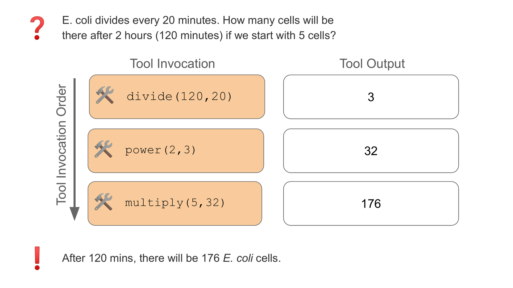Example successful tool use for the Multiverse Math task

To solve this using the provided tools, the agent needs to identify:

- How many divisions `d` will occur in the allotted time? (`d = 120/20`)
- Then, for each cell `c` , how many cells will be produced? (`c = 2**d`)
- Then how many cells will result `f` at the end (`f = 5*c`)

`GPT-4` may have seen each of these steps during training, but since it knows that these operations have been modified, it must refrain from skipping steps and instead focus on composing the tools. Below are the results for this task across the tested agents:

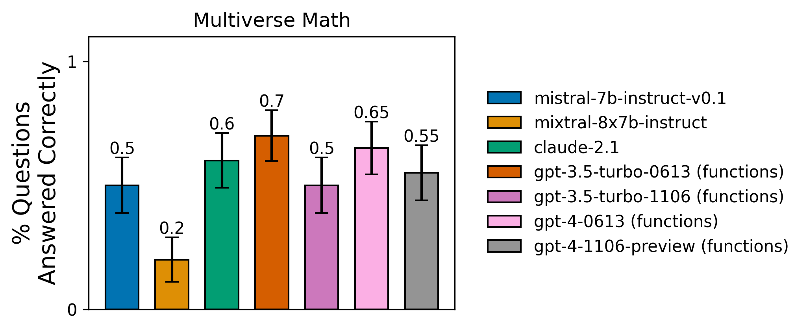GPT-4 does not reliably out-perform gpt-3.5 or claude-2.1 (or even the open-source `mistral-7b` model) on this task. Scale does not always translate to quality improvements if the task is out of distribution.

The multiverse math dataset tests two important characteristics of an LLM in isolation, without letting its factual knowledge interfere:

- How well can it “reason” compositionally?
- How well does it following instructions that may contradict the pre-trained knowledge?

It’s easy to [ace a test when you’ve memorized the answers](https://arxiv.org/abs/2309.08632?ref=blog.langchain.com). It’s harder when the answers contradict patterns you’re used to. Let's seen one of the many examples `GPT-4` fails: " [how much is 131,778 divided by 2?](https://smith.langchain.com/public/c92080f3-abae-440e-b528-ea901f614fa9/r/d3752681-4dcb-424f-801e-39cd587b1281?ref=blog.langchain.com)"

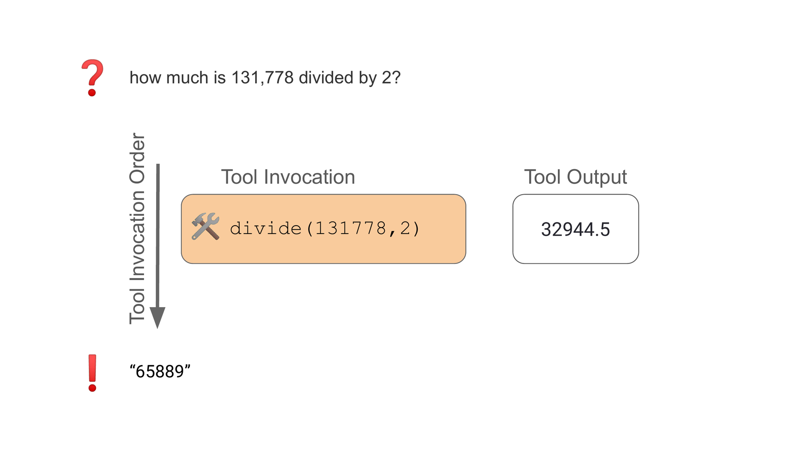GPT-4 using memorized answer (65,589) instead of the tool output (32,944.5)

While the `GPT-4` agent correctly calls the `divide()` tool, it ignores the output from the tool and instead uses what it thinks the answer should be. This happens despite the instructions to the agent stating that it should only rely on tool outputs for its answers.

`mistral-7b-instruct-v0.1` , the OSS model fine-tuned by Anyscale for function calling, performs surprisingly well on this task. This dataset on average has _fewer_ questions requiring multiple tool invocations (compared to our other tasks). That the model fails on the simple typewriter tasks but performs reasonably well here highlights how fine-tuning only on 1-hop function calling can lead to unintended performance degradations.

## Additional Observations:

For these results, we communicated model _quality,_ but building an AI app also requires service reliability and stability. Despite the relatively small dataset size for these experiments and despite adding client-side rate limiting to our evaluation suite, we still ran into random-yet-frequent 5xx internal server errors from the popular model providers.

We originally planned to benchmark Google's `gemini-pro` model, but because of the rate of internal server errors it rose during evaluations, we decided to leave it out of our results. The API also rejected multiple data points for the Typewriter and Multiverse Math datasets as being "unsafe" (for instance ["what is the result of 2 to the power of 3"](https://smith.langchain.com/public/da25fb81-44eb-4c64-a8c9-455bfca04ad9/r/7a7e40ef-6b29-4541-ae50-a69392ed7e25?ref=blog.langchain.com))

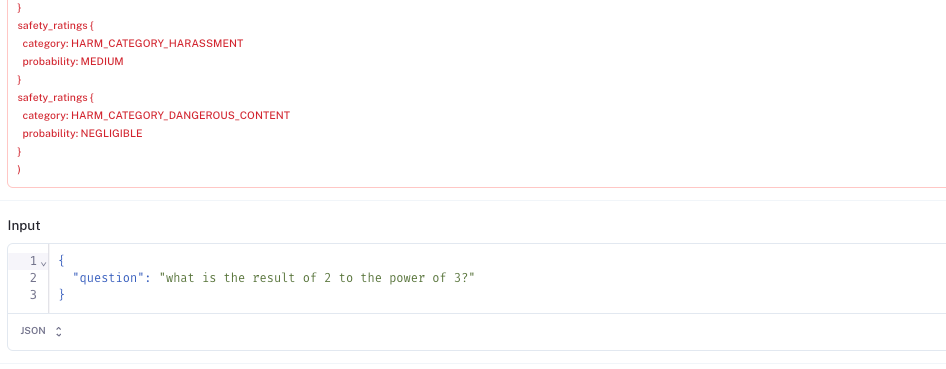

Safety filters can be helpful, but if the false positive rate is too high, it can impact your service quality.

Finally, we have shown a clear need for better open-source alternatives for tool use. The open-source community is rapidly developing better function calling models, and we expect more competitive options to be broadly available soon. To test your function calling model on these benchmarks, follow the instructions [here](https://langchain-ai.github.io/langchain-benchmarks/notebooks/tool_usage/intro.html?ref=blog.langchain.com), or if you'd like us to run a specific model, [open an issue in the GitHub repo.](https://github.com/langchain-ai/langchain-benchmarks/issues?ref=blog.langchain.com) We'd love for these results to change!

## Conclusion

Thanks for reading! We’d love to hear your feedback on what other models and architectures you’d like to see tested on these environments, and what other tests would help make _your_ life easier when trying to use agents in your app. You can check out our previous findings on [document Q&A](https://blog.langchain.com/public-langsmith-benchmarks/), [extraction](https://blog.langchain.com/extraction-benchmarking/), [Q&A over semi-structured tables](https://blog.langchain.com/benchmarking-rag-on-tables/), and [multimodal reasoning abilities](https://blog.langchain.com/multi-modal-rag-template/) in the linked posts. You can also see how to reproduce these results yourself by running the notebooks in the [`langchain-benchmarks`](https://github.com/langchain-ai/langchain-benchmarks?ref=blog.langchain.dev)) package. Thanks again!

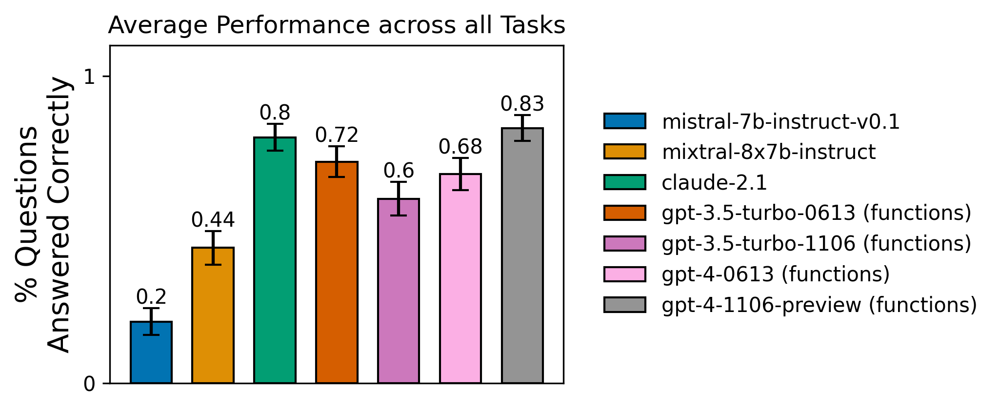