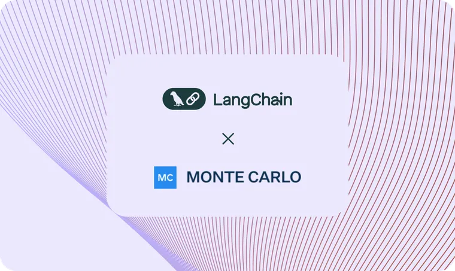

Ally Financial, the largest digital-only bank in the US and a leading auto lender, has recently collaborated with LangChain to release the first initial coding module that addresses a significant challenge for AI developers working with personal identifiable information (PII) in highly regulated, consumer-focused industries. The PII Masking module - available [here](https://js.langchain.com/docs/modules/experimental/mask/?ref=blog.langchain.com) \- provides a starting point for organizations that frequently handle customer PII during the normal course of business – including those in financial services, healthcare and retail - to build generative AI applications that also protect customer data.

### Releasing Ally.ai Built with LangChain

The PII Masking module, built with support from LangChain, was created for Ally.ai, the company’s proprietary, cloud-based AI platform that would serve as a secure bridge between Ally data and commercially available LLMs. Ally was an early adopter of generative AI in the financial services industry, launching the platform in September 2023. The company’s first use case with Ally.ai harnessed the power of the platform to assist the Customer Care & Experience team as they interacted with thousands of customers per day.

Ally.ai assists more than 700 customer care associates in summarizing the conversations between them and Ally customers. The platform, which is connected to commercial grade LLMs, assists them by sharing a full transcript of each customer call, which is then summarized by the LLM. In the highly-regulated banking sector, PII should be stripped out before summarization by the LLM occurs.

With the help of LangChain software, Ally’s developers created a module for Ally.ai that would mask various forms of PII, including names, email addresses, account numbers and much more. Because LangChain gave the Ally team the building blocks and framework to ship and iterate quickly, they could solve a critical challenge while moving the project along. Ally.ai was built by a team of five engineers in just two months. The platform has already made an impact on the business, specifically the Customer Care associates receiving the call summaries:

- Ally.ai has saved between 30 seconds and two minutes per customer call, allowing associates to quickly finalize their customer call summaries
- Upwards of 85% of call summaries require no additional edits from associates, a testament to the strength of the platform
- Associates also said that Ally.ai summarizations have helped them focus their energy on meaningful customer interactions and have reduced the amount of time needed to document the conversation and toggle between screens.

“As a digital bank that serves more than 11 million customers, we want to put the right technology into the hands of our teammates so they can be more productive and provide excellent service. We see so much opportunity in the power of generative AI for our business, and we use LangChain to get to production quickly. The Ally.ai platform allows our team to spend more time with customers while also being more efficient than ever before.” – Sathish Muthukrishnan, Chief Information, Data and Digital Officer at Ally

### Enhancing Security and Compliance + Contributing PII Filtering to LangChain

While Ally moves quickly, they do so with great care and consideration because they operate in a regulated industry. Security and customer data privacy are front and center of all their initiatives, and with Ally.ai, the Ally team had to be confident that no PII data was sent to LLMs. PII filtering was a requirement of the product in order to ensure security best practices. Achieving this, however, took considerable work because PII data can come in many forms, and during any real-time conversation with a user, there’s risk that the user might share sensitive information unprompted.

In order to release the Ally.ai platform in a manner that adhered to the bank’s governance and compliance needs, the Ally team added their own PII filtering to the LangChain code, which masked all sensitive data _before_ it was sent to the LLM. The result was a new PII Masking module that could first identify potential PII, mask it before it goes to an LLM, and then rehydrate the PII once a summary or other output comes back from the LLM. Essentially, the PII Masking module has two-way communication with the LLM – both before and after data is shared.

Ally’s approach to PII filtering was so successful that the Ally team wanted to give back to the LangChain community by contributing their code so that others could benefit.

Muthurkrishnan continued: “The LangChain ecosystem evolves rapidly, and we’ve benefited from the typescript package while developing the Ally.ai platform. We wanted to give back to the community, so we’ve open sourced our code in the langchain-community package. We’re thrilled that other financial institutions, or other companies operating in regulated industries, could benefit from what we’ve created.”

### The Road Ahead

The initial results of Ally.ai has encouraged the Ally team to forge ahead with pursuing almost 200 AI use cases throughout the enterprise. While not all of them will make it to production – Ally has begun final evaluations on two additional use cases – one with the marketing content and SEO team, and a second one with Ally’s investor relations group. Both of these use cases lean into optimizing employee productivity and improving business processes. For example, the marketing content team has seen the time needed to launch campaigns reduced by up to 2-3 weeks. As more use cases are tested and evaluated through Ally’s extensive governance process, what will be a constant is the use of Ally.ai – with the necessary privacy and security features in place – as the company expands its AI capabilities.

“We’re not standing still, and neither is the developer community,” Muthukrishnan said. “We hope that by making this contribution and collaborating with LangChain, our actions will serve as a model to other organizations who want to harness the power of AI in a responsible way that positively serves consumers and our community.”

For more insights from the technology team at Ally, including how the team is doing it right with AI and exploring new innovation, visit [https://ally.tech](https://ally.tech/?ref=blog.langchain.com). You can read more about their announcement too – [here](https://ally.tech/ally-gives-back-to-langchain-ai-community-with-pii-masking-module-137a8701cdaa?ref=blog.langchain.com).

“Our goal is for LangChain to be ubiquitous. We designed the framework to be useful no matter the size of the company or the industry it operates in. Ally pushed the boundaries and solved a real problem that we see many companies run up against. We’re grateful that Ally decided to support our mission and contribute back so that others could benefit, and we’re excited to continue to partner with Ally to evolve LangChain to serve financial institutions even better.” – Harrison Chase, CEO of LangChain

**_About Ally Financial_**

_Ally Financial Inc. (NYSE: ALLY) is a financial services company with the nation's largest all-digital bank and an industry-leading auto financing business, driven by a mission to "Do It Right" and be a relentless ally for customers and communities. The company serves more than 11 million customers through a full range of online banking services (including deposits, mortgage, point-of-sale personal lending, and credit card products) and securities brokerage and investment advisory services. The company also includes a robust corporate finance business that offers capital for equity sponsors and middle-market companies, as well as auto financing and insurance offerings. For more information, please visit www.ally.com and follow @allyfinancial._

**_About LangChain_**

_LangChain, Inc. was founded in early 2023 to help developers build context-aware reasoning applications. The company’s popular open source framework gives developers the building blocks to create production-ready applications with LLMs. LangChain’s open standard benefits from the force of the community; it keeps pace with the cutting edge, so companies can too. With 600+ tool integrations, 60+ models supported, and easy adoption of the latest cognitive architectures, LangChain gives companies choice, flexibility, and a build-kit to move fast. LangSmith complements as an all-in-one SaaS platform that enables a full, end-to-end, development workflow for building and monitoring LangChain and LLM-powered apps._

### Tags

[Case Studies](https://blog.langchain.com/tag/case-studies/)

[**monday Service + LangSmith: Building a Code-First Evaluation Strategy from Day 1**](https://blog.langchain.com/customers-monday/)

[Case Studies](https://blog.langchain.com/tag/case-studies/) 8 min read

[**How Remote uses LangChain and LangGraph to onboard thousands of customers with AI**](https://blog.langchain.com/customers-remote/)

[Case Studies](https://blog.langchain.com/tag/case-studies/) 5 min read

[**Fastweb + Vodafone: Transforming Customer Experience with AI Agents using LangGraph and LangSmith**](https://blog.langchain.com/customers-vodafone-italy/)

[Case Studies](https://blog.langchain.com/tag/case-studies/) 7 min read

[**How Jimdo empower solopreneurs with AI-powered business assistance**](https://blog.langchain.com/customers-jimdo/)

[Case Studies](https://blog.langchain.com/tag/case-studies/) 4 min read

[**How ServiceNow uses LangSmith to get visibility into its customer success agents**](https://blog.langchain.com/customers-servicenow/)

[Case Studies](https://blog.langchain.com/tag/case-studies/) 4 min read

[**Monte Carlo: Building Data + AI Observability Agents with LangGraph and LangSmith**](https://blog.langchain.com/customers-monte-carlo/)

[Case Studies](https://blog.langchain.com/tag/case-studies/) 4 min read