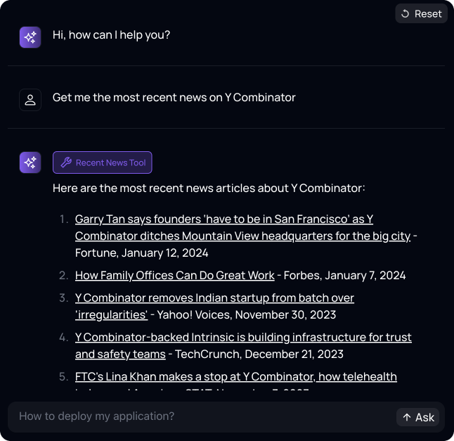
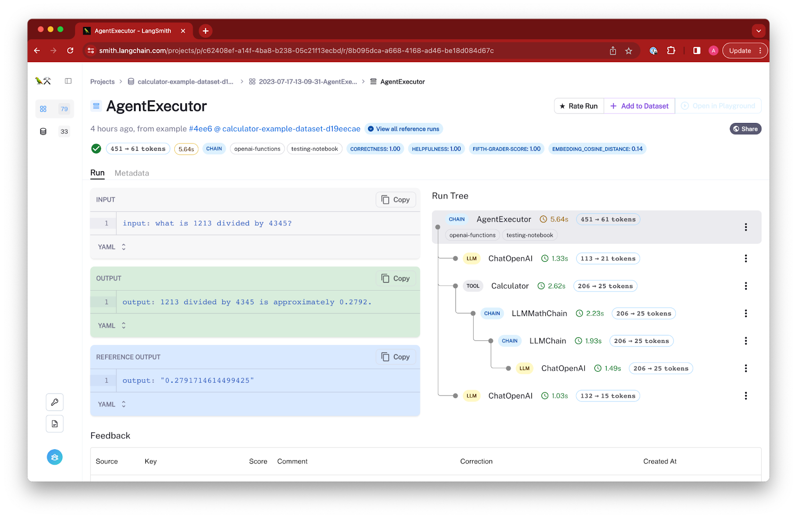
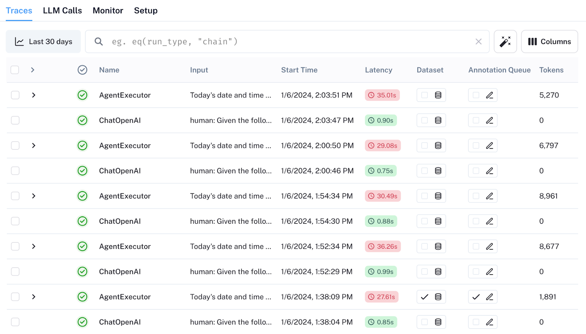
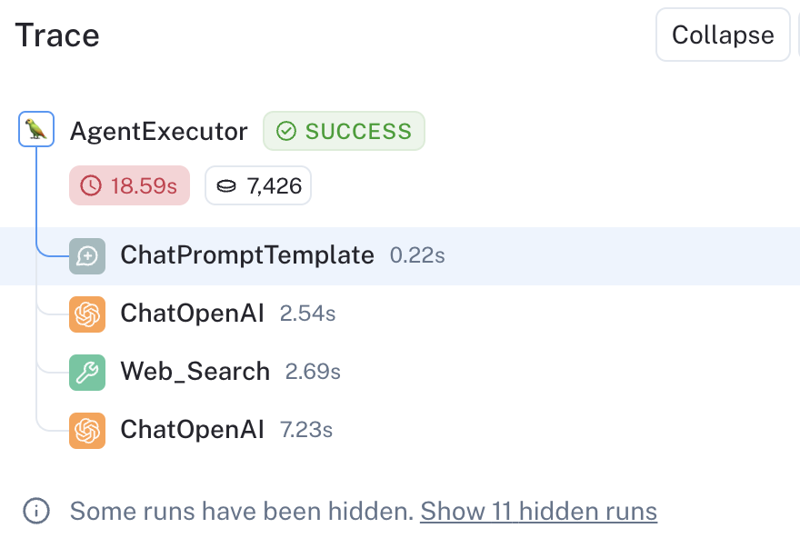
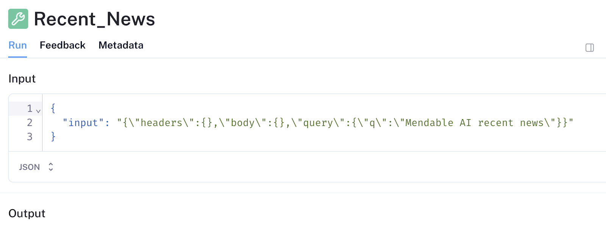
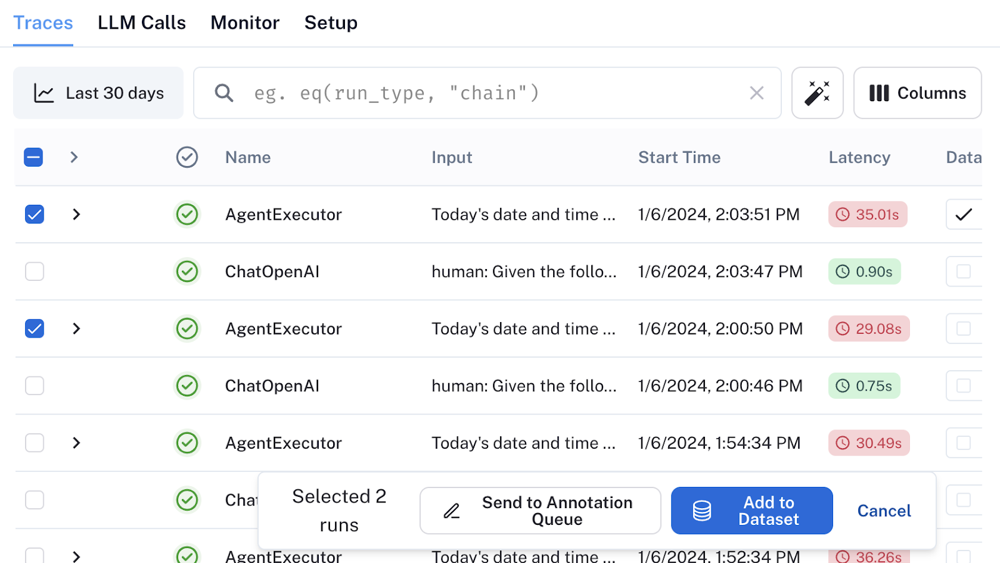
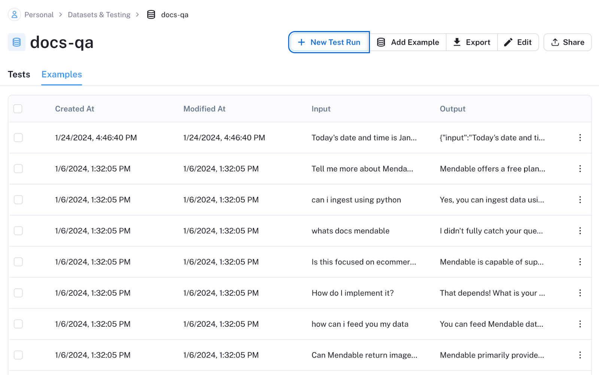

**_Editor's Note: this blog is from Nicolas Camara, CTO @ Mendable. Mendable.ai is a platform helping enterprise teams answer technical questions with AI. We're incredibly excited to highlight how they are using LangChain Agents and LangSmith on their newest feature:_** [**_Tools & Actions_**](https://www.mendable.ai/blog/tools?ref=blog.langchain.com) **_._**

It is no secret that 2024 will be the year we start seeing more LLMs baked into our workflows. This means that the way we interact with LLM models will be less just Question and Answer and more action-based.

At [Mendable.ai](https://www.mendable.ai/?ref=blog.langchain.com), we are seeing this transformation first hand. Late last year, we equipped ~1000 customer success + sales people at a $20+ billion tech company with GTM assistants that help with tech guidance, process help, and industry expertise. In five months, the platform achieved $1.3 million in savings, and it's projected to save $3 million this year due to decreased research time and dependency on technical resources. Now we are working with that same company to enable these assistants to take action, enabling even more efficiency improvements.

An example use case would be a salesperson who wants to get the latest focus areas for a prospect and their company. When asking an assistant enabled with our Tools & Actions “what are the latest key initiatives for X”,  the assistant could:

1. Call the CRM API and get the exact team the salesperson is trying to sell to
2. Use the Google News or DUNS API to get the latest news on the specific team and related initiatives
3. Call the CoreSignal API to get the latest hiring trends for the company based on job postings and more
4. Interpret the news and hiring trends, highlighting ways the salesperson can use these new found initiatives to sell in meeting

As you can see the introduction of Tools & Actions in Mendable expands capabilities quite a bit, enabling chatbots to access and utilize a wider range of data sources and perform various automated tasks. On the backend, to ensure the precision and efficiency of these features, Mendable leverages LangSmith's debugging tools, a critical component in the development and optimization of our AI-driven functionalities.

**Opening the ‘black box’ of agent execution**

One of the biggest problems when building applications that depend on agentic behavior is reliability and lack of observability. Understanding the key interactions, decisions of an Agent loop can be quite tricky. Especially when it has been giving access to multiple resources and is embedded in a production pipeline.

While building Tools & Actions, the core aspect we had in mind was giving the ability for the user to create their own Tool via an API call. We designed this so the user could input a tag such as <ai-generated-value> when creating the API request and the AI can fill that value at request time with an ‘AI generated’ value based on the user's question and schema. This is one example, but there were a lot more just in time AI inputs/outputs that went into it. This posed some challenges in the building process that we weren’t expecting. Soon our development process was full of “console.logs” everywhere and high latency runs. Trying to debug why a tool wasn’t being called or why the API request had failed became a nightmare. It quickly started to get messy and we had no proper visibility on what the agentic behavior looked like nor if custom tools were working as expected.

Here is where LangSmith from LangChain came to help. If you are not familiar, LangSmith allows you to easily debug, evaluate and manage LLM apps. It, of course, integrates swiftly with LangChain. As we were already using parts of the [OpenAI tool agents](https://js.langchain.com/docs/modules/agents/quick_start?ref=blog.langchain.com) that LangChain provides, the integration was smooth.

**The Debugging Process**

LangSmith allows us to have a peek inside of the agents’ brain. This is very useful for debugging how an agent's thinking and decision process can impact the output.

When you enable tracing in a LangChain, the app captures and displays a detailed visualization of the runs’ call hierarchy. This feature allows you to explore the inputs, outputs, parameters, response times, feedback, token consumption, and other critical metrics of your run.

When we connected LangSmith to our tools & action module, we quickly spotted problems that we didn’t have the visibility for.

Take a look for instance on one of our first traces using Tools. As you can see here, the last call to \`ChatOpenAI\` took a long time: 7.23 seconds.

When you click on the 7.23s Run we saw that the prompt was massive, it had concatenated all of our RAG pipeline prompts/sources with our Tools & Actions, leading to delay in the streaming process. This allowed to further optimize what chunks of the prompt need to be used by the Tools & Action module, reducing total latency overall.

**Inspecting Tools**

Another valuable aspect of having ease access to traces is the ability to inspect a tool input. As I mentioned in the beginning, we allow users to create custom tools in Mendable. With that we need to make sure that the building process of a tool in the UI is easy and quick but also performs well. This means that when we create a tool in the backend, it needs to have the correct schema defined partially by what the user inputted in our UI (API request details) but also by what the AI will automatically feed in at request time.

In the example below, it shows a Recent News Tool that was run. The question inside the {query : { q } } parameter was generated by the AI.

Making sure that query was accurate with what the user inputted but also optimized for the tool being used was very challenging. Thankfully it was very easy to double check that with LangSmith. What we did is we ran the same tool with different queries ~20 times and quickly scrolled through LangSmith making sure the output and schema were accurate. The times that weren’t accurate, we could easily understand why by opening the trace further or by annotating in LangSmith so we could review it later.

What we realized is that the Tools description was critical for the correct schema and input to be generated. With this new insight we obtained from running tons of experiments, we went ahead and improved the AI generated part of that in our product and also made users aware that they need to provide good detailed descriptions when creating a Tool.

**Building our Dataset**

With all the optimization experiments taking over, the need to quickly save inputs/outputs for further evaluation became evident. With LangSmith we selected the runs that we wanted to add to our dataset and clicked the “Add to Dataset” button.

This was a very quick and easy win for us as we now had all the data in one place from our runs and we could even evaluate that using LangSmith itself.

**Conclusion**

LangSmith's debugging tools have been a game-changer for us. They've given us a clear window into how our Tools and Action AI agent thinks and acts, which has been helpful for tackling tricky issues like slow response times and making our debugging process way smoother. [Mendable Tools & Actions](https://mendable.ai/blog/tools?ref=blog.langchain.com) has launched but we are still early in the process. We have been working with amazing enterprises to help improve it and tailor custom actions to them. If you are interested in testing Mendable, email us at [garrett@mendable.ai](mailto:garrett@mendable.ai) with your use case.

Also, if you are looking to speed up your LLM development process, I would definitely recommend trying [LangSmith](https://www.langchain.com/langsmith?ref=blog.langchain.com) out - especially if you already use LangChain in your pipeline.

I hope my insights were helpful and thanks to LangChain for being an awesome partner.