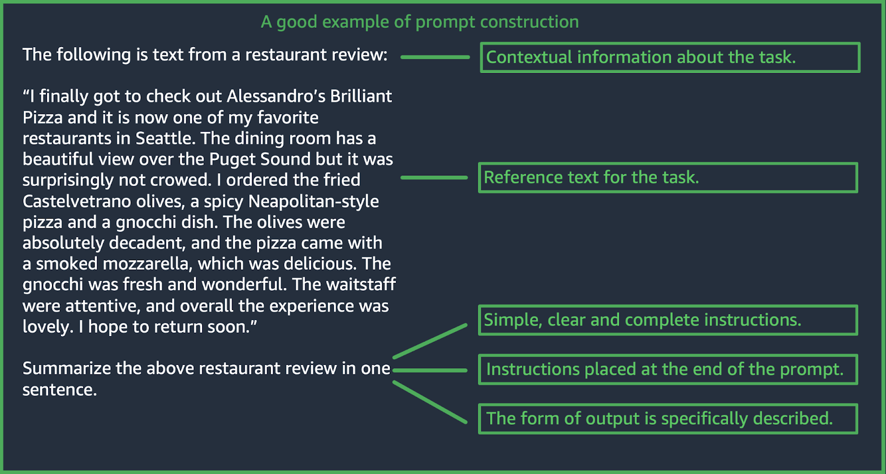
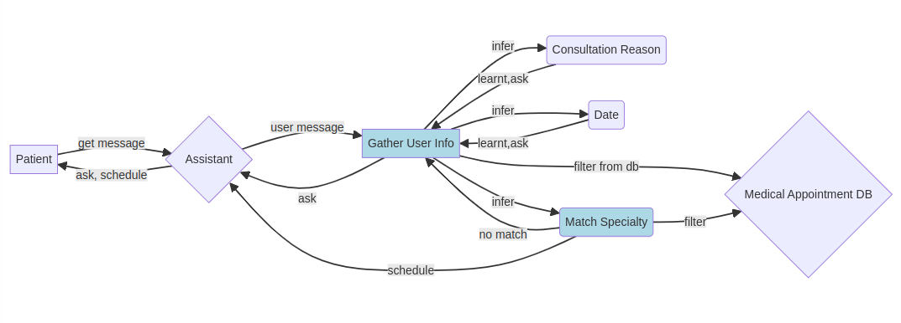
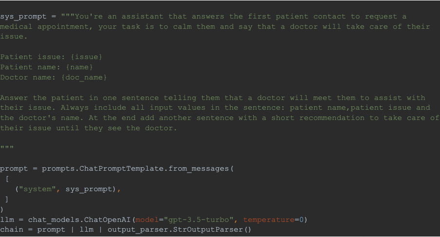
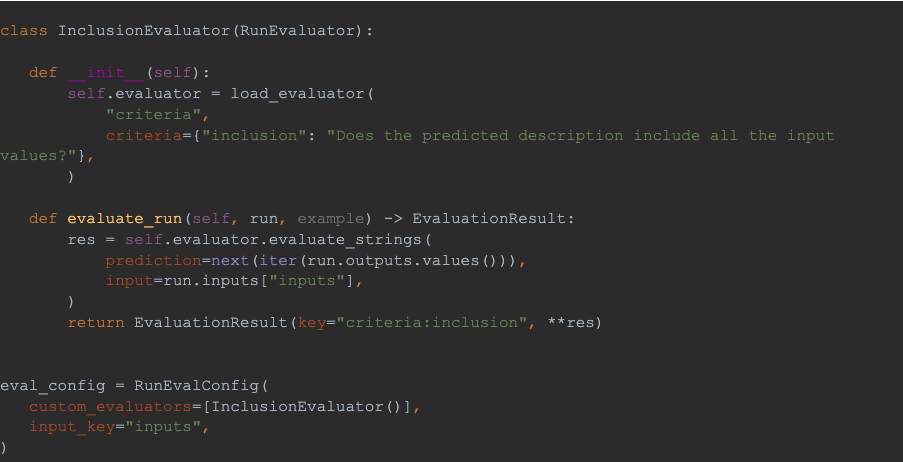
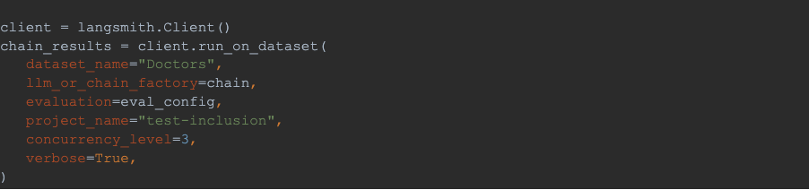
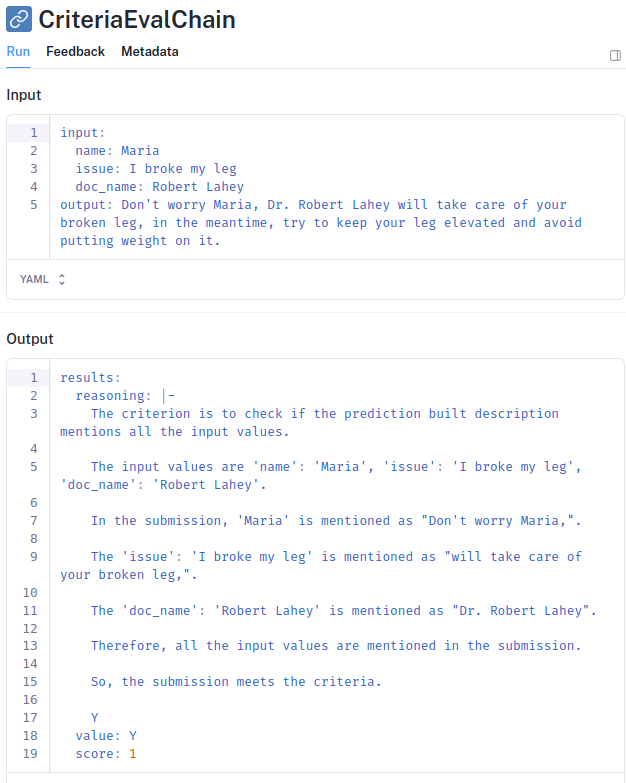
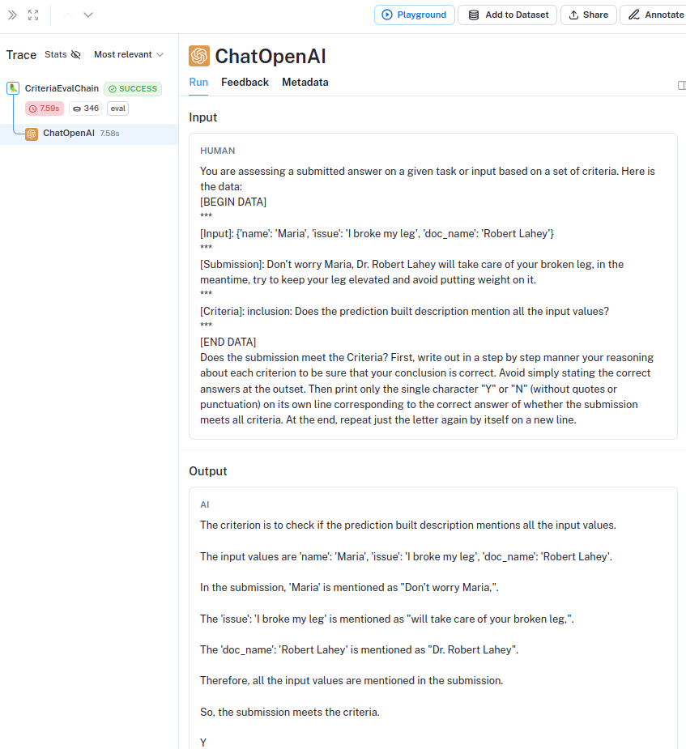

_Editor's Note: This post was written by_ [_Mutt Data_](https://muttdata.ai/?ref=blog.langchain.com) _through LangChain's Partner Program._

## Introduction

### Overview

In our previous discussions, we not only delved into the [challenges of implementing Generative AI applications](https://blog.muttdata.ai/post/2023-11-27-genAI-framework?ref=blog.langchain.com) in general but also explored effective [mitigation strategies for image generation](https://blog.muttdata.ai/post/2024-01-03-gen-ai-pictures?ref=blog.langchain.com) problems. Now, it's time to shift our focus to the unique set of challenges that arise when **generating text**.

In this blog post, we provide a concise overview of these **challenges while** sharing some **insights** from our experiences utilizing **Large Language Models**( **LLMs**). To lay the groundwork for our exploration, we will first introduce some fundamental concepts such as **prompts** and **prompt engineering**. Let’s go right to it!

### Prompts

If you have been involved in the Generative AI world in the last months, you have probably heard about **prompts**. Prompts are specific **user-provided inputs** that **guide** LLMs to generate an appropriate response tailored to a given **task**.

As well as we expect some kind of order in the sections of a presentation (introduction, discussion, solution, and conclusion), LLMs work much better if we follow some **structure** in our prompts. Moreover, this structure can greatly vary depending on the task we want to perform. To illustrate, some common tasks supported by LLMs include: classification, question-answer, summarization, code generation, and reasoning. It's essential to adapt the structure to the specific requirements and particularities of each type of task when **crafting** prompts for these diverse tasks.

### Prompt Engineering

The practice of optimizing input prompts by selecting appropriate words, phrases, sentences, punctuation, and separator characters to effectively use LLMs, is known as **prompt engineering**. In other words, prompt engineering is the art of communicating with an LLM in a manner that aligns with its expected understanding and enhances its performance.

An example of a well formed prompt in case of Summarization is attached below

Well formed prompt example. Extracted from [docs.aws.amazon.com](https://docs.aws.amazon.com/bedrock/latest/userguide/general-guidelines-for-bedrock-users.html?ref=blog.langchain.com)

On the other hand if your use case is Classification, including some **examples**(input-response pairs) for each category after the contextual information, could be really helpful. This is known as **few-shot prompting** and couldalso apply to more complex tasks such as Question-answer. However, the more complex the task, the more examples that will be needed to improve performance.

Another powerful technique is to ask the LLM to **reason** and **explain** prior to giving the final answer, also known as “ **step by step**” reasoning. The essential concept behind this relies on the autoregressive nature of these models, which means that each predicted word influences the generation of the next element in the sequence. Please find more details about this [here](https://github.com/openai/openai-cookbook/blob/main/articles/techniques_to_improve_reliability.md?ref=blog.langchain.com).

Last but not least we could consider refining our prompts with **modifiers**, such as including details about the input data, specifying output format or simply encouraging the LLM at the end of the prompt. Amazon Web Services provides further [details](https://docs.aws.amazon.com/bedrock/latest/userguide/general-guidelines-for-bedrock-users.html?ref=blog.langchain.com#:~:text=Consider%20refining%20the%20prompt%20with%20modifiers) about this.

## Navigating Challenges and Solutions

### 1) Less is More

**Challenge**: **When using LLMs we’re talking to a program, not a human.**

Unlike human conversations where we can be somewhat messy and correct ourselves, providing complex or controversial instructions to an LLM can lead to inconsistent and incorrect responses. Clear and straightforward instructions are crucial for helping the LLM focus on relevant information and produce accurate results.

**Solution**: **Clear, concise, and smart prompting.**

Be as clear as possible when crafting prompts. Also known as prompt engineering, selecting precise words and phrases for clear and concise instructions is key. You can also explore [prompt templates](https://ignacio-velasquez.notion.site/2-500-ChatGPT-Prompt-Templates-d9541e901b2b4e8f800e819bdc0256da?ref=blog.langchain.com) for similar use cases to discover effective structures for certain tasks.

**Example**: Let’s consider two prompts for summarizing a food product description from a lengthy description into a concise title and caption for packaging.

_Prompt 1: Please analyze the extensive details provided about this food product, including the ingredients, benefits, instructions, and customer reviews. Extract the most crucial information, taking into account various aspects such as nutritional value, taste, user experiences, and overall market trends. Create a concise summary suitable for product packaging, striking a balance between brevity and capturing the product's multifaceted qualities. Also, ensure that the summary caters to diverse consumer preferences and aligns with current industry standards. It should be versatile enough to meet the expectations of both seasoned food enthusiasts and those new to culinary experiences. Additionally, incorporate any notable advancements in food science and technology to highlight the product's innovative features._

_Prompt 2_: _Summarize essential details for a food product, emphasizing ingredients, benefits, and user experiences. Create a brief yet compelling title and caption suitable for product packaging, ensuring its appeal to a broad audience and highlighting any innovative features. Emphasize clarity and brevity in the summary, taking into consideration the varied preferences and experiences of food enthusiasts._

Which one describes the task in a clearer way?

### 2) Divide & Conquer

**Challenge**: LLMs excel at tackling some specific tasks, but we should not overwhelm them by asking to do a bunch of them at the same time!

**Solution**: Break down complex tasks into simpler ones by using straightforward prompts and then gather the results.

**Example**: When recommending movies from a long list of options to users, we found that the accuracy of correct recommendations improved significantly by asking if the movies were suitable one by one instead of providing long lists of movies altogether. Check the following two prompts:

> _Prompt 1_: You are a language model assisting a web platform in recommending movies to users based on their preferences. Your objective is to present the movies attractively and sorted by the level of relevance. Below is the complete list of available movies, along with their features. Describe these attributes in an appealing manner, commencing with the movie names. The total list of movies includes:
>
> \[ { "Movie Title": "Daring Odyssey",\
>\
>     "Category": "Adventure",\
>\
>    "Description": "Embark on an exciting journey filled with twists and turns. Join the protagonists as they navigate through breathtaking landscapes and face thrilling challenges. A cinematic adventure you won't want to miss!",\
>\
> },,  …(whole list)...\]

> _Prompt 2_: You are a language model that recommends movies. Your job is to determine if the movie category and description are the both suitable for the user's freely written description:
>
> \-\-\--
>
> User's description: {user\_description}.
>
> Movie category: {movie\_category}
>
> Movie description: {movie\_description}
>
> \-\-\--
>
> Reply with a JSON object in this format:
>
> "reasoning": Briefly explain your reasoning to the user.
>
> "match": "YES" \| "NO"

Which is a simpler task?

### 3) Power of an Elephant but Memory of a Bee

**Challenge**: While LLMs can handle a broad spectrum of problems, they often face difficulty consistently _recalling_ specific instructions. While their _context_ grows, their ability to retain such details decreases.

**Solution**: Reduce dependency on the LLM's memory by managing internal states within our applications. Generate controlled outputs, transitioning through intermediate steps to meet checkpoints and conditions.

**Example**: This insight came from our experience developing a medical appointment scheduling app. Our first approach involved allowing the model to verify all patient-specified conditions against a list of available specialties and time slots of each doctor, emphasizing the fact that adding non-listed specialties or time slots was prohibited. However, this strategy led to the LLM systematically generating custom specialties not present in the list and unavailable time slots, even after we had already pointed out the mistake in the same conversation.

As a solution, we refined our approach by orchestrating the process in validated steps (states): we first leveraged the LLM to collect patient information, such as the reason for consultation and available dates. Following validation, the LLM performed individual matches between the reason and each possible specialty. Subsequently, we employed a traditional database process to filter doctors based on the corresponding specialty and availability on the desired dates. This step ensured that we overcame the issue of inventing non-existing options. Finally, the LLM presented the patient with available appointments until one was confirmed.

Simplified diagram of states(light blue) for our medical appointment scheduling application. First managing the learning of user information and after it matching the right specialty and filtering possible doctors and time slots from a database

### 4) Evaluating performance

**Challenge**: Measuring performance and getting unbiased metrics on the quality of text generations.

**Solution**: Selecting a standarized tool for testing and evaluating LLMs

**Example**: This was a clear issue we faced when implementing our medical appointment scheduling application. As a first approach we did a test suite of possible prompts corresponding to a set of topics. Referring to consultations that should get an appointment, others that were not able to be fulfilled due to the lack of a doctor with that specialty, and lastly incorporating messages that should be ignored or moderated because of being malicious. The way to evaluate the test suite was to manually perform the tests by a group of testers and make them provide a satisfaction score from 1 to 5. This was time consuming and tied to the bias of the annotators.

We understood that this was not the correct approach for a production environment and did some extra research until we discovered a useful tool: [LangSmith](https://www.langchain.com/langsmith?ref=blog.langchain.com). This is a platform that provides support for developing LLM applications oriented to the production environment. It facilitates the test and evaluation process and provides a standard for certain metrics. Moreover, it covers the monitoring and debugging of your application, which makes the whole app lifecycle much more efficient.

As an example of our use case, we discovered it valuable to confirm that the successful messages, which offer assistance to the user, included specific information like the patient's name, the described issue, and the doctor's name.

LangSmith offers a user-friendly and straightforward approach to implement this functionality, along with comprehensive metrics for the dataset run, including mean, standard deviation, and percentiles of scores and execution time. In this instance, drawing inspiration from the examples outlined in the LangChain [Custom Evaluator](https://docs.smith.langchain.com/evaluation/custom-evaluators?ref=blog.langchain.com) section, we developed a "Criteria" evaluator utilizing an LLM to verify the presence of the specified input values in the response. With just 50 lines of Python code, we were all set to proceed!

To illustrate the example, consider the following LLM task…

Langchain code running a simple response task for a patient, including some input fields

Now let’s implement a criteria evaluator for our test:

Evaluator to perform the test for each sample in our dataset

Finally let’s use the LangSmith client to run the test for each sample in a dataset:

LangSmith client code to run the test on a previously created key-value dataset

Let’s check how LangSmith’s Web UI registers the trace of the run for one specific sample:

The out-of-the-box CriteriaEvalChain returns a score of 1 if the criteria was met, 0 otherwiseCriteriaEvalChain [prompt](https://github.com/langchain-ai/langchain/blob/master/libs/langchain/langchain/evaluation/criteria/prompt.py?ref=blog.langchain.com) to evaluate the criteria

Amazing! In this way we can run independent tests for specific datasets with custom criteria and have real metrics about the performance of our features with just some lines of code.

### 5) Security Risks

**Challenge**: Ensuring the reliability of your application to mitigate potential legal issues.

**Solution**: Maintain strict control over both input and output within your application. Avoid direct utilization of the LLM to respond to user input. Instead, break down your processes into independent tasks or states and employ controlled prompts to leverage only the specific capabilities required from the LLM.

**Example**: We consistently integrate an input filter to validate and categorize user input. If a user's intention diverges from the intended purpose of the application, we gently remind them of the app's designated usage. This approach helps us circumvent potential pitfalls, as illustrated by the famous example attached below.

Famous pitfall of a company chatbot giving too much freedom to an LLM

## Conclusion

To wrap things up, our exploration into challenges and solutions surrounding the application of Large Language Models (LLMs) for text generation underscores the importance of strategic considerations. By emphasizing the clarity of prompts, task segmentation, and robust evaluation practices, we pave the way for effective LLM applications.

The practical solutions presented, including the breakdown of complex tasks, management of internal states to reduce reliance on the LLM's memory, and stringent control over inputs and outputs, provide actionable insights for building reliable and efficient AI text applications.

It is evident that a thoughtful approach to LLM integration, grounded in practical methodologies, ensures a more seamless and impactful utilization of these powerful language models. As we refine our approaches, the landscape of possibilities in generative AI for usable text continues to expand, promising exciting developments on the horizon. The ongoing exploration of the synergy between human creativity and AI computational prowess remains at the forefront of this transformative field.

### Tags

[By LangChain](https://blog.langchain.com/tag/by-langchain/)

[**Evaluating Deep Agents: Our Learnings**](https://blog.langchain.com/evaluating-deep-agents-our-learnings/)

[By LangChain](https://blog.langchain.com/tag/by-langchain/) 7 min read

[**Introducing End-to-End OpenTelemetry Support in LangSmith**](https://blog.langchain.com/end-to-end-opentelemetry-langsmith/)

[By LangChain](https://blog.langchain.com/tag/by-langchain/) 3 min read

[**LangChain State of AI 2024 Report**](https://blog.langchain.com/langchain-state-of-ai-2024/)

[By LangChain](https://blog.langchain.com/tag/by-langchain/) 6 min read

[**Introducing OpenTelemetry support for LangSmith**](https://blog.langchain.com/opentelemetry-langsmith/)

[By LangChain](https://blog.langchain.com/tag/by-langchain/) 4 min read

[**Easier evaluations with LangSmith SDK v0.2**](https://blog.langchain.com/easier-evaluations-with-langsmith-sdk-v0-2/)

[By LangChain](https://blog.langchain.com/tag/by-langchain/) 4 min read

[**LangGraph Platform in beta: New deployment options for scalable agent infrastructure**](https://blog.langchain.com/langgraph-platform-announce/)

[By LangChain](https://blog.langchain.com/tag/by-langchain/) 4 min read