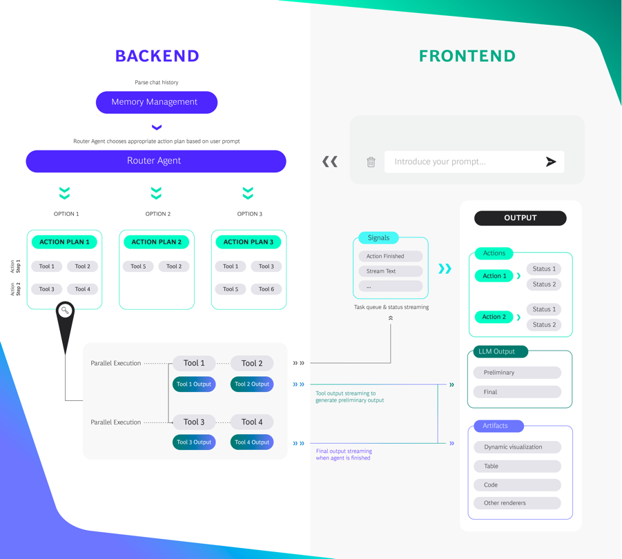
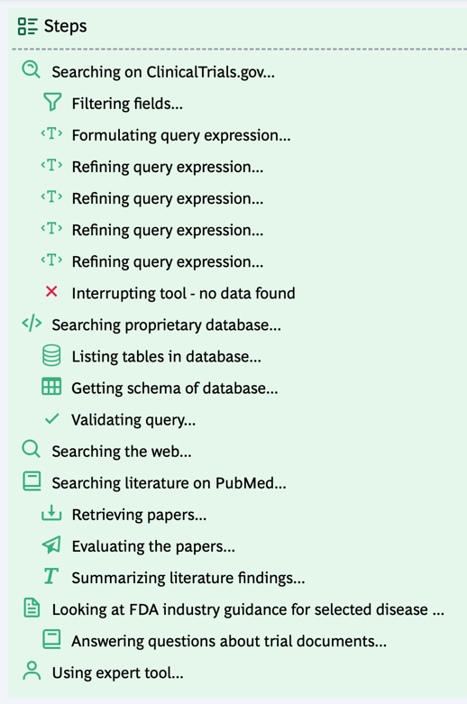

**Editor's Note: We're very excited to share this work by BCG. We've worked closely with the BCG over the past year to help support companies bring GenAI initiatives into production. We were intrigued to hear about their AgentKit platform, and once we got a closer look we were even more excited. We hope you all are as well!**

## **Introduction**

BCG X is excited to announce today's release of [AgentKit](https://github.com/BCG-X-Official/agentkit?ref=blog.langchain.com), a LangChain-based starter kit to build constrained agent applications. We frequently use LangChain inside BCG X to build GenAI applications and LangSmith to evaluate them. With AgentKit, we’re contributing back to the community by releasing something that has been useful for us in building agent-based applications for our clients.

## **What Is AgentKit?**

AgentKit is a starter kit to build full-stack constrained agent applications. It is built on the latest versions of Next.js 14, FastAPI (Pydantic 2.x) and LangChain for optimal performance, security, and developer experience. Developers can use AgentKit as a foundation for your projects to:

- quickly experiment with a constrained agent architecture with a chat UI and scalable backend, and
- build a full-stack, chat-based agent app that can scale to MVP

We chose to build AgentKit on top of LangChain for a couple of reasons. LangChain enables us to both work with any LLM that is right for the application, and to natively integrate with LangSmith so that we can easily evaluate the app’s performance. Moreover, it has made it easier for us to integrate helpful features such as memory management and an extensible AgentExecutor.

## **How it works**

At the heart of the AgentKit framework lies the concept of “Action Plans”, a predefined tree of tasks and decisions that the agent navigates to get to the desired output. Instead of allowing an agent full freedom of choice (like a ReAct agent), we trade off degrees of freedom for reliability by restricting the agent’s options to Action Plans that we pre-program with human experts. We then use a ‘Router Agent’ to select the most applicable Action Plan based on the user prompt and chat history.

When an Action Plan is selected, a tree of Action Steps is executed, with each Action Step containing one or more tools that are executed asynchronously. The outputs of the tools in an Action Step are passed down the tree to the next set of tools, and we’ve built functionality to carefully manage the state such that each tool only receives relevant context from previous steps.

To make the agent’s actions and output transparent to the users, we can signal status updates and stream output of each Action Step either as preliminary text, or in the form of an Appendix, which is a dynamic content block which can be configured to contain graphs, tables of data, code and more.

For example, for a shipping optimization copilot, we can restrict the agent to a set of Action Plans that

- retrieves and cleans pricing data and displays it in a table Appendix,
- runs an optimization model to find the new optimal schedule, and returns the schedule in a custom Appendix for dynamic Gantt charts in Plotly,
- answer questions on shipping regulations, using RAG,

We’ve wrapped this functionality into a full-stack starter kit that is easy to configure, with yaml files and environment variables for actions plans and tools, and Tailwind/daisyUI for the UI.

## **Motivation behind AgentKit**

BCG X is the tech build and design unit of the global management consulting firm, Boston Consulting Group (BCG). We partner with clients to build, operate, scale, and transfer capabilities and solutions that generate the greatest amount of impact for business and society.  Typically, a client will come to us because they want us to build solutions in areas that are new to them. We begin by talking to the client’s business users to understand their needs, design the product and build a first version, and then rapidly iterate to find the right solution. We have designed AgentKit to prioritize speed-to-value, keeping a few specific principles in mind: rapid development, scalability, reliability, and user-centric design. If these resonate with you, we hope AgentKit can be helpful in building your applications!

### **Build an initial proof of concept fast, then iterate with users**

Our clients expect quick, high-quality results. With the configurability and modularity of the AgentKit tech stack combined with the flexibility of LangChain, we can typically build a strong first proof of concept in just a few days. The sooner we can demo an application to business users, the sooner we can start iterating on their feedback.

### **Make applications that easily scale to MVP**

BCG X’s success is measured by the business value we deliver. With AgentKit’s pre-built modules for authentication, user feedback monitoring, queue management, and caching—and by making it easy to deploy an AgentKit application—we’re set up well to start scaling the application to production and begin realizing value.

### **Develop applications that are safe and reliable**

To put agents into production for a real business use case, we need to ensure the reliability and safety of its outputs. This requires careful evaluation - an area where LangSmith has been a useful tool for us, for instance, for investigating complex traces or by constructing comprehensive Datasets. Most importantly, we need to have a degree of “cognitive control” over the agent’s actions. Similar to the “state machines” mentioned in LangChain’s recent [LangGraph blog](https://blog.langchain.com/langgraph/), we believe that agents that are more “constrained” in the choices they are able to make have huge potential. The Action Plan framework helps us route the agent to actions we know are useful, and makes it easier to implement guardrails, for instance by routing unhelpful queries to separate Action Plans, or including guardrail tools at the start of an Action Plan.

### **Build applications for business users**

We believe that a transparent UI/UX that clearly shows an agent’s actions and outputs is key for adoption with business users. AgentKit’s UI is deliberately designed to show what the agent is doing at every step, while using streaming to show its preliminary outputs. And we have included support for rendering of tables, dynamic visualizations such as graphs, Gantt charts, images, and code to support a wide range of business use cases.

## **Learn more**

If you are interested in learning more or would like to try out AgentKit for yourself, explore the [GitHub repo,](https://github.com/BCG-X-Official/agentkit?ref=blog.langchain.com) our [AgentKit documentation](https://agentkit.infra.x.bcg.com/docs/introduction?ref=blog.langchain.com), or a demo of an [AgentKit codebase helper.](https://agentkit.infra.x.bcg.com/?ref=blog.langchain.com)

To date, some of the projects BCG X has used AgentKit for include:

- Generating drafts of complex clinical documents, such as clinical trial protocols, for a global pharma company
- Controlling and orchestrating supply chain optimization systems using a helpful agent assistant
- Developing a chatbot that helps a major automotive player service its customers
- ... and many more