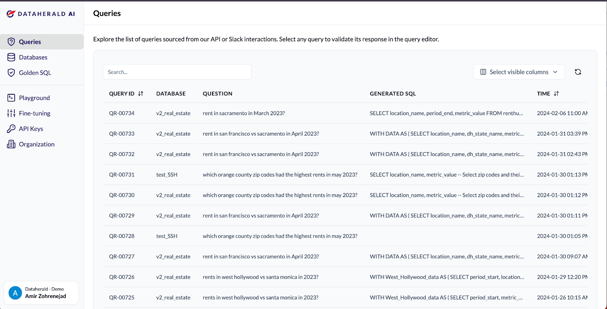
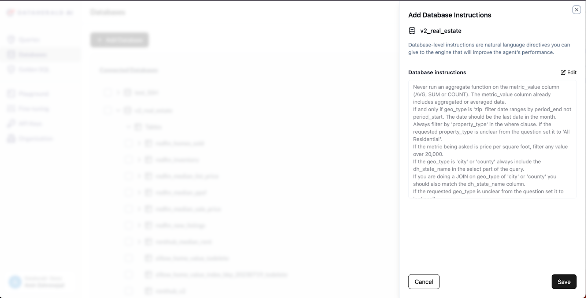
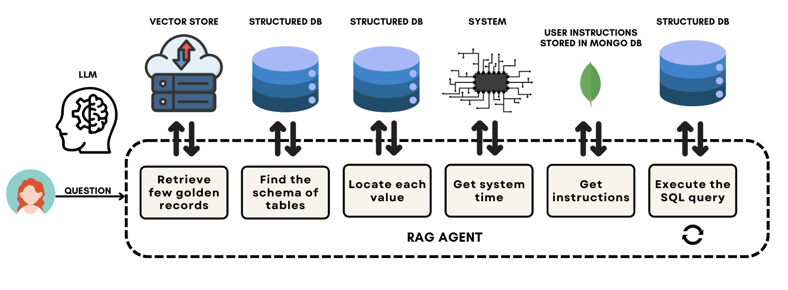
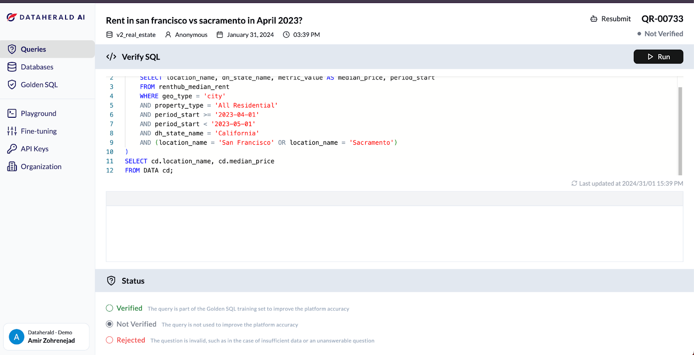
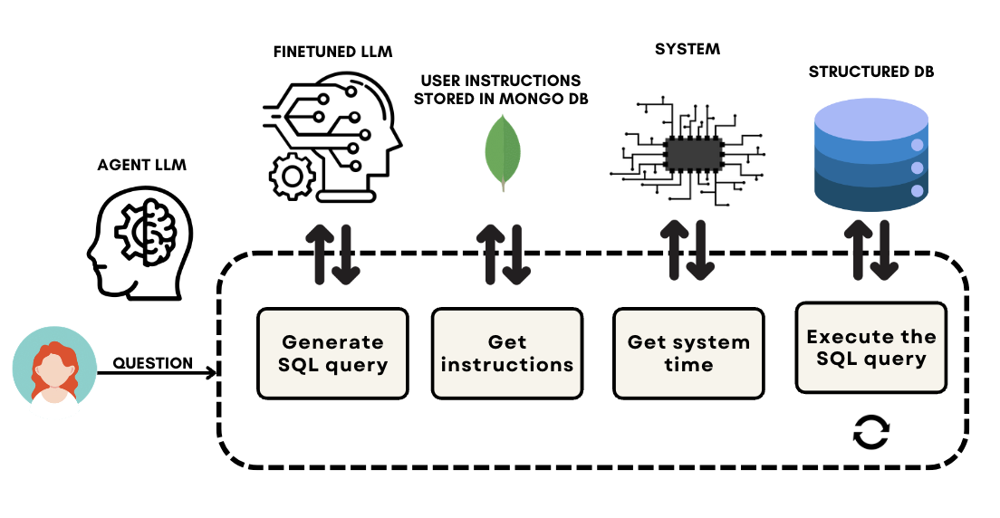

**Editor's Note: we're excited to feature this guest post from the** [**Dataherald**](https://www.dataherald.com/?ref=blog.langchain.com) **team. Text-to-SQL is a HUGE use case, and Dataherald is the open-source leader in the space. This is a great look behind the curtains to see what makes it tick.**

When ChatGPT came out in late 2022, everyone went over to see if AI could do their day to day work. Marketers wanted their blog posts written, college students their essays, and developers their helper functions. For those working with relational data, the test was to see how well these advanced LLMs could write SQL.

It turned out that while modern LLMs had become very good at writing _syntactically_ correct SQL, the code they generated often was _semantically_ incorrect. In fact, it soon became clear that LLMs are better at writing procedural code than SQL. This is because:

1. Metadata and business definition are not stored in the relational database schema.
2. LLMs do not do well when it comes to complex SQL requiring window functions, complex JOINs or temporal calculations. Furthermore on large schemas users will often run into context window issues
3. To get best performance, you need to fine-tune the LLM to the dataset. Creating the training datasets for NL-to-SQL is hard.
4. Assessing the accuracy of the AI generated SQL is extremely challenging.

At Dataherald, we set out to build an engine that would allow developers to deploy state of the art NL-to-SQL in their applications. We built it on LangChain, leveraging LangSmith for observability.

## How Dataherald works

Dataherald is an [open source](https://github.com/Dataherald/dataherald?ref=blog.langchain.com) NL-to-SQL engine which can also be accessed via a [hosted API](https://www.dataherald.com/news/introducing-dhai?ref=blog.langchain.com). Users can add business context, create training data and fine-tune LLMs to their schema. In the hosted version, users can monitor performance and configure the engine through a UI. However, the core part of the product are the two LangChain agents that do the NL to SQL translation.

Dataherald Admin Console Query ListDataherald Admin Console Database Instructions

## How the agents work

Dataherald has two LangChain agents: a RAG-only agent which relies on few-shot prompting and the more advanced agent which uses a fine-tuned LLM-as-a-tool.

### RAG agent:

The RAG agent is used for scenarios where the developer does not have access to a substantial set of sample Question<>SQL pairs (golden SQL) for fine-tuning or training the LLM. It connects to the database and extracts essential information for SQL generation, such as table schema, categorical values, table and column descriptions. It also then leverages the following tools:

- A schema-linking tool to identify relevant tables and columns
- A SQL execution tool that executes the generated SQL queries against the database to validate its correctness and recover from errors.
- Few-shot sample retriever tool to fetch golden SQL based on the similarity to the incoming prompt and use it for few shot prompting

Developers can further augment prompts with business-specific instructions that are injected into the prompts based on relevance

Developers often use this agent to create golden SQLs which can then be used to fine-tune an LLM for the more advanced model. The hosted version allows users to do modify SQL and add samples to the training data with a single click through the UI and code editor

### Agent with LLM-as-a-tool:

Once there are more than 10 golden SQL per table, our recommendation is to fine-tune a model and use the more advanced agent, which can be done with a single API call. For this agent, the fine-tuned NL-to-SQL model serves as a tool itself. However, since the fine-tuned model does not possess all the business context, it is still deployed within an agent that is responsible for retrieving business context.

Similar to the RAG agent, this agent has direct access to the database and can execute the generated SQL queries, ensuring they accurately retrieve the necessary information to answer the question and doesn’t contain any syntax errors.

The diagram below shows how this agent works:

## Conclusion

Developers and data teams at companies ranging in size from startups to Fortune 500 companies use Dataherald today to power conversational interfaces for their customers and empower internal business users to self-serve from the data warehouse.

We are just getting started and we have a lot lined up for the next few months: a LangChain integration, increased support for open source LLMs, and allowing agents to ask follow up questions (human as a tool) are all items currently in development.

If you are tired of wrangling with prompts to get NL-to-SQL to work, try out [Dataherald](https://dataherald.com/?ref=blog.langchain.com).