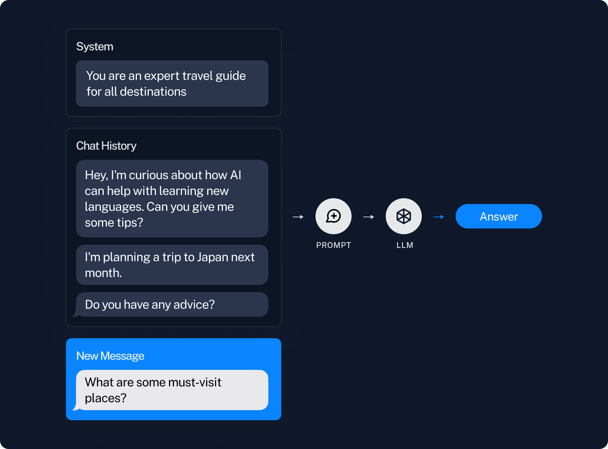
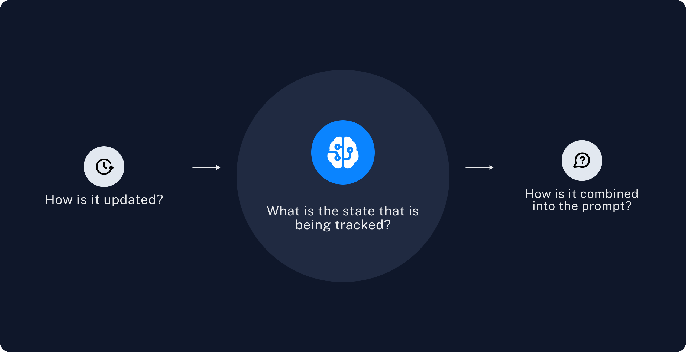
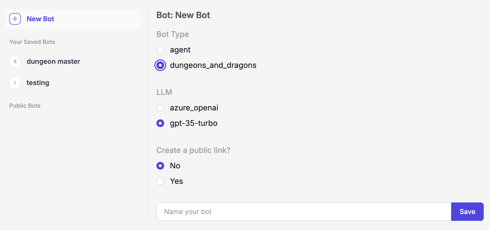
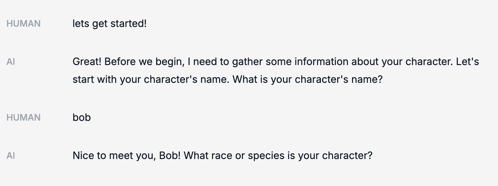
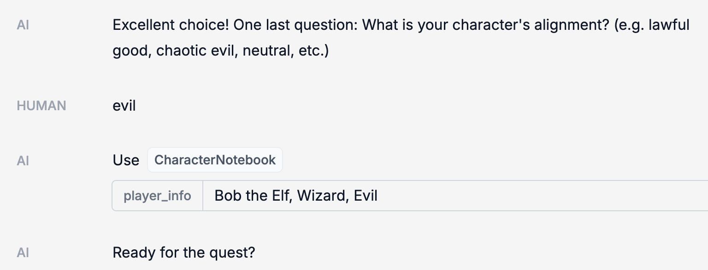
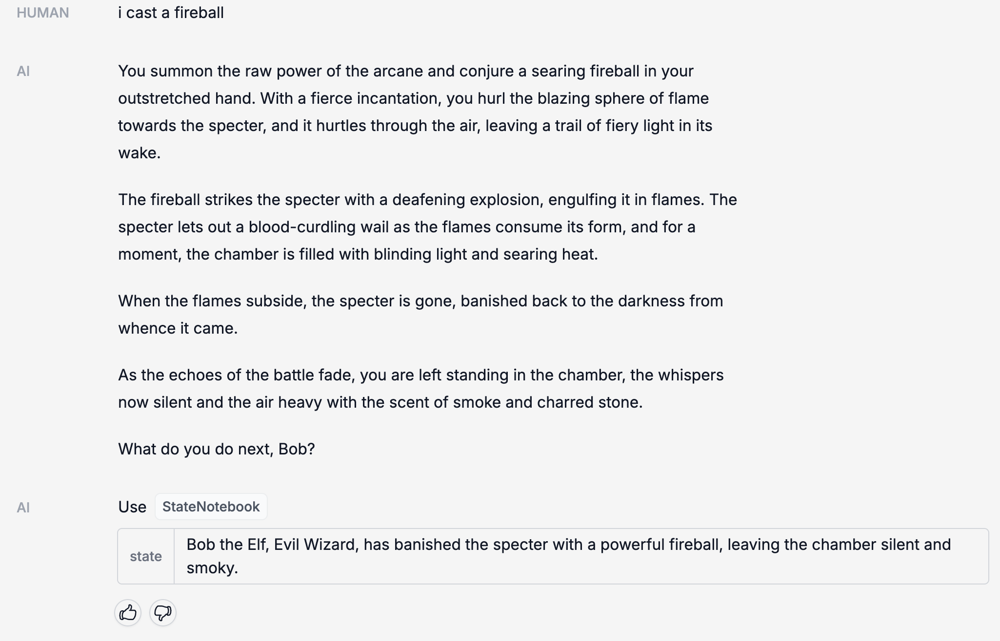
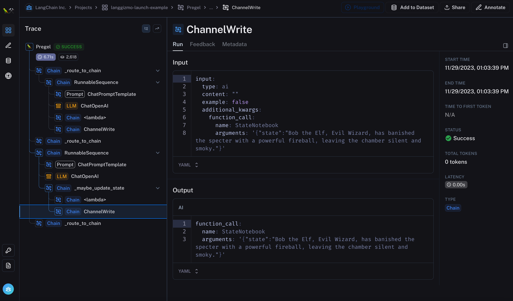

Three weeks ago we launched [OpenGPTs](https://github.com/langchain-ai/opengpts?ref=blog.langchain.com), an implementation of OpenAI GPTs and Assistant API but in an open source manner. OpenGPTs allows for implementation of conversational agents - a flexible and futuristic cognitive architecture. One large part of agents is **memory**. In their current implementation, GPTs, OpenGPTs, and the Assistants API only really support basic conversational memory. Longer term memory is an underexplored area. In this blog post we will talk a little bit about how we think about memory, why it is so underexplored, and then walk through the specific memory we implemented and exposed in OpenGPTs to create a "Dungeons and Dragons" Dungeon Master.

## LLMs are Stateless

LLMs themselves are stateless - if you pass in a first input, and then a second, it will not remember the first when operating on the second. As a result, pretty much all LLMs are stateless as well. This means that if you want to have any concept of memory at all, the user needs to maintain this state on their side before passing to the LLM.

The first main exception to that was released a few weeks ago by OpenAI with the Assistants API. This API allows you to keep track of a list of messages. You can then call an Assistant (an LLM) on this list of messages, and it will append messages to that thread. The LLM itself is still stateless, but the API exposed no longer is.

Even with this introduction, the main type of memory used is still just conversation memory.

## Conversation Memory

By conversational memory we simply mean the ability to remember previous messages in a conversation. This is done by keeping track of a list of previous messages, and then passing that into the prompt, which is then passed into the LLM.

This starts to run into issues when the list of previous messages gets rather long. First, if the list gets long enough, it may become longer than the context window. Second, even if it doesn't overflow the context window, it may still be long enough where it is too distracting for the LLM to properly attend over all the messages (see [some great research here by Greg Kamradt](https://x.com/GregKamradt/status/1727018183608193393?s=20&ref=blog.langchain.com) on the limitations of long context windows).

The most obvious way to deal with this is just to only use the N most recent messages. This leads to the downside of a lack of long term memory - the bot may forget everything you said before that.

So how do you deal with that?

## Semantic Memory

Semantic memory is maybe the next most commonly used type of memory. This refers to finding messages that are **similar** to the current message and bringing them into the prompt in some way.

This is typically done by computing an embedding for each message, and then finding other messages with a similar embedding. This is basically the same idea that powers retrieval augmentation generation (RAG). Except instead of searching for documents, you are searching for messages.

For example, if a user asks "what is my favorite fruit", we would maybe find a previous message like "my favorite fruit is blueberries" (since they are similar in the embedding space). We could then pass that previous message in as context.

However, this approach has some flaws.

## Challenges

First: if insights or information is spread out over multiple messages, then the right messages may not be retrieved. For example if there was a sequence of messages like:

> AI: What's your favorite fruit?

> Human: Blueberries

You would need to retrieve both those messages in order to have the appropriate information.

Second: this doesn't account for time. Preferences or facts can change over time. My favorite fruit could change over time. If we retrieve just based on semantic similarity, that isn't taken into account.

Third: this is relatively unopionated about the type of memory that is needed. Which is maybe good for AGI, but less good for developing more narrow, focused applications that actually work.

## Generative Agents

[Generative agents](https://arxiv.org/abs/2304.03442?ref=blog.langchain.com) was a fantastic paper that came out less than a year ago and does some of the most interesting advanced memory work. It's worth looking at that paper and seeing how it tackles some of the challenges listed above.

In _Generative Agents_, they build memory using a variety of techniques:

- Recency: they fetch memories based on recent messages (combination of _conversation memory_ and just upweighting messages based on time stamp after fetching).
- Relevancy: they fetch relevant messages ( _semantic memory_)
- Reflection: they don't just fetch raw messages, but rather they use an LLM to reflect on the messages and then fetch those reflections.

The use of reflection can help to address the first issue raised above - if information is spread out over multiple messages, by reflecting over multiple message a synthesis can be generated.

The second issue is partially addressed by the recency weighting. However, likely not fully solved.

The third issue isn't really addressed, this is still a pretty general form of memory (but that's fine, that's what it was aiming to do).

## Long Term Memory Abstraction

When we think of long term memory, the most general abstraction is:

- There exists some state that is tracked over time
- This state is updated at some period
- This state is combined into the prompt in some way

The relevant questions then become:

1\. What is the state is that tracked?

2\. How is the state updated?

3\. How is the state used?

Let's look at how the three different types of memory above play out.

#### **Conversation Memory**

- The state that is tracked is a list of messages
- The state is updated by appending recent messages after each turn
- The state is combined into the prompt by inserting the messages into the prompt

#### **Semantic Memory**

- The state that is tracked is a vectorstore of messages
- The state is updated by vectorizing and inserting messages after each turn
- The state is combined into the prompt by querying it for similar messages after each turn

#### **Generative Agents**

- The state that is tracked is a vectorstore of memories, as well as a list of the most recent memories
- The state is updated in several ways. First, after each turn a new memory is inserted into the list of most recent memories. Then, an embedding is calculated for that memory. Then, after N turns, a reflection is made over the recent memories and that is inserted both into the list and into the vectorstore.
- The state is combined into the prompt by selecting memories (or reflections of memories) based on a weighted combination of recency and relevancy.

## Application Specific Memory

All of these forms of memory are fairly generic. Which is great if you are trying to build AGI. But is less reliable and performant if you are trying to build more narrow applications.

💡

Memory is one part of a cognitive architecture. Just as with cognitive architectures, we've found in practice that more application specific forms of memory can go a long way in increasing the reliability and performance of your application.

So when you're building your application, we would highly recommend asking the above questions:

- **_What is the state that is tracked?_**
- **_How is the state updated?_**
- **_How is the state used?_**

Of course, this is easier said than done. And then even if you are able to answer those questions, how can you actually build it?

We've decided to give this a go within OpenGPTs and build a specific type of chatbot with a specific form of memory.

## Dungeons and Dragons Chatbot

We decided to build a chatbot that could reliably serve as a dungeon master for a game of dungeon and dragons. What is the specific type of memory we wanted for this?

**_What is the state that is tracked?_**

We wanted to first make sure to track the characters that we're involved in the game. Who they were, their descriptions, etc. This seems like something that should be known. We call this `character` memory.

We then also wanted to track the state of the game itself. What had happened up to that point, where they were, etc. We call this `quest` memory.

We decided to split this into two distinct things - so we were actually tracking an updating two different states: `character` and `quest`.

**_How is the state updated?_**

For the character description, we just wanted to update that once at beginning. So we wanted our chatbot to gather all relevant information, update that state, and then never update it again.

Afterwards, we wanted our chatbot to attempt to update the state of the quest every turn. If it decides that no update is necessary, then we won't update it. Otherwise, we will override the current state of the quest with an LLM generated new state.

**_How is the state used?_**

We wanted both the character description and the state of the quest to always be inserted into the prompt. This is pretty straightforward since they were both text, so it was just some prompt engineering with some placeholders for those variables.

#### Cognitive Architecture

It's worth noting that for this chatbot we used a slightly different cognitive architecture than the generic agents. Namely, we used a version of a state machine. The chatbot was in one of two states:

1. Character-constructing state: gathering information about a user's character
2. Quest-mode state: leading a quest

The transition between these two states occurred when the LLM decided that it had gleaned enough of the player's character. When that occurred, it updated the `character` memory. The presence of a `character` memory serves as signposting that the chatbot should be in the quest-telling state.

## See it in action

To see this in action, you can go to the deployed version of OpenGPTs. You can see the source code [here](https://github.com/langchain-ai/opengpts?ref=blog.langchain.com).

If you want to create a "Dungeons and Dragons" chatbot with this type of memory from scratch, when creating a new bot you can select the `dungeons_and_dragons` type.

When messaging it, it will first interview you for information about your character.

Once it has enough information, it will save it to the `CharacterNotebook` (our name for the memory that contains information about the character).

After that, it will lead you on a quest. At various points, the `StateNotebook` will update (this is our name for the memory that contains the state of the quest).

Everything is logged in LangSmith, so we can take a look at what is going on behind the scenes:

Note that this is not perfect! There is definitely some prompt engineering to be done to improve the updating of the quest over time. Still, we hope this serves as a concrete example of how we think about long term memory, and one concrete _custom_ implementation.

## Conclusion

Long term memory is a very underexplored topic. Part of that is probably because it is either (1) very general, and trends towards AGI, or (2) so application specific, and tough to talk about generically.

At LangChain, we believe that most applications that need a form of long term memory are likely better suited by application specific memory. In this case, it becomes important to think critically about:

- What is the state that is tracked?
- How is the state updated?
- How is the state used?

We're building a framework (and tools) to help make this easy - LangChain, OpenGPTs, LangSmith. Still, due to the application-specific nature of it, it's tough to work on in the abstract. **If you are a company working on an application that requires long-term memory and need assistance, please reach out to hello@langchain.dev**