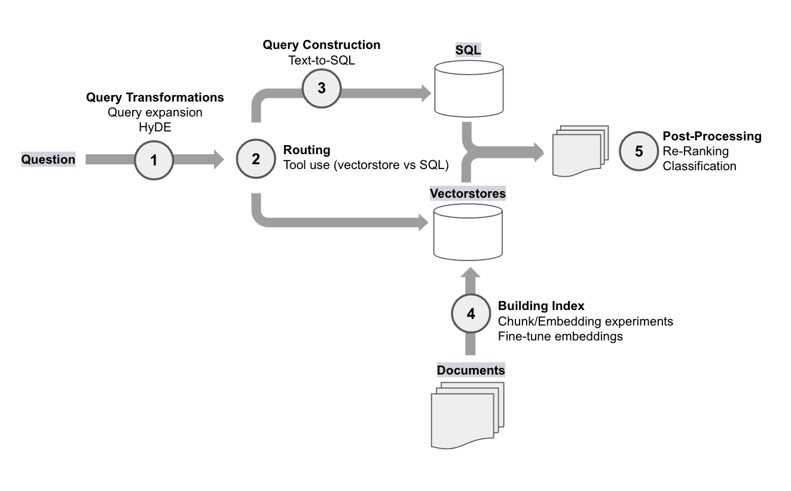
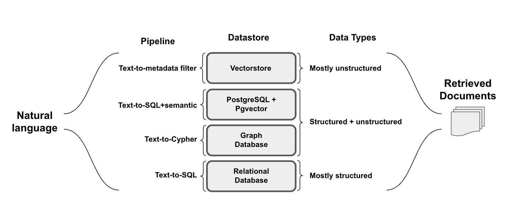
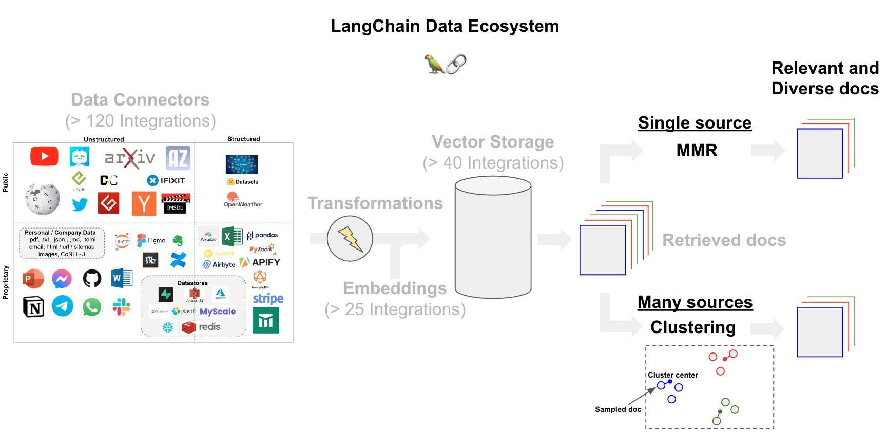

## Context

At their demo day, Open AI [reported](https://www.youtube.com/watch?v=ahnGLM-RC1Y&ref=blog.langchain.com#t=16m8s) a series of RAG experiments for a customer that they worked with. While evaluation metics will depend on your specific application, it’s interesting to see what worked and what didn't for them. Below, we expand on each method mention and show how you can implement each one for yourself. The ability to understand and these methods on your application is critical: from talking to many partners and users, there is no "one-size-fits-all" solution because different problems require different retrieval techniques.

## How these fit into the RAG stack

First, we can bin these methods into a few RAG categories. Here is a diagram that shows each RAG experiment in its category and places them in the RAG stack:

### Baseline

Distance-based vector database retrieval embeds (represents) queries in high-dimensional space and finds similar embedded documents based on "distance". The base-case retrieval method used in the OpenAI study mentioned cosine similarity. LangChain has [over 60](https://integrations.langchain.com/vectorstores?ref=blog.langchain.com) vectorstore integrations, many of which allow for configuration distance functions used in similarity search. Useful blog posts on the various distance metrics can be found from [Weaviate](https://weaviate.io/blog/distance-metrics-in-vector-search?ref=blog.langchain.com) and [Pinecone](https://www.pinecone.io/learn/vector-similarity/?ref=blog.langchain.com).

### Query Transformations

However, retrieval may produce different results due to subtle changes in query wording or if the embeddings do not capture the semantics of the data well. Query transformations are a set of approaches focused on modifying the user input in order to improve retrieval.See our recent blog on the topic [here](https://blog.langchain.com/query-transformations/).

**OpenAI reported two methods, which you can try**:

- **Query expansion**: LangChain’s [Multi-query retriever](https://python.langchain.com/docs/modules/data_connection/retrievers/MultiQueryRetriever?ref=blog.langchain.com) achieves query expansion using an LLM to generate multiple queries from different perspectives for a given user input query. For each query, it retrieves a set of relevant documents and takes the unique union across all queries.
- **HyDE**: LangChain’s [HyDE](https://python.langchain.com/docs/templates/hyde?ref=blog.langchain.com) (Hypothetical Document Embeddings) retriever generates hypothetical documents for an incoming query, embeds them, and uses them in retrieval (see [paper](https://arxiv.org/abs/2212.10496?ref=blog.langchain.com)). The idea is that these simulated documents may have more similarity to the desired source documents than the question.

**Other ideas to consider**:

- **Step back prompting**: For reasoning tasks, this [paper](https://arxiv.org/pdf/2310.06117.pdf?ref=blog.langchain.dev) shows that a step-back question can be used to ground an answer synthesis in higher-level concepts or principles. For example, a question about physics can be abstracted into a question and answer about the physical principles behind the user query. The final answer can be derived from the input question as well as the step-back answer. The this [blog post](https://cobusgreyling.medium.com/a-new-prompt-engineering-technique-has-been-introduced-called-step-back-prompting-b00e8954cacb?ref=blog.langchain.com) and the [LangChain implementation](https://github.com/langchain-ai/langchain/blob/master/cookbook/stepback-qa.ipynb?ref=blog.langchain.dev) to learn more.
- **Rewrite-Retrieve-Read**: This [paper](https://arxiv.org/pdf/2305.14283.pdf?ref=blog.langchain.dev) re-writes user questions in order to improve retrieval. See the [LangChain implementation](https://github.com/langchain-ai/langchain/blob/master/cookbook/rewrite.ipynb?ref=blog.langchain.dev) to learn more.

### Routing

When querying across multiple datastores, routing questions to the appropriate source become critical. The OpenAI presentation reported that they needed to route question between two vectorstores and single SQL database. LangChain has [support for routing](https://python.langchain.com/docs/expression_language/how_to/routing?ref=blog.langchain.com) using an LLM to gate user-input into a set of defined sub-chains, which - as in this case - could be different vectorstores.

### Query Construction

Because one of the datasources mentioned in the OpenAI study is a relational (SQL) database, valid SQL needed to be generated from the user input in order to extract the necessary information. LangChain has support for [text-to-sql](https://blog.langchain.com/llms-and-sql/), which is reviewed in depth in our recent [recent blog](https://blog.langchain.com/query-construction/) focused on query construction.

**Other ideas to consider**:

- [Text-to-metadata filter](https://python.langchain.com/docs/modules/data_connection/retrievers/self_query/?ref=blog.langchain.dev#constructing-from-scratch-with-lcel) for vectorstores
- [Text-to-Cypher](https://python.langchain.com/docs/use_cases/graph/graph_cypher_qa?ref=blog.langchain.dev) for graph databases
- [Text-to-SQL+semantic](https://github.com/langchain-ai/langchain/blob/master/cookbook/retrieval_in_sql.ipynb?ref=blog.langchain.dev) for semi-structured data in [Postgres with Pgvector](https://supabase.com/docs/guides/database/extensions/pgvector?ref=blog.langchain.com)

### Building the Index

OpenAI reported an notable boost in performance simply from experimenting with the chunk size during document embedding. Because this is a central step in index building, we have an [open source](https://github.com/langchain-ai/text-split-explorer?ref=blog.langchain.com) [Streamlit app](https://x.com/hwchase17/status/1689015952623771648?s=20&ref=blog.langchain.com) where you can test chunk sizes.

While they did not report a considerable boost in performance from embedding fine-tuning, [favorable results](https://www.glean.com/blog/how-to-build-an-ai-assistant-for-the-enterprise?ref=blog.langchain.com) have been reported. While OpenAI notes that this is probably not advised as "low-hanging-fruit", we have shared [guides for fine-tuning](https://blog.langchain.com/using-langsmith-to-support-fine-tuning-of-open-source-llms/) and there are some [very](https://huggingface.co/blog/getting-started-with-embeddings?ref=blog.langchain.com) [good](https://huggingface.co/blog/how-to-train-sentence-transformers?ref=blog.langchain.com) tutorials from HuggingFace that go deeper on this.

### Post-Processing

Processing documents following retrieval, but prior to LLM ingestion, is an important strategy for many applications. We can use post-processing to enforce diversity or recency among our retrieved documents, which can be especially important when we are pooling documents from multiple sources.

**OpenAI reported two methods**:

- **Re-rank**: LangChain’s integration with the [Cohere ReRank](https://python.langchain.com/docs/integrations/retrievers/cohere-reranker?ref=blog.langchain.com) endpoint is one approach, which can be used for document compression (reduce redundancy) in cases where we are retrieving a large number of documents. Relatedly, RAG-fusion uses reciprocal rank fusion (see [blog](https://towardsdatascience.com/forget-rag-the-future-is-rag-fusion-1147298d8ad1?ref=blog.langchain.com) and [implementation](https://github.com/langchain-ai/langchain/blob/master/cookbook/rag_fusion.ipynb?ref=blog.langchain.dev)) to ReRank documents returned from a retriever similar to [multi-query](https://github.com/langchain-ai/langchain/blob/master/cookbook/rag_fusion.ipynb?ref=blog.langchain.dev) (discussed above).
- **Classification**: OpenAI classified each retrieved document based upon its content and then chose a different prompt depending on the classification. This marries two ideas: LangChain supports [tagging](https://python.langchain.com/docs/modules/chains/how_to/openai_functions?ref=blog.langchain.com) [of](https://github.com/langchain-ai/langchain/tree/master/templates/extraction-openai-functions?ref=blog.langchain.com) [text](https://python.langchain.com/docs/modules/chains/how_to/openai_functions?ref=blog.langchain.com) (e.g., using function calling to enforce the output schema) for classification. As mentioned above, [logical routing](https://python.langchain.com/docs/expression_language/how_to/routing?ref=blog.langchain.com) can also be used to route based on a tag (or include the process of semantic tagging in the logical routing chain itself).

**Other ideas to consider**:

- **MMR**: To balance between relevance and diversity, many vectorstores offer [max-marginal-relevance](https://t.co/dUKfHdPy46?ref=blog.langchain.com) [search](https://python.langchain.com/docs/integrations/vectorstores/pinecone?ref=blog.langchain.com#maximal-marginal-relevance-searches) (see blog post [here](https://medium.com/tech-that-works/maximal-marginal-relevance-to-rerank-results-in-unsupervised-keyphrase-extraction-22d95015c7c5?ref=blog.langchain.com)).
- **Clustering**: Some approaches have used [clustering](https://python.langchain.com/docs/integrations/retrievers/merger_retriever?ref=blog.langchain.com) of embedded documents with sampling, which may be helpful in cases where we are consolidating documents across a wide range sources.

## Conclusion

It's instructive to see what OpenAI has tried on the topic of RAG. The approaches can be reproduced in your own hands as shown above: trying different methods is crucial because application performance can vary widely on the RAG setup.

However, the OpenAI results also show that evaluation is critically important to avoid wasted time and effort on approaches that yield little or no benefit. For RAG evaluation, [LangSmith](https://docs.smith.langchain.com/evaluation/evaluator-implementations?ref=blog.langchain.com) offers a great deal of support: for example, [here](https://github.com/langchain-ai/langchain/blob/master/cookbook/advanced_rag_eval.ipynb?ref=blog.langchain.com) is a cookbook using LangSmith to evaluate several advanced RAG chains.

### Tags

[**Extraction Benchmarking**](https://blog.langchain.com/extraction-benchmarking/)

[**LangServe Playground and Configurability**](https://blog.langchain.com/langserve-playground-and-configurability/)

[**A Chunk by Any Other Name: Structured Text Splitting and Metadata-enhanced RAG**](https://blog.langchain.com/a-chunk-by-any-other-name/)

[**The Prompt Landscape**](https://blog.langchain.com/the-prompt-landscape/)

[**Building Chat LangChain**](https://blog.langchain.com/building-chat-langchain-2/)