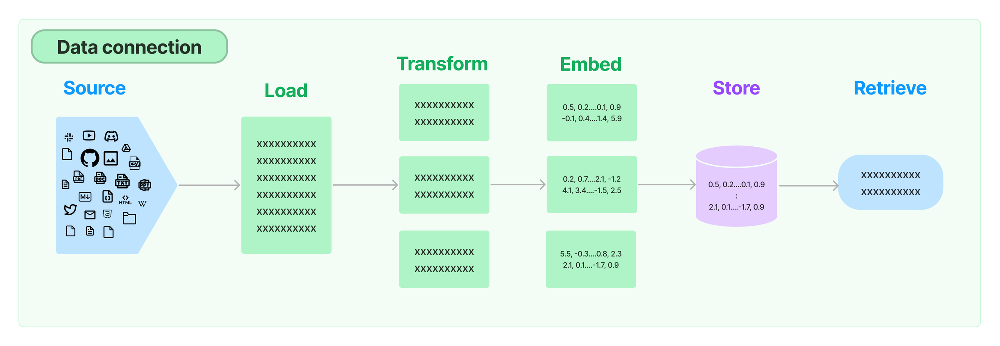
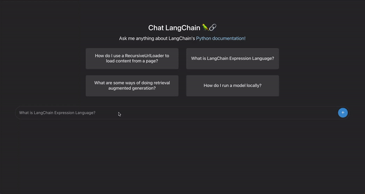
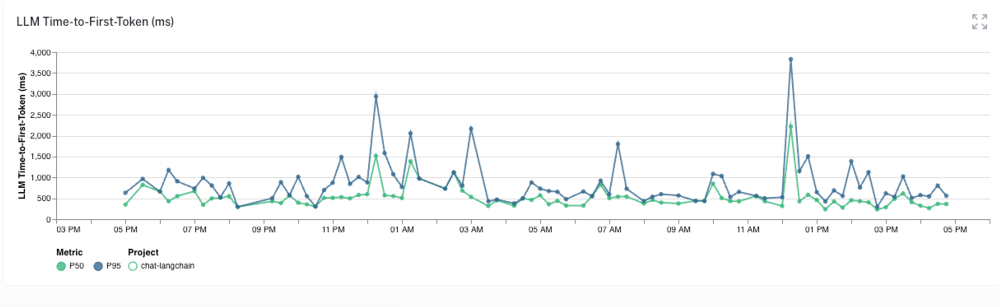
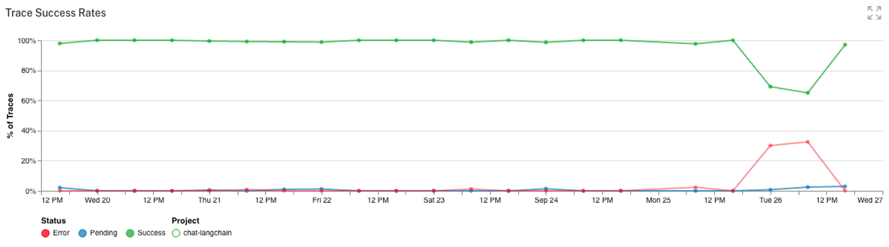
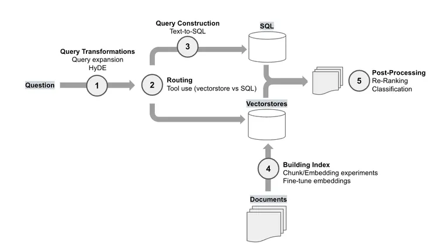

Hosted: [https://chat.langchain.com](https://chat.langchain.com/?ref=blog.langchain.com)

Repo: [https://github.com/langchain-ai/chat-langchain](https://github.com/langchain-ai/chat-langchain?ref=blog.langchain.com)

## Intro

LangChain packs the power of large language models and an entire ecosystem of tooling around them into a single package. This consolidation ultimately simplifies building LLM applications, but it does mean that there are a lot of features to learn about.

To help folks navigate LangChain, we decided to use LangChain to explain LangChain.

In this post, we'll build a chatbot that answers questions about LangChain by indexing and searching through the [Python docs](https://python.langchain.com/docs/get_started/introduction?ref=blog.langchain.com) and [API reference](https://api.python.langchain.com/en/latest/api_reference.html?ref=blog.langchain.com). We call this bot **Chat LangChain.** In explaining the architecture we'll touch on how to:

- Use the Indexing API to continuously sync a vector store to data sources
- Define a RAG chain with LangChain Expression Language (LCEL)
- Evaluate an LLM application
- Deploy a LangChain application
- Monitor a LangChain application

By the end, you'll see how easy it is to bootstrap an intelligent chatbot from scratch. The process can be adapted for other knowledge bases, too. Let's dive in!

## Architecture

### Ingestion

To perform RAG, we need to create an index over some source of information about LangChain that can be queried at runtime. Ingestion refers to the process of loading, transforming and indexing the relevant data source(s).

See [https://python.langchain.com/docs/modules/data\_connection](https://python.langchain.com/docs/modules/data_connection/?ref=blog.langchain.com) for more on the building blocks of retrieval

To start we tried indexing the Python docs, API Reference and Python repo. We found that retrieving chunks of code directly was often less effective than more contextualized and verbose sources like the docs, so we dropped the codebase from our retrieval sources.

The final ingestion pipeline looks like this:

**Load: SitemapLoader + RecursiveURLLoader**— We first load in our docs by scraping the relevant web pages. We do this instead of loading directly from the repo because 1) parts of our docs and API reference are autogenerated from code and notebooks, and 2) this is a more generalizable approach.

To load the Python docs we used the `SitemapLoader`, which finds all the relevant links to scrape from a sitemap XML file. A lot of the legwork here is done by the `langchain_docs_extractor` method, which is an awesome custom HTML -> text parser contributed by [Jesús Vélez Santiago](https://github.com/jvelezmagic?ref=blog.langchain.com):

```python
docs = SitemapLoader(
    "https://python.langchain.com/sitemap.xml",
    filter_urls=["https://python.langchain.com/"],
    parsing_function=langchain_docs_extractor,
    default_parser="lxml",
    bs_kwargs={
        "parse_only": SoupStrainer(
            name=("article", "title", "html", "lang", "content")
        ),
    },
    meta_function=metadata_extractor,
).load()
```

To load the API Reference (which doesn't have a very useful sitemap) we use a `RecursiveUrlLoader`, which recursively loads sublinks from a page up to a certain depth.

```python
api_ref = RecursiveUrlLoader(
    "https://api.python.langchain.com/en/latest/",
    max_depth=8,
    extractor=simple_extractor,
    prevent_outside=True,
    use_async=True,
    timeout=600,
    check_response_status=True,
    exclude_dirs=(
        "https://api.python.langchain.com/en/latest/_sources",
        "https://api.python.langchain.com/en/latest/_modules",
    ),
).load()
```

**Transform: RecursiveCharacterTextSplitter**— By the time our documents are loaded, we've already done a good amount of HTML to text and metadata parsing. Some of the pages we've loaded are quite long, so we'll want to chunk them. This is important because 1) it can improve retrieval performance; similarity search might miss relevant documents if they also contain a lot of irrelevant information, 2) saves us having to worry about retrieved documents fitting in a model's context window.

We use a simple RecursiveCharacterTextSplitter to partition the content into approximately equally-sized chunks:

```python
transformed_docs = RecursiveCharacterTextSplitter(
    chunk_size=4000,
    chunk_overlap=200,
).split_documents(docs + api_ref)
```

**Embed + Store: OpenAIEmbeddings, Weaviate**— To make sense of this textual data and enable effective retrieval, we leveraged OpenAI's embeddings. These embeddings allowed us to represent each chunk as a vector in the Weaviate vector store, creating a structured knowledge repository ready for retrieval.

```python
client = weaviate.Client(
    url=WEAVIATE_URL,
    auth_client_secret=weaviate.AuthApiKey(api_key=WEAVIATE_API_KEY),
)
embedding = OpenAIEmbeddings(chunk_size=200)
vectorstore = Weaviate(
    client=client,
    index_name=WEAVIATE_DOCS_INDEX_NAME,
    text_key="text",
    embedding=embedding,
    by_text=False,
    attributes=["source", "title"],
)
```

**Indexing + Record Management: SQLRecordManager**— We want to be able to re-run our ingestion pipeline to keep the chatbot up-to-date with new LangChain releases and documentation. We also want to be able to improve our ingestion logic over time. To do this without having to re-index all of our documents from scratch every time, we use the [LangChain Indexing API](https://python.langchain.com/docs/modules/data_connection/indexing?ref=blog.langchain.com). This uses a `RecordManager` to track writes to any vector store and handles deduplication and cleanup of documents from the same source. For our purposes, we used a Supabase PostgreSQL-backed record manager:

```python
record_manager = SQLRecordManager(
    f"weaviate/{WEAVIATE_DOCS_INDEX_NAME}", db_url=RECORD_MANAGER_DB_URL
)
record_manager.create_schema()
indexing_stats = index(
    transformed_docs,
    record_manager,
    vectorstore,
    cleanup="full",
    source_id_key="source",
)
```

And voila! We've now created a query-able vector store index of our docs and API reference.

### Continuous ingestion

We add and improve LangChain features pretty regularly. To make sure our chatbot is up-to-date with the latest and greatest that LangChain has to offer, we need to regularly re-index the docs. To do this we added a scheduled Github Action  to the repo that runs the ingestion pipeline daily: check it out [here](https://github.com/langchain-ai/chat-langchain/blob/master/.github/workflows/update-index.yml?ref=blog.langchain.com).

### Question-Answering

Our question-answering chain has two simple components. First, we take the question, combine it with the past messages from the current chat session, and write a standalone search query. So if a user asks “How do I use the Anthropic LLM” and follows up with “How about VertexAI”, the chatbot might rewrite the last question as “How do I use the VertexAI LLM” and use that to query the retriever instead of “How about VertexAI”. You can see the prompt we use for rephrasing a question [here](https://smith.langchain.com/hub/bagatur/chat-langchain-rephrase?ref=blog.langchain.com).

```python
condense_question_chain = (
    PromptTemplate.from_template(REPHRASE_TEMPLATE)
    | llm
    | StrOutputParser()
).with_config(
    run_name="CondenseQuestion",
)
retriever_chain = condense_question_chain | retriever
```

Once we’ve formulated the search query and retrieved relevant documents, we pass the original question, the chat history and the retrieved context to a model using [this prompt](https://smith.langchain.com/hub/bagatur/chat-langchain-response?ref=blog.langchain.com). Notice the prompt instructs the model to cite its sources. This is done 1) to try and mitigate hallucinations, and 2) to make it easy for the user to explore the relevant documentation themselves.

```python
_context = RunnableMap(
    {
        "context": retriever_chain | format_docs,
        "question": itemgetter("question"),
        "chat_history": itemgetter("chat_history"),
    }
).with_config(run_name="RetrieveDocs")
prompt = ChatPromptTemplate.from_messages(
    [\
        ("system", RESPONSE_TEMPLATE),\
        MessagesPlaceholder(variable_name="chat_history"),\
        ("human", "{question}"),\
    ]
)

response_synthesizer = (prompt | llm | StrOutputParser()).with_config(
    run_name="GenerateResponse",
)
answer_chain = _context | response_synthesizer
```

### Evaluation

Building a reliable chatbot took many adjustments. Our initial prototype left a lot to be desired. It confidently [hallucinated content](https://smith.langchain.com/public/89d6c43a-572d-40eb-93f0-0fb3862b9ab6/r?ref=blog.langchain.com) that was irrelevant to the LangChain context  or it was [unable to respond](https://smith.langchain.com/public/bb5e7e29-aa65-4493-91fc-885c3c452bd1/r?ref=blog.langchain.com) to many common questions. By using LangSmith throughout the development process, we could rapidly iterate on the different steps in our pipeline, quickly identifying the weakest links in our chain. Our typical process would be to interact with the app, view the trace for bad examples, assign blame to the different components (retriever, response generator, etc.) so we know what to update, and repeat.  Whenever the bot failed on one of our questions, we would add the run to a dataset, along with the answer we expected to receive. This quickly got us a working V0 and gave us benchmark dataset "for free", which we could use to check our performance whenever we make further changes to our chain structure.

We took our dataset of questions and hand-written answers and used LangSmith to benchmark each version of our bot. For tasks like question-answering, where the responses can sometimes be long or contain code, selecting the right metrics can be a challenge. When checking the evaluation results for embedding or string distance evaluators, neither adequately matched what we would expect for grading, so used LangChain’s QA evaluator, along with a custom “Hallucination” evaluator that compares the response with the documents to see if there is content that is not grounded in the retrieved docs. Doing so let us confidently make changes to the bot’s prompt, retriever, and overall architecture.

### Chat Application

With any chat application, the “time to first token” needs to be minimal, meaning end-to-end asynchronous streaming support is a must. For our application, we also want to stream the reference knowledge so the user can see the source docs for more information. Since we’ve built our chat bot using LangChain [Runnables](https://python.langchain.com/docs/expression_language/?ref=blog.langchain.com), we gets all of this for free.

Our chatbot uses the `astream_log` method to asynchronously stream the responses from the retriever and the response generation chain to the web client.

```python
stream = answer_chain.astream_log(
      {
          "question": question,
          "chat_history": converted_chat_history,
      },
      config={"metadata": metadata},
      include_names=["FindDocs"],
      include_tags=["FindDocs"],
  )
```

This creates a generator that emits operations from the selected  that we can easily separate into:

- Response content (the answer)
- Retrieved document metadata (for citations)
- The run ID for the LangSmith trace (for feedback)

From these, the client can render the document cards as soon as they are available, stream the chat response, and capture the run ID to use for logging user feedback.

Logging User Feedback

The feedback endpoint is a simple line that takes the Run ID and score from the web client and logs the values to LangSmith:

```
client.create_feedback(run_id, "user_score", score=score)
```

**Monitoring**

With the chat bot in production, LangSmith makes it easy to aggregate and monitor relevant metrics so we can track how well the application is behaving. For instance, we can check the time-to-first-token metric, which captures the delay between when the query is sent to the chat bot and when the first response token is sent back to the user.

Time to first token (TTFT) chart

Or we can monitor when there are any errors in the trace:

Success rate chart

We can also track the user feedback metrics, token counts, and all kinds of other analytics to make sure our chat bot is performing as expected. All this information helps us detect, filter, and improve the bot over time.

## Conclusion

Head to [https://chat.langchain.com](https://chat.langchain.com/?ref=blog.langchain.com) to play around with the deployed version. To dive deeper, check out the [source code](https://github.com/langchain-ai/chat-langchain?ref=blog.langchain.com), clone it, and incorporate your own documents to further explore its capabilities.

If you are exploring building apps and want to chat, I would be happy to make that happen :) DM me on Twitter @mollycantillon

### Tags


[](https://blog.langchain.com/extraction-benchmarking/)

[**Extraction Benchmarking**](https://blog.langchain.com/extraction-benchmarking/)


[](https://blog.langchain.com/applying-openai-rag/)

[**Applying OpenAI's RAG Strategies**](https://blog.langchain.com/applying-openai-rag/)


[](https://blog.langchain.com/langserve-playground-and-configurability/)

[**LangServe Playground and Configurability**](https://blog.langchain.com/langserve-playground-and-configurability/)


[](https://blog.langchain.com/a-chunk-by-any-other-name/)

[**A Chunk by Any Other Name: Structured Text Splitting and Metadata-enhanced RAG**](https://blog.langchain.com/a-chunk-by-any-other-name/)


[**The Prompt Landscape**](https://blog.langchain.com/the-prompt-landscape/)