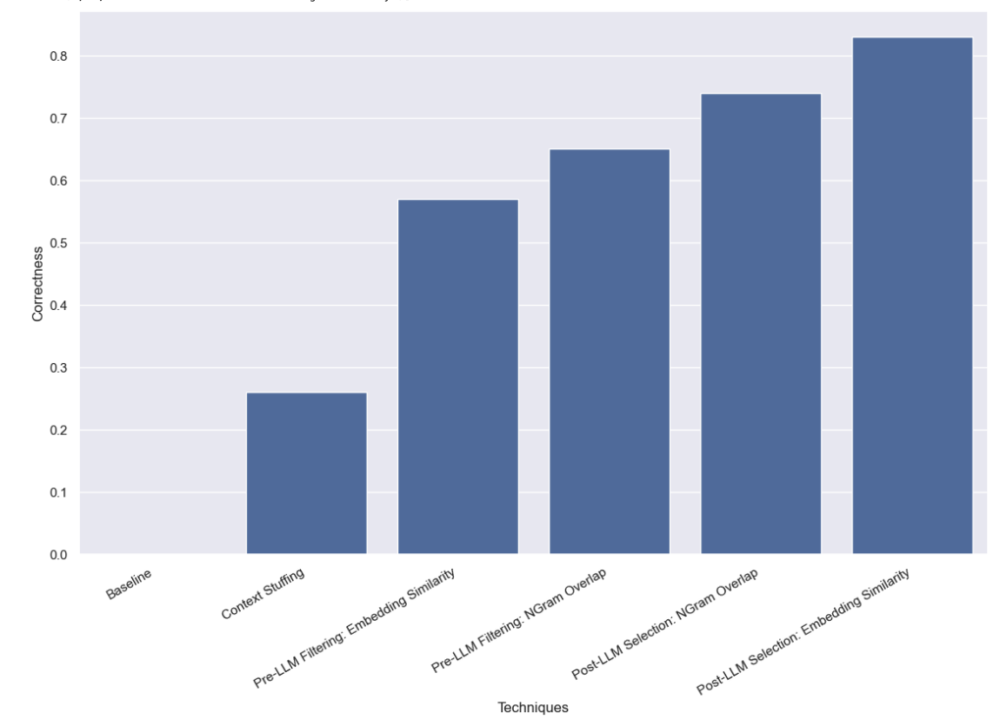

Several key use cases for LLMs involve returning data in a structured format. Extraction is one such use case - we recently highlighted this with [updated documentation](https://python.langchain.com/docs/use_cases/extraction/?ref=blog.langchain.com) and [a dedicated repo](https://github.com/langchain-ai/langchain-extract?ref=blog.langchain.com). Query analysis is another - we’ve also [updated our documentation](https://python.langchain.com/docs/use_cases/query_analysis/?ref=blog.langchain.com) around this recently. When returning information in a structured format the fields can be a myriad of types: string, boolean, integers. One of the hardest types to correctly handle is high-cardinality categorical values (or enums).

What does “high cardinality categorical values” mean? “Categorical values” refers to values that need to be one of several possible values - e.g. they cannot be an arbitrary number or string, they have to be in an allowed set. By “High cardinality” we mean that there are many valid values.

Why is this hard? This is hard because the LLM does not intrinsically know what the possible values the field could be actually are. Therefore, you need to provide information to the LLM about the range of possible values. If you do not do this, then it will make up values. For a small number of possible categorical values, this is easy - you can just put those values in the prompt and ask the LLM nicely to only use those values. However, for a large amount of values it gets tricker.

As the number of possible values increases, it becomes harder and harder for the LLM to fill in the correct value. First, if the number of possible values gets high enough then they may not fit in context. Second, even if all possible values could fit in context, stuffing them all in would cause issues with speed, cost, and the ability of the LLM to reason over all of that context.

We’ve spent a lot of time thinking about query analysis recently, and when we revamped the documentation for this use case we explicitly added in a page on [how to deal with high cardinality categorical values](https://python.langchain.com/docs/use_cases/query_analysis/how_to/high_cardinality?ref=blog.langchain.com). In this blog, we want to deep dive into a few of the approaches we experimented with and provide concrete benchmarks for how they perform.

Here’s a preview of the results, which you can also view in [LangSmith](https://smith.langchain.com/public/8c0a4c25-426d-4582-96fc-d7def170be76/d?ref=blog.langchain.com). Read on for more details:

## The Dataset

You can [view the dataset here.](https://smith.langchain.com/public/8c0a4c25-426d-4582-96fc-d7def170be76/d?ref=blog.langchain.com)

In order to simulate this problem we will imagine a situation where we want to look up books by an author. The author field is a high cardinality categorical variable - there are many different values it could take on, but they should be specific valid author names. In order to test this, we created a dataset of author names and common aliases. For example, Harry Chase could be an alias for Harrison Chase. We would hope that an intelligent system would be able to handle these types of aliases. Once we had this list of names and aliases, we then generated 10,000 other random names. Note that 10,000 is not even really that high of cardinality - for enterprise systems, this could perhaps be in the millions.

With this dataset created, we then would ask questions like “what are books by Harry Chase about aliens?”. Our query analysis system would be expected to parse this into a structured format, with two fields: topic and author. In this case, the expected result would be {“topic”:’ “aliens”, “author”: “Harrison Chase”}. We would expect our system to recognize that there was no author named Harry Chase, but that Harrison Chase was probably what the user meant.

With this setup, we could run this exercise for the dataset of aliases we created, seeing if they were correctly mapped to the true name. We would also track latency and cost. This type of query analysis system would often be used for search, which means that we would care a reasonable amount about both those factors. For this reason we also restricted all approaches to only make a **single** LLM call. We may benchmark approaches with multiple LLM calls in a future post.

Below, we present a few different approaches and how they performed.

You can see the [full results in LangSmith here](https://smith.langchain.com/public/8c0a4c25-426d-4582-96fc-d7def170be76/d?paginationState=%7B%22pageIndex%22%3A0%2C%22pageSize%22%3A10%7D&chartedColumn=latency_p50&ref=blog.langchain.com), and [code to reproduce them here](https://langchain-ai.github.io/langchain-benchmarks/notebooks/extraction/high_cardinality.html?ref=blog.langchain.com).

## Baseline

First, we benchmarked the baseline of just asking the LLM to do query analysis without giving it knowledge of what valid names could be. As expected, this did not get a single response correct. This is by construction - we are benchmarking a dataset which explicitly asks for authors by their aliases.

## Context Stuffing

In this approach we stuffed all the 10,000 legitimate author names into the prompt and asked the LLM to do the query analysis keeping in mind that those are the legimate author names. Some models (like GPT-3.5) were not even able to run this at all (due to context window limitations). For other models that had longer context windows, they struggled to accurately choose the right name. GPT-4 only chose the right name on **26%** of examples. The biggest mistake that it would make was extract the name without correcting it. This method was also fairly slow and costly, taking on average **5 seconds** to run and costing **$8.44** in total.

## Pre-LLM Filtering

The next approach we benchmarked was filtering the list of possible values that we passed to the LLM. This would have the benefit of passing a subset of the possible names to the LLM, which would mean that there would be far less names for it to have to consider, hopefully allowing it to do the query analysis more quickly, cheaply, and accurately. This does add in a separate potential failure mode - what if the initial filtering is wrong?

### Filter by Embedding Similarity

For the initial filtering we used an embedding based approach and selected the 10 most similar names to the query. Note that here we are comparing the whole query to the name - this isn’t a great comparison!

We found that with this approach GPT-3.5 managed to get **57%** of examples correct. This was also much faster and cheaper than the previous method, taking **0.76 seconds** to run on average and costing **$.002** total.

### Filter by NGram Similarity

The second filtering approach we used was to fit a TF-IDF vectorizer to 3-gram character sequences of all the valid names, and to use cosine similarity between the vectorized valid names and the vectorized user input to select the top 10 most relevant valid names to add to the model prompt. Note that here we are comparing the whole query to the name - this isn’t a great comparison!

We found that with this approach GPT-3.5 managed to get **65%** of examples correct. This was also much faster and cheaper than the previous method, taking **0.57 seconds** to run on average and costing **$.002** total.

## Post-LLM Selection

The final method we benchmarked involved doing query analysis with the LLM to start and then trying to correct any mistakes after the fact. We first ran a query analysis on the user input and did not put ANY information about what valid author names could be into the prompt. This was the same as the baseline we ran initially. We then ran a step after that which took the name that was in the author field and found the most similar valid name.

### Select by Embedding Similarity

First we did this similarity check by using embeddings.

We found that with this approach GPT-3.5 managed to get **83%** of examples correct. This was also much faster and cheaper than the previous method, taking **0.66 seconds** to run on average and costing **$.001** total.

### Select by NGram Similarity

Lastly we tried doing this similarity check using our 3-gram vectorizer.

We found that with this approach GPT-3.5 managed to get **74%** of examples correct. This was also much faster and cheaper than the previous method, taking **0.48 seconds** to run on average and costing **$.001** total.

## Conclusion

We benchmarked a variety of methods for doing query analysis with high cardinality categoricals. We constrained ourselves to only being allowed to make a single LLM call, which prevented us from using chaining or agent techniques. This was done to mimic real-world latency constraints. We found that using post-LLM selection via embedding similarity performed best.

There are other methods to benchmark. In particular, there are many methods to consider for finding the most similar categorical value (before or after the LLM call). The category used in this dataset is also not as high cardinality as the ones many enterprise systems have to deal with. This dataset had ~10k values, many real world ones have millions. It would be worthwhile to benchmark on higher cardinality data, and more of it.