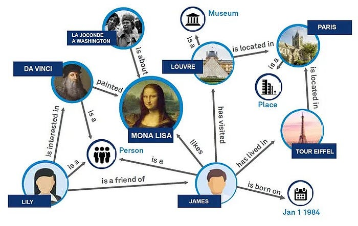
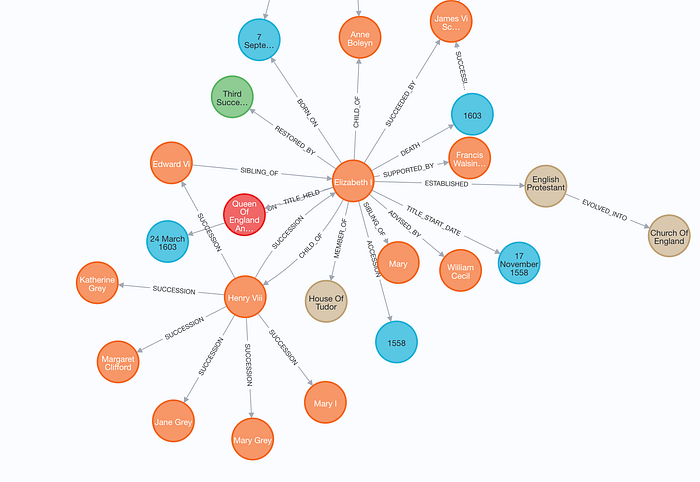
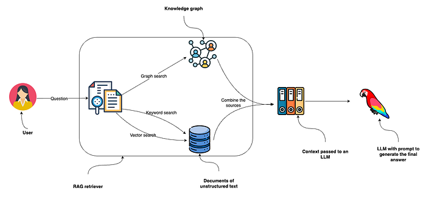
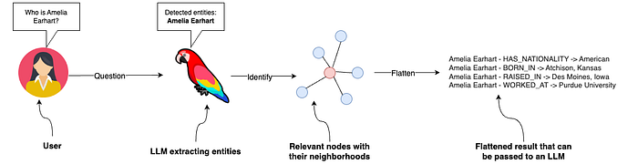
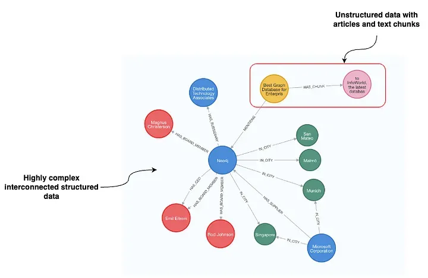

### A practical guide to constructing and retrieving information from knowledge graphs in RAG applications with Neo4j and LangChain

_Editor's Note: the following is a guest blog post from Tomaz Bratanic, who focuses on Graph ML and GenAI research at_ [_Neo4j_](https://neo4j.com/?utm_source=Google&utm_medium=PaidSearch&utm_campaign=Evergreenutm_content%3DAMS-Search-SEMBrand-Evergreen-None-SEM-SEM-NonABM&utm_term=neo4j&utm_adgroup=core-brand&gad_source=1&gclid=CjwKCAjw48-vBhBbEiwAzqrZVOnH2D4WOkRLH78FtQAFitObkbJNs34kTFw4bbBX0VzwqSalQUV2UhoCrFcQAvD_BwE) _._ _Neo4j is a graph database and analytics company which helps organizations find hidden relationships and patterns across billions of data connections deeply, easily, and quickly._

Graph retrieval augmented generation ( [Graph RAG](https://www.microsoft.com/en-us/research/blog/graphrag-unlocking-llm-discovery-on-narrative-private-data/?ref=blog.langchain.com)) is gaining momentum and emerging as a powerful addition to traditional vector search retrieval methods. This approach leverages the structured nature of graph databases, which organize data as nodes and relationships, to enhance the depth and contextuality of retrieved information.

Example knowledge graph.

Graphs are great at representing and storing heterogeneous and interconnected information in a structured manner, effortlessly capturing complex relationships and attributes across diverse data types. In contrast, vector databases often struggle with such structured information, as their strength lies in handling unstructured data through high-dimensional vectors. In your RAG application, you can combine structured graph data with vector search through unstructured text to achieve the best of both worlds, which is exactly what we will do in this blog post.

**Knowledge graphs are great, but how do you create one?** Constructing a knowledge graph is typically the most challenging step in leveraging the power of graph-based data representation. It involves gathering and structuring the data, which requires a deep understanding of both the domain and graph modeling. To simplify this process, we have been experimenting with LLMs. LLMs, with their profound understanding of language and context, can automate significant parts of the knowledge graph creation process. By analyzing text data, these models can identify entities, understand the relationships between them, and suggest how they might be best represented in a graph structure. As a result of these experiments, we have added the first version of the graph construction module to LangChain, which we will demonstrate in this blog post.

The code is available on [GitHub](https://github.com/tomasonjo/blogs/blob/master/llm/enhancing_rag_with_graph.ipynb?ref=blog.langchain.com).

### Neo4j Environment Setup

You need to set up a Neo4j instance follow along with the examples in this blog post. The easiest way is to start a free instance on [Neo4j Aura](https://neo4j.com/cloud/platform/aura-graph-database/?ref=blog.langchain.com), which offers cloud instances of Neo4j database. Alternatively, you can also set up a local instance of the Neo4j database by downloading the [Neo4j Desktop](https://neo4j.com/download/?ref=blog.langchain.com) application and creating a local database instance.

```python
os.environ["OPENAI_API_KEY"] = "sk-"
os.environ["NEO4J_URI"] = "bolt://localhost:7687"
os.environ["NEO4J_USERNAME"] = "neo4j"
os.environ["NEO4J_PASSWORD"] = "password"

graph = Neo4jGraph()
```

Additionally, you must provide an [OpenAI key](https://openai.com/?ref=blog.langchain.com), as we will use their models in this blog post.

## Data ingestion

For this demonstration, we will use [Elizabeth I’s](https://en.wikipedia.org/wiki/Elizabeth_I?ref=blog.langchain.com) Wikipedia page. We can utilize [LangChain loaders](https://python.langchain.com/docs/modules/data_connection/document_loaders/?ref=blog.langchain.com) to fetch and split the documents from Wikipedia seamlessly.

```python
# Read the wikipedia article
raw_documents = WikipediaLoader(query="Elizabeth I").load()

# Define chunking strategy
text_splitter = TokenTextSplitter(chunk_size=512, chunk_overlap=24)
documents = text_splitter.split_documents(raw_documents[:3])
```

Now it’s time to construct a graph based on the retrieved documents. For this purpose, we have implemented an `LLMGraphTransformer`module that significantly simplifies constructing and storing a knowledge graph in a graph database.

```python
llm=ChatOpenAI(temperature=0, model_name="gpt-4-0125-preview")
llm_transformer = LLMGraphTransformer(llm=llm)

# Extract graph data
graph_documents = llm_transformer.convert_to_graph_documents(documents)

# Store to neo4j
graph.add_graph_documents(
  graph_documents,
  baseEntityLabel=True,
  include_source=True
)
```

You can define which LLM you want the knowledge graph generation chain to use. At the moment, we support only function calling models from OpenAI and Mistral. However, we plan to expand the LLM selection in the future. In this example, we are using the latest GPT-4. Note that the quality of generated graph significantly depends on the model you are using. In theory, you always want to use the most capable one. The LLM graph transformers returns graph documents, which can be imported to Neo4j via the `add_graph_documents` method. The `baseEntityLabel` parameter assigns an additional `__Entity__` label to each node, enhancing indexing and query performance. The `include_source` parameter links nodes to their originating documents, facilitating data traceability and context understanding.

You can inspect the generated graph in Neo4j Browser.

Part of the generated graph.

Note that this image represents only a part of the generated graph for clarity.

## Hybrid Retrieval for RAG

After the graph generation, we will use a hybrid retrieval approach that combines vector and keyword indexes with graph retrieval for RAG applications.

Combining hybrid (vector + keyword) and graph retrieval methods. Image by author.

The diagram illustrates a retrieval process beginning with a user posing a question, which is then directed to an RAG retriever. This retriever employs keyword and vector searches to search through unstructured text data and combines it with the information it collects from the knowledge graph. Since Neo4j features both keyword and vector indexes, you can implement all three retrieval options with a single database system. The collected data from these sources is fed into an LLM to generate and deliver the final answer.

### Unstructured data retriever

You can use the `Neo4jVector.from_existing_graph` method to add both keyword and vector retrieval to documents. This method configures keyword and vector search indexes for a hybrid search approach, targeting nodes labeled `Document`. Additionally, it calculates text embedding values if they are missing.

```python
vector_index = Neo4jVector.from_existing_graph(
    OpenAIEmbeddings(),
    search_type="hybrid",
    node_label="Document",
    text_node_properties=["text"],
    embedding_node_property="embedding"
)
```

The vector index can then be called with the `similarity_search` method.

### Graph retriever

On the other hand, configuring a graph retrieval is more involved but offers more freedom. In this example, we will use a full-text index to identify relevant nodes and then return their direct neighborhood.

Graph retriever. Image by author.

The graph retriever starts by identifying relevant entities in the input. For simplicity, we instruct the LLM to identify people, organizations, and locations. To achieve this, we will use LCEL with the newly added `with_structured_output` method to achieve this.

```python
# Extract entities from text
class Entities(BaseModel):
    """Identifying information about entities."""

    names: List[str] = Field(
        ...,
        description="All the person, organization, or business entities
        that " "appear in the text",
    )

prompt = ChatPromptTemplate.from_messages(
    [\
        (\
            "system",\
            "You are extracting organization and person entities from the\
            text.",\
        ),\
        (\
            "human",\
            "Use the given format to extract information from the\
             following"\
            "input: {question}",\
        ),\
    ]
)

entity_chain = prompt | llm.with_structured_output(Entities)
```

Let’s test it out:

```python
entity_chain.invoke({"question": "Where was Amelia Earhart born?"}).names
# ['Amelia Earhart']
```

Great, now that we can detect entities in the question, let’s use a full-text index to map them to the knowledge graph. First, we need to define a full-text index and a function that will generate full-text queries that allow a bit of misspelling, which we won’t go into much detail here.

```python
graph.query(
    "CREATE FULLTEXT INDEX entity IF NOT EXISTS FOR (e:__Entity__) ON EACH [e.id]")

def generate_full_text_query(input: str) -> str:
    """
    Generate a full-text search query for a given input string.

    This function constructs a query string suitable for a full-text
    search. It processes the input string by splitting it into words and
    appending a similarity threshold (~2 changed characters) to each
    word, then combines them using the AND operator. Useful for mapping
    entities from user questions to database values, and allows for some
    misspelings.
    """
    full_text_query = ""
    words = [el for el in remove_lucene_chars(input).split() if el]
    for word in words[:-1]:
        full_text_query += f" {word}~2 AND"
    full_text_query += f" {words[-1]}~2"
    return full_text_query.strip()
```

Let’s put it all together now.

```python
# Fulltext index query
def structured_retriever(question: str) -> str:
    """
    Collects the neighborhood of entities mentioned
    in the question
    """
    result = ""
    entities = entity_chain.invoke({"question": question})
    for entity in entities.names:
        response = graph.query(
            """CALL db.index.fulltext.queryNodes('entity', $query,
            {limit:2})
            YIELD node,score
            CALL {
              MATCH (node)-[r:!MENTIONS]->(neighbor)
              RETURN node.id + ' - ' + type(r) + ' -> ' + neighbor.id AS
              output
              UNION
              MATCH (node)<-[r:!MENTIONS]-(neighbor)
              RETURN neighbor.id + ' - ' + type(r) + ' -> ' +  node.id AS
              output
            }
            RETURN output LIMIT 50
            """,
            {"query": generate_full_text_query(entity)},
        )
        result += "\n".join([el['output'] for el in response])
    return result
```

The `structured_retriever` function starts by detecting entities in the user question. Next, it iterates over the detected entities and uses a Cypher template to retrieve the neighborhood of relevant nodes. Let’s test it out!

```python
print(structured_retriever("Who is Elizabeth I?"))
# Elizabeth I - BORN_ON -> 7 September 1533
# Elizabeth I - DIED_ON -> 24 March 1603
# Elizabeth I - TITLE_HELD_FROM -> Queen Of England And Ireland
# Elizabeth I - TITLE_HELD_UNTIL -> 17 November 1558
# Elizabeth I - MEMBER_OF -> House Of Tudor
# Elizabeth I - CHILD_OF -> Henry Viii
# and more...
```

### Final retriever

As we mentioned at the start, we’ll combine the unstructured and graph retriever to create the final context that will be passed to an LLM.

```python
def retriever(question: str):
    print(f"Search query: {question}")
    structured_data = structured_retriever(question)
    unstructured_data = [el.page_content for el in vector_index.similarity_search(question)]
    final_data = f"""Structured data:
{structured_data}
Unstructured data:
{"#Document ". join(unstructured_data)}
    """
    return final_data
```

As we are dealing with Python, we can simply concatenate the outputs using the f-string.

## Defining the RAG chain

We have successfully implemented the retrieval component of the RAG. Next, we introduce a prompt that leverages the context provided by the integrated hybrid retriever to produce the response, completing the implementation of the RAG chain.

```python
template = """Answer the question based only on the following context:
{context}

Question: {question}
"""
prompt = ChatPromptTemplate.from_template(template)

chain = (
    RunnableParallel(
        {
            "context": _search_query | retriever,
            "question": RunnablePassthrough(),
        }
    )
    | prompt
    | llm
    | StrOutputParser()
)
```

Finally, we can go ahead and test our hybrid RAG implementation.

```python
chain.invoke({"question": "Which house did Elizabeth I belong to?"})
# Search query: Which house did Elizabeth I belong to?
# 'Elizabeth I belonged to the House of Tudor.'
```

I’ve also incorporated a query rewriting feature, enabling the RAG chain to adapt to conversational settings that allow follow-up questions. Given that we use vector and keyword search methods, we must rewrite follow-up questions to optimize our search process.

```python
chain.invoke(
    {
        "question": "When was she born?",
        "chat_history": [("Which house did Elizabeth I belong to?",\
        "House Of Tudor")],
    }
)
# Search query: When was Elizabeth I born?
# 'Elizabeth I was born on 7 September 1533.'
```

You can observe that `When was she born?` was first rewritten to `When was Elizabeth I born?` . The rewritten query was then used to retrieve relevant context and answer the question.

## Summary

With the introduction of the `LLMGraphTransformer`, the process of generating knowledge graphs should now be smoother and more accessible, making it easier for anyone looking to enhance their RAG-based applications with the depth and context that knowledge graphs provide. This is just a start as we have a lot of improvements planned.

If you have insights, suggestions, or questions about our generating graphs with LLMs, please don’t hesitate to reach out.

The code is available on [GitHub](https://github.com/tomasonjo/blogs/blob/master/llm/enhancing_rag_with_graph.ipynb?ref=blog.langchain.com).

### Tags

[Partner Post](https://blog.langchain.com/tag/partner-post/)


[](https://blog.langchain.com/graph-based-metadata-filtering-for-improving-vector-search-in-rag-applications/)

[**Graph-based metadata filtering for improving vector search in RAG applications**](https://blog.langchain.com/graph-based-metadata-filtering-for-improving-vector-search-in-rag-applications/)

[Partner Post](https://blog.langchain.com/tag/partner-post/) 11 min read