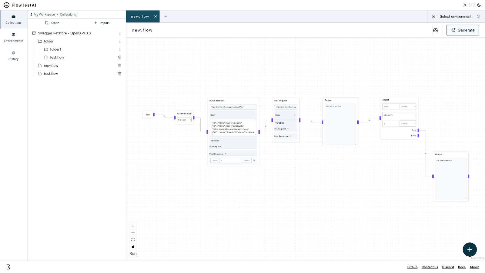
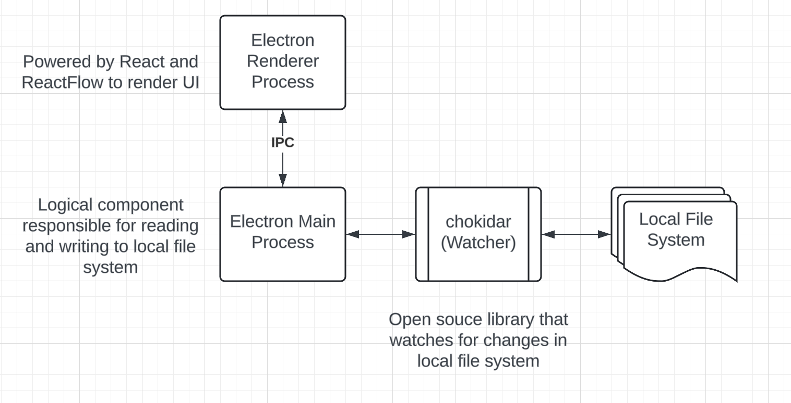
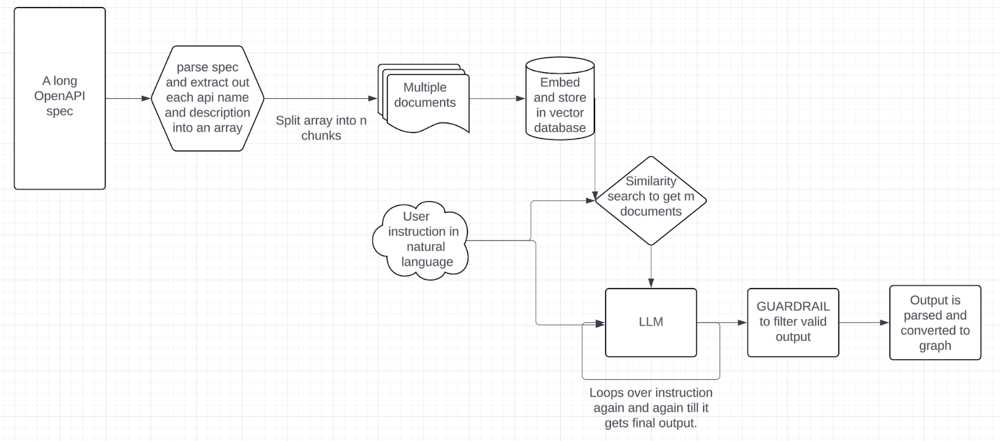
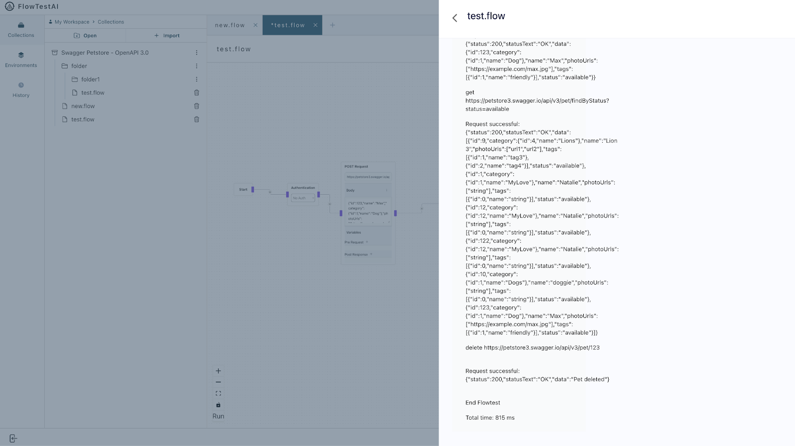
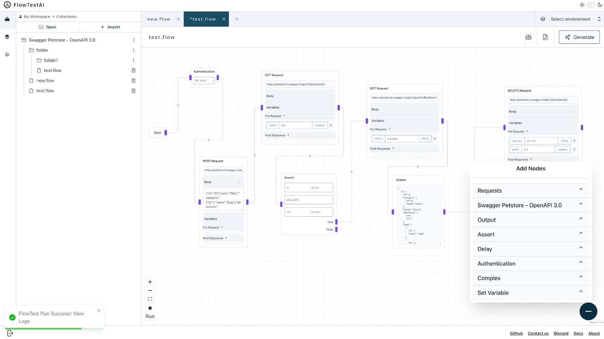

**Editor's note: we're excited to highlight this blog from FlowTestAI. FlowTestAI is an exciting startup building on top of LangChain. Specifically, they try to enable easy accessing of APIs through LLMs. Interacting with APIs via LLMs is a huge use case of LangChain, and so we're excited to showcase what this looks like in a production application.**

Independent APIs when connected together are very powerful. Virtually every online interaction, whether it involves external customers, internal use, or routine end-to-end testing, essentially constitutes a network of interconnected APIs as a _flow_. This interconnectedness forms the backbone of digital product experiences.

Parallel to the capability of APIs, Large Language Models (LLMs) exhibit remarkable reasoning prowess, closely mirroring human iterative thought processes in problem-solving. This ability to iteratively refine understanding and responses, positions LLMs as a formidable tool in computational reasoning, particularly when engaged in repetitive iterations as a _flow_.

# Introducing FlowTestAI:

At the heart of our innovation lies the mission to synergize these two powerful domains. FlowTestAI stands as the world’s first GenAI powered OpenSource Integrated Development Environment (IDE) specifically designed to craft, visualize, and manage API first workflows. Characterized by its speed, lightweight architecture, and local operation, FlowTestAI safeguards privacy while facilitating the seamless integration of API first workflows.

## Addressing the Testing Conundrum:

Testing remains a crucial yet fragmented aspect of product development. The absence of comprehensive and robust end-to-end tests significantly jeopardizes product integrity, slowing down development velocity.

Fundamentally, end to end tests are nothing but API first workflows. The ideal framework should allow for rapid and straightforward generation of these workflows, coupled with their seamless management without sacrificing efficiency. Yet, current practices are marred by excessive boilerplate code, cumbersome management layers, and a detachment from actual development practices. This results in slow and complicated end to end tests that really hammer development velocity.

Efficient testing also necessitates secure access to and management of sensitive information, such as access IDs and keys. Unfortunately, the current landscape lacks a tool that ensures safety in this domain. Utilizing conventional platforms like Postman for entering credentials exposes them to potential risks. Compounding this issue is the absence of a dedicated environment for developers to safely test in-development or private APIs. Like with credentials, introducing these APIs into common online tools inadvertently risks exposure. This gap underscores the need for a solution that provides a secure, local sandbox for testing, devoid of the vulnerabilities associated with current methodologies.

## FlowTestAI’s Approach:

Leveraging the reasoning capabilities of LLMs, the organizational utility of git (or any version control system) and the structural advantages of graph data representation, FlowTestAI aims to revolutionize generation and management of API first workflow.

1. **Generation**: Describe your workflows in natural language, and our platform will transform them into a runnable API first workflow within seconds. Alternatively, employ drag-and-drop functionality with nodes from your OpenAPI specification to construct your workflow.
2. **Management**: Emulating the functionality of conventional IDEs, FlowTestAI stores and manages everything on your local file system. Organizations can further use them to collaborate using any git-compatible tool or version control system.
3. **Privacy**: With everything localized to your file system, FlowTestAI enables the use of private or in-development API endpoints without risk. The platform securely stores credentials locally, ensuring they are protected from external threats.
4. **Visualization**: By offering a no code - graphical representation of API first workflows, FlowTestAI eliminates the disconnect between testing and development teams, fostering a unified point of view or a single source of truth for the whole organization that helps accelerate development velocity.
5. **Speed:** FlowTestAI outputs API first workflows devoid of any boilerplate or un-necessary code. This results in faster execution time leading to high development velocity.

## Future Scope

(Re)Imagining end to end tests as API first workflows is just touching the surface. The tool is designed to be as generic as possible. One can create any API first workflow and can automate that to run periodically. For instance, imagine a workflow that checks in JIRA for top 10 customer support tickets, sends it to ChatGPT to summarize and post it daily in a slack channel for engineering teams to prioritize.

Because of the free and open source nature of this project, anybody can create and submit a custom node with custom logic that you feel is helpful and share it with the community. You can also create custom flows and submit it for others to use. For instance a custom flow can take an LLM output as input, send it to a sentiment analysis tool’s API hosted on AWS or Azure, check if the output positive score is greater than let’s say 0.7 and then only forward that input to the rest of the graph or to the end user.

Imagine each workflow as a utility that can be used and nested inside other workflows.

# How FlowTestAI works

FlowTestAI is essentially comprised of two parts -

## Experience

For experience we offer an Integrated Development Experience (IDE) just like VS code, intellij etc.. as an electron app. Everything works locally with a two way communication just like a traditional IDE. Any CRUD operation that you perform inside our IDE is updated on local disk and similarly local disk changes are mirrored in our IDE. Here is how it looks -

Here is how it works :

## AI

There are three main stages in our pipeline :

### Pre-processing

This is where **LangChain** is a boon to us . Let’s first understand the problem. OpenAPI specs are huge, comprising 1000s of APIs (referred as functions also) and LLMs out there can only take a limited number of functions as reference input, for instance OpenAI GPT 3.5 turbo can only take 128 functions as input.

So first we parse out {API\_NAME, API\_DESCRIPTION} for each API defined in the spec and construct this one large document. Using LangChain’s out of the box text splitters we split this document into n sized chunks depending on the LLM capacity. If we take the above example of GPT 3.5 turbo, we divide it into 32 sized chunks i.e each chunk comprises 32 functions. Next we use LangChain’s wrapper over OPENAI embedding api to embed each chunk and store all these chunks in an in-memory vector database offered out of the box by LangChain.

By doing the above, we basically re-imagine the RAG problem, which is majorly used for text inputs, for structured functions.

### Processing

Next we take the user prompt and do a similarity search against LangChain’s powered in-memory vector database where we stored all our small chunks. We extract m documents such that n x m satisfies LLM’s input limit. So taking our previous example we would extract 4 documents such that 32 x 4 = 128.

Next we give these n x m functions and user instruction as input to the LLM. We do this process iteratively until we determine that there are no more further operations to be performed. Each iteration outputs a function call.

### Post-processing

Next we take the set of function calls output in the previous step and perform post processing. We have put proper GUARDRAILS to determine if the LLM hallucinated at any step of the process and if it does, we filter that part of the output to not mislead the user. Then we take each valid function call, parse it and convert it into our internal graph node assigning appropriate values to query parameters, request body etc. required by the API call. Finally we chain them to form a runnable workflow.

Some points to watch out for -

1. **Langchain** offers such a vast domain of things for LLM pipeline construction out of the box that it makes it easy to split, embed, store and search data in an in memory vector database all just in a few lines of code. 🖖
2. We pass very limited but sufficient information to the LLM to avoid leaking too much information to the LLM especially in cases where users who don’t want to expose too much of their API spec.
3. Once we get the output from LLM, it is parsed, chained and rendered as a runnable graph to the user where each node represents the API request with prefilled query or path parameters or request body and each edge represents the next operation. Users can now run it, modify it and save it.
4. LLMs do hallucinate sometimes, we have put proper guardrails to make sure that if LLM hallucinates we filter that part of the output.
5. We are working on integrating other LLMs like Gemini etc.
6. We will soon be launching AI powered summarization of generated logs when you run a workflow, so that it is easy to spot where your flow breaks.

# Demo

Step 1 :  Choose model as OPENAI and add your instruction

Step 2 :  Click Generate and a runnable graph will be output with API requests chained together and notice that each request is pre-filled with correct request parameters and request body

Step 3 :  Click Run and see each request logs with total time of the flow at the end.

Step 4 :  Add extra logical nodes and make the graph even more rich

# Conclusion:

FlowTestAI visualizes your end to end tests as API first workflows that are quick to generate, seamless to manage and run miles faster than traditional tests all leading to high development velocity.

We are just getting started, and our aim is to foster a culture where, just as other IDEs are available for developers to write code, a similar integrated experience should also be available for easily generating, managing, and running API-first workflows at **NO COST**.

For more information on how to utilize this tool in your daily activities, integrate it into your current stack, or for any other inquiries, feel free to contact us through our [social media platforms](https://flowtestai.gitbook.io/flowtestai?ref=blog.langchain.com) or directly email me at [jsajal1993@gmail.com](mailto:jsajal1993@gmail.com).