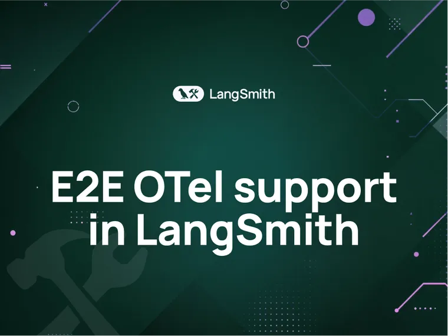

Today, we’re thrilled to announce that enterprises can purchase [LangSmith in the Azure Marketplace](https://azuremarketplace.microsoft.com/en-us/marketplace/apps/langchain.langsmith?tab=Overview&ref=blog.langchain.com) as an Azure Kubernetes Application. [LangSmith](https://www.langchain.com/langsmith?ref=blog.langchain.com) is a unified DevOps platform for developing, collaborating, testing, and monitoring LLM applications, whether you’re building with LangChain or not. LangSmith has quickly become the platform of choice to help enterprises get their LLM-apps from prototype to production, and LangSmith customers such as Moody’s, Elastic, Rakuten, and BCG rely on the platform to build high quality genAI applications that scale.

“As a leader in innovation and technology, Moody’s prioritizes thorough testing and evaluation of our Generative AI-powered tools. In order to create applications that are reliable for the enterprise and our customers, LangSmith helps maintain engineering rigor throughout the development and testing phases, allowing us to stress test our LLM-powered applications well before we release them. This gives us confidence as we continue harnessing Generative AI in our mission to decode risk and unlock opportunity.” – Han-chung Lee, Director of Machine Learning at Moody’s.

We’re excited to lean into our collaboration with Microsoft by giving our joint customers an easier procurement option via Azure Marketplace, with a data security posture that satisfies even the most demanding infosec and compliance teams.

To learn more about LangSmith and the benefits that come with the Azure Marketplace, continue reading or [get in touch](https://www.langchain.com/contact-sales?ref=blog.langchain.com) today.

### Benefits of LangSmith

Through LangSmith’s debugging, testing, monitoring, and prompt management modules, enterprise customers benefit from:

- **Increased visibility of user interactions with their production LLM-applications**: LangSmith gives engineering teams trace-level detail on what their end users are asking their LLM-apps and how the app is responding in production. With easy to augment traces with end-user feedback, LangSmith provides the observability needed for remediation and continual improvement. LangSmith offers teams peace of mind on
  - performance and quality,
  - audibility of conversations, and
  - explainability when interactions fall short of expectations.
- **More complete testing coverage to improve application quality:** LLM-apps are powerful, but have peculiar characteristics. The non-determinism, coupled with unpredictable, natural language inputs, make for countless ways the system can fail. LangSmith re-imagines traditional software engineering testing to be better suited for working with LLMs. With LangSmith’s Testing & Evaluation module, developers can build confidence in how their application will perform _before_ shipping it to end users. LangSmith helps developers spot regressions and identify if changes to the application logic are moving key metrics in the right direction.
- **Improved application development velocity and collaboration with subject matter experts:** LangSmith helps developers debug their application traces to pinpoint where an agent or chain is going off the rails. LangSmith also improves developer collaboration with subject matter experts (e.g. product managers or quality assurance teams) on prompt construction and labeling feedback that often need more end user or industry knowledge.
- **Clearer ROI analysis to make better business tradeoffs.** When building LLM applications, you almost always are trading off amongst quality, cost, and latency. LangSmith helps teams run experiments to examine metrics related to these three, so that developers can back up their choices with data, helping them prioritize what matters and keep spend in check.

### Benefits of procuring LangSmith through the Azure Marketplace

When you purchase LangSmith through the Azure Marketplace, you’ll keep data fully contained in your Azure VPC, get ease of deployment, and experience a smoother procurement process.

- **LangSmith will run in your Azure VPC so no data is shared with a 3rd-party.** As a monitoring platform, LangSmith logs a tremendous amount of useful information about what end users are asking of your LLM-applications and how your app responds. When you purchase LangSmith as an Azure Kubernetes Application, we’ll deploy the entire platform in your environment, so no data leaves your network and you have full control over data management. Additionally, infosec teams will appreciate that the Microsoft team has already vetted and certified the LangSmith offering and will continually run security vulnerability scans on our images to keep customers’ data and environments safe.
- **Deploying LangSmith to Azure Kubernetes Service (AKS) has never been easier.** We will provide you with a trial license and then production license, upon transaction, to deploy LangSmith and its dependencies to your AKS or OpenShift cluster. With a deep integration with Azure Resource Manager (ARM) APIs, LangSmith via the Azure Marketplace will be simple to set up and integrate. You’ll receive a minor release every six weeks and get white-glove support from our infra team to help with deployment, updates, and on-going scalability maintenance.
- **You can retire credits from your Microsoft Azure Consumption Commitment (MACC).** Many Azure customers rely on the full Microsoft suite of products to solve their infrastructure and development needs. LangSmith has met the requirements for IP co-sell, meaning you not only can use your Azure credits to purchase LangSmith, but also every dollar you spend on LangSmith will net against your MACC, making the process of budget approval easier on teams.

### Furthering LangChain’s collaboration with Microsoft

We’re continuing to invest in LangChain’s technology collaboration with Azure AI services with deep integrations with Azure OpenAI, Azure AI Search, Microsoft Fabric, and more. Extending our product collaboration with a joint go-to-market effort for LangChain’s commercial offering, LangSmith, was a natural fit that benefits both our customers.

If you’re looking for a platform that supports all phases of the LLM application lifecycle, consider LangSmith deployed in your Azure environment. Reach out directly in the [Azure Marketplace](https://azuremarketplace.microsoft.com/en-us/marketplace/apps/langchain.langsmith?tab=Overview&ref=blog.langchain.com) or [contact sales](https://www.langchain.com/contact-sales?ref=blog.langchain.com) to start a conversation with one of our experts. We’re excited to work with you.

* * *

_Additional resources:_

- [_Deployment documentation_](https://docs.smith.langchain.com/self_hosting/kubernetes?ref=blog.langchain.com)
- [_LangSmith overview_](https://www.langchain.com/langsmith?ref=blog.langchain.com)
- [_LangSmith demo_](https://www.youtube.com/watch?v=3wAON0Lqviw&list=PLfaIDFEXuae2CjNiTeqXG5r8n9rld9qQu&index=2&ref=blog.langchain.com)

### Tags

[By LangChain](https://blog.langchain.com/tag/by-langchain/)

[**Evaluating Deep Agents: Our Learnings**](https://blog.langchain.com/evaluating-deep-agents-our-learnings/)

[By LangChain](https://blog.langchain.com/tag/by-langchain/) 7 min read

[**Introducing End-to-End OpenTelemetry Support in LangSmith**](https://blog.langchain.com/end-to-end-opentelemetry-langsmith/)

[By LangChain](https://blog.langchain.com/tag/by-langchain/) 3 min read

[**LangChain State of AI 2024 Report**](https://blog.langchain.com/langchain-state-of-ai-2024/)

[By LangChain](https://blog.langchain.com/tag/by-langchain/) 6 min read

[**Introducing OpenTelemetry support for LangSmith**](https://blog.langchain.com/opentelemetry-langsmith/)

[By LangChain](https://blog.langchain.com/tag/by-langchain/) 4 min read

[**Easier evaluations with LangSmith SDK v0.2**](https://blog.langchain.com/easier-evaluations-with-langsmith-sdk-v0-2/)

[By LangChain](https://blog.langchain.com/tag/by-langchain/) 4 min read

[**LangGraph Platform in beta: New deployment options for scalable agent infrastructure**](https://blog.langchain.com/langgraph-platform-announce/)

[By LangChain](https://blog.langchain.com/tag/by-langchain/) 4 min read