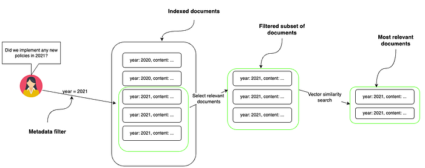
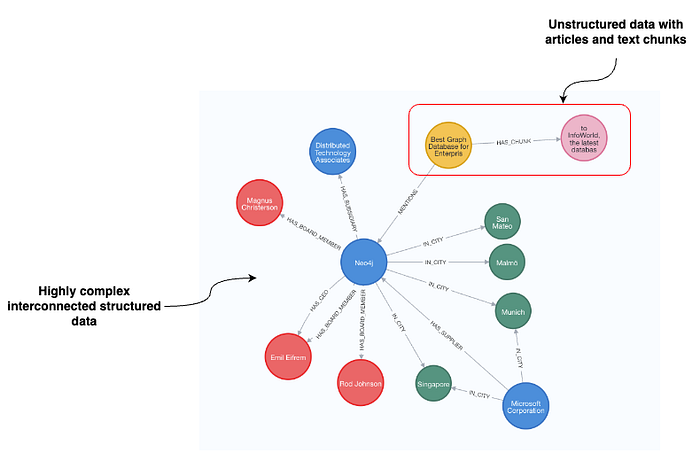
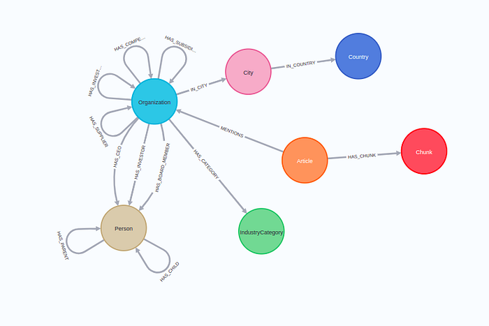
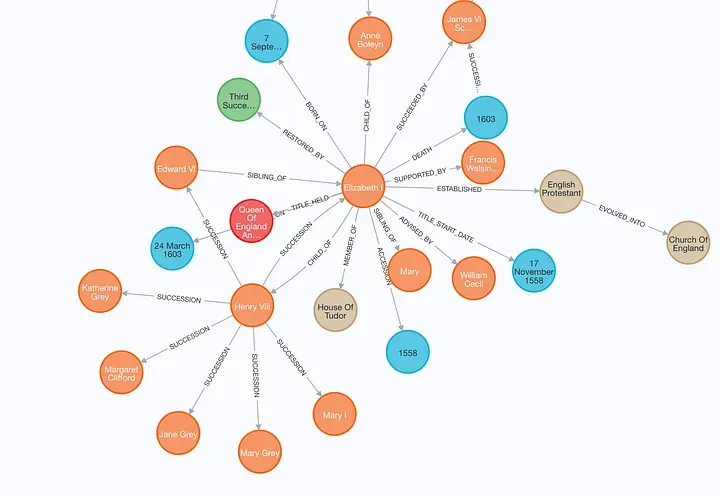

### Optimizing vector retrieval with advanced graph-based metadata techniques using LangChain and Neo4j

_Editor's Note: the following is a guest blog post from Tomaz Bratanic, who focuses on Graph ML and GenAI research at_ [_Neo4j_](https://neo4j.com/?utm_source=Google&utm_medium=PaidSearch&utm_campaign=Evergreenutm_content%3DAMS-Search-SEMBrand-Evergreen-None-SEM-SEM-NonABM&utm_term=neo4j&utm_adgroup=core-brand&gad_source=1&gclid=CjwKCAjw48-vBhBbEiwAzqrZVOnH2D4WOkRLH78FtQAFitObkbJNs34kTFw4bbBX0VzwqSalQUV2UhoCrFcQAvD_BwE) _._ _Neo4j is a graph database and analytics company which helps organizations find hidden relationships and patterns across billions of data connections deeply, easily, and quickly._

Text embeddings and vector similarity search help us find documents by understanding their meanings and how similar they are to each other. However, text embeddings aren’t as effective when sorting information based on specific criteria like dates or categories; for example, if you need to find all documents created in a particular year or documents tagged under a specific category like “science fiction.” This is where metadata filtering or filtered vector search comes into play, as it can effectively handle those structured filters, allowing users to narrow their search results according to specific attributes.

Metadata filtering using the pre-filtering approach, where you first narrow down the set of relevant documents and then apply vector similarity search on the narrowed set. Image by author.

In the image provided, the process starts with a user asking whether any new policies were implemented in 2021. A metadata filter is then used to sort through a larger pool of indexed documents by the specified year, which in this case is 2021. This results in a filtered subset of documents from that year only. To further hone in on the most relevant documents, a vector similarity search is performed within this subset. This method allows the system to find documents closely related to the topic of interest from within the contextually relevant pool of documents from the year 2021. This two-step process, metadata filtering followed by vector similarity search, increases the accuracy and relevance of the search results.

Recently, we introduced [LangChain support for metadata filtering](https://python.langchain.com/docs/integrations/vectorstores/neo4jvector/?ref=blog.langchain.com#metadata-filtering) in Neo4j based on node properties. However, graph databases like [Neo4j](https://neo4j.com/docs/getting-started/get-started-with-neo4j/?ref=blog.langchain.com) can store highly complex and connected structured data alongside unstructured data. Let’s take a look at the following example:

Graph representation of highly connected data alongside unstructured data. Image by author.

The unstructured part of the dataset represents articles and their text chunks, located at the top right of the visualization. Text chunk nodes contain text and their text embedding values and are linked to the article nodes, where more information about the article, such as the date, sentiment, author, etc., is present. However, the articles are then further linked to the organizations they mention. In this example, the article mentions Neo4j. Additionally, our dataset includes a wealth of structured information about Neo4j such as its investors, board members, suppliers, and beyond.

Thus, we can leverage this extensive structured information to execute sophisticated metadata filtering, allowing us to precisely refine our document selection using structured criteria such as:

- Did any of the companies where Rod Johnson is the board member implement a new work-from-home policy?
- Are there any negative news about companies that Neo4j invested in?
- Were there any notable news in connection with supply chain problems for companies that supply Hyundai?

With all these example questions, you can greatly narrow down the relevant document subset using a structured graph-based metadata filter.

In this blog post, I will show you how to implement graph-based metadata filtering using LangChain in combination with OpenAI function-calling agent. The code is available on [GitHub](https://github.com/tomasonjo/blogs/blob/master/llm/graph_based_prefiltering.ipynb?ref=blog.langchain.com).

### Agenda

We will use the so-called _companies_ graph dataset, available on a public demo server hosted by Neo4j. You can access it by using the following credentials.

```python
Neo4j Browser URI: https://demo.neo4jlabs.com:7473/browser/
username: companies
password: companies
database: companies
```

The complete schema of the dataset is the following:

Graph schema. Image by author.

The graph schema revolves around **Organization** nodes. There is vast information available regarding their suppliers, competitors, location, board members, and more. As mentioned before, there also articles mentioning particular organizations with their corresponding text chunks.

We will implement an OpenAI agent with a single tool, which can dynamically generate Cypher statements based on user input and retrieve relevant text chunks from the graph database. In this example, the tool will have four optional input parameters:

- topic: Any specific information or topic besides organization, country, and sentiment that the user is interested in.
- organization: Organization that the user wants to find information about
- country: Country of organizations that the user is interested in. Use full names like United States of America and France.
- sentiment: Sentiment of articles

Based on the four input parameters, we will dynamically, but deterministically, construct a corresponding Cypher statement to retrieve relevant information from the graph and use it as context to generate the final answer using an LLM.

You will require an [OpenAI API key](https://openai.com/blog/openai-api?ref=blog.langchain.com) to follow along with the code.

### Function Implementation

We will begin by defining credentials and relevant connections to Neo4j.

```python
import os

os.environ["OPENAI_API_KEY"] = "sk-"
os.environ["NEO4J_URI"] = "neo4j+s://demo.neo4jlabs.com"
os.environ["NEO4J_USERNAME"] = "companies"
os.environ["NEO4J_PASSWORD"] = "companies"
os.environ["NEO4J_DATABASE"] = "companies"

embeddings = OpenAIEmbeddings()
graph = Neo4jGraph()
vector_index = Neo4jVector.from_existing_index(
    embeddings,
    index_name="news"
)
```

As mentioned, we will be using the OpenAI embeddings, for which you require their API key. Next, we define the graph connection to Neo4j, allowing us to execute arbitrary Cypher statements. Lastly, we instantiate a Neo4jVector connection, which can retrieve information by querying the existing vector index. At the time of writing this article, you cannot use the vector index in combination with the pre-filtering approach; you can only apply post-filtering in combination with the vector index. However, debating post-filtering is beyond the scope of this article as we will focus on pre-filtering approaches combined with an exhaustive vector similarity search.

More or less, the whole blog post boils down to the following `get_organization_news` function, which dynamically generates a Cypher statement and retrieves relevant information. For clarity, I will split the code into multiple parts.

```python
def get_organization_news(
    topic: Optional[str] = None,
    organization: Optional[str] = None,
    country: Optional[str] = None,
    sentiment: Optional[str] = None,
) -> str:
    # If there is no prefiltering, we can use vector index
    if topic and not organization and not country and not sentiment:
        return vector_index.similarity_search(topic)
    # Uses parallel runtime where available
    base_query = (
        "CYPHER runtime = parallel parallelRuntimeSupport=all "
        "MATCH (c:Chunk)<-[:HAS_CHUNK]-(a:Article) WHERE "
    )
    where_queries = []
    params = {"k": 5} # Define the number of text chunks to retrieve
```

We begin by defining the input parameters. As you can observe, all of them are optional strings. The `topic` parameter is used to find specific information within documents. In practice, we embed the value of the `topic` parameter and use it as input for vector similarity search. The other three parameters will be used to demonstrate the pre-filtering approach.

If all of the pre-filtering parameters are empty, we can find the relevant documents using the existing vector index. Otherwise, we start preparing the base Cypher statement that will be used for the pre-filtered metadata approach. The clause `CYPHER runtime = parallel parallelRuntimeSupport=all` instructs the Neo4j database to use [parallel runtime](https://neo4j.com/developer-blog/speed-up-queries-neo4j-parallel-runtime/?ref=blog.langchain.com) where available. Next, we prepare a match statement that selects `Chunk` nodes and their corresponding `Article` nodes.

Now we are ready to dynamically append metadata filters to the Cypher statement. We will begin with `Organization`filter.

```python
if organization:
    # Map to database
    candidates = get_candidates(organization)
    if len(candidates) > 1:  # Ask for follow up if too many options
        return (
         "Ask a follow up question which of the available organizations "
         f"did the user mean. Available options: {candidates}"
        )
    where_queries.append(
        "EXISTS {(a)-[:MENTIONS]->(:Organization {name: $organization})}"
    )
    params["organization"] = candidates[0]
```

If the LLM identifies any particular organization the user is interested in, we must first map the value to the database with the `get_candidates`function. Under the hood, the `get_candidates`function uses [keyword search utilizing a full-text index](https://neo4j.com/docs/cypher-manual/current/indexes/semantic-indexes/full-text-indexes/?ref=blog.langchain.com) to find candidate nodes. If multiple candidates are found, we instruct the LLM to ask a follow-up question to the user to clarify which organization they meant exactly. Otherwise we append an [existential subquery](https://neo4j.com/developer/cypher/subqueries/?ref=blog.langchain.com#existential-subqueries) that filters the articles which mention the particular organization to the list of filters. To prevent any Cypher injection, we use query parameters instead of concatenating the query.

Next, we handle situations when a user wants to pre-filter text chunks based on the country of the mentioned organizations.

```python
if country:
    # No need to disambiguate
    where_queries.append(
        "EXISTS {(a)-[:MENTIONS]->(:Organization)-[:IN_CITY]->()-[:IN_COUNTRY]->(:Country {name: $country})}"
    )
    params["country"] = country
```

Since countries follow standard naming, we don’t have to map values to the database, as LLMs are familiar with most country naming standards.

Similarly, we also handle sentiment metadata filtering.

```python
if sentiment:
    if sentiment == "positive":
        where_queries.append("a.sentiment > $sentiment")
        params["sentiment"] = 0.5
    else:
        where_queries.append("a.sentiment < $sentiment")
        params["sentiment"] = -0.5
```

We will instruct the LLM to only use two values for a sentiment input value, either positive or negative. We then map these two values to appropriate filter values.

We handle the `topic`parameter slightly differently as it’s not used for prefiltering but rather vector similarity search.

```python
if topic:  # Do vector comparison
    vector_snippet = (
        " WITH c, a, vector.similarity.cosine(c.embedding,$embedding) AS score "
        "ORDER BY score DESC LIMIT toInteger($k) "
    )
    params["embedding"] = embeddings.embed_query(topic)
else:  # Just return the latest data
    vector_snippet = " WITH c, a ORDER BY a.date DESC LIMIT toInteger($k) "
```

If the LLM identifies that the user is interested in a particular topic in the news, we use the topic input’s text embedding to find the most relevant documents. On the other hand, if no specific topic is identified, we simply return the latest couple of articles and avoid vector similarity search altogether.

Now, we have to put the Cypher statement together and use it to retrieve information from the database.

```python
return_snippet = "RETURN '#title ' + a.title + '\n#date ' + toString(a.date) + '\n#text ' + c.text AS output"

complete_query = (
    base_query + " AND ".join(where_queries) + vector_snippet + return_snippet
)

# Retrieve information from the database
data = graph.query(complete_query, params)
print(f"Cypher: {complete_query}\n")
# Safely remove embedding before printing
params.pop('embedding', None)
print(f"Parameters: {params}")
return "###Article: ".join([el["output"] for el in data])
```

We construct the final `complete_query` by combining all the query snippets. After that, we use the dynamically generated Cypher statement to retrieve information from the database and return it to the LLM. Let’s examine the generated Cypher statement for an example input.

```python
get_organization_news(
  organization='neo4j',
  sentiment='positive',
  topic='remote work'
)

# Cypher: CYPHER runtime = parallel parallelRuntimeSupport=all
# MATCH (c:Chunk)<-[:HAS_CHUNK]-(a:Article) WHERE
# EXISTS {(a)-[:MENTIONS]->(:Organization {name: $organization})} AND
# a.sentiment > $sentiment
# WITH c, a, vector.similarity.cosine(c.embedding,$embedding) AS score
# ORDER BY score DESC LIMIT toInteger($k)
# RETURN '#title ' + a.title + '\ndate ' + toString(a.date) + '\ntext ' + c.text AS output

# Parameters: {'k': 5, 'organization': 'Neo4j', 'sentiment': 0.5}
```

The dynamic query generations works as expected, and is able to retrieve relevant information from the database.

### Defining OpenAI agent

Next, we need to wrap the function as an Agent tool. First, we will add input parameter descriptions.

```python
fewshot_examples = """{Input:What are the health benefits for Google employees in the news? Query: Health benefits}
{Input: What is the latest positive news about Google? Query: None}
{Input: Are there any news about VertexAI regarding Google? Query: VertexAI}
{Input: Are there any news about new products regarding Google? Query: new products}
"""

class NewsInput(BaseModel):
    topic: Optional[str] = Field(
        description="Any specific information or topic besides organization, country, and sentiment that the user is interested in. Here are some examples: "
        + fewshot_examples
    )
    organization: Optional[str] = Field(
        description="Organization that the user wants to find information about"
    )
    country: Optional[str] = Field(
        description="Country of organizations that the user is interested in. Use full names like United States of America and France."
    )
    sentiment: Optional[str] = Field(
        description="Sentiment of articles", enum=["positive", "negative"]
    )
```

The pre-filtering parameters were quite simple to describe, but I had some problems with getting the `topic` parameter to work as expected. In the end, I decided to add some examples so that the LLM would understand it better. Additionally, you can observe that we give the LLM information about the `country`naming format as well as provide enumeration for `sentiment` .

Now, we can define a custom tool by giving it a name and description containing instructions for an LLM on when to use it.

```python
class NewsTool(BaseTool):
    name = "NewsInformation"
    description = (
        "useful for when you need to find relevant information in the news"
    )
    args_schema: Type[BaseModel] = NewsInput

    def _run(
        self,
        topic: Optional[str] = None,
        organization: Optional[str] = None,
        country: Optional[str] = None,
        sentiment: Optional[str] = None,
        run_manager: Optional[CallbackManagerForToolRun] = None,
    ) -> str:
        """Use the tool."""
        return get_organization_news(topic, organization, country, sentiment)
```

One last thing is to define the Agent executor. I just reuse the [LCEL implementation](https://python.langchain.com/docs/expression_language/?ref=blog.langchain.com) of an OpenAI agent I implemented some time ago.

```python
llm = ChatOpenAI(temperature=0, model="gpt-4-turbo", streaming=True)
tools = [NewsTool()]

llm_with_tools = llm.bind(functions=[format_tool_to_openai_function(t) for t in tools])

prompt = ChatPromptTemplate.from_messages(
    [\
        (\
            "system",\
            "You are a helpful assistant that finds information about movies "\
            " and recommends them. If tools require follow up questions, "\
            "make sure to ask the user for clarification. Make sure to include any "\
            "available options that need to be clarified in the follow up questions "\
            "Do only the things the user specifically requested. ",\
        ),\
        MessagesPlaceholder(variable_name="chat_history"),\
        ("user", "{input}"),\
        MessagesPlaceholder(variable_name="agent_scratchpad"),\
    ]
)

agent = (
    {
        "input": lambda x: x["input"],
        "chat_history": lambda x: _format_chat_history(x["chat_history"])
        if x.get("chat_history")
        else [],
        "agent_scratchpad": lambda x: format_to_openai_function_messages(
            x["intermediate_steps"]
        ),
    }
    | prompt
    | llm_with_tools
    | OpenAIFunctionsAgentOutputParser()
)

agent_executor = AgentExecutor(agent=agent, tools=tools)
```

The agent has a single tool it can use to retrieve information about the news. We also added the `chat_history` message placeholder, making the agent conversational and allowing follow-up questions and replies.

### Implementation testing

Let’s run a couple of inputs and examine the generated Cypher statements and parameters.

```python
agent_executor.invoke(
  {"input": "What are some positive news regarding neo4j?"}
)

# Cypher: CYPHER runtime = parallel parallelRuntimeSupport=all
# MATCH (c:Chunk)<-[:HAS_CHUNK]-(a:Article) WHERE
# EXISTS {(a)-[:MENTIONS]->(:Organization {name: $organization})} AND
# a.sentiment > $sentiment WITH c, a
# ORDER BY a.date DESC LIMIT toInteger($k)
# RETURN '#title ' + a.title + 'date ' + toString(a.date) + 'text ' + c.text AS output
# Parameters: {'k': 5, 'organization': 'Neo4j', 'sentiment': 0.5}
```

The generated Cypher statement is valid. Since we didn’t specify any particular topic, it returns the last five text chunks from positive articles mentioning Neo4j. Let’s something a bit more complex:

```python
agent_executor.invoke(
   {"input": "What are some of the latest negative news about employee happiness for companies from France?"}
)

# Cypher: CYPHER runtime = parallel parallelRuntimeSupport=all
# MATCH (c:Chunk)<-[:HAS_CHUNK]-(a:Article) WHERE
# EXISTS {(a)-[:MENTIONS]->(:Organization)-[:IN_CITY]->()-[:IN_COUNTRY]->(:Country {name: $country})} AND
# a.sentiment < $sentiment
# WITH c, a, vector.similarity.cosine(c.embedding,$embedding) AS score
# ORDER BY score DESC LIMIT toInteger($k)
# RETURN '#title ' + a.title + 'date ' + toString(a.date) + 'text ' + c.text AS output
# Parameters: {'k': 5, 'country': 'France', 'sentiment': -0.5, 'topic': 'employee happiness'}
```

The LLM agent correctly generated prefiltering parameters but also identified a specific _employee happiness_ topic. This topic is used as input to vector similarity search, allowing us to refine the retrieval process even more.

### Summary

In this blog post, we’ve implemented example graph-based metadata filters, enhancing vector search accuracy. However, the dataset has extensive and interconnected options that allow for much more sophisticated pre-filtering queries. With a graph data representation, the possibilities for structured filters are virtually limitless when combined with the LLM function-calling feature to generate Cypher statements dynamically.

Additionally, your agent could have tools that retrieve unstructured text, as shown in this blog post, as well as other tools that can [retrieve structured information](https://towardsdatascience.com/enhancing-interaction-between-language-models-and-graph-databases-via-a-semantic-layer-0a78ad3eba49?ref=blog.langchain.com), making a knowledge graph an excellent solution for many RAG applications.

The code is available on [GitHub](https://github.com/tomasonjo/blogs/blob/master/llm/graph_based_prefiltering.ipynb?ref=blog.langchain.com).

### Tags

[Partner Post](https://blog.langchain.com/tag/partner-post/)


[](https://blog.langchain.com/enhancing-rag-based-applications-accuracy-by-constructing-and-leveraging-knowledge-graphs/)

[**Enhancing RAG-based application accuracy by constructing and leveraging knowledge graphs**](https://blog.langchain.com/enhancing-rag-based-applications-accuracy-by-constructing-and-leveraging-knowledge-graphs/)

[Partner Post](https://blog.langchain.com/tag/partner-post/) 7 min read