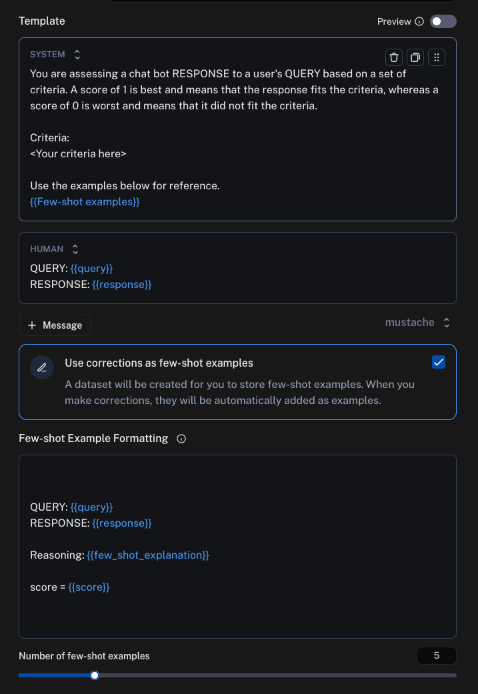

**Key Links:**

- [**Technical documentation**](https://docs.smith.langchain.com/how_to_guides/evaluation/create_few_shot_evaluators?ref=blog.langchain.com#create-your-evaluator)
- [**Video walkthrough**](https://www.youtube.com/watch?v=3gCTa0Li4ew&ref=blog.langchain.com)

[Evaluation](https://docs.smith.langchain.com/concepts/evaluation?ref=blog.langchain.com) is the process of continuously [improving your LLM application](https://www.youtube.com/watch?v=c0gcsprsFig&t=1140s&ref=blog.langchain.com). This requires a way to measure your application’s performance.

LLM applications often produce outputs in natural language, which are difficult to judge using hard-coded rules. For example, attributes like conciseness or correctness relative to a reference output are [difficult to express](https://arxiv.org/pdf/2404.12272v1?ref=blog.langchain.com) as typical unit tests.

Using an “ [LLM-as-a-Judge](https://docs.smith.langchain.com/concepts/evaluation?ref=blog.langchain.com#llm-as-judge)” is a popular way to grade natural language outputs from LLM applications. This involves passing the generated output (and other information) to a **separate** LLM and asking it to judge the output. Although this has proven useful in several contexts, it raises an interesting problem: you now have to do **another** round of prompt engineering to make sure the LLM-as-a-Judge is performing well.

LangSmith presents a novel solution to this rising problem. LangSmith evaluators now feature “self-improvement” whereby human corrections to LLM-as-a-Judge outputs are stored as few-shot examples, which are then fed back into the prompt in future iterations.

💡

The net impact is that it is easier to create LLM-as-a-Judge evaluators that accurately reflect your preferences with **no** prompt engineering, and have them adapt over time as you interact natively with LangSmith.

In this post we will talk about the rise of LLM-as-a-Judge evaluators, some motivating research that led us to this solution, and then deep dive into how exactly this is implemented. If you want to try it out, you can [sign up for LangSmith for free here](http://smith.langchain.com/?ref=blog.langchain.com).

## LLM-as-a-Judge

It’s often hard to evaluate LLM output programmatically. A big part of this is a lack of good metrics. Sure, if you are doing classification or named entity extraction or other “traditional” ML tasks then there’s standard ML metrics to use. But if you are doing more “generative” tasks (which most applications often are) then there aren’t many great options.

And evaluation is super important! You can’t just launch an application and hope for the best - you should be evaluating its performance on real data, making changes to your app, and then making sure the changes don’t cause regressions. We see builders spending significant time on both the **online** and **offline** evaluation stages - and built LangSmith accordingly.

LangSmith is not opinionated in what metrics you use (we see that nearly everyone defines their own custom metric). We've worked with fantastic teams like [Elastic](https://blog.langchain.com/langchain-partners-with-elastic-to-launch-the-elastic-ai-assistant/) and [Rakuten](https://blog.langchain.com/customers-rakuten/), seeing firsthand how they are doing evaluation – and one of the things we’ve noticed is a rise in the usage of “LLM-as-a-Judge” evaluators.

An “LLM-as-a-Judge” evaluator is simply an evaluator that uses an LLM to score the output. This is often useful when it’s tough to programmatically evaluate an application and the only other recourse would be human labels. Key use cases we’ve seen involve:

- Detecting RAG hallucinations (online evaluation)
- Detecting RAG correctness (offline evaluation)
- Detecting whether the LLM generated a toxic or inappropriate answer (offline and online evaluation)

Why does this work? If LLMs are generating the answers in the first place, then why does using an LLM to score the results actually work at all?

There are two factors at play. First, during evaluation the LLM may have access to information it didn’t have at the time of generation. For example, when judging RAG correctness, you give the evaluator LLM the ground truth answer and ask it to compare to that. Obviously, this is some information you didn’t have in the moment. Second, judging the correctness of an answer is easier for an LLM than generating a correct answer itself. This “simplifying” of the task makes LLM-as-a-Judge feasible.

While this process can work well, it has complications. You still have to do another round of prompt engineering for the evaluator prompt, which can time-consuming and hinder teams from setting up a proper evaluation system. With LangSmith, we've aimed to streamline this evaluation process.

## Motivating research

There were two pieces of motivating research that led us to implement a solution.

The first piece is nothing new: [language models are adept at few-shot](https://arxiv.org/abs/2005.14165?ref=blog.langchain.com) learning. If you give LLMs examples of things done correctly, they will imitate the correct behavior. This method is widely-adopted in our client LLM applications; it's particularly effective in cases where it's tough to explain in instructions how the LLM should behave, and where the output is expected to have a particular format. Evaluations fit both these criteria!

The other piece of research is new: a paper out of Berkeley by Shreya Shankar titled [Who Validates the Validators? Aligning LLM-Assisted Evaluation of LLM Outputs with Human Preferences](https://arxiv.org/pdf/2404.12272?ref=blog.langchain.com). This paper addresses the same problem, and, though it proposes a different solution than ours, it helped motivate our usage of feedback collection as a way to programmatically align LLM evaluations with human preferences.

So - how did we take these two ideas and build our “self-improving” evaluators?

## Our solution: Self-improving evaluation in LangSmith

Building on recent research and the widespread adoption of LLM-as-a-Judge evaluators, we've developed a novel "self-improving" system for LangSmith evaluators. This approach aims to streamline the process of aligning LLM evaluations with human preferences, eliminating the need for extensive prompt engineering. Here's how it works:

**To start, set up LLM as a judge (online or offline):** Users can easily [set up an LLM-as-a-Judge evaluator in LangSmith for either online or offline evaluation](https://docs.smith.langchain.com/how_to_guides/evaluation/create_few_shot_evaluators?ref=blog.langchain.com#create-your-evaluator). This initial setup requires minimal configuration, as the system is designed to improve over time. When setting it up you can specify how few-shot examples should be formatted into the prompt.

1. **Have it leave feedback**: The LLM evaluator provides feedback on the generated outputs, assessing factors such as correctness, relevance, or any other criteria specified as part of the judge in the prior step.
2. **Users can make corrections on that feedback natively in the app:** As users review the LLM's evaluations, they can directly modify or correct the feedback within the LangSmith interface. This step is crucial for capturing human preferences and judgments.
3. **These corrections will be stored as few-shot examples:** LangSmith automatically stores these human corrections as few-shot examples. This creates a growing dataset of human-aligned evaluations that reflect the specific preferences and standards of your team or application. You can also leave **explanations** for your corrections as part of this flow.
4. **The next time an evaluator runs, it will store those examples  (and optionally, the explanations) and use those to inform its generation:** In subsequent evaluation runs, the system incorporates these stored examples into the prompt for the LLM-as-a-Judge. By leveraging the few-shot learning capabilities of language models, the evaluator becomes increasingly aligned with human preferences over time.

For more of a technical walkthrough, see [this how-to guide](https://docs.smith.langchain.com/how_to_guides/evaluation/create_few_shot_evaluators?ref=blog.langchain.com#create-your-evaluator).

This self-improving cycle allows the LLM-as-a-Judge to adapt and refine its evaluations based on real-world feedback, eliminating manual prompt adjustments or time-consuming prompt engineering. Now, teams can focus on reviewing and correcting evaluations when necessary, knowing that their input directly improves the system's performance over time.

## Conclusion

LLM-as-a-Judge evaluators are powerful tools for assessing generative AI systems but have posed new challenges in prompt engineering and human preference alignment. LangSmith's self-improving evaluators provide an elegant solution to this problem, leveraging few-shot learning and user corrections to integrate human feedback for accurate, relevant evaluations without constant manual intervention.

As AI rapidly advances, self-improving evaluators will be crucial in bridging the gap between machine capabilities and human expectations. With LangSmith, we're empowering teams to build, assess, and refine their AI applications with greater confidence and efficiency. If you haven’t already - sign up for LangSmith for free [here](https://smith.langchain.com/?ref=blog.langchain.com).

### Tags

[By LangChain](https://blog.langchain.com/tag/by-langchain/)

[**Evaluating Deep Agents: Our Learnings**](https://blog.langchain.com/evaluating-deep-agents-our-learnings/)

[By LangChain](https://blog.langchain.com/tag/by-langchain/) 7 min read

[**Introducing End-to-End OpenTelemetry Support in LangSmith**](https://blog.langchain.com/end-to-end-opentelemetry-langsmith/)

[By LangChain](https://blog.langchain.com/tag/by-langchain/) 3 min read

[**LangChain State of AI 2024 Report**](https://blog.langchain.com/langchain-state-of-ai-2024/)

[By LangChain](https://blog.langchain.com/tag/by-langchain/) 6 min read

[**Introducing OpenTelemetry support for LangSmith**](https://blog.langchain.com/opentelemetry-langsmith/)

[By LangChain](https://blog.langchain.com/tag/by-langchain/) 4 min read

[**Easier evaluations with LangSmith SDK v0.2**](https://blog.langchain.com/easier-evaluations-with-langsmith-sdk-v0-2/)

[By LangChain](https://blog.langchain.com/tag/by-langchain/) 4 min read

[**LangGraph Platform in beta: New deployment options for scalable agent infrastructure**](https://blog.langchain.com/langgraph-platform-announce/)

[By LangChain](https://blog.langchain.com/tag/by-langchain/) 4 min read