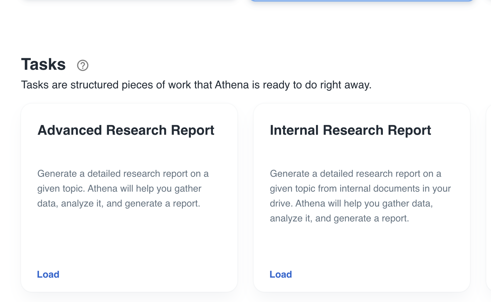
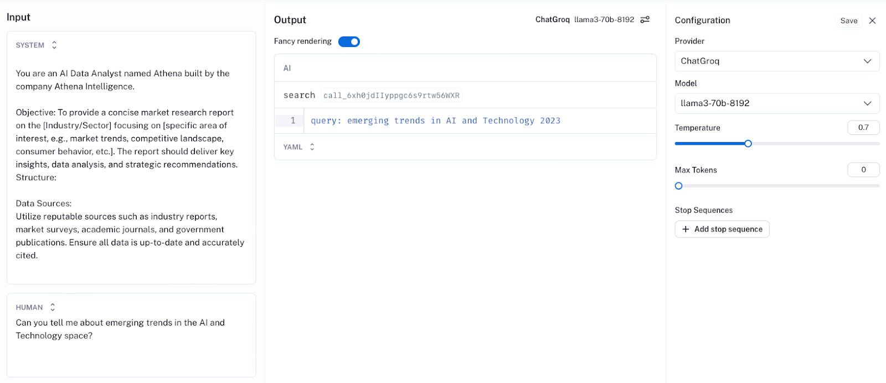

Athena Intelligence is an AI-powered employee that is transforming enterprise analytics by automating time-consuming data tasks  and democratizing data analysis for data scientists and business users alike. Their natural language interface, Olympus, aims to connect all data sources and applications so that users can query complex datasets easily, much like asking a question to a colleague.

One of Athena’s most powerful features is the ability to generate high-quality enterprise reports. In this case study, we will go over what this feature entails and how LangSmith helped during the development process.

## **Generating reports on complex topics**

Generating elaborate reports on complex topics requires pulling information from various sources, both web-based and internal. Having proper source citation and data-rich reports was especially important to Athena's customers.

_Example of types of research reports Athena can create_

Building a product to reliably generate these types of reports is hard work. It may be easy to build a prototype of a report writer and make something that passes as a Twitter demo — but as with many GenAI applications, it's significantly more difficult to build a reliable production system like Athena’s.

_Example of a research report generated with Athena’s Olympus platform_

To bridge the gap between prototype and production, Athena turned to LangChain, LangGraph, and LangSmith. They used LangChain to stay agnostic to the underlying LLM they used and manage integrations with thousands of tools. LangGraph helped them orchestrate complex custom agent architectures. They used LangSmith first to rapidly iterate during the development process, and then to observe their applications in production.

### **Maximum flexibility and interoperability with LangChain**

Athena Intelligence began its journey with [LangChain](https://python.langchain.com/v0.2/docs/introduction/?ref=blog.langchain.com), relying on its interoperability to swap in different models and build their AI apps. LangChain's architecture allowed Athena to be completely LLM-agnostic throughout their platform, reducing their dependency on any one model provider.

Athena also heavily used LangChain’s document, retriever, and tool abstractions. By using the standard LangChain document format, Athena could ensure that documents they passed around were always in the same format. LangChain’s retriever interface made this even easier, exposing a common way to access these documents. Athena’s research reports also heavily relied on tool usage - by using LangChain’s tool interface they could easily manage the collection of tools they had and pass them in the same manner to all LLMs.

### **Building production-ready agent architecture with LangGraph**

_As_ Athena developed more agentic capabilities, they turned to [LangGraph](https://langchain-ai.github.io/langgraph/?ref=blog.langchain.com). The agentic architecture they adopted was highly customized for their use case. LangGraph provided low-level controllability, allowing the team to build out complex agent architectures that orchestrated hundreds of LLM calls.

LangGraph provides Athena engineers with a stateful environment to build production-ready agentic architectures. It enables them to create specialized nodes with tuned prompts, and then quickly assemble them into complex multi-agent workflows. The composability of LangGraph, with its stateful arguments, allows the team to reuse components across different applications in their cognitive stack.

To manage computationally intensive workflows with hundreds of LLM calls introduced by their agentic system, Athena then also LangSmith to improve observability in their development lifecycle.

### **Rapid iteration in development using LangSmith**

[LangSmith](https://www.langchain.com/langsmith?ref=blog.langchain.com) played a crucial role in Athena's development process. To give an example of this, let’s consider the feature in the research reports that cited where the data came from.

Doing in-text source citation properly typically takes a lot of prompt engineering effort. LangSmith greatly accelerated this process. With tracing in LangSmith, the Athena team had logs of all runs that generated reports and could quickly identify runs where citations had failed.

Instead of pushing code to production and testing, Athena developers could just then just open up the LangSmith Playground from a specific run and adjust their prompts on the fly. This made it easier to isolate an LLM call to see cause-and-effect, in a way that was tailored for Athena’s complex and bespoke stack — saving countless development hours for the Athena team as they iterated quickly on prompts before shipping to production.

_Caption: Using LangSmith Playground view to optimize a market research report_

By tuning prompts to understand and correctly cite sources, Athena engineers could link similarly-named data points back to their applications accurately, enhancing their development quality and speed.

### **Monitoring in production with LangSmith**

Once their application was released to production, Athena monitored the performance of several key metrics with LangSmith traces. Prior to LangSmith, Athena engineers would read through server logs and building manual dashboards to identify issues in production — a time-consuming and cumbersome process.

LangSmith provided out-of-the-box metrics like error rate, latency, and time-to-first-token to help the Athena team keep an eye on the uptime of their LLM app. This was especially beneficial for tasks like document retrieval, where tracing let the team see exactly what documents were pulled up and how different steps in the retrieval process affected their response times.

As Ben Reilly, Founding Platform Engineer at Athena Intelligence, notes:

> “ _The speed at which we’re able to move would not be possible unless we had a full-stack observability platform like LangSmith. It has saved countless hours for our developers and made tasks that would have been almost unfeasible, feasible.”_

## **Conclusion**

Athena Intelligence has successfully leveraged LangChain, LangGraph, and LangSmith to create a powerful AI-powered analytics platform. By using these tools, Athena was able to rapidly iterate on their development, efficiently debug and optimize their system, and deliver high-quality, reliable reports to their enterprise customers.

### Tags

[Case Studies](https://blog.langchain.com/tag/case-studies/)

[**monday Service + LangSmith: Building a Code-First Evaluation Strategy from Day 1**](https://blog.langchain.com/customers-monday/)

[Case Studies](https://blog.langchain.com/tag/case-studies/) 8 min read

[**How Remote uses LangChain and LangGraph to onboard thousands of customers with AI**](https://blog.langchain.com/customers-remote/)

[Case Studies](https://blog.langchain.com/tag/case-studies/) 5 min read

[**Fastweb + Vodafone: Transforming Customer Experience with AI Agents using LangGraph and LangSmith**](https://blog.langchain.com/customers-vodafone-italy/)

[Case Studies](https://blog.langchain.com/tag/case-studies/) 7 min read

[**How Jimdo empower solopreneurs with AI-powered business assistance**](https://blog.langchain.com/customers-jimdo/)

[Case Studies](https://blog.langchain.com/tag/case-studies/) 4 min read

[**How ServiceNow uses LangSmith to get visibility into its customer success agents**](https://blog.langchain.com/customers-servicenow/)

[Case Studies](https://blog.langchain.com/tag/case-studies/) 4 min read

[**Monte Carlo: Building Data + AI Observability Agents with LangGraph and LangSmith**](https://blog.langchain.com/customers-monte-carlo/)

[Case Studies](https://blog.langchain.com/tag/case-studies/) 4 min read