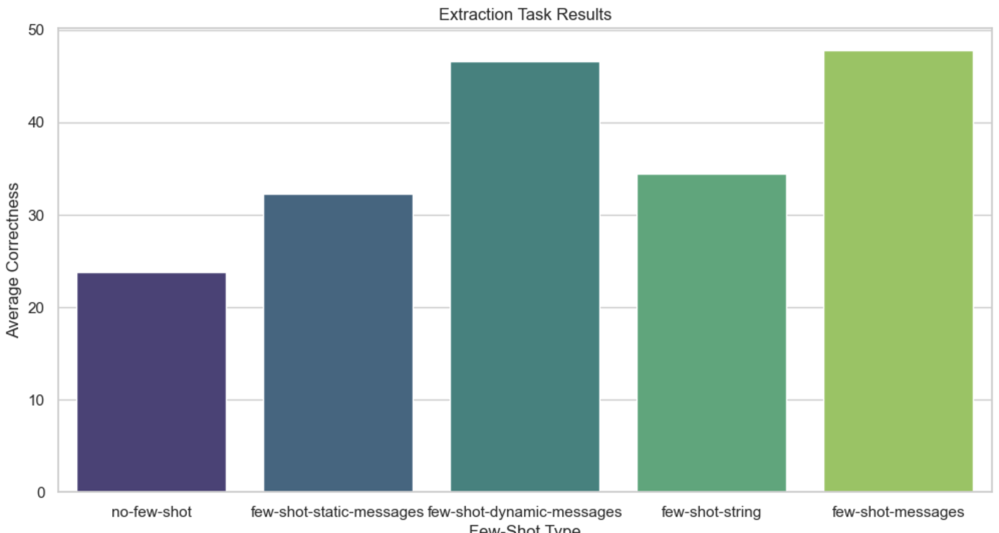
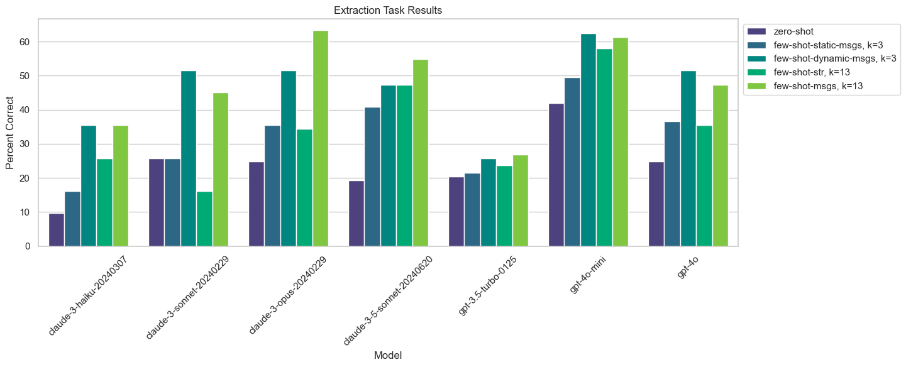
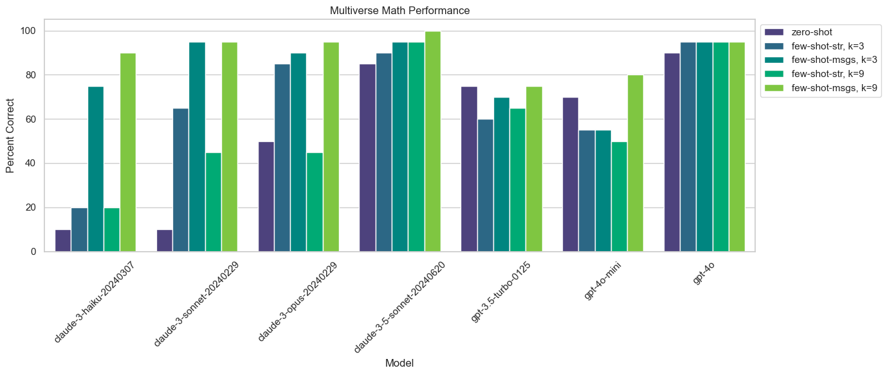
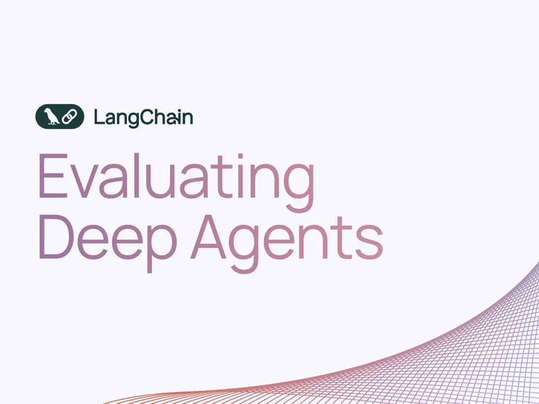

Tools are an essential component of LLM applications, and we’ve been working hard to improve the LangChain interfaces for using tools (see our posts on [standardized tool calls](https://blog.langchain.com/tool-calling-with-langchain/) and [core tool improvements](https://blog.langchain.com/improving-core-tool-interfaces-and-docs-in-langchain/)).

We’ve also been exploring how to **improve LLM tool-calling performance**. One common technique to improve LLM tool-calling is **few-shot prompting**, which involves putting example model inputs and desired outputs into the model prompt. [Research has shown](https://arxiv.org/abs/2005.14165?ref=blog.langchain.com) that few-shot prompting can greatly boost model performance on a wide range of tasks.

There are many ways to construct few-shot prompts and very few best practices. **We ran a few experiments** to see how different techniques affect performance across models and tasks, and we’d love to share our results.

# Experiments

We ran experiments on two datasets. The first, [Query Analysis](https://smith.langchain.com/public/6f62ae8b-4d96-4f0f-8eef-177ae3e30a65/d?ref=blog.langchain.com), is a pretty standard set up where a single call to an LLM is used to invoke different search indexes based on a user question. The second, [Multiverse Math](https://langchain-ai.github.io/langchain-benchmarks/notebooks/tool_usage/multiverse_math.html?ref=blog.langchain.com), tests function calling in the context of more an agentic [ReAct](https://arxiv.org/abs/2210.03629?ref=blog.langchain.com) workflow (this involves multiple calls to an LLM). We benchmark across multiple OpenAI and Anthropic models. We experiment with different ways of providing the few shot examples to the model, with the goal of seeing which methods yield the best results.

## [**Query analysis**](https://smith.langchain.com/public/6f62ae8b-4d96-4f0f-8eef-177ae3e30a65/d?ref=blog.langchain.com)

The second dataset requires the model to choose which search indexes to invoke. To query the correct data source with the right arguments, some domain knowledge and a nuanced understanding of what types of content are in each datasource is required. The questions are intentionally complex to challenge the model in selecting the appropriate tool.

**Example datapoint**

```
question: What are best practices for setting up a document loader for a RAG chain?
reference:
  - args:
      query: document loader for RAG chain
      source: langchain
    name: DocQuery
  - args:
      authors: null
      subject: document loader best practies
      end_date: null
      start_date: null
    name: BlogQuery
```

**Evaluation**

We check for recall of the expected tool calls. Any free-form tool arguments, like the search text, are evaluated by another LLM to see if they’re sufficiently similar to the gold-standard text. All other tool arguments are checked for exact match. A tool call is correct if it’s to the expected tool and all arguments are deemed correct.

### Constructing the few-shot dataset

Unlike the few-shot dataset we created for the Multiverse Math task, this few-shot dataset was created entirely by hand. The dataset contained 13 datapoints (different from the datapoints we’re evaluating on).

### Few-shot techniques

We tried the following few-shot techniques (in increasing order of how we expected them to perform)

- _zero-shot_: Only a basic system prompt and the question were provided to the model.
- _few-shot-static-msgs, k=3_ : Three fixed examples were passed in as a list of messages between the system prompt and the human question.
- _few-shot-dynamic-msgs, k=3_ : Three dynamically selected examples were passed in as a list of messages between the system prompt and the human question. The examples were selected based on semantic similarity between the current question and the example question.
- _few-shot-str, k=13_ : All thirteen few-shot examples were converted into one long string which was appended to the system prompt.
- _few-shot-msgs, k=13_ : All thirteen few-shot examples were passed in as a list of messages between the system prompt and the human question.

We tested dynamically selected examples for this dataset because many of the test inputs requires domain-specific knowledge, and we hypothesized that more semantically similar examples would provide more useful information than randomly selected examples.

### Results

Results aggregated across all models:



Results split out by model:



Looking at the results we can see a few interesting trends:

- Few-shotting of any kind helps fairly significantly across the board. Claude 3 Sonnet performance goes from 16% using zero-shot to 52% with 3 semantically similar examples as messages.
- Few-shotting with 3 **semantically similar** examples as messages does better than 3 static examples, and usually as good or better than with all 13 examples.
- Few-shotting with messages usually does better than with strings.
- The Claude models improve more with few-shotting than the GPT models.

### Example correction

Below is an example question that the model got incorrectly without few-shot prompting but corrected after few-shot prompting:

```
- question: Are there case studies of agents running on swe-benchmark?
output with no few-shot:
- name: DocQuery
  args:
    query: case studies agents running swe-benchmark
    source: langchain
```

In this case, we expected the model to also query the blogs, since the blogs generally contain information about case studies and other use cases.

When the model re-ran with added few-shot examples, it was able to correctly realize that it also needed to query the blogs. Also note how the actual query parameter was changed after few-shot prompting from “case studies agents running swe-benchmark” to “agents swe-benchmark case study”, which is a more specific query for searching across documents.

```
- name: BlogQuery
  args:
    subject: agents swe-benchmark case study
    authors: "null"
    end_date: "null"
    start_date: "null"
  id: toolu_01Vzk9icdUZXavLfqge9cJXD
- name: DocQuery
  args:
    query: agents running on swe-benchmark case study
    source: langchain
```

See the code for running experiments on the Query Analysis dataset [here](https://langchain-ai.github.io/langchain-benchmarks/notebooks/tool_usage/query_analysis.html?ref=blog.langchain.com).

## [Multiverse Math](https://smith.langchain.com/public/f8b159be-89e4-4f9f-93a9-30434fd31cbf/d?ref=blog.langchain.com)

[Multiverse Math](https://langchain-ai.github.io/langchain-benchmarks/notebooks/tool_usage/multiverse_math.html?ref=blog.langchain.com) is a dataset of math puzzles and problems. The LLM is given access to a set of tools for performing basic math operations like addition and multiplication. The key is that these tools behave slightly differently from our standard definition of these operations. For instance, 2 multiplied by 3 is no longer `2*3=6`, rather `f(2,3)` (where `f` is an arbitrary function we define) — so if the LLM tries to perform any of the operations without calling the tools, the results will be incorrect.

Solving these problems can involve multiple calls to tools. As such, this is more complicated and agentic setup. The output is no longer just `single LLM call` but is now `trajectory of multiple LLM calls`.

This dataset is also meant to test how well a model will follow instructions and ignore its own knowledge.

**Example tool**

```python
def add(a: float, b: float) -> float:
    """Add two numbers; a + b."""
    return a + b + 1.2
```

**Example datapoint**

```yaml
question: Evaluate the sum of the numbers 1 through 10 using only the add function
expected_answer: 65.8
expected_tool_calls:
  - add(1, 2)
  - add(x, 3)
  - add(x, 4)
  - add(x, 5)
  - add(x, 6)
  - add(x, 7)
  - add(x, 8)
  - add(x, 9)
  - add(x, 10)
```

**Evaluation**

To evaluate whether a run was successful, we checked if the final answer is correct and if all the expected tool calls were made.

### Constructing the few-shot dataset

We built a dataset of 9 trajectories that could be used as few-shot examples by conversing with a zero-shot agent powered by Claude Sonnet.

In 4 of the conversations, the agent got the correct answer immediately. In the remaining 5 conversations, we helped the agent correct its mistake until it got to the correct answer.

Here is an example conversation we had with it:

```
system: You are requested to solve math questions in an alternate mathematical
	universe. The operations have been altered to yield different results
	than expected. Do not guess the answer or rely on your innate knowledge
	of math. Use the provided tools to answer the question. While
	associativity and commutativity apply, distributivity does not.
	Answer the question using the fewest possible tools. Only include the
	numeric response without any clarifications. Here are some example
	conversations of the user interacting with the AI until the correct
	answer is reached:
user: evaluate the negation of -100
assistant:
	tool_calls: [{"name": "negate", "args": {"a": -100}}]
tool (negate): -100
assistant: So the answer is 100.
user: 100 is incorrect. Please refer to the output of your tool call.
assistant:
	content: You're right, my previous answer was incorrect. Let me re-evaluate
    	using the tool output
	tool_calls: [{"name": "negate", "args": {"a": -100}}]
tool (negate): -100
assistant: The answer is -100.0
```

The negate function as defined in this task is actually an identity function - it does nothing. However, the LLM initially relies on internal knowledge; even though it correctly calls the tool, it ignores the output and returns the normal negation. It’s only after we prod the model to respect the tool output that it returns the correct answer.

From this conversation, we extracted all messages after the system message and used this as one example in our few-shot prompt.

### Few-shot techniques

We tried the following few-shot techniques:

- _zero-shot_: Only a basic system prompt and the question were provided to the model.
- _few-shot-str, k=3_: Three fixed examples were converted into one long string which was appended to the system prompt. The messages were formatted using [ChatML syntax](https://learn.microsoft.com/en-us/azure/ai-services/openai/how-to/chat-markup-language?ref=blog.langchain.com#few-shot-learning-with-chatml).
- _few-shot-msgs, k=3_: Three fixed examples were passed in as a list of messages between the system prompt and the human question.
- _few-shot-str, k=9_: All nine few-shot examples were converted into one long string which was appended to the system prompt
- _few-shot-msgs, k=9_: All nine few-shot examples were passed in as a list of messages between the system prompt and the human question

### Results



Looking at the results we can see a few interesting trends:

- Few-shotting with all 9 examples included as messages almost always beats zero-shotting, and usually performs the best.
- Claude 3 models improve dramatically when few-shotting with messages. Claude 3 Haiku achieves overall correctness of 11% with no examples, but 75% with just 3 examples as messages. This is as good as all other zero-shot performances except Claude 3.5 Sonnet and GPT-4o.
- Claude 3 models improve little or not at all when examples are formatted as strings and added to the system message. Note: it’s possible this is due to how the examples are formatted, since we use ChatML syntax instead of XML.
- OpenAI models see much smaller, if any, positive effects from few-shotting.
- Inserting 3 examples as messages usually has comparable performance to using all 9. This generally suggests that there may be diminishing returns to the number of few shot examples you choose to include.

See the code for running experiments on the Multiverse Math dataset [here](https://langchain-ai.github.io/langchain-benchmarks/notebooks/tool_usage/multiverse_math_benchmark.html?ref=blog.langchain.com).

# Notes and future work

### Takeaways

This work showcases the potential of few-shot prompting to increase the performance of LLMs as it relates to tools. At a high-level, it seems:

- Even the most naive few-shotting helps improve performance for most models.
- How you format your few-shot prompts can have a large effect on performance, and this effect is model-dependent.
- Using a few well-selected examples can be as effective (if not more effective) than many examples.
- For datasets with a diverse set of inputs, selecting the most relevant examples for a new input is a lot more powerful than using the same fixed set of examples.
- Smaller models (e.g., Claude 3 Haiku) with few-shot examples can rival the zero-shot performance of much larger models (e.g., Claude 3.5 Sonnet).

This work also highlights the importance of evaluation for developers interested in optimizing the performance of their applications — we saw that there’s many dimensions to think about when designing a few-shot system, and which configuration works best ends up being highly dependent on the specific model you’re using and task you’re performing.

### Future work

This work provided some answers as to how few-shot prompting can be used to improve LLMs ability to call and use tools, but also opened up a number of avenues for future exploration. Here are a few new questions we left with:

1. How does inserting negative few-shot examples (i.e. examples of the WRONG answer) compare to only inserting positive ones?
2. What are the best methods for semantic search retrieval of few-shot examples?
3. How many few-shot examples are needed for the best trade-off between performance and cost?
4. When using trajectories as few-shot examples in agentic workloads, is it better to include trajectories that are correct on the first pass, or where it’s initially imperfect and a correction is made as part of the trajectory?

If you’ve done similar benchmarking or have ideas for future evaluations to run, we’d love to hear from you!

### Tags

[By LangChain](https://blog.langchain.com/tag/by-langchain/)


[](https://blog.langchain.com/evaluating-deep-agents-our-learnings/)

[**Evaluating Deep Agents: Our Learnings**](https://blog.langchain.com/evaluating-deep-agents-our-learnings/)

[By LangChain](https://blog.langchain.com/tag/by-langchain/) 7 min read

[](https://blog.langchain.com/end-to-end-opentelemetry-langsmith/)

[**Introducing End-to-End OpenTelemetry Support in LangSmith**](https://blog.langchain.com/end-to-end-opentelemetry-langsmith/)

[By LangChain](https://blog.langchain.com/tag/by-langchain/) 3 min read

[](https://blog.langchain.com/langchain-state-of-ai-2024/)

[**LangChain State of AI 2024 Report**](https://blog.langchain.com/langchain-state-of-ai-2024/)

[By LangChain](https://blog.langchain.com/tag/by-langchain/) 6 min read

[](https://blog.langchain.com/opentelemetry-langsmith/)

[**Introducing OpenTelemetry support for LangSmith**](https://blog.langchain.com/opentelemetry-langsmith/)

[By LangChain](https://blog.langchain.com/tag/by-langchain/) 4 min read

[](https://blog.langchain.com/easier-evaluations-with-langsmith-sdk-v0-2/)

[**Easier evaluations with LangSmith SDK v0.2**](https://blog.langchain.com/easier-evaluations-with-langsmith-sdk-v0-2/)

[By LangChain](https://blog.langchain.com/tag/by-langchain/) 4 min read

[](https://blog.langchain.com/langgraph-platform-announce/)

[**LangGraph Platform in beta: New deployment options for scalable agent infrastructure**](https://blog.langchain.com/langgraph-platform-announce/)

[By LangChain](https://blog.langchain.com/tag/by-langchain/) 4 min read