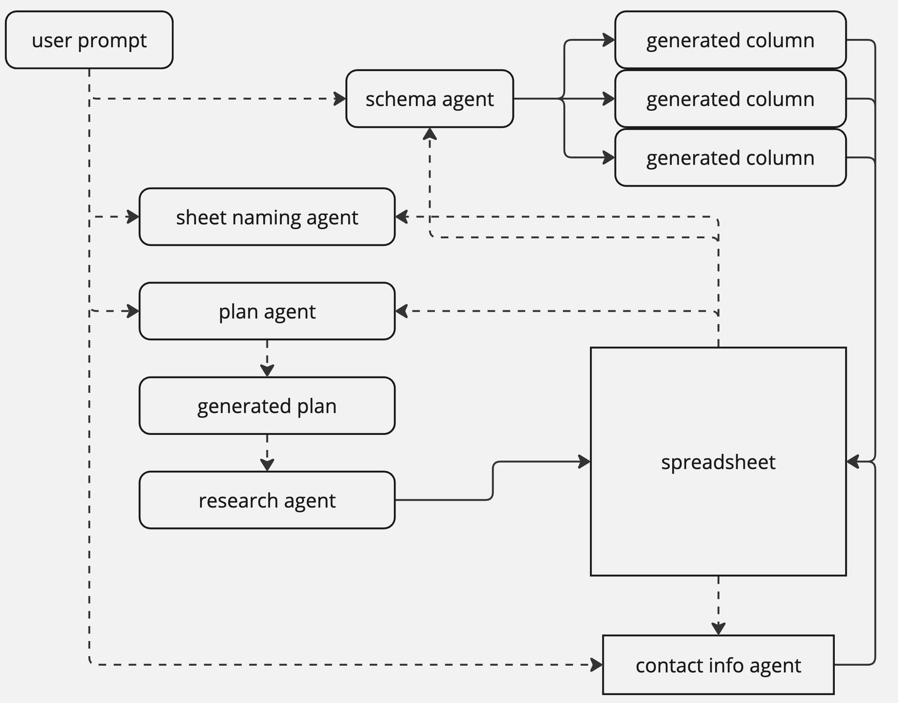

[Paradigm](https://www.paradigmai.com/?ref=blog.langchain.com) (YC24) is transforming the traditional spreadsheet by integrating AI to create the first generally intelligent spreadsheet. Their tool orchestrates a swarm of AI agents to gather data, structure it, and execute tasks with human-level precision.

To achieve their goals, Paradigm has leveraged LangChain’s suite of products to build and productionize their product. [LangSmith](https://www.langchain.com/langsmith?ref=blog.langchain.com), in particular, has provided critical operational insights and contextual awareness of their agent thought process and LLM usage. This enabled Paradigm to optimize both their product performance and pricing models, keeping compute costs low.

### **Building AI-Driven Spreadsheets with LangChain for Rapid Iteration**

Paradigm’s intelligent spreadsheet deploys numerous task-specific agents for data processing tasks, [all powered by LangChain](https://github.com/langchain-ai/langgraph?ref=blog.langchain.com). Beyond data generation in their spreadsheet, Paradigm also uses LangChain-powered micro-agents for various small tasks throughout their product.

For instance, Paradigm developed the following agents using [LangChain](https://www.langchain.com/langchain?ref=blog.langchain.com):

1. **Schema agent**: Takes in a prompt as context and outputs a set of columns and column prompts that instruct our spreadsheet agents how to gather this data.
2. **Sheet naming agent**. Automatically names each sheet based on the prompt provided and the data in the sheet.
3. **Plan agent:** Organizes the agent’s tasks into stages given the context of each row of the spreadsheet. This helps parallelize research tasks and reduce latency without sacrificing accuracy.
4. **Contact info agent**. Performs a lookup for ways to reach a contact from unstructured data.

Flow of agent operations for Paradigm

LangChain facilitated fast iteration cycles for these agents, allowing Paradigm to refine elements such as temperature settings, model selection, and prompt optimization before deploying them in production. These agents also leverage LangChain's abstractions in order to use [structured outputs](https://python.langchain.com/v0.2/docs/how_to/structured_output/?ref=blog.langchain.com) to generate information in the right schema.

### **Monitoring in LangSmith to gain operational insights**

Paradigm's AI-first spreadsheet is designed to handle extensive data processing tasks, with users triggering hundreds or thousands of individual agents to perform tasks on a per-cell basis. They also have a multitude of tools and APIs integrated into their backend that the agents can call to do certain tasks.

The complexity of these operations required a sophisticated system to monitor and optimize agent performance. LangSmith was invaluable in providing full context behind their agent’s thought processes and LLM usage.

This granular level of insight allowed the Paradigm team to:

- Track the execution flow of agents, including token usage and success rates.
- Analyze and refine the dependency system for column generation, improving data quality by prioritizing tasks that require less context before moving on to more complex jobs.

For example, the Paradigm team could change the structure of the dependency system, re-run the same spreadsheet job, and assess which system led to the most clear and concise agent traces using LangSmith.  This type of observability is invaluable when developing complex agentic systems.

### **Optimizing usage-based pricing with LangSmith**

With LangSmith’s [monitoring capabilities](https://docs.smith.langchain.com/how_to_guides/monitoring?ref=blog.langchain.com), Paradigm has also been able to execute and implement a precise usage-based pricing model. LangSmith gave the Paradigm team perfect context on their agent operations, including the specific tools leveraged, the order of their execution, and the token usage at each step. This allowed them to accurately calculate the cost of different tasks.

Paradigm's traces in LangSmith for cost visibility

For example, tasks involving simple data, such as names or links, incur lower costs compared to more complex outputs like candidate ratings or investment memos. Paradigm can support the multi-step reasoning needed for those complex outputs.

Similarly, retrieving private data, such as fundraising information, is more resource-intensive than scraping public data, justifying the need for a nuanced pricing model. Paradigm can thus support different types of tasks with varying costs. And by diving deep into their historical tool usage and input/output tokens per job, they could better understand how to shape their pricing and tool structure going forward

### **Conclusion**

With LangSmith and LangChain, Paradigm has unlocked a variety of data processing tasks for their AI-integrated workspace and intelligent agent spreadsheets. Through rapid iteration, optimization, and operational insight, Paradigm delivers a high-performing, user-focused product for their users.

To learn more about monitoring in LangSmith, watch [this video series](https://www.youtube.com/watch?v=4rupAXVraEA&list=PLfaIDFEXuae0bYV1_60f0aiM0qI7e1zSf&ref=blog.langchain.com). You can also [try LangSmith for free](https://smith.langchain.com/?ref=blog.langchain.com) to efficiently optimize and monitor your LLM applications.

### Tags

[Case Studies](https://blog.langchain.com/tag/case-studies/)

[**monday Service + LangSmith: Building a Code-First Evaluation Strategy from Day 1**](https://blog.langchain.com/customers-monday/)

[Case Studies](https://blog.langchain.com/tag/case-studies/) 8 min read

[**How Remote uses LangChain and LangGraph to onboard thousands of customers with AI**](https://blog.langchain.com/customers-remote/)

[Case Studies](https://blog.langchain.com/tag/case-studies/) 5 min read

[**Fastweb + Vodafone: Transforming Customer Experience with AI Agents using LangGraph and LangSmith**](https://blog.langchain.com/customers-vodafone-italy/)

[Case Studies](https://blog.langchain.com/tag/case-studies/) 7 min read

[**How Jimdo empower solopreneurs with AI-powered business assistance**](https://blog.langchain.com/customers-jimdo/)

[Case Studies](https://blog.langchain.com/tag/case-studies/) 4 min read

[**How ServiceNow uses LangSmith to get visibility into its customer success agents**](https://blog.langchain.com/customers-servicenow/)

[Case Studies](https://blog.langchain.com/tag/case-studies/) 4 min read

[**Monte Carlo: Building Data + AI Observability Agents with LangGraph and LangSmith**](https://blog.langchain.com/customers-monte-carlo/)

[Case Studies](https://blog.langchain.com/tag/case-studies/) 4 min read