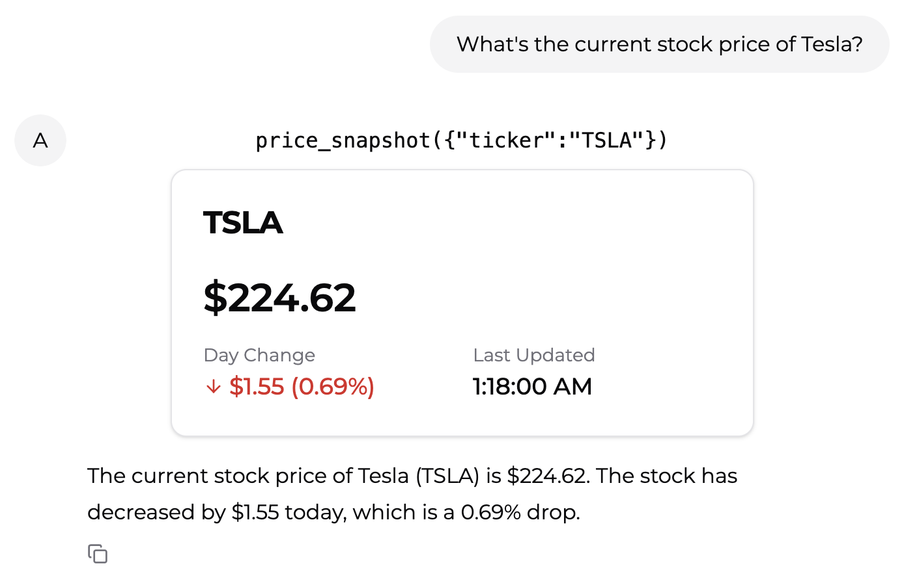
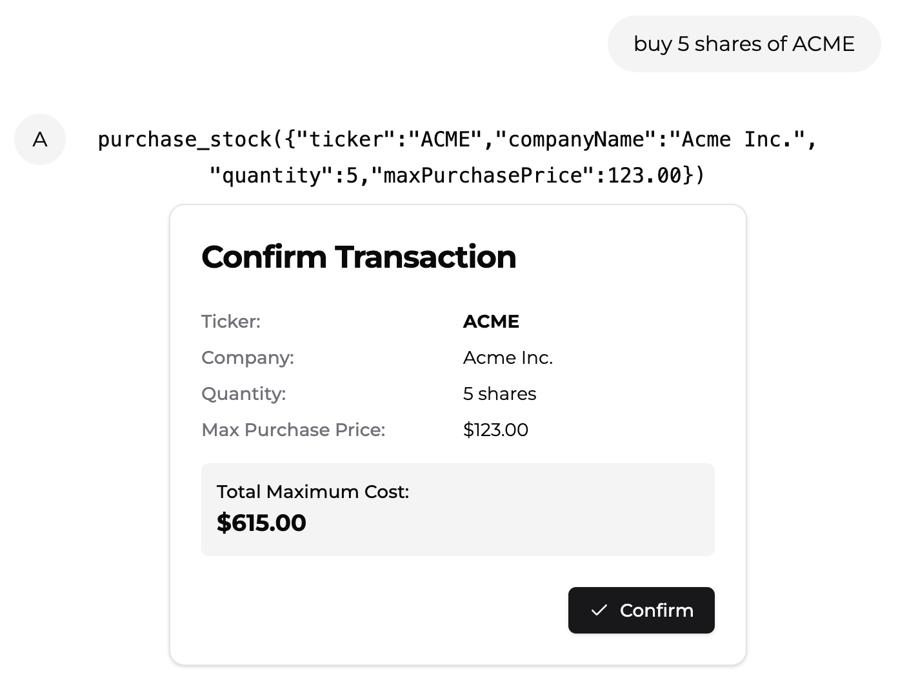
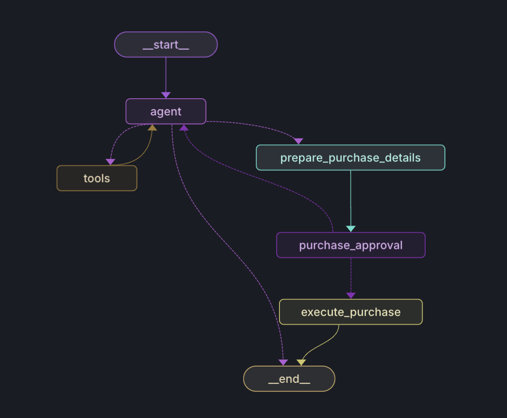

**TL;DR: assistant-ui is an embeddable AI chat frontend for React applications. It supports streaming, generative UI, human-in-the-loop, and other UX paradigms crucial for agentic applications. We’ve worked with Simon (the maintainer) to add a tight integration with LangGraph Cloud. This allows you to easily deploy LangGraph agents as standalone web apps or integrate them as assistants into existing applications. This post was written in collaboration with Simon.**

## **Relevant Links**

- [Getting Started](https://www.assistant-ui.com/docs/runtimes/langgraph?ref=blog.langchain.com)
- [Tutorial](https://www.assistant-ui.com/docs/runtimes/langgraph/tutorial?ref=blog.langchain.com)
- [Example repository](https://github.com/Yonom/assistant-ui-stockbroker?ref=blog.langchain.com) and [demo](https://assistant-ui-stockbroker.vercel.app/?ref=blog.langchain.com)
- [YT video](https://youtu.be/k1OEeqknoR0?ref=blog.langchain.com)

## **Introduction**

One of the areas of agent building that we are most excited about at LangChain is the UI/UX of agentic applications. We wrote [a whole](https://blog.langchain.com/ux-for-agents-part-1-chat-2/) [series of](https://blog.langchain.com/ux-for-agents-part-2-ambient/) [blog posts](https://blog.langchain.com/ux-for-agents-part-3/) on UX for agents exploring this topic. The primary UX that we see being used for agents these days is chat.

There are many different types of chat UI/UXs, however, and many different types of functionality that you may want to add into them as you build out more complex agents. For one, we see the notion of [“human-in-the-loop”](https://www.youtube.com/watch?v=gm-WaPTFQqM&ref=blog.langchain.com) becoming more and more prevalent - having the user approve/weigh-in on certain agent actions. [Generative UI](https://www.youtube.com/watch?v=EKNiz_fWrDk&ref=blog.langchain.com) is increasingly in popularity as developers want to make sure the agent communicates with end users about what actions it is taking. And of course, streaming is basically a must.

At LangChain, our mission is to make it as easy as possible to build the cognitive architectures that power these agents. We want to make it easy to power these features - we’re adding standardized interfaces for tool calling to help with generative UIs, and we’re building LangGraph to be stateful to more easily enable human-in-the-loop.

Still - just building the cognitive architecture isn’t enough, you also need to build the frontend for these agents. That is why we’re so excited to partner with assistant-ui to work on a strong integration between assistant-ui and LangGraph Cloud. assistant-ui shares a lot of our same focuses and believes, making it a seamless stack to build agents upon.

## **Overview of assistant-ui**

assistant-ui is a powerful React-based chat interface specifically designed for AI-driven conversations. It offers a comprehensive suite of features that enable developers to create interactive user-friendly AI chat experiences. Here's an overview of its key capabilities:

### **Streaming LLM Results**

assistant-ui provides out-of-the-box support for streaming LangChain LLM responses, including tool calls. This ensures a dynamic and responsive chat experience, allowing users to see AI responses as they're generated.


/0:05

1×

### **Rich Content Display**

The interface supports markdown rendering, enabling the presentation of diverse content types such as lists, code snippets, tables and more. This versatility allows for clear and visually appealing communication of complex information.

### **Generative UI**

One of the standout features is the ability to display structured data in an easily digestible manner. Tool calls from LangChain/LangGraph can be mapped to custom UI components, enabling a more interactive and visually appealing presentation of information. For example, stock price data can be rendered as such:



### **Human-in-the-Loop with Approval UI**

For scenarios requiring user oversight, assistant-ui offers approval interfaces. This feature enables users to review and authorize specific AI actions before execution. This enhances safety and control in agent interactions and is particularly useful for critical operations, such as financial transactions.



### **Multimodal**

assistant-ui goes beyond text-based interactions by allowing the upload of images or documents as inputs to agents.

### **Stateful interactions**

By synchronizing with LangGraph state, your apps can host multi-turn conversations with context awareness, complex task handling across multiple exchanges and persistent memory for more natural and efficient interactions.

## **Setting up the LangGraph Cloud integration**

It’s pretty easy to get LangGraph Cloud and an assistant-ui frontend to work together.

1) Deploy your LangGraph agent to LangGraph Cloud

2) Bootstrap an assistant-ui frontend

`npx assistant-ui@latest create -t langgraph`

3) Set the following environment variables

```
# Only required for production deployments
# LANGCHAIN_API_KEY=your_langchain_api_key
LANGGRAPH_API_URL=your_langgraph_api_url
NEXT_PUBLIC_LANGGRAPH_ASSISTANT_ID=your_assistant_id_or_graph_id
```

For detailed instructions on using generative UI, human-in-the-loop interactions, tool call approvals, and integrating into existing applications, refer to the [documentation](https://www.assistant-ui.com/docs/runtimes/langgraph?ref=blog.langchain.com).

## **Stockbroker Agent**

To illustrate the capabilities of this integration, let's explore the Stockbroker Agent example. This agent demonstrates the power of combining LangGraph and assistant-ui:

- Web Search: The agent can search the internet for relevant financial information.
- Financial Statement Analysis: It can read and interpret financial statements.
- Stock Price Retrieval: Real-time stock prices can be fetched and displayed.
- Purchase Order Execution: The agent can execute stock purchase orders with user approval.

The Stockbroker Agent leverages generative UI to display stock information in a visually appealing format. It also uses approval UI for purchase confirmations, ensuring user oversight on critical financial decisions.



This diagram illustrates the structure of the Stockbroker Agent, showing how LangGraph Cloud hosts the agent's cognitive architecture, while assistant-ui provides the human-in-the-loop user interaction. The integration between these two systems enables a powerful and user-friendly AI assistant experience.

You can see a video where we walk through this demo [here](https://youtu.be/k1OEeqknoR0?ref=blog.langchain.com).

Here’s the link to the [agent repository](https://github.com/Yonom/assistant-ui-stockbroker?ref=blog.langchain.com) and [live demo](https://assistant-ui-stockbroker.vercel.app/?ref=blog.langchain.com).

## **Conclusion**

The combination of LangGraph and assistant-ui opens up new possibilities for building interactive stateful AI assistants that seamlessly integrate into React apps. The streaming, generative UI, and approval UI features enable transparent and interactive communication between users and AI agents, enhancing trust and usability.

By leveraging this powerful integration, developers can focus on creating value-added features and domain-specific functionality. The underlying infrastructure handles the complexities of state management (LangGraph) and UX interaction patterns (assistant-ui), streamlining the development process and enabling the creation of more advanced AI-powered applications.

To learn more about assistant-ui, check out the [documentation](https://www.assistant-ui.com/docs/runtimes/langgraph?ref=blog.langchain.com) or the stockbroker [example repository](https://github.com/Yonom/assistant-ui-stockbroker?ref=blog.langchain.com).