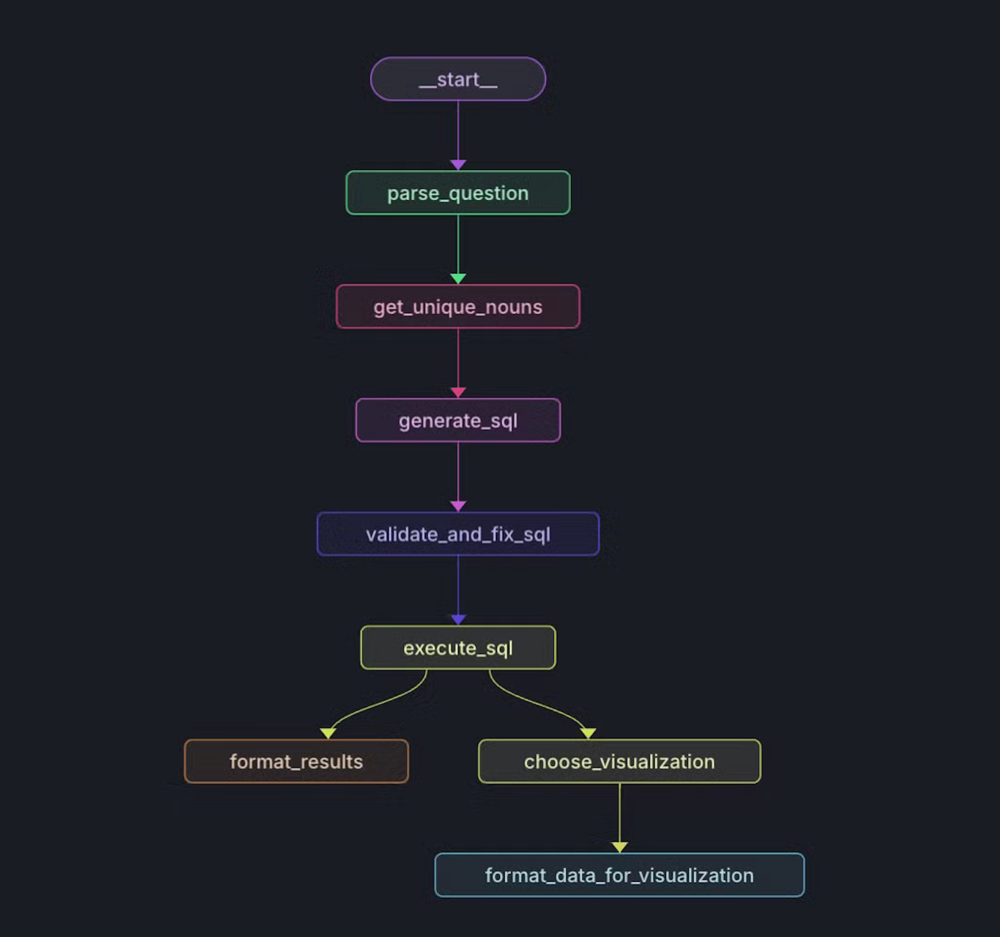
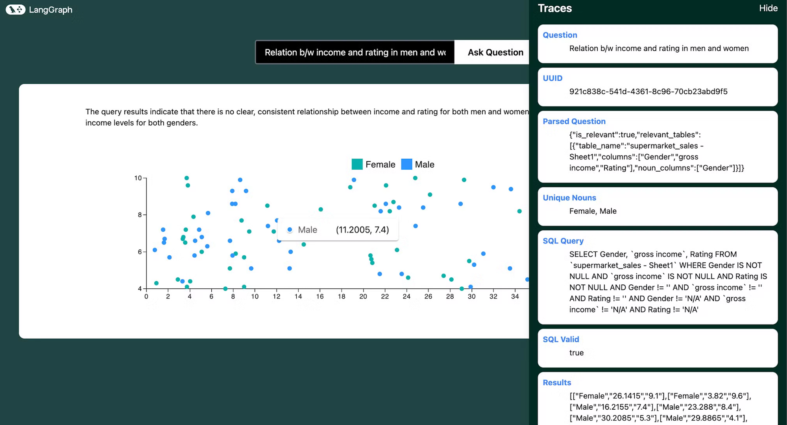

**Editor's Note: This is a guest blog post by** [**Dhruv Ateja**](https://www.linkedin.com/in/dhruv-atreja/?ref=blog.langchain.com) **. It covers building a full stack application that uses an agent to both query data as well as choose how to display that data. It leverages LangGraph and LangGraph Cloud.**

**Key Links:**

- [**YouTube Video**](https://youtu.be/LRcjlXL9hPA?ref=blog.langchain.com)
- [**GitHub Repo**](https://github.com/DhruvAtreja/datavisualization_langgraph?ref=blog.langchain.com)
- [**Hosted Application**](https://data-visualization-frontend-gamma.vercel.app/?ref=blog.langchain.com)

Let's explore an exciting project that leverages LangGraph Cloud's streaming API to create a data visualization agent. You can upload an SQLite database or CSV file, ask questions about your data, and the agent will generate appropriate visualizations. This blog is a brief dive into the agent’s workflow and key features.


/0:28

1×

The entire workflow is orchestrated using **LangGraph Cloud**, which provides a framework for easily building complex AI agents, a streaming API for real-time updates, and a visual studio for monitoring and experimenting with the agent's behavior.

First, let us see the current SOTA text to sql workflow:

### **Schema and Metadata Extraction:**

- The system processes the provided database (e.g., SQLite or CSV) to extract crucial information like table structure and column details.
- This initial step grants a comprehensive understanding of the database's organization.

### **Embedding Creation:**

- For larger datasets, embeddings for schema elements (tables, columns) and sample data are generated. These embeddings improve efficiency during retrieval and matching tasks later on.

### **Entity and Context Retrieval:**

- The user's query is analyzed to identify entities and the overall context.
- For database values, a syntactic search leveraging a Locality Sensitive Hashing (LSH) index can be implemented.

### **Relevant Table Extraction using Retrieval-Augmented Generation (RAG):**

- This step utilizes RAG to pinpoint the relevant tables that hold the information the user seeks.
- **Experimental Approaches:**
  - If the schema is manageable within the context window, this step might be skipped.
  - Exploring a Knowledge Graph-based RAG for multi-hop functionalities is a potential avenue for future development.
  - Extracting relevant columns can be fed into the RAG for more precise table extraction.

### **Large Schema Handling :**

- When dealing with massive table schemas, techniques can be employed to manage them effectively:
  - Reducing schema details to essential information ensures efficient processing.
  - Pruning columns based on metadata tags streamlines the analysis.
  - The pruned schema can then be presented to the Language Model (LLM) to assess table relevance.

### **Table and Relevance Validation:**

- The extracted tables are meticulously verified to ensure they are truly relevant to the user's query.

### **SQL Query Generation:**

- The relevant tables, their schema, and sample data rows are fed into the LLM to generate the SQL query.
- **Experimentation:** Prompting the LLM to evaluate the necessity of each column in filtered tables, coupled with a chain-of-thought explanation, can provide valuable insights into the reasoning behind the generated query.

### **Query Structure Validation:**

- A workflow validates and corrects the generated SQL query's structure, ensuring its correctness before execution.

For our project, we've focused on smaller datasets, eliminating the need for RAG or LSH techniques. However, the core workflow remains consistent. To explore text-to-SQL implementations for larger datasets, check out [this insightful article](https://medium.com/pinterest-engineering/how-we-built-text-to-sql-at-pinterest-30bad30dabff/?ref=blog.langchain.com) from Pinterest Engineering.

Here are is an overview of the implementation of the text to sql workflow:



### Setting up the graph

```python

    def create_workflow(self) -> StateGraph:
        """Create and configure the workflow graph."""
        workflow = StateGraph(State)
        # Add nodes to the graph
        workflow.add_node("parse_question", self.sql_agent.parse_question)
        workflow.add_node("get_unique_nouns", self.sql_agent.get_unique_nouns)
        workflow.add_node("generate_sql", self.sql_agent.generate_sql)
        workflow.add_node("validate_and_fix_sql", self.sql_agent.validate_and_fix_sql)
        workflow.add_node("execute_sql", self.sql_agent.execute_sql)
        workflow.add_node("format_results", self.sql_agent.format_results)
        workflow.add_node("choose_visualization", self.sql_agent.choose_visualization)
        workflow.add_node("format_data_for_visualization", self.data_formatter.format_data_for_visualization)
        # Define edges
        workflow.add_edge("parse_question", "get_unique_nouns")
        workflow.add_edge("get_unique_nouns", "generate_sql")
        workflow.add_edge("generate_sql", "validate_and_fix_sql")
        workflow.add_edge("validate_and_fix_sql", "execute_sql")
        workflow.add_edge("execute_sql", "format_results")
        workflow.add_edge("execute_sql", "choose_visualization")
        workflow.add_edge("choose_visualization", "format_data_for_visualization")
        workflow.set_entry_point("parse_question")

        return workflow

```

### **1\. Schema and Metadata Extraction:**

- We've developed a server to store and query SQLite files for this project: [https://github.com/DhruvAtreja/sqllite-server](https://github.com/DhruvAtreja/sqllite-server?ref=blog.langchain.com)
- This server has two main functions: querying the database and retrieving its schema.
- We extract the schema for all tables, including the first three rows of each table for context.

Extracting schema

```jsx

  const db = new sqlite3.Database(dbPath);

  db.all(
    "SELECT name, sql FROM sqlite_master WHERE type='table';",
    [],
    (err, tables) => {
      if (err) {
        db.close();
        return res.status(500).json({ error: err.message });
      }

      const schema = [];

      const processTable = (index) => {
        if (index >= tables.length) {
          db.close();
          return res.json({ schema: schema.join("\\n") });
        }

        const { name: tableName, sql: createStatement } = tables[index];
        schema.push(`Table: ${tableName}`);
        schema.push(`CREATE statement: ${createStatement}\\n`);

        db.all(`SELECT * FROM '${tableName}' LIMIT 3;`, [], (err, rows) => {
          if (err) {
            console.error(`Error fetching rows for table ${tableName}:`, err);
          } else if (rows.length > 0) {
            schema.push("Example rows:");
            rows.forEach((row) => schema.push(JSON.stringify(row)));
          }
          schema.push(""); // Add a blank line between tables
          processTable(index + 1);
        });
      };

      processTable(0);
    }
  );
```

### **2\. Parsing the user's question:**

- We pass the user's question to the SQLAgent along with the schema of the database. Using this data we extract the relevant tables and columns.
- We also identify columns which contain nouns. We'll see why this is important in the next step.
- If the question is not relevant to the database or if there is not enough information to answer the question, we set is\_relevant to false and end the workflow.

Prompt:

```python
You are a data analyst that can help summarize SQL tables and parse user questions about a database.
Given the question and database schema, identify the relevant tables and columns.
If the question is not relevant to the database or if there is not enough information to answer the question, set is_relevant to false.

The "noun_columns" field should contain only the columns that are relevant to the question and contain nouns or names, for example, the column "Artist name" contains nouns relevant to the question "What are the top selling artists?", but the column "Artist ID" is not relevant because it does not contain a noun. Do not include columns that contain numbers.
```

Response Format:

```json
{

"is_relevant": boolean,

"relevant_tables": [\
\
		{{\
\
		"table_name": string,\
\
		"columns": [string],\
\
		"noun_columns": [string]\
\
		}}\
\
	]

}
```

### **3\. Getting the unique nouns:**

- If the user asks "What are the top selling artists?" or "What is the market share of each category?", we need to know which artists are being referred to or which categories are being referred to in order to generate the correct SQL query.
- What if the user asks "Top selling ac dc songs?" (We all know it has to be Thunderstruck) but the table contains the name "AC/DC" instead of "ac dc"? We need to get the correct spelling of the artist's name in order to generate the correct SQL query.
- This is where the unique nouns come in. We extract the unique nouns from the question and the schema and match them. We can get the correct spelling of the artist's name and the list of entities using the unique nouns.

Function

```python
    def get_unique_nouns(self, state: dict) -> dict:
        """Find unique nouns in relevant tables and columns."""
        parsed_question = state['parsed_question']

        if not parsed_question['is_relevant']:
            return {"unique_nouns": []}

        unique_nouns = set()
        for table_info in parsed_question['relevant_tables']:
            table_name = table_info['table_name']
            noun_columns = table_info['noun_columns']

            if noun_columns:
                column_names = ', '.join(f"`{col}`" for col in noun_columns)
                query = f"SELECT DISTINCT {column_names} FROM `{table_name}`"
                results = self.db_manager.execute_query(state['uuid'], query)
                for row in results:
                    unique_nouns.update(str(value) for value in row if value)

        return {"unique_nouns": list(unique_nouns)}
```

### **4\. Generating the SQL query:**

We pass the schema, the user's question, the parsed question and the unique nouns to the SQLAgent. We skip the rows where any column is null, "N/A" or "".

Prompt

```python
You are an AI assistant that generates SQL queries based on user questions, database schema, and unique nouns found in the relevant tables. Generate a valid SQL query to answer the user's question.

If there is not enough information to write a SQL query, respond with "NOT_ENOUGH_INFO".

Here are some examples:

1. What is the top selling product?
Answer: SELECT product_name, SUM(quantity) as total_quantity FROM sales WHERE product_name IS NOT NULL AND quantity IS NOT NULL AND product_name != "" AND quantity != "" AND product_name != "N/A" AND quantity != "N/A" GROUP BY product_name ORDER BY total_quantity DESC LIMIT 1

2. What is the total revenue for each product?
Answer: SELECT product_name, SUM(quantity * price) as total_revenue FROM sales WHERE product_name IS NOT NULL AND quantity IS NOT NULL AND price IS NOT NULL AND product_name != "" AND quantity != "" AND price != "" AND product_name != "N/A" AND quantity != "N/A" AND price != "N/A" GROUP BY product_name ORDER BY total_revenue DESC

3. What is the market share of each product?
Answer: SELECT product_name, SUM(quantity) * 100.0 / (SELECT SUM(quantity) FROM sales) as market_share FROM sales WHERE product_name IS NOT NULL AND quantity IS NOT NULL AND product_name != "" AND quantity != "" AND product_name != "N/A" AND quantity != "N/A" GROUP BY product_name ORDER BY market_share DESC

4. Plot the distribution of income over time
Answer: SELECT income, COUNT(*) as count FROM users WHERE income IS NOT NULL AND income != "" AND income != "N/A" GROUP BY income

THE RESULTS SHOULD ONLY BE IN THE FOLLOWING FORMAT, SO MAKE SURE TO ONLY GIVE TWO OR THREE COLUMNS:
[[x, y]]
or
[[label, x, y]]

For questions like "plot a distribution of the fares for men and women", count the frequency of each fare and plot it. The x axis should be the fare and the y axis should be the count of people who paid that fare.
SKIP ALL ROWS WHERE ANY COLUMN IS NULL or "N/A" or "".
Just give the query string. Do not format it. Make sure to use the correct spellings of nouns as provided in the unique nouns list.
```

Data passed

```json
===Database schema:
{schema}

===User question:

{question}

===Relevant tables and columns:

{parsed_question}

===Unique nouns in relevant tables:

{unique_nouns}
```

### **5\. Validating and fixing the SQL query:**

- We pass the SQL query to the SQLAgent. It checks if the query is valid and all the tables and columns used in the query are relevant and if it is, it returns the SQL query.
- For example, there are cases when the data needs to be converted from string to date or integer, this is fixed in this step.

Prompt

```python
You are an AI assistant that validates and fixes SQL queries. Your task is to:
1. Check if the SQL query is valid.
2. Ensure all table and column names are correctly spelled and exist in the schema.
3. If there are any issues, fix them and provide the corrected SQL query.
4. If no issues are found, return the original query.

Respond in JSON format with the following structure. Only respond with the JSON:
{{
    "valid": boolean,
    "issues": string or null,
    "corrected_query": string
}}
'''),
            ("human", '''===Database schema:
{schema}

===Generated SQL query:
{sql_query}

Respond in JSON format with the following structure. Only respond with the JSON:
{{
    "valid": boolean,
    "issues": string or null,
    "corrected_query": string
}}

For example:
1. {{
    "valid": true,
    "issues": null,
    "corrected_query": "None"
}}

2. {{
    "valid": false,
    "issues": "Column USERS does not exist",
    "corrected_query": "SELECT * FROM users WHERE age > 25"
}}
```

### **6\. Executing the SQL query:**

We pass the SQL query to the DatabaseManager. It passes the query to the remote database and returns the results.

### **7\. Choosing an appropriate visualization:**

I think it is a good idea to reverse engineer this process. Assuming that we are adding support for the following graphs/charts:

1. Column Graphs
2. Bar Graphs
3. Scatter Plots
4. Line Graphs
5. Pie Charts

Here’s a breakdown of the types of questions we would need to support

- **Bar/Column Graphs**:
  - **Questions**: "What are the sales figures for each product in the last quarter?", "How does the population of cities compare?", "What are the top 5 most common job titles in the company?"
  - **Use Case**: Best for comparing categorical data or showing changes over time when categories are discrete.
- **Scatter Plots**:
  - **Questions**: "Is there a relationship between advertising spend and sales?", "How do height and weight correlate in the dataset?", "What is the distribution of ages vs. salaries?"
  - **Use Case**: Useful for identifying relationships or correlations between two numerical variables.
- **Pie Charts**:
  - **Questions**: "What is the market share distribution among different companies?", "How are the department budgets divided?", "What percentage of the total revenue comes from each product?"
  - **Use Case**: Ideal for showing proportions or percentages within a whole.
- **Line Graphs**:
  - **Questions**: "How have website visits changed over the year?", "What is the trend in temperature over the past decade?", "How has stock price fluctuated over time?"
  - **Use Case**: Best for showing trends over time with continuous data.

This identifies the following lines of questioning:

- **Aggregations and Summarizations**:
  - Example: "What is the average revenue by month?" (Line Graph)
  - "Show the total sales by product category." (Bar/Column Graph)
- **Comparisons**:
  - Example: "Compare the sales figures of Product A and Product B over the last year." (Line or Column Graph)
- **Trends Over Time**:
  - Example: "What is the trend in the number of active users over the past year?" (Line Graph)
- **Proportions**:
  - Example: "What percentage of sales came from each region?" (Pie Chart)
- **Correlations**:
  - Example: "Is there a correlation between marketing spend and revenue?" (Scatter Plot)

**Prompt**

```python
You are an AI assistant that recommends appropriate data visualizations. Based on the user's question, SQL query, and query results, suggest the most suitable type of graph or chart to visualize the data. If no visualization is appropriate, indicate that.

Available chart types and their use cases:

- Bar Graphs: Best for comparing categorical data or showing changes over time when categories are discrete and the number of categories is more than 2. Use for questions like "What are the sales figures for each product?" or "How does the population of cities compare? or "What percentage of each city is male?"
- Horizontal Bar Graphs: Best for comparing categorical data or showing changes over time when the number of categories is small or the disparity between categories is large. Use for questions like "Show the revenue of A and B?" or "How does the population of 2 cities compare?" or "How many men and women got promoted?" or "What percentage of men and what percentage of women got promoted?" when the disparity between categories is large.
- Scatter Plots: Useful for identifying relationships or correlations between two numerical variables or plotting distributions of data. Best used when both x axis and y axis are continuous. Use for questions like "Plot a distribution of the fares (where the x axis is the fare and the y axis is the count of people who paid that fare)" or "Is there a relationship between advertising spend and sales?" or "How do height and weight correlate in the dataset? Do not use it for questions that do not have a continuous x axis."
- Pie Charts: Ideal for showing proportions or percentages within a whole. Use for questions like "What is the market share distribution among different companies?" or "What percentage of the total revenue comes from each product?"
- Line Graphs: Best for showing trends and distributionsover time. Best used when both x axis and y axis are continuous. Used for questions like "How have website visits changed over the year?" or "What is the trend in temperature over the past decade?". Do not use it for questions that do not have a continuous x axis or a time based x axis.

Consider these types of questions when recommending a visualization:

1. Aggregations and Summarizations (e.g., "What is the average revenue by month?" - Line Graph)

2. Comparisons (e.g., "Compare the sales figures of Product A and Product B over the last year." - Line or Column Graph)

3. Plotting Distributions (e.g., "Plot a distribution of the age of users" - Scatter Plot)

4. Trends Over Time (e.g., "What is the trend in the number of active users over the past year?" - Line Graph)

5. Proportions (e.g., "What is the market share of the products?" - Pie Chart)

6. Correlations (e.g., "Is there a correlation between marketing spend and revenue?" - Scatter Plot)

Provide your response in the following format:

Recommended Visualization: [Chart type or "None"]. ONLY use the following names: bar, horizontal_bar, line, pie, scatter, none

Reason: [Brief explanation for your recommendation]
```

### **8\. Formatting the data for visualization:**

We pass the SQL query results to the DataFormatter. It formats the data according to the visualization type. If the results are in a predictable format, we have implemented rule based logic to format the data and only use llms to come up with labels, which speeds up the process especially in the cases of bar graphs, line graphs and scatter plots. Else we pass the results to a LLM to format the data.

**Formatting instructions**

```python

barGraphIntstruction = '''

  Where data is: {
    labels: string[]
    values: {\\data: number[], label: string}[]
  }

// Examples of usage:
Each label represents a column on the x axis.
Each array in values represents a different entity.

Here we are looking at average income for each month.
1. data = {
  labels: ['Jan', 'Feb', 'Mar', 'Apr', 'May', 'Jun'],
  values: [{data:[21.5, 25.0, 47.5, 64.8, 105.5, 133.2], label: 'Income'}],
}

Here we are looking at the performance of american and european players for each series. Since there are two entities, we have two arrays in values.
2. data = {
  labels: ['series A', 'series B', 'series C'],
  values: [{data:[10, 15, 20], label: 'American'}, {data:[20, 25, 30], label: 'European'}],
}
'''

horizontalBarGraphIntstruction = '''

  Where data is: {
    labels: string[]
    values: {\\data: number[], label: string}[]
  }

// Examples of usage:
Each label represents a column on the x axis.
Each array in values represents a different entity.

Here we are looking at average income for each month.
1. data = {
  labels: ['Jan', 'Feb', 'Mar', 'Apr', 'May', 'Jun'],
  values: [{data:[21.5, 25.0, 47.5, 64.8, 105.5, 133.2], label: 'Income'}],
}

Here we are looking at the performance of american and european players for each series. Since there are two entities, we have two arrays in values.
2. data = {
  labels: ['series A', 'series B', 'series C'],
  values: [{data:[10, 15, 20], label: 'American'}, {data:[20, 25, 30], label: 'European'}],
}

'''

lineGraphIntstruction = '''

  Where data is: {
  xValues: number[] | string[]
  yValues: { data: number[]; label: string }[]
}

// Examples of usage:

Here we are looking at the momentum of a body as a function of mass.
1. data = {
  xValues: ['2020', '2021', '2022', '2023', '2024'],
  yValues: [\
    { data: [2, 5.5, 2, 8.5, 1.5]},\
  ],
}

Here we are looking at the performance of american and european players for each year. Since there are two entities, we have two arrays in yValues.
2. data = {
  xValues: ['2020', '2021', '2022', '2023', '2024'],
  yValues: [\
    { data: [2, 5.5, 2, 8.5, 1.5], label: 'American' },\
    { data: [2, 5.5, 2, 8.5, 1.5], label: 'European' },\
  ],
}
'''

pieChartIntstruction = '''

  Where data is: {
    labels: string
    values: number
  }[]

// Example usage:
 data = [\
        { id: 0, value: 10, label: 'series A' },\
        { id: 1, value: 15, label: 'series B' },\
        { id: 2, value: 20, label: 'series C' },\
      ],
'''

scatterPlotIntstruction = '''
Where data is: {
  series: {
    data: { x: number; y: number; id: number }[]
    label: string
  }[]
}

// Examples of usage:
1. Here each data array represents the points for a different entity.
We are looking for correlation between amount spent and quantity bought for men and women.
data = {
  series: [\
    {\
      data: [\
        { x: 100, y: 200, id: 1 },\
        { x: 120, y: 100, id: 2 },\
        { x: 170, y: 300, id: 3 },\
      ],\
      label: 'Men',\
    },\
    {\
      data: [\
        { x: 300, y: 300, id: 1 },\
        { x: 400, y: 500, id: 2 },\
        { x: 200, y: 700, id: 3 },\
      ],\
      label: 'Women',\
    }\
  ],
}

2. Here we are looking for correlation between the height and weight of players.
data = {
  series: [\
    {\
      data: [\
        { x: 180, y: 80, id: 1 },\
        { x: 170, y: 70, id: 2 },\
        { x: 160, y: 60, id: 3 },\
      ],\
      label: 'Players',\
    },\
  ],
}

// Note: Each object in the 'data' array represents a point on the scatter plot.
// The 'x' and 'y' values determine the position of the point, and 'id' is a unique identifier.
// Multiple series can be represented, each as an object in the outer array.
'''

graph_instructions = {
    "bar": barGraphIntstruction,
    "horizontal_bar": horizontalBarGraphIntstruction,
    "line": lineGraphIntstruction,
    "pie": pieChartIntstruction,
    "scatter": scatterPlotIntstruction
}
```

**Data formatter**

```python

class DataFormatter:
    def __init__(self):
        self.llm_manager = LLMManager()


    def format_data_for_visualization(self, state: dict) -> dict:
        """Format the data for the chosen visualization type."""
        visualization = state['visualization']
        results = state['results']
        question = state['question']
        sql_query = state['sql_query']

        if visualization == "none":
            return {"formatted_data_for_visualization": None}

        if visualization == "scatter":
            try:
                return self._format_scatter_data(results)
            except Exception as e:
                return self._format_other_visualizations(visualization, question, sql_query, results)

        if visualization == "bar" or visualization == "horizontal_bar":
            try:
                return self._format_bar_data(results, question)
            except Exception as e:
                return self._format_other_visualizations(visualization, question, sql_query, results)

        if visualization == "line":
            try:
                return self._format_line_data(results, question)
            except Exception as e:
                return self._format_other_visualizations(visualization, question, sql_query, results)

        return self._format_other_visualizations(visualization, question, sql_query, results)

    def _format_line_data(self, results, question):
        if isinstance(results, str):
            results = eval(results)

        if len(results[0]) == 2:

            x_values = [str(row[0]) for row in results]
            y_values = [float(row[1]) for row in results]

            # Use LLM to get a relevant label
            prompt = ChatPromptTemplate.from_messages([\
                ("system", "You are a data labeling expert. Given a question and some data, provide a concise and relevant label for the data series."),\
                ("human", "Question: {question}\\n Data (first few rows): {data}\\n\\nProvide a concise label for this y axis. For example, if the data is the sales figures over time, the label could be 'Sales'. If the data is the population growth, the label could be 'Population'. If the data is the revenue trend, the label could be 'Revenue'."),\
            ])
            label = self.llm_manager.invoke(prompt, question=question, data=str(results[:2]))

            formatted_data = {
                "xValues": x_values,
                "yValues": [\
                    {\
                        "data": y_values,\
                        "label": label.strip()\
                    }\
                ]
            }
        elif len(results[0]) == 3:

            # Group data by label
            data_by_label = {}
            x_values = []

            for item1, item2, item3 in results:
                # Determine which item is the label (string not convertible to float and not containing "/")
                if isinstance(item1, str) and not item1.replace(".", "").isdigit() and "/" not in item1:
                    label, x, y = item1, item2, item3
                else:
                    x, label, y = item1, item2, item3


                if str(x) not in x_values:
                    x_values.append(str(x))
                if label not in data_by_label:
                    data_by_label[label] = []
                data_by_label[label].append(float(y))

            # Create yValues array
            y_values = [\
                {\
                    "data": data,\
                    "label": label\
                }\
                for label, data in data_by_label.items()\
            ]

            formatted_data = {
                "xValues": x_values,
                "yValues": y_values
            }

            # Use LLM to get a relevant label for the y-axis
            prompt = ChatPromptTemplate.from_messages([\
                ("system", "You are a data labeling expert. Given a question and some data, provide a concise and relevant label for the y-axis."),\
                ("human", "Question: {question}\\n Data (first few rows): {data}\\n\\nProvide a concise label for the y-axis. For example, if the data represents sales figures over time for different categories, the label could be 'Sales'. If it's about population growth for different groups, it could be 'Population'."),\
            ])
            y_axis_label = self.llm_manager.invoke(prompt, question=question, data=str(results[:2]))

            # Add the y-axis label to the formatted data
            formatted_data["yAxisLabel"] = y_axis_label.strip()

        return {"formatted_data_for_visualization": formatted_data}

    def _format_scatter_data(self, results):
        if isinstance(results, str):
            results = eval(results)

        formatted_data = {"series": []}

        if len(results[0]) == 2:
            formatted_data["series"].append({
                "data": [\
                    {"x": float(x), "y": float(y), "id": i+1}\
                    for i, (x, y) in enumerate(results)\
                ],
                "label": "Data Points"
            })
        elif len(results[0]) == 3:
            entities = {}
            for item1, item2, item3 in results:
                # Determine which item is the label (string not convertible to float and not containing "/")
                if isinstance(item1, str) and not item1.replace(".", "").isdigit() and "/" not in item1:
                    label, x, y = item1, item2, item3
                else:
                    x, label, y = item1, item2, item3
                if label not in entities:
                    entities[label] = []
                entities[label].append({"x": float(x), "y": float(y), "id": len(entities[label])+1})

            for label, data in entities.items():
                formatted_data["series"].append({
                    "data": data,
                    "label": label
                })
        else:
            raise ValueError("Unexpected data format in results")

        return {"formatted_data_for_visualization": formatted_data}

    def _format_bar_data(self, results, question):
        if isinstance(results, str):
            results = eval(results)

        if len(results[0]) == 2:
            # Simple bar chart with one series
            labels = [str(row[0]) for row in results]
            data = [float(row[1]) for row in results]

            # Use LLM to get a relevant label
            prompt = ChatPromptTemplate.from_messages([\
                ("system", "You are a data labeling expert. Given a question and some data, provide a concise and relevant label for the data series."),\
                ("human", "Question: {question}\\nData (first few rows): {data}\\n\\nProvide a concise label for this y axis. For example, if the data is the sales figures for products, the label could be 'Sales'. If the data is the population of cities, the label could be 'Population'. If the data is the revenue by region, the label could be 'Revenue'."),\
            ])
            label = self.llm_manager.invoke(prompt, question=question, data=str(results[:2]))

            values = [{"data": data, "label": label}]
        elif len(results[0]) == 3:
            # Grouped bar chart with multiple series
            categories = set(row[1] for row in results)
            labels = list(categories)
            entities = set(row[0] for row in results)
            values = []
            for entity in entities:
                entity_data = [float(row[2]) for row in results if row[0] == entity]
                values.append({"data": entity_data, "label": str(entity)})
        else:
            raise ValueError("Unexpected data format in results")

        formatted_data = {
            "labels": labels,
            "values": values
        }

        return {"formatted_data_for_visualization": formatted_data}

    def _format_other_visualizations(self, visualization, question, sql_query, results):
        instructions = graph_instructions[visualization]
        prompt = ChatPromptTemplate.from_messages([\
            ("system", "You are a Data expert who formats data according to the required needs. You are given the question asked by the user, it's sql query, the result of the query and the format you need to format it in."),\
            ("human", 'For the given question: {question}\\n\\nSQL query: {sql_query}\\n\\Result: {results}\\n\\nUse the following example to structure the data: {instructions}. Just give the json string. Do not format it'),\
        ])
        response = self.llm_manager.invoke(prompt, question=question, sql_query=sql_query, results=results, instructions=instructions)

        try:
            formatted_data_for_visualization = json.loads(response)
            return {"formatted_data_for_visualization": formatted_data_for_visualization}
        except json.JSONDecodeError:
            return {"error": "Failed to format data for visualization", "raw_response": response}
```

**Throughout the workflow, this was our state:**

```python
class State(TypedDict):
    question: str
    uuid: str
    parsed_question: Dict[str, Any]
    unique_nouns: List[str]
    sql_query: str
    sql_valid: bool
    sql_issues: str
    results: List[Any]
    answer: Annotated[str, operator.add]
    error: str
    visualization: Annotated[str, operator.add]
    visualization_reason: Annotated[str, operator.add]
    formatted_data_for_visualization: Dict[str, Any]
```

### **Frontend**



On the frontend, we have prebuilt graph templates which are used to show the visualization.

We use langgraph's streaming api to get the state of the workflow and updates in real time, to provide a nice UI where user can see the progress of the workflow.

Once the visualization is generated, the user can see the traces of the workflow along with the final visualization.

## **Conclusion**

By combining the power of LangGraph Cloud's streaming API, parallel processing capabilities, and interactive studio, we've created a flexible and powerful data visualization agent. This project demonstrates how modern AI tools can be leveraged to create intuitive interfaces for database querying and data visualization.

The ability to ask natural language questions about your data and receive instant, visually appealing results opens up new possibilities for data exploration and analysis. Whether you're a data scientist, business analyst, or just someone curious about your data, this tool provides an accessible and powerful way to gain insights.

We encourage you to try out this project, connect it to your own database, and explore the possibilities of agentic workflows with LangGraph Cloud!