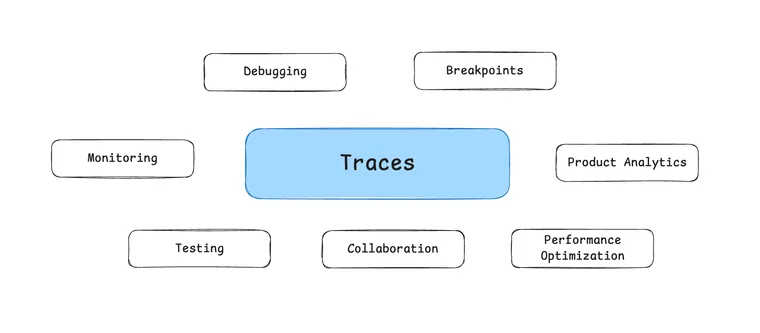

> “What we’ve got here is failure to communicate” - [Cool Hand Luke (1967)](https://www.youtube.com/watch?v=452XjnaHr1A&ref=blog.langchain.com)

Communication is the hardest part of life. It’s also the hardest part of building LLM applications.

New hires always requires a lot of communication when first joining a company, no matter how smart they may be. This might include getting a guidebook of key procedures and best practices, having a manager step in to help the new hire get up to speed, and gaining access to specific software to do the job properly. While ramping up, giving and receiving continuous feedback ensures that the new hire is successful in their role.

Just as onboarding a new hire requires thoughtful communication, building an agent also requires high standards for good communication. As smart as the underlying LLMs may become, they will still need the proper context to function reliably, and that context needs to be communicated properly.

💡

Most of the time when an agent is not performing reliably the underlying cause is not that the model is not intelligent enough, but rather that context and instructions have not been communicated properly to the model.

Don’t get me wrong - the models do mess up and have room to improve. But more often than not, it comes down to basic communication issues.

If we believe that communication is a key part of building LLM applications, then from that axiom, we can derive some other “hot takes” about agents that should hold. I’ve listed a few below in brief detail. All of these could (and maybe will) be individual blogs.

## Why prompt engineering isn’t going away

As models improve, prompt engineering tricks like [bribing an LLM with a tip](https://minimaxir.com/2024/02/chatgpt-tips-analysis/?ref=blog.langchain.com) or worrying about JSON vs XML formatting will become near obsolete. However, it will still be critical for you to effectively and clearly communicate to the model and give it clear instructions on how to handle various scenarios.

💡

The model is not a mind reader - if you want it to behave a certain way or process specific information, you must provide that context.

The best tip for diagnosing why your agent isn’t working is to simply look at the actual calls to the LLM and the exact inputs to the prompts— then make sure that if you gave these inputs to the smartest human you know, they would be able to respond as you expect. If they couldn’t do that, then you need to clarify your request, typically by adjusting the prompt. This process, known as prompt engineering, is unlikely to disappear anytime soon.

## Why code will make up a large part of the "cognitive architecture" of an agent

Prompts are one way to communicate to an LLM how they should behave as part of an agentic system, but code is just as important. Code is a fantastic way to communicate how a system should behave. Compared to natural language, code lets you communicate much more precisely the steps you expect a system to take.

💡

The ["cognitive architecture"](https://blog.langchain.com/what-is-a-cognitive-architecture/) of your agent will consist of both code and prompts.

Some instructions an agent can only be communicated in natural language. Others could be either code or language. Code can be more precise and more efficient, and so there are many spots we see code being more useful than prompts when building the ["cognitive architecture"](https://blog.langchain.com/what-is-a-cognitive-architecture/) of your agent.

## Why you need an agent framework

Some parts of coding are necessary for you, as an agent developer, to write, in order to best communicate to the agent what it should be doing. This makes up the cognitive architecture of your application and is part of your competitive advantage and moat.

💡

There are other pieces of code that you will have to write that are generic infrastructure and tooling that you need to build, but don't provide any differentiation. This is where an agent framework can assist.

An agent framework facilitates this by letting you focus on the parts of code that matter - what the agent should be doing — while taking care of common concerns unrelated to your application’s cognitive architecture, such as:

- Clear streaming of what the agent is doing
- Persistence to enable multi-tenant memory
- Infrastructure to power human-in-the-loop interaction patterns
- Running agents in a fault tolerant, horizontally scalable way

## Why it matters that LangGraph is the most controllable agent framework out there

You want an agent framework that takes care of some of the issues that are listed above, but that still lets you communicate as clearly as possible (through prompts and code) what the agent should be doing. Any agent framework that obstructs that is just going to get in the way - even if it makes it easier to get started. Transparently, that’s what we saw with `langchain` \- it made it easy to get started but suffered from built-in prompts, a hard-coded while loop, and wasn’t easy to extend.

We made sure to fix that with LangGraph.

💡

LangGraph stands apart from all other agent frameworks for its focus on being low-level, highly controllable, and highly customizable.

There is nothing built in that restricts the cognitive architectures you can build. The nodes and edges are nothing more than Python functions - you can put whatever you want inside them!

Agents are going to heavily feature code as part of their cognitive architecture. Agent frameworks can help remove some of the common infrastructure needs. But they CANNOT restrict the cognitive architecture of your agent. That will impede your ability to communicate what exactly you want to happen and the agent won’t be reliable.

## **Why agent frameworks like LangGraph are here to stay**

A somewhat common question I get asked is: “as the models get better, will that remove the need for frameworks like LangGraph?”. The underlying assumption is that the models will get so good that they will remove the need for any code around the LLM.

No.

If you’re using LangGraph to elicit better general purpose reasoning from models, then sure, maybe.

But that’s not how most people are using it.

💡

Most people are using LangGraph to build vertical-specific, highly customized agentic applications.

Communication is a key part of that, and code is a key part of communication. Communication isn’t going away, and so neither is code — and so neither is LangGraph.

## Why building agents is a multidisciplinary endeavor

One thing that we noticed quickly is that teams building agents aren’t just made up of engineers.

💡

Non-technical subject matter experts also often play a crucial role in the building process.

One key area is prompt engineering, where domain experts often write the best natural language instructions for prompts, since they know how the LLM should behave (more so than the engineers).

Yet, the value of domain experts goes beyond prompting. They can review the entire “cognitive architecture” of the agent, to make sure all logic (whether expressed in language or in code) is correct. Tools like [LangGraph Studio](https://blog.langchain.com/langgraph-studio-the-first-agent-ide/), which visualize the flow of your agent, make this process easier.

Domain experts can also help debug why an agent is messing up, as agents often mess up because of a failure to communicate - a gap that domain experts are well-equipped to spot.

## Why we made LangSmith the most user friendly “LLM Ops” tool

Since AI engineering requires multiple teams to collaborate to figure out how to best build with LLMs, an “LLM Ops” tool like LangSmith also focuses on facilitating that type of collaboration. What most of the triaging flow amounts to is – “Look at your data!”, and we want to make looking at large, mostly text responses very easy in LangSmith.

One thing we’ve invested in really heavily from the beginning is a beautiful UI for visualizing agent traces. This beauty serves a purpose - it makes it easier for domain experts of all levels of technical ability to understand what is going on. It communicates so much more clearly what is happening that JSON logs ever would.

💡

The visualization of traces within LangSmith allows everyone - regardless of technical ability - to understand what is happening inside the agent, and contribute to diagnosing any issues.

LangSmith also facilitates this cross team collaboration in other areas - most notably, the prompt playground- but I like to use tracing as an example because it is so subtle yet so important.

## Why people have asked us to expose LangSmith traces to their end users

For the same reasons listed above, we have had multiple companies ask to expose LangSmith traces to their end users. Understanding what the agent is doing isn’t just important for developers - it's also important for end users!

There are other (more user-friendly ways) to do this than our traces, of course. But it is still flattering to hear this request.

## Why UI/UX is the most important place to be innovating with AI

Most of this post has focused on the importance of communication with AI agents when building them, but this also extends to end users. Allowing users to interact with an agent in a transparent, efficient, and reliable way can be crucial for adoption.

💡

The power an AI application comes down to how well it facilitates human-AI collaboration, and for that reason we think UI/UX is one of the most important places to be innovating.

We’ve talked about different agentic UXs we see emerging ( [here](https://blog.langchain.com/ux-for-agents-part-1-chat-2/), [here](https://blog.langchain.com/ux-for-agents-part-2-ambient/), and [here](https://blog.langchain.com/ux-for-agents-part-3/)), but it’s still super early on in this space.

Communication is all you need, and so UI/UXs that best facilitate this human-agent interaction patterns will lead to better products.

## Communication is all you need

Communication can mean a lot of things. It’s an integral part of the human experience. As agents attempt to accomplish more and more humanlike tasks, I strongly believe that good communication skills will make you a better agent developer — whether it’s through prompts, code, or UX design.

Communication is not just expression in natural language, but it can also involve code to communicate more precisely. The best people to communicate something are the ones who understand it best, and so building these agents will become cross-functional.

And I’ll close with a tip from George Bernard Shaw “The single biggest problem in communication is the illusion that it has taken place.” If we want a future in which LLM applications are solving real problems, we need to figure out how to communicate with them better.

_Thanks to Nuno Campos, Julia Schottenstein, and Linda Ye for reading drafts of this._

### Tags

[Harrison's Hot Takes](https://blog.langchain.com/tag/in-the-loop/)

[**On Agent Frameworks and Agent Observability**](https://blog.langchain.com/on-agent-frameworks-and-agent-observability/)

[Harrison's Hot Takes](https://blog.langchain.com/tag/in-the-loop/) 4 min read

[**From Traces to Insights: Understanding Agent Behavior at Scale**](https://blog.langchain.com/from-traces-to-insights-understanding-agent-behavior-at-scale/)

[Harrison's Hot Takes](https://blog.langchain.com/tag/in-the-loop/) 5 min read

[**In software, the code documents the app. In AI, the traces do.**](https://blog.langchain.com/in-software-the-code-documents-the-app-in-ai-the-traces-do/)

[Harrison's Hot Takes](https://blog.langchain.com/tag/in-the-loop/) 5 min read

[**Agent Frameworks, Runtimes, and Harnesses- oh my!**](https://blog.langchain.com/agent-frameworks-runtimes-and-harnesses-oh-my/)

[Harrison's Hot Takes](https://blog.langchain.com/tag/in-the-loop/) 3 min read

[**Reflections on Three Years of Building LangChain**](https://blog.langchain.com/three-years-langchain/)

[Harrison's Hot Takes](https://blog.langchain.com/tag/in-the-loop/) 6 min read

[**Not Another Workflow Builder**](https://blog.langchain.com/not-another-workflow-builder/)

[Harrison's Hot Takes](https://blog.langchain.com/tag/in-the-loop/) 4 min read