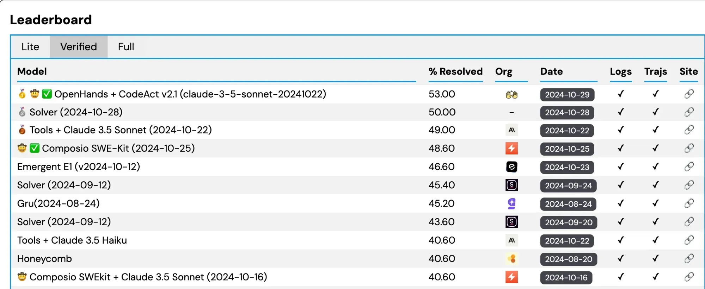
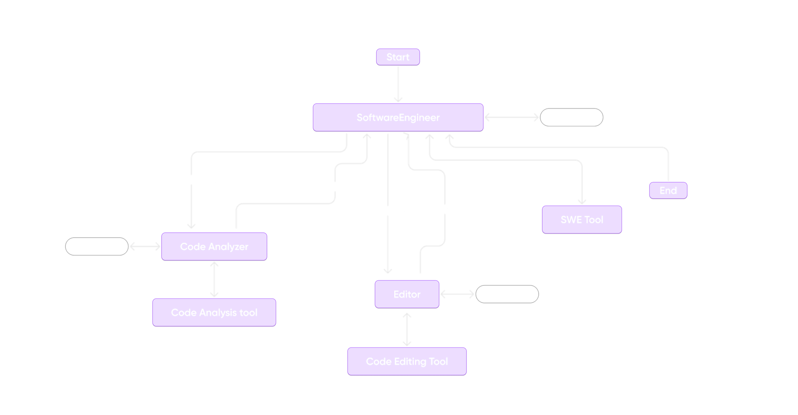
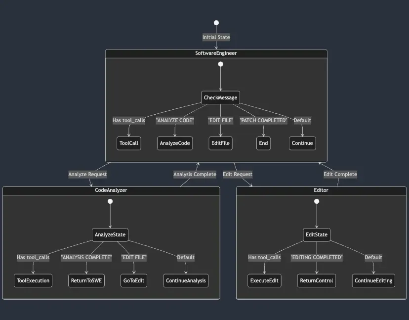
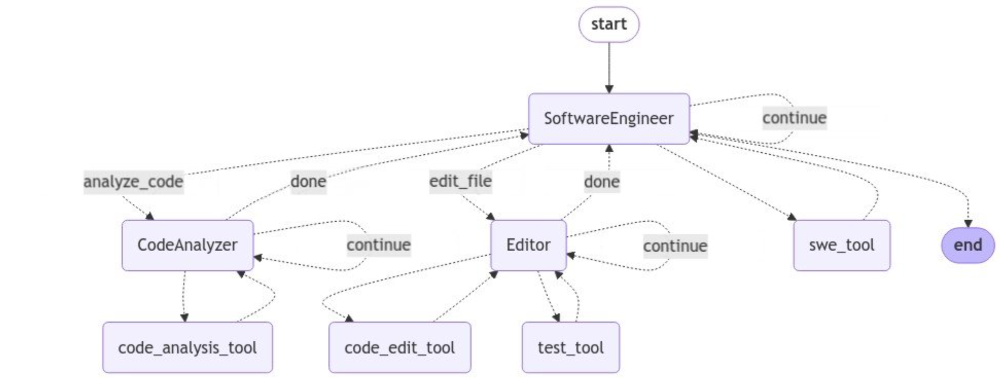

We are excited to launch SWE-Kit, an open-source headless IDE with AI-native coding toolkits for AI agents, as part of Composio's agent tooling ecosystem. SWE-kit offers a headless IDE featuring Language Server Protocol (LSP) for code intelligence and a development container for secure code execution. It also features comprehensive coding tools like CodeAnalysis, Shell tools, File management and Git tools.

To demonstrate SWE-Kit’s efficiency, we built a complete SWE agent using LangGraph and tested it on the [SWE Bench](https://www.swebench.com/?ref=blog.langchain.com).

This benchmark evaluates the effectiveness of coding agents on real-world software engineering tasks. It comprises 2294 GitHub issues from popular Python libraries, such as Django, SymPy, Flask, Scikit-learn, etc.



The verified track consists of a human-validated subset of 500 problems reviewed by software engineers. Our agent solved 243 issues, an accuracy rate of 48.60%, placing fourth overall and second in the open-source category.

## SWE agent architecture



### Building agents as state-machines using LangGraph

Managing agent states is a critical component of building reliable agentic workflows. Moving beyond a basic architecture, we adopted a graph-based approach using LangGraph, allowing us to model agents as state machines for efficient and transparent state management.

Rather than relying on routers or orchestrator agents to handle communication—methods that struggle to control or manage hidden states effectively—we flattened our workflow into state graphs, where each agent is a **state machine**. This approach provides a structured and robust solution to orchestrate agent interactions and control hidden states seamlessly.

### Monitoring with LangSmith

Another crucial aspect of agentic automation is monitoring, which becomes especially vital due to agents' non-deterministic nature. Monitoring allows granular visibility of underlying agent actions, giving you an idea of what is happening. So, we adopted **LangSmith**, which offers comprehensive logging of the actions taken by agents, providing a holistic context. Besides, it is highly compatible with LangGraph. We used it to monitor actions taken by agents at each step of solving issues, which subsequently helped us better our tools.

### Specialist vs. generalist agents

Our approach uses specialized agents with distinct toolsets, each focused on specific tasks:

- **Software Engineering Agent**: Responsible for task delegation, workflow initiation, and termination.
- **CodeAnalyzer Agent**: Analyzes codebases to gather insights on classes, methods, and functions.
- **Editor Agent**: Manages navigation within the codebase and file modifications.

This specialization improves performance by allowing each agent to focus on a well-defined task.

## Workflow analysis

The LangGraph workflow consists of three separate agent and tool nodes. Each agent has pre-defined tasks and tools it can utilize based on the current workflow.



### Workflow nodes and transitions

1. **Software Engineer Node**:
1. This agent initiates the workflow and determines subsequent actions based on its current state and message history.
2. If the **Software Engineer** node decides an analysis is needed, it transitions to the **Code Analyzer**. If it requires file editing, it transitions to the **Editor**.
3. Depending on the task, the agent can use the SWE tools to generate a repository tree to understand the codebase better and create patch files as part of the solution.
4. When the workflow reaches this node, the **Code Analyzer** agent performs code analysis tasks using the **Code Analysis Tool**. After completing the analysis, it may:
      - Return to the **Software Engineer** if the analysis is done.
      - Transition to the **Editor** if file edits are required.
      - Use **continue** to stay within the **Code Analyzer** state if more analysis is needed.
5. Uses the **CodeAnalysis tool** to generate Fully Qualified Domain Name (FQDN) code mappings, enabling precise identification and localization of code within the project.
2. **CodeAnalyzer Node**:
1. When the workflow reaches this node, the **Code Analyzer** agent performs code analysis tasks using the **Code Analysis Tool**. After completing the analysis, it may:
      - Return to the **Software Engineer** if the analysis is done.
      - Transition to the **Editor** if file edits are required.
      - Use **continue** to stay within the **Code Analyzer** state if more analysis is needed.
2. Uses the **CodeAnalysis tool** to generate Fully Qualified Domain Name (FQDN) code mappings, enabling precise identification and localization of code within the project. In code analysis, an FQDN (Fully Qualified Domain Name) is a unique identifier representing a specific code element, such as a class, method, or function, by tracing its full path within the codebase. Learn more about it [here](https://composio.dev/blog/tool-design-is-all-you-need-for-sota-swe-agents/?ref=blog.langchain.com).
3. **Editor Node**:
1. The **Editor** agent is responsible for editing files. Once editing is complete, the agent can:
      - Transition back to **Software Engineer** if editing tasks are complete.
      - Continue within the **Editor** if more editing actions are needed.
2. Uses the **Code Editing Tool** to \*\*\*\*create a repository tree, navigate code bases, and open and edit files.
4. **Tool Nodes**:

- **Code Analyzer Tool Node**: Used by the **Code Analyzer** agent for performing detailed code analysis.
- **Code Editor Tool Node**: Used by the **Editor** agent for file editing tasks.
- **SWE Tool Node**: Contains software engineering-related tools that the **Software Engineer** agent can access.

## State management in multi-agent LangGraph system

Effective state management is crucial for reliability and predictability when building complex multi-agent systems. The LangGraph architecture implements a sophisticated state management system that avoids the pitfalls of hidden states while maintaining clear agent boundaries and transitions.

### Core agent state

```
class AgentState(TypedDict):
    messages: Annotated[Sequence[BaseMessage], operator.add]
    sender: str
    consecutive_visits: dict
```

The state object maintains three critical pieces of information:

- Message history that preserves the conversation context
- Current sender identity to track agent ownership
- Visit counts to track repeated visits to prevent unintended loops.

### State transition control

LangGraph’s state management allows for controlled and predictable transitions between agents. Each agent’s following action is determined by conditional logic based on its current state and message history, ensuring that agents only engage in relevant tasks.

```
# Router examines message content to determine next state
def router(state):
    messages = state["messages"]
    last_ai_message = get_last_ai_message(messages)

    # Explicit state transitions based on message markers
    if "ANALYZE CODE" in last_ai_message.content:
        return "analyze_code"
    if "EDIT FILE" in last_ai_message.content:
        return "edit_file"
    if "PATCH COMPLETED" in last_ai_message.content:
        return "__end__"
```

In the above routing code block, the `router` function uses specific markers in the last AI message to control state transitions:

- **"ANALYZE CODE"**: Switches to the `analyze_code` state for analysis tasks.
- **"EDIT FILE"**: Moves to the `edit_file` state for file edits.
- **"PATCH COMPLETED"**: Ends the workflow by transitioning to the `__end__` state.

This logic ensures agents perform only relevant actions, keeping the workflow efficient and predictable.



### Agent state boundaries

LangGraph ensures that each agent operates within well-defined boundaries, meaning their actions are determined solely by their state and message history.

```
# Software Engineer state transitions
workflow.add_conditional_edges(
    software_engineer_name,
    router,
    {
        "continue": software_engineer_name,
        "analyze_code": code_analyzer_name,
        "edit_file": editor_name,
        "__end__": END,
    }
)
# Code Analyzer state transitions
workflow.add_conditional_edges(
    code_analyzer_name,
    code_analyzer_router,
    {
        "continue": code_analyzer_name,
        "done": software_engineer_name,
        "edit_file": editor_name,
    }
)
```

The code above defines specific state transitions for each agent, ensuring they operate within defined boundaries:

- The **Software Engineer** agent transitions based on conditions set in the `router` function, allowing it to continue its tasks, switch to code analysis, initiate file edits, or end the workflow.
- The **Code Analyzer** agent follows conditions in `code_analyzer_router`, enabling it to continue analysis, return control to the Software Engineer, or transition to the Editor for file modifications.

This setup ensures **clear task delegation** with no overlap, **modularity** through self-contained states and transitions, and **predictability** by controlling state transitions, preventing unintended side effects.

## Empowering developers to build real-world agents

One motivation behind SWE-Kit was to make it convenient for developers to build their closing agents. The platform's modular design lets developers mix and match tools, frameworks, and LLMs to create custom agents that fit their workflow.

Our vision extends beyond software engineering to various real-world applications, including CRM, HRM, and administration. By making agent-driven automation dependable and accessible, we aim to equip developers to build intelligent agents capable of transforming workflows across industries.