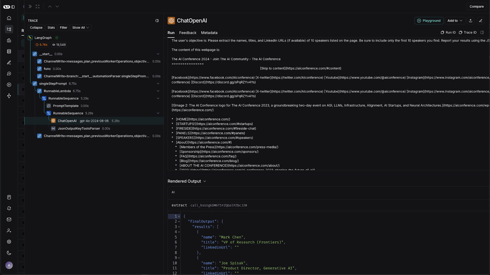
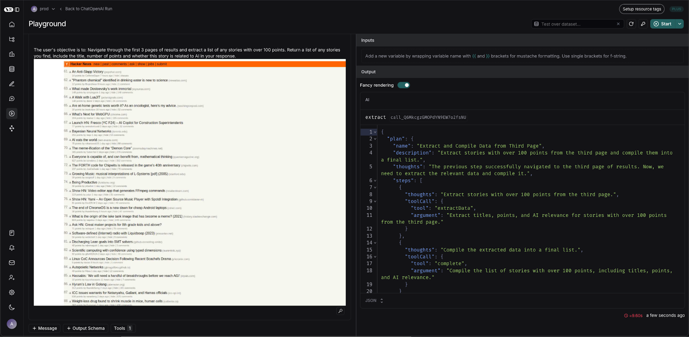
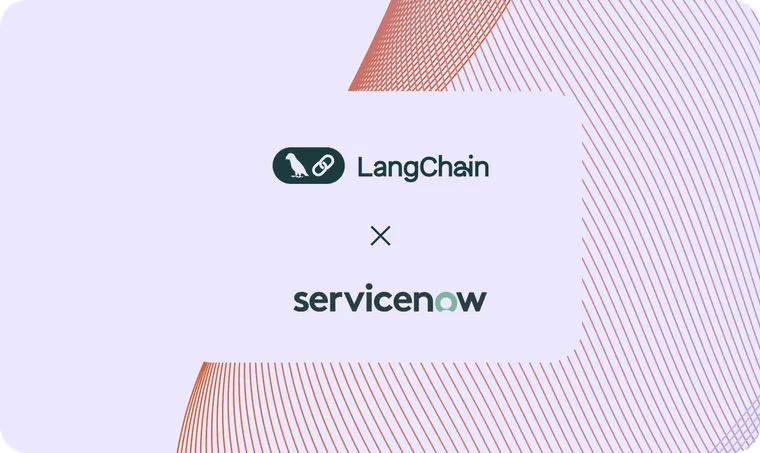

[Airtop](https://www.airtop.ai/?ref=blog.langchain.com) is a powerful platform that empowers developers to create scalable, production-ready web automations with simplicity and precision. Airtop is at the forefront of enabling agents to interact intelligently with the web, it empowers agents to perform actions such as logging in, extracting information, filling forms, and interacting with web interfaces—all through natural language commands.

AI agents are only as functional as the data they can access. Navigating websites at scale introduces challenges like authentication and Captchas. Airtop bridges this gap by providing developers with a reliable way to control browsers via natural language APIs, eliminating the need for complex CSS selector hacks or Puppeteer scripts.

Leveraging the full LangChain ecosystem (LangChain, LangSmith, and LangGraph), Airtop has built a number of browser solutions, including:

1. **Extract API**: Enables **extraction of structured information** from web pages, like lists of speakers, LinkedIn URLs, or monitoring flight prices. Also works with authenticated sites for use cases like social listening and e-commerce.
2. **Act API:** Adds the **ability to take actions on websites,** such as entering search queries or interacting with UI elements in real-time.

## **Simplifying model integration with LangChain**

As Airtop set out to build its cloud-based browsers for AI agents, they needed a platform that could flexibly integrate various LLM models. [LangChain](https://www.langchain.com/langchain?ref=blog.langchain.com) quickly stood out because of its "batteries-included" approach. With built-in integrations for the GPT-4 series, Claude, Fireworks, and Gemini, LangChain saved Airtop countless hours of development time.

“The standardized interface LangChain provides has been a game-changer,” shared Kyle, Airtop’s AI Engineer. “We can switch between models effortlessly, which has been critical as we optimize for different use cases.”

## **Building a flexible agent architecture in LangGraph**

As Airtop looked to add more browser automations, their engineering team turned to [LangGraph](https://www.langchain.com/langgraph?ref=blog.langchain.com) to leverage its flexible architecture to build their agent system. With LangGraph, Airtop constructed individual browser automations as subgraphs. This also helped future-proof their application, as it would be easy to add in additional subgraphs as they expanded their automations — giving the team more dynamic control without needing to redesign their control flow.

As Airtop designed their agents, the team decided to start small with micro-capabilities for their agents, then building out their system with more sophisticated agents that could click on elements on the site and perform keystrokes. As their agents evolved, reliability was top-of-mind. LangGraph helped Airtop validate the accuracy of their agent steps as it took actions on a website.

## **Debugging and refining prompts in LangSmith**

While Airtop originally began using LangSmith to debug issues that would come in through customer support tickets, they quickly also discovered that [LangSmith](https://www.langchain.com/langsmith?ref=blog.langchain.com) could speed up multiple parts of their development process.

During development, Airtop used LangSmith for prompt engineering and dynamic testing. When nebulous error messages arose from AI models like OpenAI or Claude, LangSmith’s multimodal debugging features offered clarity, allowing the team to identify whether issues stemmed from formatting problems or misplaced prompt components.

In addition, it was important for the Airtop team to empower their users with reliable web automation capabilities. They utilized LangSmith’s playground to iterate on prompts and run parallel model requests, simulating real-world use cases on the fly. This sped up Airtop’s internal workflows and enhanced their ability to deliver more accurate, tailored responses to users.

## **What’s next**

Airtop has significantly accelerated its time-to-market for AI agent-powered web automation solutions. With LangGraph’s controllable agent framework and LangSmith for testing in development, the team ensures robust agent performance.

_“Each innovation becomes a foundation for what's next,”_ said Daniel Shteremberg, Airtop’s CTO. _“With LangChain and LangSmith, we can create solutions that are adaptable, reliable, and future-proof.”_

In the future, the Airtop team aims to:

1. **Build even more sophisticated agents**, with advanced LangGraph agents capable of performing multi-step, high-value tasks, such as stock market analysis or enterprise-level automation.
2. **Adding additional** micro-capabilities to the platform, enabling AI agents to perform an unlimited range of actions across the web.
3. **Enhanced benchmarking**: Further refining their benchmarking system to evaluate performance across a wider array of model configurations and use cases.

### Tags

[Case Studies](https://blog.langchain.com/tag/case-studies/)

[**monday Service + LangSmith: Building a Code-First Evaluation Strategy from Day 1**](https://blog.langchain.com/customers-monday/)

[Case Studies](https://blog.langchain.com/tag/case-studies/) 8 min read

[**How Remote uses LangChain and LangGraph to onboard thousands of customers with AI**](https://blog.langchain.com/customers-remote/)

[Case Studies](https://blog.langchain.com/tag/case-studies/) 5 min read

[**Fastweb + Vodafone: Transforming Customer Experience with AI Agents using LangGraph and LangSmith**](https://blog.langchain.com/customers-vodafone-italy/)

[Case Studies](https://blog.langchain.com/tag/case-studies/) 7 min read

[**How Jimdo empower solopreneurs with AI-powered business assistance**](https://blog.langchain.com/customers-jimdo/)

[Case Studies](https://blog.langchain.com/tag/case-studies/) 4 min read

[**How ServiceNow uses LangSmith to get visibility into its customer success agents**](https://blog.langchain.com/customers-servicenow/)

[Case Studies](https://blog.langchain.com/tag/case-studies/) 4 min read

[**Monte Carlo: Building Data + AI Observability Agents with LangGraph and LangSmith**](https://blog.langchain.com/customers-monte-carlo/)

[Case Studies](https://blog.langchain.com/tag/case-studies/) 4 min read