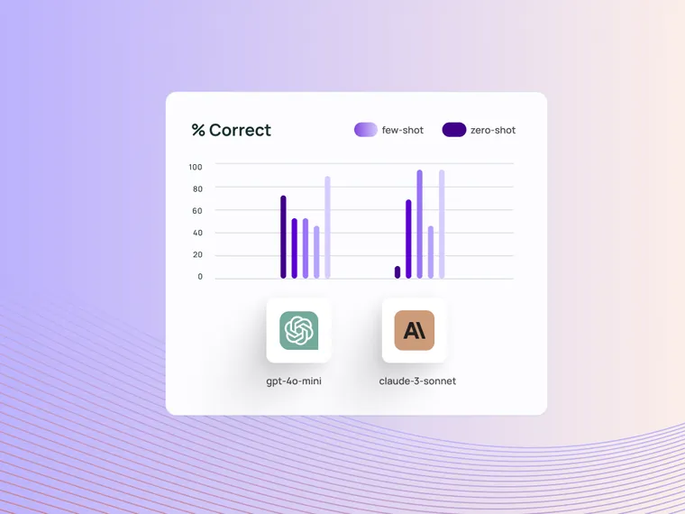

We’ve recently released v0.2 of the LangSmith SDKs, which come with a number of improvements to the developer experience for evaluating applications. We have simplified usage of the `evaluate()` / `aevaluate()` methods, added an option to run evaluations locally without uploading any results, improved SDK performance, and expanded our documentation. These improvements have been made in both the Python and TypeScript SDKs.

The v0.2 release has 2 breaking changes in the Python SDK. These are listed at the bottom.

## Simplified usage of `evaluate()` / `aevaluate()`

### **Simpler evaluators**

The LangSmith SDK’s allow you to define [custom evaluators](https://docs.smith.langchain.com/evaluation/how_to_guides/custom_evaluator?ref=blog.langchain.com), which are functions that score your application’s outputs on a dataset. Before today, these evaluators had to take as arguments a Run and an Example object:

```python
from langsmith import evaluate
from langsmith.schemas import Run, Example

def correct(run: Run, example: Example) -> dict:
  outputs = run.outputs
  inputs = example.inputs
  reference_outputs = example.outputs

	score = run.outputs['answer'] == example.outputs['answer']
  return {"key": "correct", "score": score}

results = evaluate(..., evaluators=[correct])
```

In v0.2, you can write this in Python as:

```python
from langsmith import evaluate

def correct(inputs: dict, outputs: dict, reference_outputs: dict) -> bool:
  return outputs["answer"] == reference_outputs["answer"]

results = evaluate(..., evaluators=[correct])
```

And in TypeScript as:

```tsx
import type { EvaluationResult } from "langsmith/evaluation";

const correct = async ({
  outputs,
  referenceOutputs,
}: {
  outputs: Record<string, any>;
  referenceOutputs?: Record<string, any>;
}): Promise<EvaluationResult> => {
  const score = outputs?.answer === referenceOutputs?.answer;
  return { key: "correct", score };
};
```

The keys changes are as follows:

- You can write evaluator functions that accept the `inputs`, `outputs`, `reference_outputs` dicts as args. If needed, you can continue to pass in `run` and `example` to access run [intermediates steps or run/example metadata.](https://docs.smith.langchain.com/evaluation/how_to_guides/evaluate_on_intermediate_steps?ref=blog.langchain.com)
- (Python only) Yo can return primitives _(float, int, bool, str)_ directly

Analogous simplifications have been made to [summary evaluators](https://docs.smith.langchain.com/evaluation/how_to_guides/summary?ref=blog.langchain.com) and [pairwise evaluators](https://docs.smith.langchain.com/evaluation/how_to_guides/evaluate_pairwise?ref=blog.langchain.com). For more on defining evaluators head to [this how-to guide](https://docs.smith.langchain.com/evaluation/how_to_guides/custom_evaluator?ref=blog.langchain.com).

### **Evaluate `langgraph` and `langchain` objects directly**

You can now pass your `langgraph` and `langchain` objects directly into `evaluate()` / `aevaluate()`:

```python
from langchain.chat_models import init_chat_model
from langgraph.prebuilt import create_react_agent
from langsmith import evaluate

def check_weather(location: str) -> str:
		'''Return the weather forecast for the specified location.'''
		return f"It's always sunny in {location}"

tools = [check_weather]
model = init_chat_model("gpt-4o-mini")
graph = create_react_agent(model, tools=tools)

results = evaluate(graph, ...)
```

For more on evaluating `langgraph` and `langchain` objects, see these how-to guides: [langgraph](https://docs.smith.langchain.com/evaluation/how_to_guides/langgraph?ref=blog.langchain.com), [langchain](https://docs.smith.langchain.com/evaluation/how_to_guides/langchain_runnable?ref=blog.langchain.com).

### **Consolidated evaluation methods**

Previously, there were three different methods for running evaluations (not counting their async counterparts): `evaluate()`, `evaluate_existing()` and `evaluate_comparative()` / `evaluateComparative()` . The first was for running your application on a dataset and scoring the outputs, the second for just running evaluators on existing experiment results, and the third for running pairwise evaluators on two existing experiments.

In v0.2, you only need to know about the `evaluate()` method:

```python
from langsmith import evaluate

# Run the application and evaluate the results
def app(inputs: dict) -> dict:
  return {"answer": "i'm not sure"}

results = evaluate(app, data="dataset-name", evaluators=[correct])

# Run new evaluators on existing experimental results
def concise(outputs: dict) -> bool:
	return len(outputs["answer"]) < 10

more_results = evaluate(
	results.experiment_name,  # Pass in an experiment name/ID instead of a function.
	evaluators=[concise].
)

# Run comparative evaluation
# First we need to run a second experiment
def app_v2(inputs: dict) -> dict:
	return {"answer": "i dunno you tell me"}

results_v2 = evaluate(app_v2, data="dataset-name", evaluators=[correct])

# Note: 'outputs' is a two-item list for pairwise evaluators.
def more_concise(outputs: list[dict]) -> bool:
	v1_len = len(outputs[0]["answer"])
	v2_len = len(outputs[1]["answer"])
	if v1_len < v2_len:
		return [1, 0]
	elif v1_len > v2_len:
		return [0, 1]
	else:
		return [0, 0]

comparative_results = evaluate(
	[results.experiment_name, results_v2.experiment_name],  # Pass in two experiment names/IDs instead of a function.
	evaluators=[more_concise],  # Pass in a pairwise evaluator(s).
)
```

For more see our how-to guides on [pairwise experiments](https://docs.smith.langchain.com/evaluation/how_to_guides/evaluate_pairwise?ref=blog.langchain.com) and [evaluating existing experiments](https://docs.smith.langchain.com/evaluation/how_to_guides/evaluate_existing_experiment?ref=blog.langchain.com).

## Beta: Run evaluations without uploading results

Sometimes it is helpful to run an evaluation locally without uploading any results to LangSmith. For example, if you're quickly iterating on a prompt and want to smoke test it on a few examples, or if you're validating that your target and evaluator functions are defined correctly, you may not want to record these evaluations.

In the v0.2 Python SDK, you can do this by simply setting:

```python
results = evaluate(..., upload_results=False)
```

The output of this will look exactly the same as it did before, but there will be no sign of this experiment in LangSmith. For more head to our [how-to guide on running evals locally](https://docs.smith.langchain.com/evaluation/how_to_guides/local?ref=blog.langchain.com).

**Note that this feature is still in beta and only supported in Python.**

## **Improved Python SDK performance**

We’ve also made several improvements to the Python SDK's evaluation performance for large examples, resulting in approximately a 30% speedup in `aevaluate()` for examples ranging from 1 to 4MB .

## **Revamped documentation**

We’ve rewritten most of our [evaluation how-to guides](https://docs.smith.langchain.com/evaluation/how_to_guides?ref=blog.langchain.com), revamping existing guides and adding a number of new ones related to the improvements mentioned in this post. We’ve also updated the Python SDK API Reference and consolidated it with the main LangSmith docs: [https://docs.smith.langchain.com/reference/python](https://docs.smith.langchain.com/reference/python?ref=blog.langchain.com)

## Breaking changes

In the Python SDK, two breaking changes have been made:

- In the Python SDK, `evaluate` / `aevaluate` now have a default `max_concurrency=0` instead of `None`. This makes it so that by default no concurrency is used instead of unlimited concurrency.
- In the Python SDK, if you pass in a string as the data arg to evaluate: `evaluate(..., data="...")` / `aevaluate(..., data="...")`, we will now check if that string corresponds to a UUID and should be treated as the dataset ID before treating it as the dataset name. Previously, it was always assumed that a string value corresponds to the dataset name.
- We’ve officially dropped support for Python 3.8, which reached its EOL in October 2024.

### Tags

[By LangChain](https://blog.langchain.com/tag/by-langchain/)


[](https://blog.langchain.com/evaluating-deep-agents-our-learnings/)

[**Evaluating Deep Agents: Our Learnings**](https://blog.langchain.com/evaluating-deep-agents-our-learnings/)

[By LangChain](https://blog.langchain.com/tag/by-langchain/) 7 min read

[](https://blog.langchain.com/end-to-end-opentelemetry-langsmith/)

[**Introducing End-to-End OpenTelemetry Support in LangSmith**](https://blog.langchain.com/end-to-end-opentelemetry-langsmith/)

[By LangChain](https://blog.langchain.com/tag/by-langchain/) 3 min read

[](https://blog.langchain.com/langchain-state-of-ai-2024/)

[**LangChain State of AI 2024 Report**](https://blog.langchain.com/langchain-state-of-ai-2024/)

[By LangChain](https://blog.langchain.com/tag/by-langchain/) 6 min read

[](https://blog.langchain.com/opentelemetry-langsmith/)

[**Introducing OpenTelemetry support for LangSmith**](https://blog.langchain.com/opentelemetry-langsmith/)

[By LangChain](https://blog.langchain.com/tag/by-langchain/) 4 min read

[](https://blog.langchain.com/langgraph-platform-announce/)

[**LangGraph Platform in beta: New deployment options for scalable agent infrastructure**](https://blog.langchain.com/langgraph-platform-announce/)

[By LangChain](https://blog.langchain.com/tag/by-langchain/) 4 min read

[](https://blog.langchain.com/few-shot-prompting-to-improve-tool-calling-performance/)

[**Few-shot prompting to improve tool-calling performance**](https://blog.langchain.com/few-shot-prompting-to-improve-tool-calling-performance/)

[By LangChain](https://blog.langchain.com/tag/by-langchain/) 8 min read