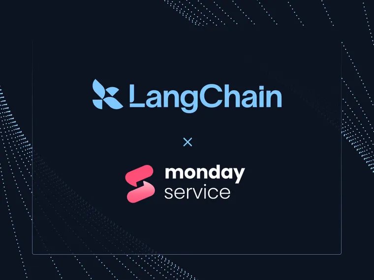

[Acxiom](https://www.acxiom.com/?ref=blog.langchain.com) ®  is the global leader in customer intelligence and AI-enabled, data-driven marketing. As part of Interpublic, Inc. (IPG), Acxiom specializes in high-performance solutions that boost customer acquisition and retention while fueling growth for the world's biggest brands and agencies. With its AI-powered identity foundation, cloud-based data management, and martech & analytics services, Acxiom has transformed omnichannel marketing strategies and execution. For over 55 years, its teams across the US, UK, Germany, China, Poland, and Mexico have helped businesses optimize their marketing and advertising investments while prioritizing customer privacy.

## **Key challenges in scaling AI-driven audience segmentation**

As a leader in data and consumer identity solutions, Acxiom continually seeks innovative ways to identify and deliver precise marketing audience segments. When tasked with evaluating large language models (LLMs) for dynamic audience creation, Acxiom's Data and Identity Data Science team faced a unique set of challenges in building a scalable, robust generative AI solution to create audience segments based on user input.

The Acxiom team initially developed a prompt input/output logging system to track and troubleshoot LLM calls. However, as their user base expanded, the team realized that lightweight logging solutions like this would not scale effectively. Instead, they needed a robust observability platform to properly support the agent application’s growing user base. Acxiom’s goal was to streamline the creation of unit tests with annotations and to improve troubleshooting bugs.

Acxiom aimed to develop an application capable of interpreting natural language input from users and transforming it into detailed audience segments from their expansive data catalog. For example, a user might request: _"Identify an audience of men over thirty who rock climb or hike but aren’t married."_ The application then needed to (1) deliver a JSON structure containing curated IDs and values from Acxiom’s transactional and predictive data products, and (2) handle the following requirements:

- **Conversational memory**: Have long-term memory for maintaining context across unrelated user conversations while building audience segments.
- **Dynamic updates**: Be able to refine or update audience segments during the session.
- **Data consistency**: Perform accurate attribute-specific searches without forgetting or hallucinating previously processed information.

Initially, the team designed a workflow using LangChain's Retrieval-Augmented Generation (RAG) tools with custom agentic code. The RAG workflow would only use metadata and the data dictionary of Acxiom’s core data products with detailed descriptions. However, additional pain points arose as the Acxiom team scaled their solution. These included:

- **Complex debugging**: Failures or omissions in LLM reasoning cascaded into incorrect or hallucinated results.
- **Scaling issues**: The original logging mechanism was limited, making it difficult to scale across multiple users.
- **Evolving requirements**: Continuous feature growth demanded iterative development, introducing complexity in the agent-based architecture.

## **Leveraging LangSmith for scalable LLM observability**

To solve these pain points, Acxiom adopted [LangSmith](https://www.langchain.com/langsmith?ref=blog.langchain.com), the LLM testing & observability platform developed by LangChain. LangSmith provided critical observability features, unlocking efficient debugging and scalability; it also seamlessly integrated with Acxiom’s hybrid ecosystem of open-source and proprietary models, including custom agent code built on LangChain primitives.

LangSmith integrated with Acxiom’s existing LangChain-based codebase with little additional effort. With its simple decorators, LangSmith provided the Acxiom team full visibility into LLM calls, function executions, and utility workflows so they could troubleshoot issues efficiently. LangSmith’s flexible support for a wide range of models — including open-source vLLM, Claude via AWS Bedrock, and Databricks’ model endpoints — also allowed Acxiom to continue using their existing technology stack without disruption.

To gain a deeper understanding of complex workflows and to troubleshoot, the tree-structured trace visualization and metadata tracking tools in LangSmith were particularly helpful. These helped the Acxiom team identify bottlenecks in requests that involved more than 60 LLM calls and 200k tokens for a single user interaction.

As Acxiom’s workflow evolved, LangSmith’s scalability proved invaluable. The platform’s ability to log and annotate arbitrary code allowed the team to adapt as new agents, such as an overseer and researcher agent, were added to the architecture for more nuanced decision-making related to audience-building.

## **Impact**

With LangSmith, Acxiom’s engineers achieved significant improvements across their application for building more refined audience segments in several ways:

- **Streamlined debugging for campaign optimization**: LangSmith’s deep visibility into nested LLM calls and RAG agents simplified troubleshooting and accelerated the development of more refined audience segments for marketing campaigns.
- **Improved audience reach**: The platform’s hierarchical agent architecture led to more accurate and dynamic audience segment creation, enabling Acxiom to deliver more relevant, data-driven recommendations for marketing strategies.
- **Scalable growth for marketing initiatives**: The system could handle increasing user demands and complexity without needing to reengineer the observability layer.
- **Optimized token usage**: Visibility into token and call usage informed cost management strategies for the Acxiom team’s hybrid model approach.

## **Conclusion**

By integrating with LangSmith, Acxiom successfully overcame the challenges of building a generative AI-based audience segmentation system. The platform’s flexibility and robust observability features enabled Acxiom to transform a complex technical vision into a scalable, user-friendly application that not only meets the demands of a growing user base but also drives better marketing precision.

### Tags

[Case Studies](https://blog.langchain.com/tag/case-studies/)

[**monday Service + LangSmith: Building a Code-First Evaluation Strategy from Day 1**](https://blog.langchain.com/customers-monday/)

[Case Studies](https://blog.langchain.com/tag/case-studies/) 8 min read

[**How Remote uses LangChain and LangGraph to onboard thousands of customers with AI**](https://blog.langchain.com/customers-remote/)

[Case Studies](https://blog.langchain.com/tag/case-studies/) 5 min read

[**Fastweb + Vodafone: Transforming Customer Experience with AI Agents using LangGraph and LangSmith**](https://blog.langchain.com/customers-vodafone-italy/)

[Case Studies](https://blog.langchain.com/tag/case-studies/) 7 min read

[**How Jimdo empower solopreneurs with AI-powered business assistance**](https://blog.langchain.com/customers-jimdo/)

[Case Studies](https://blog.langchain.com/tag/case-studies/) 4 min read

[**How ServiceNow uses LangSmith to get visibility into its customer success agents**](https://blog.langchain.com/customers-servicenow/)

[Case Studies](https://blog.langchain.com/tag/case-studies/) 4 min read

[**Monte Carlo: Building Data + AI Observability Agents with LangGraph and LangSmith**](https://blog.langchain.com/customers-monte-carlo/)

[Case Studies](https://blog.langchain.com/tag/case-studies/) 4 min read