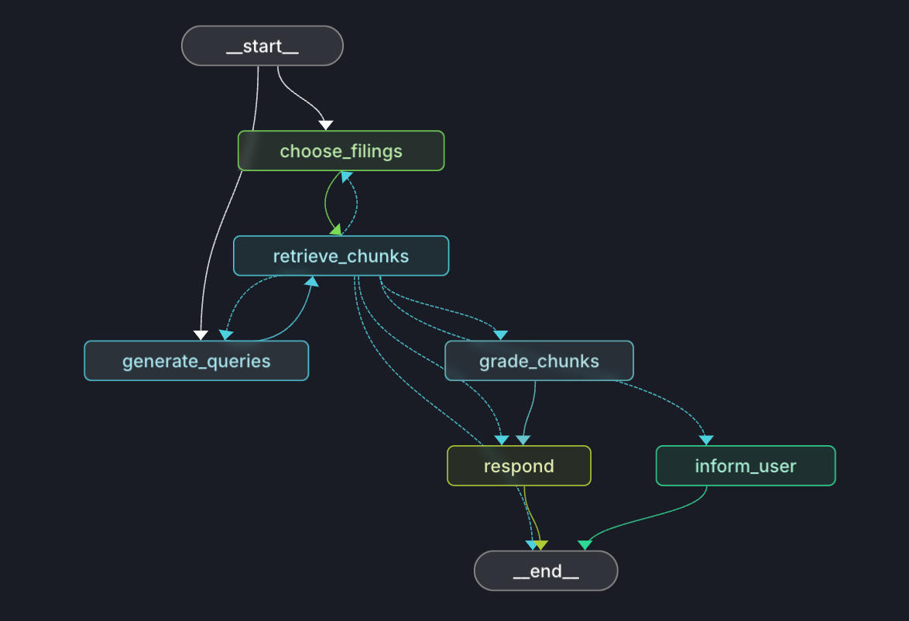
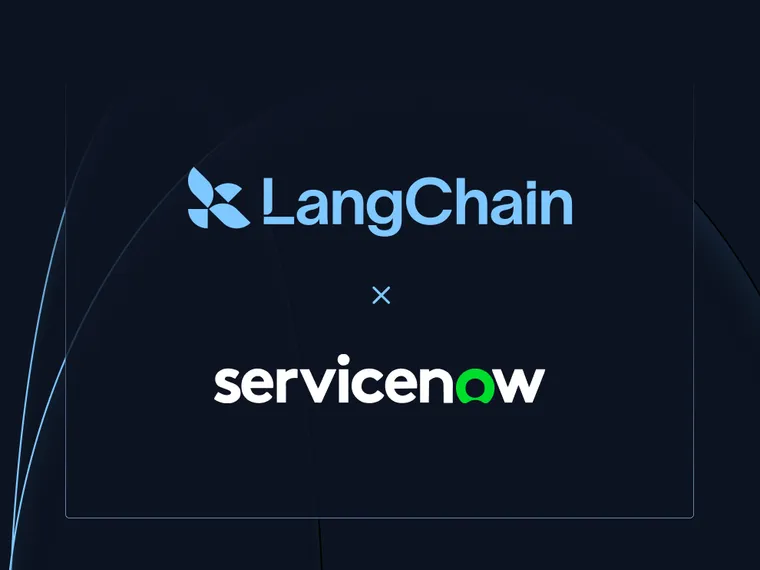

[Captide’s platform](https://www.captide.co/?ref=blog.langchain.com) transforms how investment research teams work with financial data. By automating the extraction of insights and metrics from regulatory filings and investor relations documents, analysts can create customized datasets and analyses with extreme efficiency. At the heart of this innovation is their commitment to NLP workflows and its strategic integration of LangGraph and LangSmith, hosted on [LangGraph Platform](https://langchain-ai.github.io/langgraph/concepts/langgraph_platform/?ref=blog.langchain.com).

## Redefining Financial Analysis with NLP Workflows

By allowing users to articulate complex analysis tasks in natural language, [Captide](https://www.captide.co/?ref=blog.langchain.com) simplifies the process of extracting financial metrics, creating customized datasets, and uncovering contextual insights. Once the user defines their analysis tasks, Captide’s agents take over, orchestrating the entire data retrieval and processing pipeline from a big corpus of financial documents.

This seamless transition from query to actionable results redefines efficiency in financial analysis. It provides unmatched flexibility to extract company-specific metrics and insights, overcoming the fixed-schema limitations of legacy platforms, while analyzing exponentially larger volumes of investments.

To achieve this, Captide relies on the capabilities of LangGraph and LangSmith, ensuring precision, scalability, and reliable outputs that align with the stringent standards of the financial industry.

## Using LangGraph for parallel processing and structured outputs

💡

LangGraph has become indispensable in Captide’s technological stack.

The framework’s intuitive design has streamlined development, reducing the complexity of tracking agent workflows while enhancing operational efficiency. With LangGraph, Captide’s team can manage complex agentic processes, such as parallel document processing and creation of structured outputs with ease.

For example, when analyzing vast troves of regulatory filings, LangGraph’s parallel processing capabilities come into play. Multiple agents work simultaneously to execute ticker-specific vector store queries, retrieve relevant documents, and grade each document chunks. This approach not only minimizes latency but also eliminates the need to complicate the codebase with asynchronous functions.

The platform’s ability to generate structured outputs is another highlight. By leveraging LangGraph’s [trustcall](https://github.com/hinthornw/trustcall?ref=blog.langchain.com) python library, Captide ensures that users can request table outputs with their custom schemas to structure metrics found in distinct documents. Trustcall makes the output adhere strictly to predefined JSON schemas, an essential requirement for Captide’s features. This guarantees consistency and reliability, even when dealing with the most complex document sets.

Captide’s adoption of LangGraph Studio and CLI further enhances its development workflow. By running agents locally and integrating outputs with LangSmith, the team has created an efficient environment where rapid iterations and testing are the norm.

## Integrating LangSmith for Real-Time Insights and Improvement

For Captide, real-time monitoring and iterative enhancement are non-negotiable.

💡

LangSmith provides Captide with a robust suite of tools to track agent performance, evaluate outputs, and gather invaluable user feedback as soon as tasks are run.

Captide’s integration of LangSmith allows for precise monitoring of agent workflows, with detailed traces that highlight response times, error rates, and operational costs. This visibility ensures that the platform maintains its high standards of performance and reliability.

LangSmith has also been crucial when incorporating thumbs-up and thumbs-down options within the platform where users can directly rate the quality of outputs. This feedback is collected and analyzed, creating a growing dataset that helps refine agent behavior and improve system performance over time. With LangSmith’s evaluation tools, this feedback loop enables Captide to identify trends, address weaknesses, and continuously enhance the user experience.

## Deploying on LangGraph Platform

When LangChain launched [LangGraph Platform](https://langchain-ai.github.io/langgraph/concepts/langgraph_platform/?ref=blog.langchain.com) this summer, it was a no-brainer to deploy their cutting-edge agents on it.

With Captide's agent built on LangGraph, it was a one-click deploy to get production-ready API endpoints for interacting with the agent. This includes endpoints for streaming as well as for getting the state of the thread at any point in time.

LangGraph Platform also contains LangGraph Studio, an IDE for visualizing and interacting with the agent once deployed. It also seamlessly integrates with LangSmith, which was a crucial part of Captide's workflow.

For these reasons, it was an easy decision to adopt LangGraph Platform.

## Looking Ahead: The Future of Financial Analysis

As Captide continues to redefine financial analysis, its integration with LangChain remains a driving force behind its progress. The platform is poised to expand its NLP capabilities, focusing on state management and self-validation loops to enhance accuracy and reliability further.

Captide is not just transforming how financial analysts work but also setting a new standard for the industry. Built on the capabilities of LangGraph and LangSmith, Captide is paving the way for a smarter, more effective future in financial analysis.

### Tags

[Case Studies](https://blog.langchain.com/tag/case-studies/)

[**monday Service + LangSmith: Building a Code-First Evaluation Strategy from Day 1**](https://blog.langchain.com/customers-monday/)

[Case Studies](https://blog.langchain.com/tag/case-studies/) 8 min read

[**How Remote uses LangChain and LangGraph to onboard thousands of customers with AI**](https://blog.langchain.com/customers-remote/)

[Case Studies](https://blog.langchain.com/tag/case-studies/) 5 min read

[**Fastweb + Vodafone: Transforming Customer Experience with AI Agents using LangGraph and LangSmith**](https://blog.langchain.com/customers-vodafone-italy/)

[Case Studies](https://blog.langchain.com/tag/case-studies/) 7 min read

[**How Jimdo empower solopreneurs with AI-powered business assistance**](https://blog.langchain.com/customers-jimdo/)

[Case Studies](https://blog.langchain.com/tag/case-studies/) 4 min read

[**How ServiceNow uses LangSmith to get visibility into its customer success agents**](https://blog.langchain.com/customers-servicenow/)

[Case Studies](https://blog.langchain.com/tag/case-studies/) 4 min read

[**Monte Carlo: Building Data + AI Observability Agents with LangGraph and LangSmith**](https://blog.langchain.com/customers-monte-carlo/)

[Case Studies](https://blog.langchain.com/tag/case-studies/) 4 min read