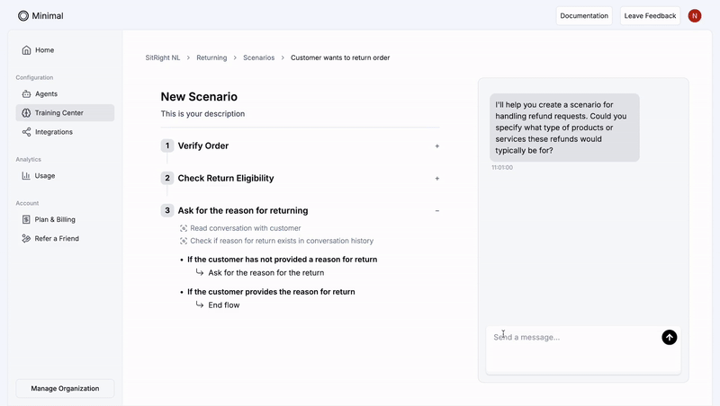

In the thriving world of e-commerce, where customer satisfaction can make or break a brand, [Minimal](https://gominimal.ai/?ref=blog.langchain.com) is leveraging the LangChain ecosystem to transform how support issues are handled. Minimal AI agents are delivering 80%+ efficiency gains over a broad variety of E-commerce stores while improving customer satisfaction. This year, Minimal expects that 90% of their customers' support tickets will be handled autonomously by their AI, escalating only 10% to human agents. Below, you’ll see how this new e-commerce support provider constructed a multi-agent system that integrates seamlessly with popular helpdesk tools, automates customer interactions, and even executes order management tasks—all while maintaining tight control over business protocols.

## **Overview: Automation for e-commerce customer support**

[Minimal](https://gominimal.ai/?ref=blog.langchain.com) focuses on automating repetitive and complex customer service workflows for e-commerce businesses. While basic support tickets (T1) are straightforward, their core strength lies in reliably resolving complex T2 and T3 issues by integrating deeply with their customers' systems. Founded by Titus Ex, a machine learning engineer and Niek Hogenboom, an aerospace engineering graduate, the company has quickly found success in the Dutch e-commerce market. They integrate with leading support platforms like Zendesk, Front, and Gorgias, enabling users to handle customer queries in one place.

Their AI system responds to customers in either draft mode (co-pilot) or fully automated mode. When a user turns the AI on, the system begins generating accurate, context-rich replies to incoming tickets. Beyond that, it can take real actions—like canceling an order or updating a shipping address—thanks to direct integrations with popular e-commerce services.

This approach saves time and energy for e-commerce operators, who rely on consistent, accurate replies to customers’ most pressing questions.

## **Embracing a multi-agent architecture for scalability**

A core differentiator is their multi-agent architecture, split into three main agents:

1. **Planner Agent**: Breaks each incoming query into sub-problems (e.g., “Return Policy” vs. “Troubleshooting Front-End Issues”). Communicates with specialized research agents that perform retrieval and re-ranking of relevant documentation or customer protocols.
2. **Research Agents**: Handle each sub-problem by scouring the training center’s knowledge base—like returns guidelines or shipping rules. Aggregate relevant information for the Planner Agent.
3. **Tool-Calling Agent**: Receives the final “tool plan” from the Planner Agent. Executes decisive actions, such as refunding an order via Shopify or updating address records. Consolidates logs in one place for post-processing and chain-of-thought validation. After these agents gather all sub-results, the system’s final step is to produce a carefully reasoned draft reply to the customer—one that references the correct protocol, checks relevant data, and ensures compliance with the business’s rules around refunds or returns.

### **Why Multi-Agent?**

The team discovered that a monolithic language model prompt often conflated multiple tasks, leading to errors and expensive usage. Splitting tasks across agents curtailed prompt complexity, increased reliability, and allowed them to add new specialized agents without disrupting existing flows.

## **Testing and benchmarking with LangSmith**

During development, the Minimal team extensively tested their system using LangSmith. This enabled them to:

• Track model responses and performance over time.

• Run side-by-side comparisons of different prompts (few-shot vs. zero-shot vs. chain-of-thought variants).

• Log each sub-agent’s output to catch unexpected reasoning loops or tool calls.

Whenever they found an error—say, a policy misunderstanding or a missing step—they created new tests in LangSmith’s trace logs, added more few-shot examples, or further split a sub-problem. This iterative process helped them catch anomalies and refine prompts without losing velocity.

## **Why they chose LangChain and LangGraph**

• **Modularity:** The Minimal team appreciates that LangGraph, which is a component of the LangChain ecosystem, is designed as a modular framework. This structure allows them to effectively manage sub-agents in a flexible manner, avoiding the constraints of a bulky, “batteries-included” approach that lacks customization options. By utilizing a modular design, the team can tailor the functionalities to better suit their specific needs and workflows, enhancing their overall efficiency and adaptability in various projects. This level of customization empowers them to innovate and optimize their processes without being hindered by unnecessary features or limitations.

• **Integration Hooks:** The system’s code-like design made it easy to add proprietary connectors for Shopify, Monta Warehouse Management Services and Firmhouse for recurring ecommerce.

• **Future-Proofing:** Adding new agents or transitioning to next-gen LLMs is a breeze. They can simply expand subgraphs for new tasks and connect them back to the Planner Agent.

## **Results and future plans**

Already, the startup has earned revenue from Dutch e-commerce clients who appreciate faster ticket resolution and advanced features like automated refunds. With a small but growing team, they aim to expand across Europe.

By pairing multi-agent workflows with LangChain’s ecosystem—LangGraph for orchestration, LangSmith for testing, and robust e-commerce integrations—this new startup stands at the forefront of automated support. Their vision is to empower e-commerce businesses to maintain full control over every edge case while letting AI handle the heavy lifting, allowing companies to scale infinitely without hiring additional support.

### Tags

[Case Studies](https://blog.langchain.com/tag/case-studies/)

[**monday Service + LangSmith: Building a Code-First Evaluation Strategy from Day 1**](https://blog.langchain.com/customers-monday/)

[Case Studies](https://blog.langchain.com/tag/case-studies/) 8 min read

[**How Remote uses LangChain and LangGraph to onboard thousands of customers with AI**](https://blog.langchain.com/customers-remote/)

[Case Studies](https://blog.langchain.com/tag/case-studies/) 5 min read

[**Fastweb + Vodafone: Transforming Customer Experience with AI Agents using LangGraph and LangSmith**](https://blog.langchain.com/customers-vodafone-italy/)

[Case Studies](https://blog.langchain.com/tag/case-studies/) 7 min read

[**How Jimdo empower solopreneurs with AI-powered business assistance**](https://blog.langchain.com/customers-jimdo/)

[Case Studies](https://blog.langchain.com/tag/case-studies/) 4 min read

[**How ServiceNow uses LangSmith to get visibility into its customer success agents**](https://blog.langchain.com/customers-servicenow/)

[Case Studies](https://blog.langchain.com/tag/case-studies/) 4 min read

[**Monte Carlo: Building Data + AI Observability Agents with LangGraph and LangSmith**](https://blog.langchain.com/customers-monte-carlo/)

[Case Studies](https://blog.langchain.com/tag/case-studies/) 4 min read