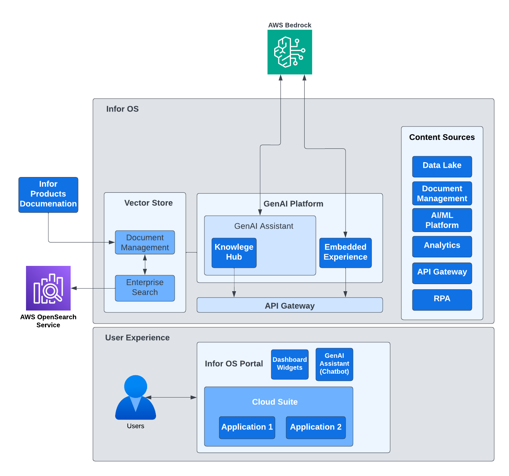

[Infor](https://www.infor.com/?ref=blog.langchain.com) is a leading enterprise software company that provides cloud-based multi-tenant solutions tailored to specific industries like Aerospace & Defense, Automotive, Distribution, Fashion, Food & Beverage, Healthcare, and Industrial Manufacturing. Their solutions are offered to customers as **cloud suites,** a comprehensive set of integrated software applications delivered as Software-as-a-Service (SaaS) across multiple AWS regions. These suites help organizations streamline operations, boost productivity, and reduce IT costs by leveraging cloud infrastructure.

Infor OS (Operating Service) is the cloud-based platform that powers all Infor cloud suite applications and services, providing a unified cloud experience that enhances functionality, security, and system interoperability for users, developers, and businesses. With the rise of generative AI, Infor saw an opportunity to future-proof its products by integrating LLMs into all its cloud suites via the Infor OS platform.

To do so, Infor transitioned their chat assistant Coleman DA (Digital Assistant) from AWS Lex to a more flexible, LLM-powered platform. The new GenAI capabilities enabled the platform to handle complex queries, generate dynamic content, provide intelligent automation, and seamlessly integrate with ML models, APIs, and cloud suite applications across the ecosystem.

## **Building a scalable AI platform from LangChain to LangGraph**

To realize its generative AI vision, Infor needed a scalable and modular solution. With [LangChain](https://www.langchain.com/langchain?ref=blog.langchain.com) and [LangGraph](https://langchain.com/langgraph?ref=blog.langchain.com), the Infor engineering team was able to quickly implement a new GenAI component to the Infor OS platform to provide their various cloud suites and business applications access to LLMs. This helped them leverage rich industry knowledge and business cases to meet customers’ expectations for innovative business solutions.

The Infor Generative AI team built a platform on AWS Bedrock with three key components:

1. **GenAI embedded experiences**– Infor applications can securely access LLMs via its API gateway, allowing one-shot requests with domain-engineered prompts for text generation, summarization, and translation to be sent. This helped embed generative AI features and streamline manual processes.
2. **GenAI Knowledge Hub** – Infor used a retrieval-augmented generation (RAG) architecture with AWS OpenSearch as a vector database to enhance document retrieval. This allowed them to ingest all product documentation and support incident tickets for improved customer support. Furthermore, customers can upload their documents— such as internal manuals, policies, and processes— into their private vector store to engage with the documents via a conversational AI assistant.
3. **GenAI Assistant -** Infor upgraded its legacy AWS chatbot to a multi-agent AI assistant that provides more intelligent, context-aware interactions. It uses the Infor OS API gateway to fetch real-time data from cloud suite applications, ensuring that LLMs have up-to-date context during inference while enforcing security permissions and data governance.

LangGraph has been instrumental to Infor’s multi-agent workflows, providing a flexible and structured approach to managing complex interactions. Its **robust memory management** helps Infor’s AI agents retain and utilize contextual information across multiple exchanges, improving reasoning capabilities over extended workflows. Additionally, LangGraph’s **state persistence** enables agents to maintain and retrieve intermediate states efficiently, preventing redundant processing and ensuring continuity in decision-making.

Its ability to handle cyclical interactions allows agents to iteratively refine their responses, collaborate dynamically, and resolve ambiguities within multi-step processes. These capabilities have empowered Infor to build sophisticated AI agents that can effectively reason through intricate workflows, automate decision-making, and enhance user interactions with greater efficiency and accuracy.

## **Strengthening LLM observability and compliance with LangSmith**

As a SaaS provider, Infor relies on strong observability and tracking to ensure reliability, performance, and a consistent, high-quality user experience. Since Infor serves customers across various geographic locations and regulated industries, its LLM-powered platform requires robust observability and governance. The team’s key needs for visibility into any model’s inference pipeline included:

- Inference Performance: Tracking latency, response times, and token usage to optimize throughput and cost efficiency.
- Model Behavior and Quality: Detecting hallucinations, mitigate bias, and track output consistency for improved accuracy.
- Data and Model Integrity: Identifying potential attacks, data drift, and unintended responses to ensure safety.
- Compliance and Security: Providing audit trailing and protecting sensitive data to meet regulatory requirements.
- Transparency and Accountability: Ensuring explainability of AI decisions to enhance trust and responsible AI deployment.

[LangSmith’s](https://www.langchain.com/langsmith?ref=blog.langchain.com) tracing required minimal integration effort and enabled Infor engineers to monitor interactions, debug performance, and ensure compliance throughout all phases of its GenAI initiatives. Additionally, with the hot-swapping nature of the LLM’s leaderboard, accessing LangSmith in combination with AWS Bedrock allows the Infor team to compare different models and prompts to identify the most effective combination for the various use cases the platform must support. As such, they not only can identify and resolve issues quickly in LangSmith but can improve their prompt engineering to ensure high-quality, safe, and reliable AI-generated outputs.

## **The Generative AI Impact and What's Next**

Infor’s generative AI initiative is a critical effort across the entire organization, driving the company to maintain its innovative edge, enhance customer confidence for its enterprise solutions. By integrating LLM-powered features throughout its cloud suite, Infor has streamlined report generation, automated content creation, and improved knowledge retrieval. Users now have a better experience and can accomplish their tasks using natural language through the new assistant.

Looking ahead, Infor is committed to empowering customers to leverage AI to enhance their businesses and customize AI agents to their use cases. They also plan to incorporate more advanced multi-agent interactions into their AI assistant to improve contextual awareness and better manage complex workflows. By utilizing LangGraph and LangSmith, Infor is not merely adopting generative AI but redefining how enterprises interact with and benefit from AI-driven automation.

### Tags

[Case Studies](https://blog.langchain.com/tag/case-studies/)

[**monday Service + LangSmith: Building a Code-First Evaluation Strategy from Day 1**](https://blog.langchain.com/customers-monday/)

[Case Studies](https://blog.langchain.com/tag/case-studies/) 8 min read

[**How Remote uses LangChain and LangGraph to onboard thousands of customers with AI**](https://blog.langchain.com/customers-remote/)

[Case Studies](https://blog.langchain.com/tag/case-studies/) 5 min read

[**Fastweb + Vodafone: Transforming Customer Experience with AI Agents using LangGraph and LangSmith**](https://blog.langchain.com/customers-vodafone-italy/)

[Case Studies](https://blog.langchain.com/tag/case-studies/) 7 min read

[**How Jimdo empower solopreneurs with AI-powered business assistance**](https://blog.langchain.com/customers-jimdo/)

[Case Studies](https://blog.langchain.com/tag/case-studies/) 4 min read

[**How ServiceNow uses LangSmith to get visibility into its customer success agents**](https://blog.langchain.com/customers-servicenow/)

[Case Studies](https://blog.langchain.com/tag/case-studies/) 4 min read

[**Monte Carlo: Building Data + AI Observability Agents with LangGraph and LangSmith**](https://blog.langchain.com/customers-monte-carlo/)

[Case Studies](https://blog.langchain.com/tag/case-studies/) 4 min read