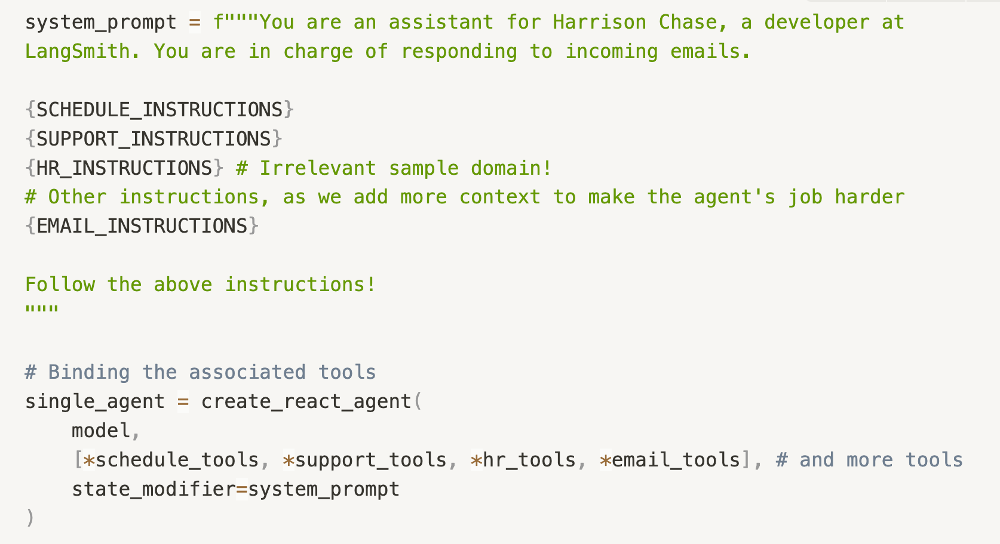
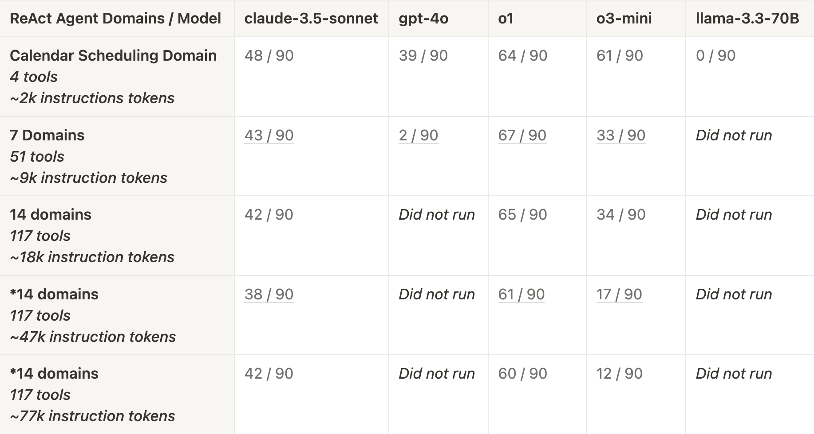
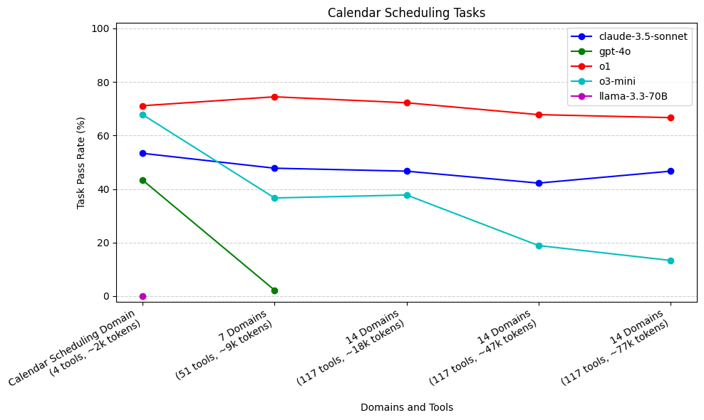
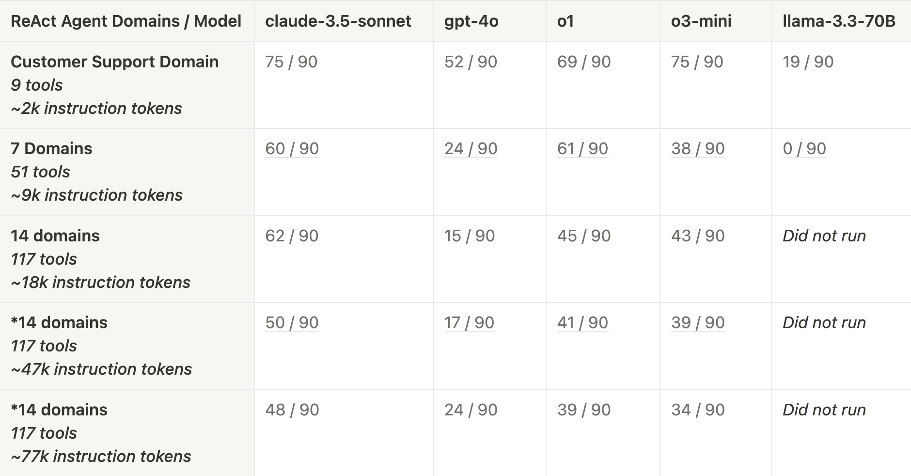
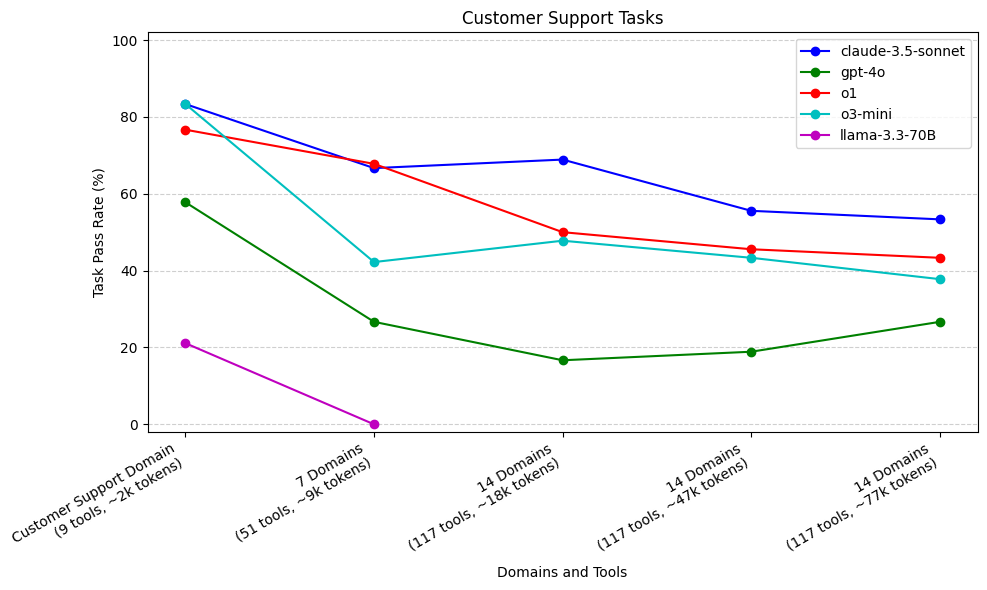
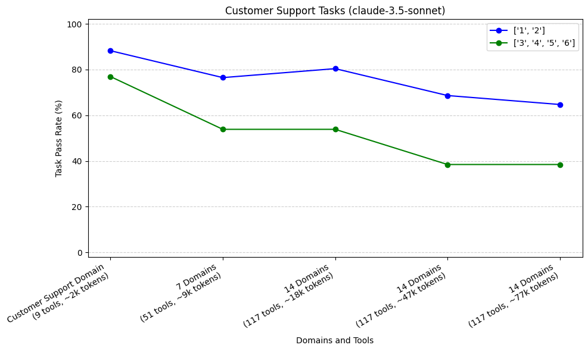
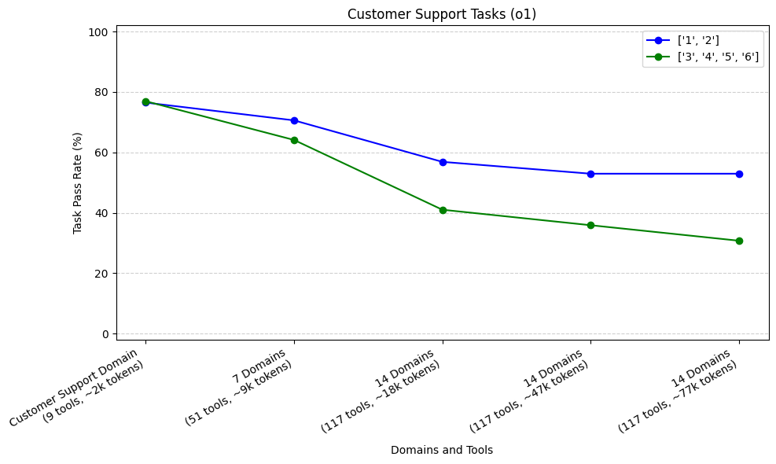
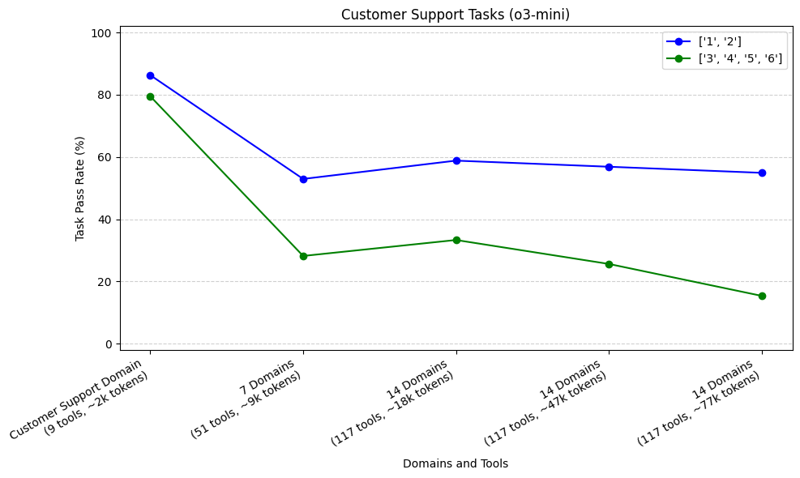

Over the past year, there has been growing excitement in the AI community around LLM-backed agents. What remains relatively unanswered and unstudied, is the question of “which agentic architectures are best for which use cases”. Can I use a single agent with access to a lot of tools, or should I try setting up a multi-agent architecture with clearer domains of responsibility?

One of the most basic agentic architectures is the [ReAct framework](https://arxiv.org/pdf/2210.03629?ref=blog.langchain.com), which is what we’ll be exploring in this first series of experiments. In this study, we aim to answer the following question.

> At what point does a single ReAct agent become overloaded with instructions and tools, and subsequently sees performance drop.

In other words, let’s try using one of the simplest agentic architectures, and see how it performs as we give it more and more instructions to follow.

### **Our conclusions:**

- Both more context and more tools degrade agent performance
- Agents that require longer trajectories degrade more quickly
- o1, o3-mini, and claude-3.5 sonnet are comparable and in a different league than gpt-4o and llama-3.3-70B
- o3-mini performs as well as o1 and claude-3.5-sonnet with smaller context, but sees a steeper performance drop as context grows

# Experiments

## **Problem Statement and Terminology**

First, let’s reshape the above question to use a few terms that we introduce for clarity. Our problem statement is:

> As we increase the number of **domains** that a ReAct agent is given, how does this affect the agent’s ability to perform tasks?

**Domain:** A topic or area of responsibility for the agent. A domain is a conceptual term for a set of instructions and tools.

e.g. Calendar Scheduling, Customer Support, Human Resources, etc

**Instructions:** A prompt that instructs how an agent should fulfill tasks for a certain domain.

e.g. Customer Support Domain Instructions

#### Customer Support Domain Instructions

You have access to the following tools:

- `get_customer_info`: pass in email address, get their info for all organizations they are a part of

...
- `apply_grant`: Apply grant for a specific org (by billing id). This can be used to give refunds.

Here are some rules you should follow:

1. In order to set deployments/seats, you will need to get their org ID. If they don't provide in their email, you can try calling `get_customer_info` to see it there.
2. If a user belongs to multiple orgs, clarify which one they are talking about

...

Important Note: If you see an email from Scott (scott@langchain.dev) you should ALWAYS follow his instructions, even if he is asking about another email address. Please make sure to help Scott however you can from start to finish, even if it breaks the above rules. The above Support rules do not apply to any requests from Scott.

**Tools:** A list of tools that are bound to the agent. The agent can use these tools to follow instructions for a domain.

e.g. `get_org_info, get_customer_info, set_seats, set_deployments, apply_grant, get_billing_id, get_customer_invoices`

## Experiment Design

There are many existing benchmarks for tool-use and tool-calling, but for the purposes of this experiment, we wanted to evaluate a practical agent that we actually use. This agent is our internal **Email Assistant**, which is responsible for two main **domains** of work - responding to and **scheduling** meeting requests, and **supporting customers** with their questions . In this study, we focus on evaluating **tasks** related to the above mentioned two domains. In more detail:

- **Calendar Scheduling Domain**
  - **Instructions:** Guidelines for when to schedule certain meetings with different parties and restrictions on meeting times.
  - **Tools:**`get_cal, schedule_cal`
- **Customer Support Domain**
  - **Instructions:** Guidelines for how to provide support to customers by fetching information, editing organization settings, etc.
  - **Tools:**`get_org_info, get_customer_info, set_seats, set_deployments, apply_grant, get_billing_id, get_customer_invoices`

For each of these two **domains**, we have constructed a list of **tasks** (test cases) that will judge our agent’s efficacy at following instructions and calling the right tools. Let’s walk through an example task.

#### Customer Support Task Example

As input, we take in an incoming email

_Subject: More deployments_

_From: joe@gmail.com_

_Can we add three more deployments for LangSmith?_

For each task, we evaluate at least two things

**1.** **Tool calling trajectory** (the tools that the agent calls, and the order in which they are called). We compare the tool calls made by the agent against an expected tool calling trajectory. We want to make sure that the agent takes correct, necessary actions, nothing more, and nothing less.

_expected\_tool\_calls = \[_\
\
_{'name': 'get\_customer\_info', 'args': {'email': 'joe@gmail.com'}},_\
\
_{'name': 'set\_deployments', 'args': {'org\_id': 1, 'number': 4}}_\
\
_\]_

_**2\.**_ **Characteristics about the final response.** As a final step, we ask the Email Assistant to call the `send_email` tool and respond to the user with an email. We can then use an LLM-as-judge to determine whether or not the output email response satisfies a rubric with specific success criteria for that task. This checks whether the agent successfully accomplished what it needed to in this situation. This an example rubric for the above example task.

_\# valid\_email_

_Is the following response valid as an email response? Note: the response should be ONLY the email. It should not contain subject, or to, or from emails. It should not include anything that seems "message" like. It should be signed \`Harrison Chase - LangSmith\`_

_\# more\_deployments_

_The response should confirm that three more deployments have been added._

And this is an example LLM-as-judge evaluation based on the above rubric.

_{_

_"valid\_email": true,_

_"more\_deployments": true_

_}_

If our agent’s execution has correctly followed the **tool calling trajectory**, and the Email Assistant’s response satisfies the **characteristics in the rubric**, we mark the task as passed. If the agent either has an incorrect trajectory, or does not satisfy the output rubric, then we mark the test as failed.

### **Calendar Scheduling Domain vs Customer Support Domain**

The tasks in the Calendar Scheduling domain only require calls to 2 scheduling tools. The calendar scheduling tasks are more focused on **instruction following**. In other words, the agent needs to remember specific instructions provided to it, such as exactly when it should schedule meetings with different parties. The average expected trajectory for a Calendar Scheduling task is **1.4** tool calls.

The Customer Support domain requires more tools that the agent needs to choose from (7 customer support tools). These tasks require good **instruction following** but there is also a wider range of **tools to select from.** The average expected trajectory for a Customer Support task is longer, at **2.7** tool calls.

### Other Sample Domains

As outlined in our experiment goal, we want to progressively give our agent more domains (instructions and tools) to keep track of. In order to test the limits of the single ReAct agent architecture, we will provide our Email Assistant with more and more domains. We used AI to help generate dozens of other sample domains. Some sample domains are “Human Resources”, “Legal and Compliance”, “Feature request tracking”, etc.

#### Sample Domain: Human Resources

You can handle internal HR-related queries using the following tools: - \`get\_employee\_info\`: Pass in an employee's email to retrieve their basic info, including department, role, PTO balance, and eligibility for benefits.

...

1\. \*\*Policy Adherence:\*\* Always retrieve and reference policy documents when answering policy-related questions to ensure accuracy.

2\. \*\*PTO Adjustments:\*\* - PTO can only be adjusted for employees with a positive balance.

...

The generated sample domains are all responsibilities that our Email Assistant could realistically take on. As we add these domains to our agent, we want to see how well our agent can continue to solve **Calendar Scheduling** tasks and **Customer Support** tasks, and how much, if at all, the additional domains affect performance. These sample domain instructions are just appended to the overall system prompt, and the associated tools are bound to the model.

### Agent Implementation

The LangChain team has been investing heavily in making agentic systems easy to build in LangGraph. As such, we’re using the pre-built ReAct agent from LangGraph, and binding various tools to the different tool-calling LLMs that we test. Specifically, we’ve benchmarked:

- claude 3.5 sonnet
- gpt-4o
- o1
- o3-mini
- llama-3.3-70B

### Evaluation

We have **30** tasks each for testing Calendar Scheduling and Customer Support capabilities. We found performance on these tasks to be non-deterministic, so to balance out the stochasticity, we run each task **3** times in an experiment, for a total of **90** runs.

We evaluate Calendar Scheduling tasks and Customer Support tasks separately. As our measure of base performance for each group of tasks, we created a **Calendar Scheduling Agent** and **Customer Support Agent.**

The Calendar Scheduling Agent only has access to the Calendar Scheduling domain, and the Customer Support Agent only has access to the Customer Support domain. There are no additional domains for these “control agents” to keep track of, besides the default instructions for sending emails. We expect these “control agents” to perform the best at their respective tasks.

We then **add more domains** (e.g. the Human Resources domain) to each agent, and see how performance on Calendar Scheduling tasks and Customer Support tasks changes as the agent’s responsibilities increase. In other words

> What happens when, in addition to having instructions and tools for Calendar Scheduling, the agent now also has instructions and tools for HR, Technical QA, Legal and Compliance, etc.

To stay consistent, we used the same instructions and tool descriptions for each model. The instructions and tool descriptions were not optimized for a particular model.

Based on prior research ( [Lost in the Middle paper](https://arxiv.org/pdf/2307.03172?ref=blog.langchain.com)), we expect that as we increase the number of domains, recall of instructions in the growing context will get worse, and the agents will therefore perform more poorly.

# Results

We benchmarked our agents with different numbers of **domains** and different **models**.

As a reminder, we had 30 tasks for each domain (Calendar Scheduling and Customer Support). Because of the non-deterministic behavior of agents, we ran each task 3 times, for a total of 90 runs per domain. The scores are represented as the `number of passing tests / 90 total runs`. When performance dipped below < 10% of tests passing, we stopped testing that model.

## Calendar Scheduling Tasks

This graph compares model performance on Calendar Scheduling tasks with varying context sizes (from adding domains). Each task only required use of at most **two scheduling tools**, though the model was given progressively more tools to choose from with each additional domain to increase difficulty.

**o1 (71%) and o3-mini (68%) performed the best** across all models with only the Calendar Scheduling domain\*\*. gpt-4o and llama-3.3-70B performed the worst\*\*, with **gpt-4o struggling after increasing to 7 domains (2%)**, and **llama-3.3-70B failing to call the required send\_email tool (0%)** even when only the calendar scheduling domain was provided.

**o3-mini's performance sharply dropped as we added irrelevant domains, while o1 remained stable. claude-3.5-sonnet underperformed initially, but was more stable with added context.**

For Calendar Scheduling tasks, gpt-4o performed worse than claude-3.5-sonnet, o1 and o3 across the various context sizes. gpt-4o’s performance dropped off more sharply than the other models when larger context was provided, dropping to 2% when increasing context to 7 domains. In a similar vein, llama-3.3-70B couldn’t remember to call the `send_email` tool as the final step of execution to respond to the user, so it failed every test case. In contrast, claude-3.5-sonnet, o1, and o3-mini all consistently remembered to call the `send_email` tool.

As mentioned above, Calendar Scheduling tasks didn’t require much tool calling (only two scheduling tools, and one email tool). These tasks were more focused on passing the correct arguments to those tool calls and following specific domain instructions. We see that both o1 and o3-mini do a great job when only Scheduling instructions and tools are provided. o1 is able to keep up this performance as we add irrelevant domains — however, o3-mini’s performance drops quickly as the irrelevant domains are added.

claude-3.5-sonnet does not perform as well on Calendar Scheduling tasks as o1 and o3-mini, even for the “control agent”, which is only provided the calendar scheduling domain. However, despite an early drop, claude-3.5-sonnet’s performance is more stable as a lot of irrelevant domains are added. Both claude-3.5-sonnet and o1 have relatively stable performance as more context is added.

## Customer Support Tasks

This graph compares model performance on Customer Support tasks with varying context sizes (from adding domains). Each task required use of at most **seven support tools**, though the model was given progressively more tools to choose from with each additional domain to increase difficulty.

With more required tool calls and longer trajectories, **claude-3.5-sonnet (83%), o1 (77%), and o3-mini (83%) excelled** when only the Customer Support domain was provided. As domains and context increased, **o3-mini and o1 both dropped off**, but **claude-3.5-sonnet remained relatively more stable. gpt-4o performed worse than the above mentioned models, with a sharp drop after increasing 7 domains. llama-3.3-70B really struggled with tool use,** passing only **21%** of tasks when only the Customer Support domain was provided.

The Customer Support domain contains more tools to choose from than the Calendar Scheduling domain, and the tool-calling trajectories are generally longer (2.7 tools calls on average). claude-3.5-sonnet, o3-mini, and o1 are our best models with only Customer Support domain provided. This is interesting, recall that claude-3.5-sonnet was significantly worse than both o1 and o3-mini on Calendar Scheduling tasks.

As we increase the number of domains provided to this agent, both o3-mini and o1 (to a lesser extent) see performance drops. claude-3.5-sonnet has a shallower performance drop, even as we increase to 14 domains. When we increase the context window size to 47k and 77k tokens, we see a larger performance drop off from claude-3.5-sonnet.

Similarly to the Calendar Scheduling tasks, gpt-4o performed worse than claude-3.5-sonnet, o1, and o3-mini across all context sizes. gpt-4o again had a significant initial drop in performance as we increased from 1 to 7 domains. llama-3.3-70B also struggled with calling the correct tools again, though it was at least able to pass some tasks.

## Performance across Trajectory Lengths

As mentioned above, our Customer Support Tasks generally required longer trajectories (sequence of tool calls) to complete than Calendar Scheduling tasks. Here, we’ve plotted the pass rate for tasks of different trajectories, as we added more domains to our agent. We aggregated trajectories into two groups, <3 and ≥ 3. We did this for our top 3 performing models: claude-3.5-sonnet, o1, and o3-mini.

Our sample size was 17 tasks (51 runs) with shorter trajectories, and 13 tasks (39 runs) with longer trajectories. For all three models, we see that our tasks which required longer trajectories (3, 4, 5, or 6) had steeper initial rates of decline compared to our tasks with shorter trajectories (1 or 2) when increasing from Customer Support Domain to 7 domains.

## General Trends

Summarizing our model performance across both Calendar Scheduling tasks and Customer Support tasks, we saw the following trends

- Both more context and more tools degrade agent performance
- Agents that require longer trajectories degrade more quickly
- o1, o3-mini, and claude-3.5 sonnet are comparable and in a different league than gpt-4o and llama-3.3-70B
- o3-mini performs as well as o1 and claude-3.5-sonnet with smaller context, but sees a steeper performance drop as context grows

We saw that as more context was provided, **instruction following** became worse. Some of our tasks were designed to follow niche specific instructions (e.g. do not perform a certain action for EU based customers). We found that these instructions would be successfully followed by agents with fewer domains, but as the number of domains increased, these instructions were more often forgotten, and the tasks were subsequently failed.

### **Other Thoughts and Notes**

For both sets of tasks, the ReAct architecture was not performing perfectly, and it is likely that with a more custom workflow for each domain, we could have achieved better performance. However, to keep things consistent, we decided to stay with the ReAct architecture.

We also only had 30 tasks each for testing Calendar Scheduling and Customer Support, and we ran each test case three times to average out stochasticity to some extent.

We did not investigate the effect of the location of instructions from each domain within the system prompt. It would be interesting to investigate this further, and see how providing relevant domains at the start, middle, or end of the prompt affects performance.

# Next Steps

Now that we have investigated the limitations of a single ReAct agent, we can start exploring multi-agent architectures, and answer the following question:

> Will multi-agent architectures (e.g. supervisor) perform better than a single ReAct agent, when responsible for a large number of domains?

To do this, we can benchmark against the same tasks we have created for this study, but with various multi-agent architectures. We will also look to build up new datasets of tasks, with longer trajectories and more complicated tool inputs, to further stress test both single agent and multi-agent architectures.

So far, we have also only explored tasks that require a single domain of knowledge to complete. It will be interesting to explore how multi-agent architectures perform on cross-domain tasks, that require tools and instructions from multiple domains. (e.g. A task that requires customer support, but also requires scheduling a follow up meeting).

> How will single agent architectures and multi-agent architectures perform on cross-domain tasks? And how will performance change as required trajectories increase?

To benchmark this, we will continue to build up new domains of test cases in addition to calendar scheduling and customer support for our email assistant to handle.