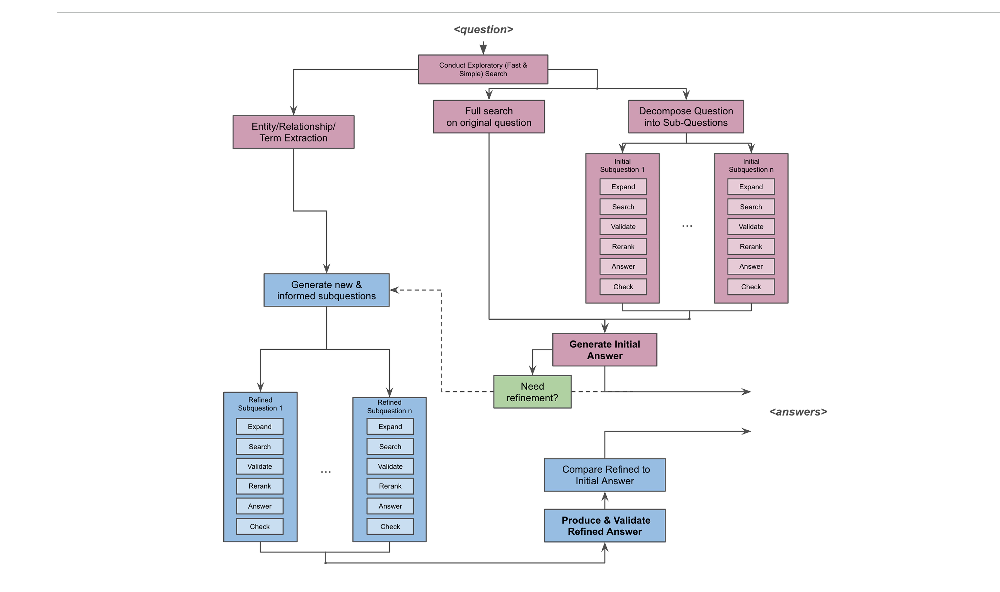
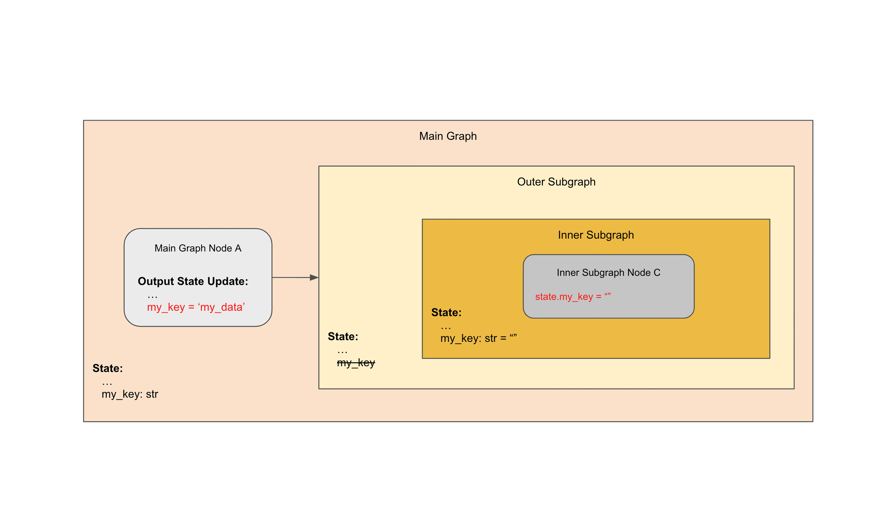
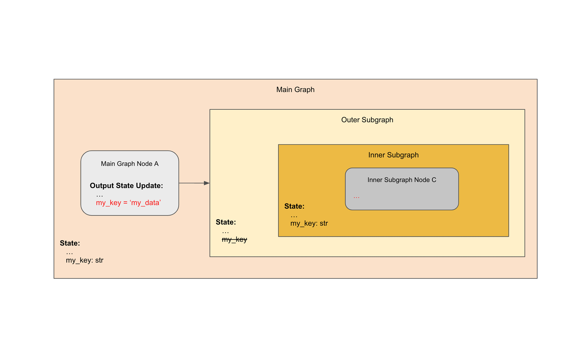
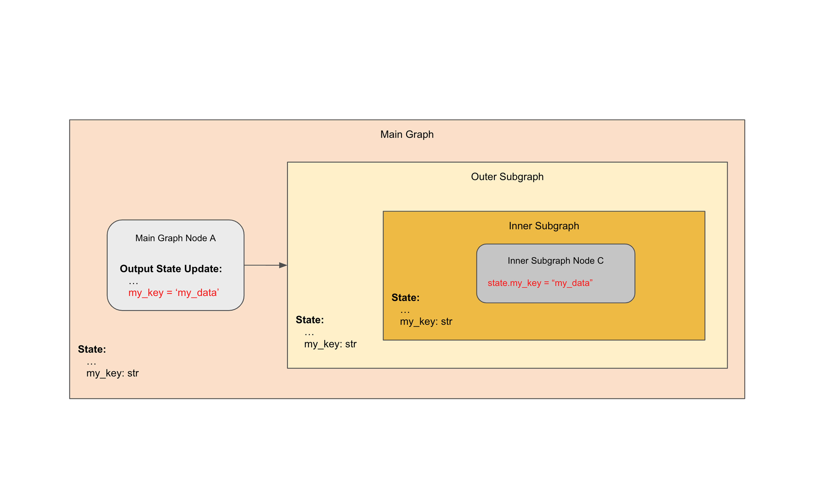
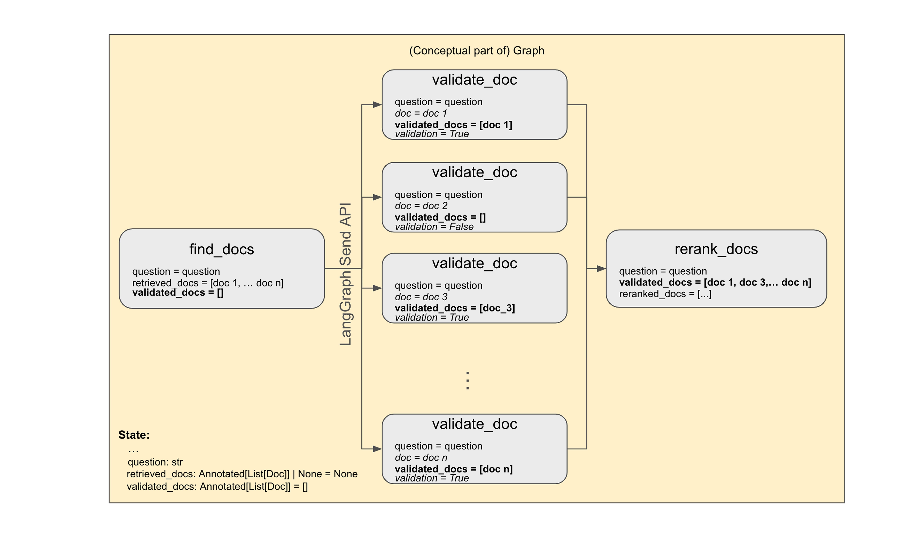
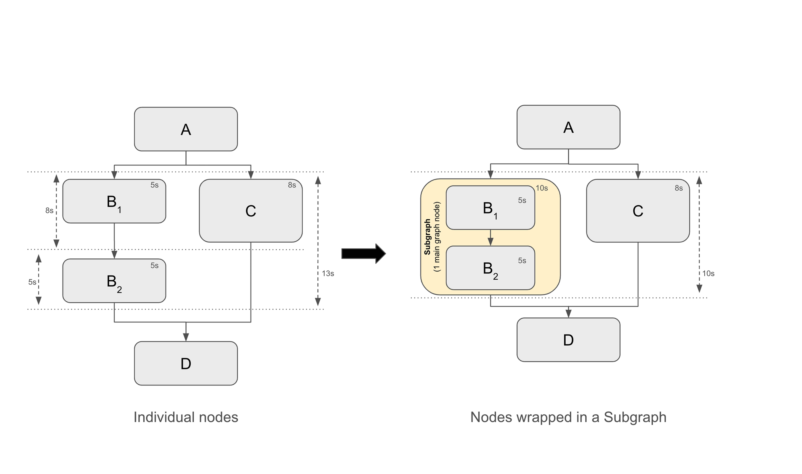
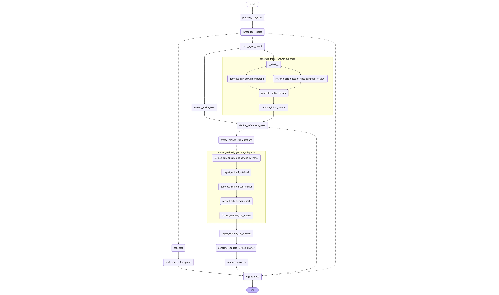

_Editor's note: this is a guest post from our friends at_ [_Onyx_](https://www.onyx.app/?ref=blog.langchain.com) _. As LangGraph has matured, we've seen more and more companies (_ [_Klarna_](https://blog.langchain.com/customers-klarna/) _,_ [_Replit_](https://blog.langchain.com/customers-replit/) _,_ [_AppFolio_](https://blog.langchain.com/customers-appfolio/) _,_ [_etc_](https://blog.langchain.com/tag/case-studies/) _) start to use it as their agent framework of choice. We thought this was a great blog describing in detail how that evaluation is done. You can read_ [_a version of this post on their blog_](https://www.onyx.app/blog/agent-search-with-langgraph?ref=blog.langchain.com) _as well._

By Evan Lohn, Joachim Rahmfeld

At [Onyx](https://www.onyx.app/?ref=blog.langchain.com), we are dedicated to expanding the knowledge and insights users can gain from their enterprise data, thereby enhancing productivity across job functions.

So, what is [Onyx](https://www.onyx.app/?ref=blog.langchain.com)? Onyx is an AI Assistant that companies can deploy at any scale—on laptops, on-premises, or in the cloud—to connect documented knowledge from many sources, including Slack, Google Drive, and Confluence. Onyx leverages LLMs to create a subject matter expert for teams, enabling users to not only find relevant documents and but also get answers for questions such as "Is feature X already supported?" or "Where's the pull request for feature Y?"

Last year, we embarked on enhancing our Enterprise Search and Knowledge Retrieval capabilities by setting the following goals:

- **Enable scalable answers to complex and ambiguous questions**
- **Improve answer quality when multiple entities are involved**
- **Provide richer detail and context around key aspects of questions**

Questions that fall into these categories are usually of high value to the user, however a traditional RAG-like system tends to struggle in these situations.

For example, consider the question: “ _What are some of the product-related differences between what we positioned at Nike vs Puma that could factor into our differing sales outcomes?_”. This question involves both, multiple entities, as well as an ambiguity ( _product-related sales outcomes_ can mean many things).

Unless there happen to be documents in the corpus that deal pretty much with this exact question, a RAG system is challenged to find a good answer here.

These are the types of questions where our new Agent Search comes in. What is the idea here?

On a high level, the approach is to 1) first break up the question into sub-questions that can focus on more narrow contexts as well as disambiguation of potentially ambiguous terms, 2) compose an initial answer using the answered sub-questions and fetched documents, and then 3) produce a further refined answer based on the initial answer and various facts that have been learned during the initial process.

To make this more concrete for the example above, some valid initial sub-questions could be ‘Which products did we discuss with Puma?’, ‘Which products did we discuss with Nike?’, ‘Which issues were reported by Puma?’...

To encapsulate this type of logical process a lot of steps, calculations, and LLM calls need to be organized and orchestrated.

The purpose of this blog is i) to illustrate how we approached this problem on a functional level, ii) discuss how we went about our technology selection approach, and iii) share in good detail how we leveraged LangGraph as a backbone, and specifically which lessons we learned.

We hope this write-up will be useful to readers who are interested in this space and/or who want to build agents using LangGraph and share some of our requirements.

# General Flow and Technical Requirements

Roughly, our targeted logical flow looks on the high level like this:

Key aspects and requirements of this flow are:

- In addition to searching relevant documents for the original question directly, we break up the initial question into more narrow, well-defined sub-questions. This helps with disambiguation and narrowing the search focus
- The decomposition is informed by an initial search, giving some context to the decomposition
- The answering of each subquestion has many parts: query expansion, search, document validations, reranking, subanswer generation, subanswer verification
- The initial answer is based on a search + the answers of the subquestions.
- If the initial answer is lacking, we perform another decomposition to generate a refined answer, which is designed to address shortcomings and/or follow-up on answers to subquestions. This refinement decomposition is informed by:
  - the question and the original answer (and the fact that it is lacking)
  - the sub-questions and their answers (and the sub-questions that were not answerable)
  - a separate entity/relationship/term extraction based on the initial search to better align the decomposition with the contents of the document set
- Overall, parallelism is imperative on many levels, including:
  - retrieved document verifications for each subquestion processing
  - the processing of multiple sub-questions in parallel
  - entity/relationship/term extraction in parallel with the handling of the subquestions
- Similarly, dependency management is essential. Examples are:
  - the decomposition in the refinement phase has to wait until both, the initial answer is generated (and need for refinement has been determined), and the extraction of the entities, relationships, and terms are done
  - future steps are informed by the outcome of earlier steps

So indeed, a lot has to happen to achieve our goal of being able to address substantially broader and more ambiguous questions.

While this flow is certainly quite workflow-centric, it presents an initial step towards a broad(er) Agent Search flow(s). We intend to hook various tools into the flow, update the refinement process, etc. We may at a later date potentially also introduce Human-in-the-Loop type interactions with the users, like approving answers before refinement or re-running part of the flow with some manual changes.

Addressing our requirements, also with an eye towards the near/mid future, asks for a framework that

1. is well-controlled,
2. is easy to extend or (re)configure,
3. is cost-effective,
4. allows for a high degree of parallelization,
5. can manage logical dependencies (A and B need to be done before C starts, and E can run in parallel to all of this, etc.), and
6. enables streaming of tokens and other objects
7. allows in the future for more complex interactions.

And - oh, yeah! - the answers also needed to be produced in a timely manner matching user expectations, and do so at scale.

So the key question we had to address was ”How do we best implement this?”

# Framework Options & Evaluation Approach

The options for us were essentially whether to implement this flow ourselves from the ground up by extending our existing flow, or to leverage an existing agentic framework - and if so, which one.

Given our priorities outlined above, we landed on LangGraph as our main candidate for our implementation framework, with implementation-from-scratch probably a relatively close second.

The initial drivers in favor of LangGraph were:

- A natural “their pictures look like our pictures”-situation, meaning: the flow we had laid out maps very well to LangGraph’s concepts of Nodes, Edges, and States
- Open Source framework with a strong community
- ‘Not brand-new’ (relative to the innovation time-scales in this space)
- High degree of control
- Native streaming support
- Interesting features for potential future Onyx functionality like Human-in-the-Loop or the ability to rerun the agent flow with some parameters altered

However, we certainly also had some concerns which favored an implementation from-scratch, including:

- Dependency on a third party and reduced end-to-end control
- Mutable state variables in LangGraph (‘ _Who changed this value?_’)
- Less visibility into the call stack for debugging purposes
- Change of our existing flow

To decide, as one does for most projects of this type, we started with a prototype evaluation. Specifically, we quickly (~1 week/1 FTE, including learnings) implemented a stripped-down, stand-alone LangGraph implementation of our targeted flow, where we tried to test:

- approximate end-to-end functionality that delivers acceptable run times
- fan-out parallelization
- subgraph parallelization
- potential issues around state management
- streaming

The results were encouraging, and we proceeded to implement our actual flow in LangGraph within our application. As expected, in the process, we learned a number of additional lessons. Below we document what we have learned, and the conventions we intend to follow in the future, as our use of Agent flows will expand.

# LangGraph Learnings - Our Best Practices Moving Forward

As the project quickly grew more complex, here are some of the observations we made and practices we adhered to.

## Code Organization

### Directory and File Structure

- The number of nodes can get rather large across a complex graph. We decided to use a one-node-per-file approach (modulo reuse of functions for different nodes).
- With many nodes, a clear directory structure and file naming strategy are advised. We created a directory for each subgraph and generally adopted an <action>\_<object>.py naming convention. Adding a digit for the step number can also be helpful, while it would require some extra work when nodes are added or removed.
- We use subgraphs extensively for purposes of parallelization (see below) and reuse. Each subgraph directory has its own edges, states and models files as well as its graph builder.
- To visualize the graph, using a mermaid png of the overall graph proved to be very useful.

### Typing & State Management

We use Pydantic across our code base, so it was great to see that LangGraph supports Pydantic models in addition to TypeDicts. Consequently, we use Pydantic models all through the LangGraph implementation as well. (Unfortunately, for graph outputs Pydantic is not yet supported).

As we have many nodes with their own actions and ‘outputs’ (state updates) within a subgraph, we generally look at the (sub)graph states as driven by the node updates. So rather than defining the keys directly within the subgraph state, we define Pydantic state models for the various node updates and then construct the graph state by inheriting from the various node update (and other) models.

**Benefits**:

- Keys are naturally grouped
- One only has to update the node state model (and the node) when adding keys
- Overlap of keys is allowed
- Default values are allowed

**Challenges:**

- Following this approach certainly makes it a bit harder to see the complete set of keys in the overall graph state.
- One has to pick a good structure to avoid inheritance issues

Not surprisingly, being deliberate about setting default values (or not!) for state keys is very important. If not handled carefully, setting default values in inappropriate situations can lead to unintended behavior that may be more difficult to detect. For instance, consider the following problematic configuration:

Here, Main Graph Node A sets ‘my\_key’ to ‘my\_data’. This value is later intended to be used by an Inner Subgraph node. But in this example we (purposefully) missed adding that key to the Outer Subgraph. Not surprisingly, the value of this key for the inner subgraph would be an empty string.A similar situation would occur on the output side as well: if we updated ‘my\_key’ in the Inner Subgraph Node C, then this would not update the ‘my\_key’ state in the main graph.

Had we been instead careful and not set a default value for ‘my\_key’ in the inner subgraph as shown here:

then _an error would be raised_, as ‘my\_key’ does not have an input value for the Inner Subgraph. Then, the missed state in Outer SubGraph would be added to arrive at the proper configuration:

This is of course not really different from traditional nested functions, but in our experience, in the LangGraph context these issues are a bit harder to identify.

Our recommendations - no surprise - are to:

- define all keys in graph input states _without_ defaults, except for documented exceptions, usually in the context of nested subgraphs
- define all keys that are updated in the graph as _<type> \| None = None_, … with the exception of when the key is a list and we expect to add to a list from many nodes.

## Graph Components & Considerations

### Parallelism

We have a lot of requirements for processes to be executed in parallel, and there are multiple types of parallelism.

#### Parallelism of Identical Flows:

Map-Reduce BranchesAn example of this type of parallelism in our flow is the validation of retrieved documents, i.e., the testing of each document in the list of retrieved documents for relevance to the question. Obviously, one wants to do these tests in parallel, and LangGraph’s Map-Reduce branches work quite well for us in these situations:

Above, the **bold-face state key** is the one being updated during the fan-out, and italic keys refer to fan-out node-internal variables.

#### Parallelism of Distinct Flow Segments:

Extensive Usage of _Subgraphs_! In the following situation, imagine B\_1 and B\_2 each take 5s to execute, whereas C takes 8s. In the scenario on the left, D starts actually 13s after A has completed, because B\_2 only starts once B1 _and_ C are completed. In the scenario on the right on the other hand, D starts 10s after A completed. Wrapping B\_1 and B\_2 into a subgraph ensures that from the parent graph’s perspective there is one node on the left and one node on the right, and B\_2’s execution is not waiting for C’s completion. (Note: we always use _subgraphs as nodes_ within the parent graph, vs _invoking a subgraph within a node_ of the parent.)

### Reusable Components: _Subgraphs_ again!

We do have plenty of repeated flow segments that consist of multiple nodes. One example is the Extended Search Retrieval, where documents for a given (sub-)question are retrieved. At the core, the process consists of a Search, followed by a Relevance Validation of each retrieved doc with respect to the question, and concludes with a reranking of the validated documents. To make this repeated process efficient, we wrap it into a subgraph, which is then used either by the main graph or other subgraphs. One needs to be careful, as always, with the definition and sharing of the keys between the parent graph and the subgraph.

- Node Structure
  - We _generally_ adopt the approach of ‘one-action-per-node’, though one could easily reduce node sprawl by putting more consecutive actions into one node.
  - When a subgraph is used at multiple steps in the flow, on occasion we find it convenient to introduce a ‘formatting node’ at the end, whose role it is to convert data into a desired key update.
- Streaming
  - In-Node Streaming of Custom Events:

    To provide a good user experience we need to stream out a lot of events in-node. Examples include retrieved documents, LLM tokens of generated answers or sub-answers, etc. Many of these are custom events, as we need to distinguish individual sub-answers which could stream out simultaneously. Our application uses synchronous operations, and following LangGraph’s [streaming documentation](https://langchain-ai.github.io/langgraph/how-tos/streaming/?ref=blog.langchain.com#custom) worked very well for us to facilitate the streaming of our custom events.
- LangGraph versions
  - As this is a fast-moving field and a fast-moving project, it is important to stay current on the releases

# Our Current Agent Search using LangGraph

Lastly, here is our current graph (x-ray level set to 1 to limit complexity, so a number of the nodes are actually subgraphs which may contain further subgraphs):

It is quite evident that this flow has a strong resemblance with the logical flow that we laid out at the beginning, with a few additions to facilitate the Basic Search flow if the Agent Search is not selected.

# **Outlook and Call To Action**

We see this implementation as a first step, and we plan on expanding the flow to become substantially more agentic in the near future. LangGraph certainly has thus far been a good fit for our needs.

We invite you to check out agent-search on [**GitHub**](https://github.com/onyx-dot-app/onyx?ref=blog.langchain.com), [**book a demo**](https://cal.com/yuhongsun/onyx-demo?ref=blog.langchain.com) **,** [**try out our cloud version**](https://cloud.onyx.app/auth/signup?ref=blog.langchain.com) for free, and join [**slack**](https://join.slack.com/t/onyx-dot-app/shared_invite/zt-2twesxdr6-5iQitKZQpgq~hYIZ~dv3KA?ref=blog.langchain.com) **,** [**discord**](https://discord.gg/jDnRGhWhg4?ref=blog.langchain.com) **#agent-search** channels to discuss our Enterprise AI Search more broadly, as well as Agents!