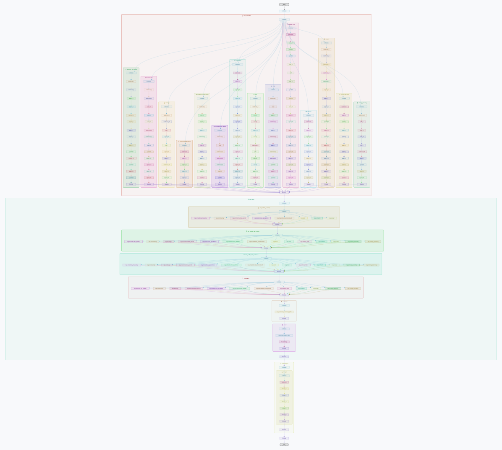
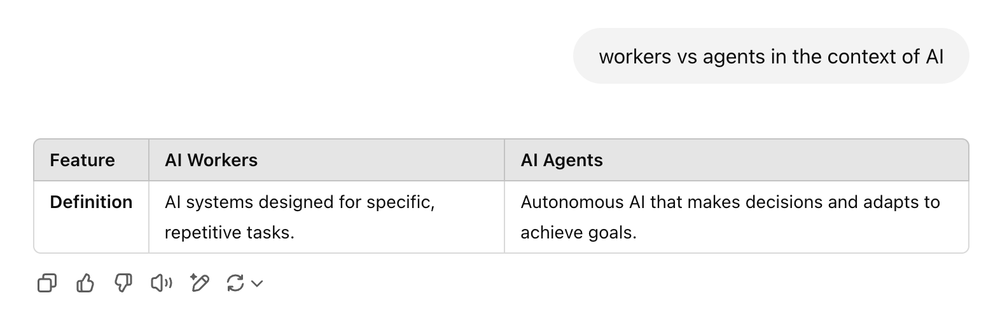

_Editor's note: This is a guest blog post from our friends at_ [_Build.inc_](https://build.inc/?ref=blog.langchain.com) _. They built one of the more complex multi-agent workflows we've seen - with over 25 sub agents. Check out the screenshot of their graph for an idea of the complexity. They also share practical lessons learned from building agent that we think will be helpful for other agent builders._

[Build.inc](https://build.inc/?ref=blog.langchain.com) is pushing the boundaries of agentic systems to automate manual and labour intensive workflows in the built world. Our first “worker”, is now in production for a range of industry titans in Commercial Real Estate (CRE) aimed towards data-center development and beyond.

Our workers are composed of a network of specialized agents performing specific, smaller tasks. Real estate stakeholders can hire our specialist workers as if they were consultants, able to perform specialized development processes. By orchestrating these agents through LangGraph, our first worker, Dougie, accomplishes in 75 minutes what previously took humans over four weeks, accelerating the world’s most critical real estate projects, including data centers, energy, and logistics.

For Dougie, the use case is land diligence for energy-intensive industries. Think everything from data centers to solar farms. This is the task of researching a piece of land to understand if it is suitable for a particular project. This workflow is critical for our customers as getting this decision right has downstream effects which, if mishandled, will cost them millions of dollars. Part of what makes LangGraph such an attractive orchestration layer for us is that we can autonomously execute an extremely complex workflow in record time and with a depth and quality that even the most experienced human consultants cannot achieve.

## **Overview: Automation for the Development Lifecycle**

Build.inc focuses on automating repetitive and complex development workflows for the world’s most important infrastructure projects (today that is data centers, renewable energy, small modular reactors). These workflows are typically expensive, take a long time to execute, and are performed by specialist teams of consultants. This means that before a project enters the construction phase, these workflows consume nearly half of the total project timeline and cost developers millions of dollars.

Solving this problem with traditional software has typically been difficult, for several reasons:

\- **Complexity & Variability** – Each project comes with its own unique requirements and risks.

\- **Fragmented Data Ecosystem** – In the US alone, there are over 30,000 jurisdictions, each with its own regulations and data sources, making universal solutions difficult.

\- **High-Stakes Specialist Workflows** –  The extraordinary depth of expertise needed for each project often exceeds what off-the-shelf software can deliver, making internal teams or external professionals the more viable option.

Thus, at Build we take an agent first approach to solving our customers problems, approaching agentic systems in a novel way to execute complex, sophisticated workflows.

For the sake of the audience, we will focus the rest of this post on our experience building at the edge of Applied AI rather than the specifics of the work we do for our customers.

## **Embracing a Multi-Agent Architecture for Handling Complexity**

To understand multi-agent systems for deterministic outputs, we start with the concept of “workers”. At Build, we define a worker as an orchestration agent that understands the make-up of a specific workflow and uses LLMs to orchestrate that workflow until it’s completed: invoking tools, managing tasks, and setting the sequence in which these tasks unfold.

However, objectives that require sophisticated outcomes— like those that we deliver for our customers— require workers that execute through more than one agent. Just as real-world projects demand teams of specialists, multi-agent systems rely on agents that cooperate, coordinate, or even compete, each contributing distinct capabilities.

Even in the work of a single person, it’s often a requirement for that individual to wear multiple hats to complete a job. This is where multi-agent architectures come to life. A multi-agent system enables one agent to initiate another— extending the concept to the next level of agency, with agents operating in parallel and actively influencing one another to achieve more complex objectives.

Abstracting this even further, just as one worker is composed of multiple agents to achieve an outcome, a multi-stage process - such as real estate development - is composed of multiple workers, where the output of one worker can be passed to another worker until a large body of work is completed. Or workers can run in parallel to execute in tandem.

## **How do you build a worker?**

At Build.inc, we deconstruct broad work activities (usually with a deterministic end goal) into smaller pieces to develop agents that are digitally analogous of how a human would physically perform that work. We then recreate that workflow through the modular, composable structure suited to development with LangGraph. We believe that the 'dark matter' of AI is context. It's rarely directly modeled or fully understood. In the frame of automating workflows, successful use of LLMs come down to have access to three things;

1. Workflows: A collection of skills and capabilities organized into broader functional categories, orchestrated to achieve a larger end goal.
2. Data: A combination of specialized long-term knowledge and task-specific short-term information (often a proprietary or niche dataset), to guide the work output and give it depth.
3. Integrations/Tools: Access to the right tools and integrations to execute into established systems.We then recreate that workflow through the modular, composable structure suited very well to development with LangGraph. This playbook ensures each worker (and its sub-agents) is purpose-built to excel at its designated responsibilities and that we can give our customers solutions that work better and faster than anything they’ve seen before.

The path to evolving our offering becomes much more flexible than traditional SaaS software. We can add new workers, transition to new models, create new agent-graphs, or expand existing agent-graphs with very little impact on what is already built. Build agents are by default compostable and modular without losing the ability to have granular control over the output.

## **Building a Hierarchy of Agents**

Build.inc orchestrates over 25 sub-agent tasks in a four-tier hierarchical system. This orchestration is a digital representation of the equivalent org of human work. At the top is the Master Agent— “the Worker” —which coordinates the entire workflow and delegates tasks to Role Agents— “the Workflows” —who handle specialized functions like data collection or risk evaluation. Each Role Agent manages one or more Sequence Agents, which carry out Workflows— multi-step processes that can involve up to 30 individual tasks executed by Task Agents. The Task Agents are equipped with the most relevant tools, context and model to complete the task, passing the results back to the role agent until the worker passes the context to the next agent.

Running these steps sequentially would be incredibly time-consuming (though not as time-consuming as the four weeks it currently takes to execute the workflow manually). To this end we leverage **asynchronous execution** via LangGraph to run multiple agents in parallel, dramatically reducing overall processing time. Even with parallelization, the entire process still requires over 75 minutes from end to end— delivering a level of depth to the output that human teams can’t match even over the course of several weeks.

## **Practical Learnings from Building Agents**

1\. **Choose where to be open-ended and non-deterministic**

Like human labour, leaving work tasks open ended can often lead  Agents don’t need to have full autonomy on the decisions they make in each step. In many cases, relying on a predefined plan instead of asking the agent to generate one every time reduces unnecessary complexity and leads to more predictable outcomes. This is ultimately great for customers.

2\. **Tailor Agents to Tasks**

On the above, each agent performs best when it’s specialized. ‘Training’ an agent can essentially be giving it the correct guardrails in a JSON file. Choose the context, model, and tools specific to each task instead of forcing a single agent to adapt to every scenario.

3\. **Keep Tasks Simple and Small**

Breaking down workflows into smaller, single-purpose tasks makes it easier for agents to execute efficiently and accurately. It also allows for a more modular and composable system which is easier to understand, edit or expand upon. The more you chain, the less pain you experience.

4) **Modular by Design**

Represent each agent as its own LangGraph subgraph to create self-contained modules. This design simplifies orchestration and visualization, reducing interdependencies and making your system easier to debug, test, and scale.

## **Agentic Futures**

At Build.inc, we envision a future where **complex, multi-layered workflows** are seamlessly automated through sophisticated orchestration, mirroring the efficiency and structure of a well-aligned organization. We do this for real estate development, but we believe that this model will extended to organizations focused on all types of professional services.

By owning the entire process and delivering a fully integrated, end-to-end service— not only providing standalone productivity tools— this next generation of automation has the potential to **unlock traditionally technology-resistant industries**.

We're building a world where tangible work output takes minutes rather than weeks, freeing CRE development teams to focus on relationships, strategy and creativity over routine, manual tasks.

Through the speed and flexibility of LangGraph, Build is leading the category of autonomous CRE development services and pushing the boundaries of what agents can do.