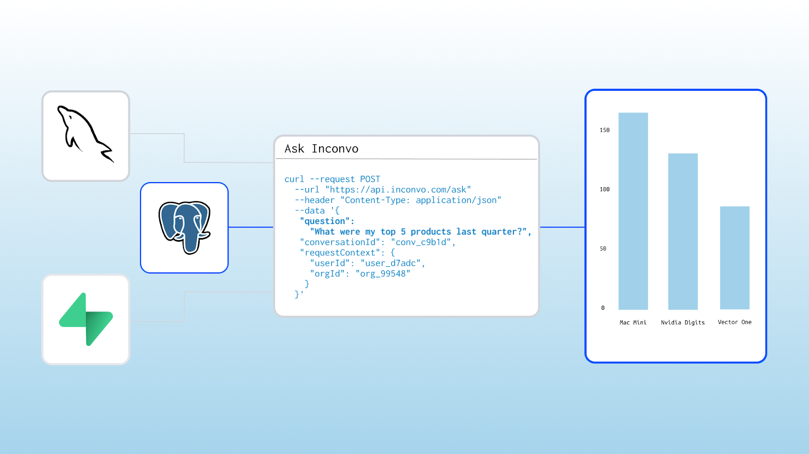
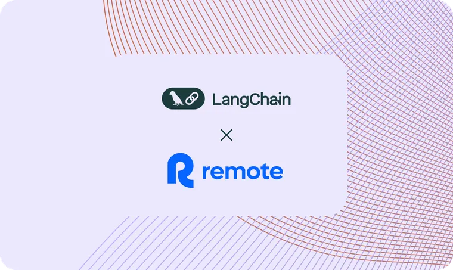
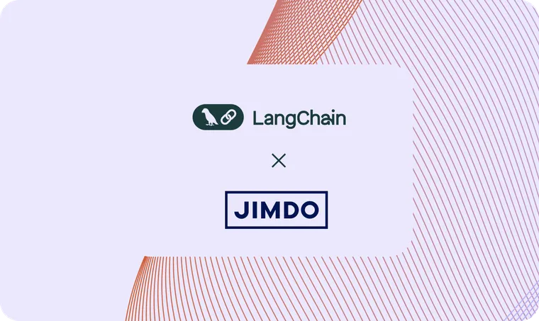

[Inconvo](https://inconvo.ai/?ref=blog.langchain.com) is a YC S23 startup that simplifies data analysis for non-technical users. This case study will focus on how Inconvo utilizes [LangGraph](https://langchain.com/langgraph?ref=blog.langchain.com) and [LangSmith](https://www.langchain.com/langsmith?ref=blog.langchain.com) to streamline their data querying process.

## **Problem: Overcoming the barrier for data analysis**

Inconvo addresses a common challenge faced by many non-technical users who struggle with traditional Business Intelligence (BI) workflows to extract simple insights from data. For example, a user of a SaaS application might find it cumbersome to navigate complex BI tools just to answer straightforward questions like "How much product have I sold over the last two weeks?" This inefficiency not only wastes time but also limits the ability of users to make data-driven decisions.

The need for a more intuitive solution became apparent as Inconvo sought to empower users to ask questions in natural language, thereby eliminating the need for technical expertise in data analysis. By providing a simple API, Inconvo aims to make it easy for developers to add conversational analytics to their applications.

## **Agent UX: API for conversational data analysis**

Inconvo's agent interface provides users with multiple ways to visualize and interact with their data. When users submit natural language queries, the API returns JSON results in the following forms:

- Bar charts for comparing categorical data
- Line graphs for time-series analysis
- Tables for detailed data examination
- Text for simple answers

The API allows users to refine their queries conversationally. For example, after seeing initial results, a user can ask for a different visualization or request to filter the data further. This interactive experience makes complex data analysis accessible to non-technical users without requiring them to learn SQL or specialized BI tools.

## **Building a powerful query processing system with LangGraph**

[LangGraph](https://langchain.com/langgraph?ref=blog.langchain.com) plays a key role in Inconvo's architecture and has enabled a multi-step workflow that efficiently processes user queries. When a user submits a question, LangGraph orchestrates the entire data retrieval process, starting with an introspection of the database to understand its schema. This allows Inconvo to configure which data is accessible and how it can be queried.

Inconvo’s architecture utilizes LangGraph to manage conditional workflows, where different operations can be executed based on the user's input. This includes selecting tables, executing SQL queries, and returning structured outputs in various formats. By integrating with LangGraph, Inconvo can handle complex queries with multiple steps, ensuring that users receive accurate and relevant results quickly.

The cognitive architecture follows a deliberate reasoning pattern:

1. Parse the user's natural language query
2. Map the query to relevant database tables and fields
3. Generate appropriate SQL queries

## **Conclusion**

Inconvo's use of LangGraph has transformed how non-technical users interact with their data, breaking down barriers to data analysis through natural language processing. By eliminating the need for specialized technical skills, Inconvo has democratized access to data insights, enabling users across various industries to make informed decisions quickly and efficiently. This case study demonstrates how innovative AI solutions can solve real-world problems and create more intuitive user experiences in the data analytics space.

### Tags

[Case Studies](https://blog.langchain.com/tag/case-studies/)

[**monday Service + LangSmith: Building a Code-First Evaluation Strategy from Day 1**](https://blog.langchain.com/customers-monday/)

[Case Studies](https://blog.langchain.com/tag/case-studies/) 8 min read

[**How Remote uses LangChain and LangGraph to onboard thousands of customers with AI**](https://blog.langchain.com/customers-remote/)

[Case Studies](https://blog.langchain.com/tag/case-studies/) 5 min read

[**Fastweb + Vodafone: Transforming Customer Experience with AI Agents using LangGraph and LangSmith**](https://blog.langchain.com/customers-vodafone-italy/)

[Case Studies](https://blog.langchain.com/tag/case-studies/) 7 min read

[**How Jimdo empower solopreneurs with AI-powered business assistance**](https://blog.langchain.com/customers-jimdo/)

[Case Studies](https://blog.langchain.com/tag/case-studies/) 4 min read

[**How ServiceNow uses LangSmith to get visibility into its customer success agents**](https://blog.langchain.com/customers-servicenow/)

[Case Studies](https://blog.langchain.com/tag/case-studies/) 4 min read

[**Monte Carlo: Building Data + AI Observability Agents with LangGraph and LangSmith**](https://blog.langchain.com/customers-monte-carlo/)

[Case Studies](https://blog.langchain.com/tag/case-studies/) 4 min read