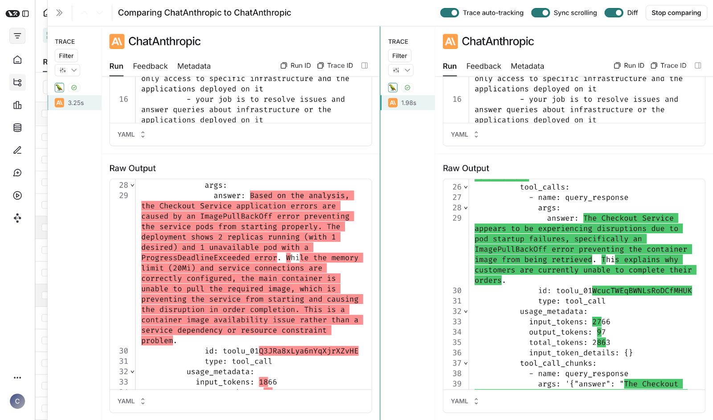
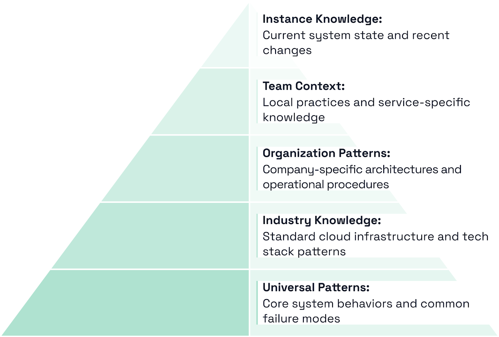

Cleric is an AI agent designed to help engineering teams debug production issues, focusing on the complex, time consuming investigations that often drain engineering productivity.

When an alert fires, Cleric automatically begins investigating using existing observability tools and infrastructure. Like a human engineer, Cleric examines multiple systems simultaneously - checking database metrics, network traffic, application logs, and system resources through read-only access to production systems. This parallel investigation approach helps quickly identify complex issues, like cascading failures across microservices.

Cleric communicates with teams through Slack, sharing its findings and asking for guidance when needed. There's no new tooling to learn – Cleric works with existing observability stacks, accessing logs, metrics, and traces just like a human engineer would.

## **Conducting concurrent investigations of production issues in LangSmith**

Production issues present unique learning opportunities that can't be reproduced later. Unlike code generation, production environments are stateful and dynamic. Once an issue is resolved, that exact system state is gone, along with the opportunity to learn from it.

The Cleric team needed to test different investigation approaches simultaneously. For instance, one investigation path might prioritize checking database connection pools and query patterns, while another focuses first on network traffic and system resources. This setup creates a complex matrix of concurrent investigations, as Cleric examines multiple systems using different investigation strategies.

This approach introduced a new challenge. How could the Cleric team monitor and compare the performance of different investigation strategies running simultaneously? And how could they determine which investigation approaches would work best for different types of issues?

LangSmith helped to address this problem by providing clear visibility into these parallel investigations and experiments. With LangSmith, the Cleric system can now:

- Compare different investigation strategies side-by-side
- Track investigation paths across all systems
- Aggregate performance metrics for different investigation approaches
- Tie user feedback directly to specific investigation strategies
- Perform direct comparisons of different approaches handling the same incident

LangSmith's tracing capabilities enabled the Cleric team to analyze investigation patterns across thousands of concurrent traces, measuring which approaches consistently lead to faster resolutions. This data-driven validation is crucial for building reliable autonomous systems, as relying on an approach that worked once isn’t enough to ensure it will be generalizable.

## **Tracking feedback & performance metrics to generalize insights across deployments**

Cleric learns continuously from interactions within each customer environment. When an engineering team provides feedback on an investigation - whether positive or negative - this creates an opportunity to improve future investigations. While learning within a single team or company is valuable, Cleric  also recognized the potential to generalize successful investigation strategies across all of our deployments.

The challenge is determining which learnings are specific to a team or company, and which represent broader patterns that could help all users. For example, a solution that works in one environment might depend on specific internal tools or processes that don't exist elsewhere.

Before generalizing any learnings, Cleric employs strict privacy controls and data anonymization. All customer specific details, proprietary information, and identifying data are stripped before any patterns are analyzed or shared.

Cleric uses LangSmith to manage this continuous learning process:

1. When Cleric completes an investigation, engineers provide feedback through their normal interactions with Cleric (Slack, ticketing systems, etc.)
2. This feedback is captured through LangSmith's feedback API and tied directly to the investigation trace. Cleric stores both the specific details of the investigation and the key patterns that led to its resolution.
3. The system analyzes these patterns to create generalized memories that strip away environment specific details while preserving the core problem-solving approach.
4. These generalized memories are then made available selectively during new investigations across all deployments. LangSmith helps track when and how these memories are used, and whether they improve investigation outcomes.
5. By comparing performance metrics across different teams, companies, and industries, Cleric can determine the appropriate scope for each learning. Some memories might only be useful within a specific team, while others provide value across all customer deployments.

LangSmith's tracing and metrics capabilities allow the Cleric team to measure the impact of these shared learnings. The system can compare investigation success rates, resolution times, and other key metrics before and after introducing new memories. This data-driven approach helps validate which learnings truly generalize across environments and which should remain local to specific customers.

This system allows Cleric to maintain separate knowledge spaces - customer specific context for unique environments and procedures, alongside a growing library of generalized problem solving patterns that benefit all users.

**Knowledge Hierarchy:** How Cleric Organizes Operational Learning

## **The path to autonomous,  self-healing systems**

Production systems are becoming more autonomous. The future of engineering is building products, not operating them. Every incident Cleric resolves advances this shift, systematically moving operations from human engineers to AI systems, letting teams focus on strategic work and product development.

Cleric is building this future systematically, expanding autonomous capabilities while maintaining the safety and control that production systems demand. Each investigation helps Cleric learn and improve, moving their customers toward truly self-healing infrastructure. To see how Cleric can help your team today, [reach out](https://cleric.io/?ref=blog.langchain.com).

### Tags

[Case Studies](https://blog.langchain.com/tag/case-studies/)

[**monday Service + LangSmith: Building a Code-First Evaluation Strategy from Day 1**](https://blog.langchain.com/customers-monday/)

[Case Studies](https://blog.langchain.com/tag/case-studies/) 8 min read

[**How Remote uses LangChain and LangGraph to onboard thousands of customers with AI**](https://blog.langchain.com/customers-remote/)

[Case Studies](https://blog.langchain.com/tag/case-studies/) 5 min read

[**Fastweb + Vodafone: Transforming Customer Experience with AI Agents using LangGraph and LangSmith**](https://blog.langchain.com/customers-vodafone-italy/)

[Case Studies](https://blog.langchain.com/tag/case-studies/) 7 min read

[**How Jimdo empower solopreneurs with AI-powered business assistance**](https://blog.langchain.com/customers-jimdo/)

[Case Studies](https://blog.langchain.com/tag/case-studies/) 4 min read

[**How ServiceNow uses LangSmith to get visibility into its customer success agents**](https://blog.langchain.com/customers-servicenow/)

[Case Studies](https://blog.langchain.com/tag/case-studies/) 4 min read

[**Monte Carlo: Building Data + AI Observability Agents with LangGraph and LangSmith**](https://blog.langchain.com/customers-monte-carlo/)

[Case Studies](https://blog.langchain.com/tag/case-studies/) 4 min read