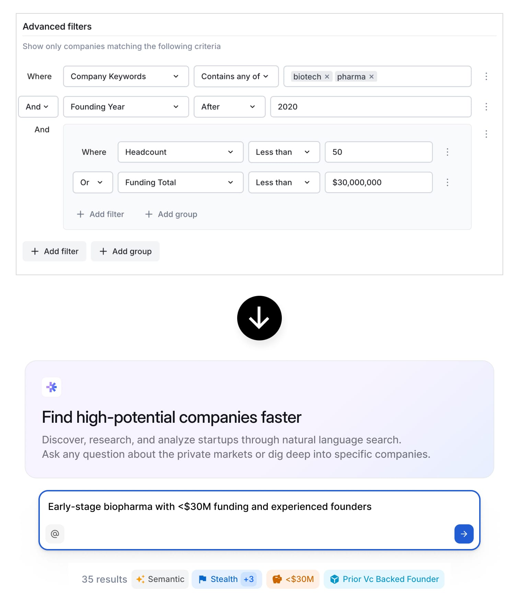
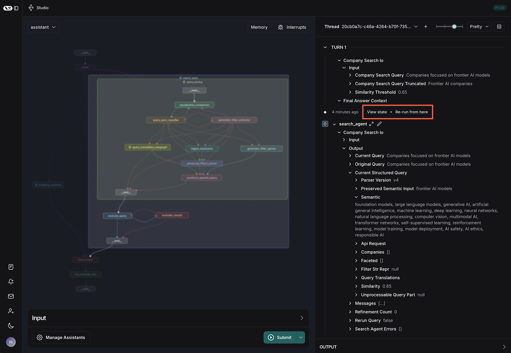
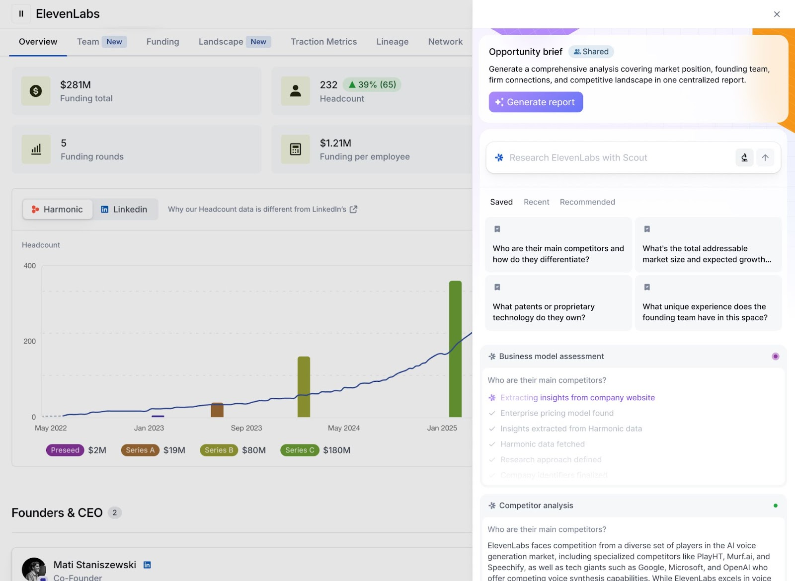
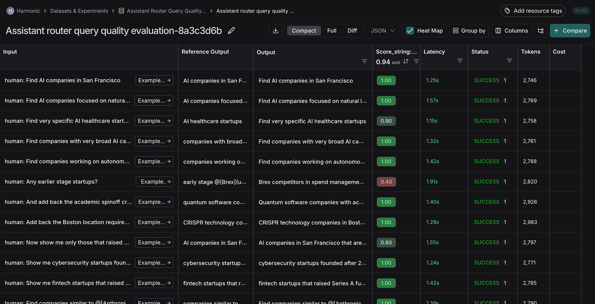
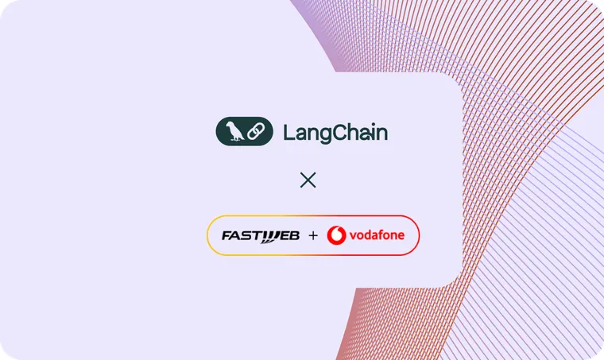

Harmonic is the startup discovery engine, tracking company formation and growth while providing valuable insights and workflow tools to venture capitalists (VCs). By aggregating vast amounts of public data and private data collected through partnerships with venture ecosystem players, Harmonic enables users to discover startups based on various criteria, enhancing their sourcing efforts. Using LangGraph and LangSmith, they’ve been able to move several steps further down the investment pipeline. With automatic market maps, research reports, and conversational interactions, VCs can now leverage Hamonic to pick and win the best deals in addition to sourcing.

## **Problem: Discovering the most exciting startups**

Navigating the complex landscape of early-stage startups is challenging for VCs and companies looking to connect with emerging businesses.  Historically, Harmonic has had an enormous search index, with a powerful search building UI.  For users, combining filters across hundreds of fields to find startups that met their interests was time-consuming at best, and prevented them from finding their best targets at worst.

Harmonic saw the need to enable far simpler and more effective search. By implementing natural language search and refinement capabilities on top of their extensive data, they aimed to significantly reduce the time it took for users to find the best-fit startups for their investment thesis.

# **LangGraph Studio for debugging agents & modular workflow**

The Harmonic team chose to build with [LangGraph](https://www.langchain.com/langgraph?ref=blog.langchain.com) due to its ecosystem approach. This allowed for a unified stack so Harmonic could host all their prompts in LangSmith, invoke their target models with LangChain, and build composable workflows in LangGraph with nodes directly linking to execution traces.

LangGraph Studio proved to be a game-changer for Harmonic's development process. The visual studio allowed engineers to track state, and directly link to any invoked LLMs in its exact invoked state, across every node in their agent workflows, significantly reducing debugging time.

> As CEO Max Ruderman notes: _"This UI is invaluable for debugging—instead of rerunning every node, we can directly inspect graph state at any point, make changes, re-run from that point, and observe the difference. Or open up that execution in Playground, with all the context from execution time already there so you can instantly experiment with different models or instructions."_

The modular framework of LangGraph empowered Harmonic to quickly bring agentic workflows to other parts of their product.  For example, because standalone workflows were modularized into subgraphs, they were able to bring a “research agent” (which was otherwise a subcomponent of a more complex workflow) to every company profile in their platform with almost no incremental backend work. That saves investors hours on screening, evaluation, and diligence, allowing them to show up prepared to every founder meeting.

By using LLMs to combine Harmonic’s millions of startup data points with live web data, Harmonic hoped to supercharge the insights and growth signals they could offer for early stage companies. But before LangGraph, building a reliable pipeline for real-time research on startup talent flow, market mapping, and media activity proved to be a tedious feat. Without a framework for composable development and graph visualization, tuning runs was a slow, iterative process of trial-and-error. Switching to LangGraph helped the team gain confidence that multiple engineers could collaborate on building these workflows quickly without introducing regressions.

Harmonic also leveraged LangGraph's capabilities to rapidly develop subgraphs for refining user intent and structuring search queries. This allowed them to create a sophisticated search agent capable of executing complex queries like: _"Show me AI companies in SF or NY that have raised funding in the last year from top investors and that have a connection to someone on my team, but no one on the team has been in touch with them in the last year."_

Now, investors can simply describe what they’re looking for—whether it’s a problem space, industry, a product that should exist, or a particular founder background—and Harmonic translates their natural language queries into precise, actionable search results.

# **LangSmith for evaluations & collaborative prompt iteration**

With [LangSmith](https://www.langchain.com/langsmith?ref=blog.langchain.com), the Harmonic team could track every model invocation with seamless integration into a playground environment. This gave the team visibility into their model performance and user interactions, something they had struggled to achieve with previous disparate systems.

A key feature that attracted Harmonic to LangSmith was its robust prompt versioning system. The Harmonic team has a collaborative approach to prompt engineering, with one engineer handling more of the model writing and prompt tuning, and others coming in to collaborate on prompt refinements. This collaborative environment extended to their fine-tuning efforts for custom models, where LangSmith's tracking capabilities provided essential data for optimization.

LangSmith's integration with LangGraph created a powerful development ecosystem that accelerated Harmonic's iteration cycles. The ability to link execution traces to specific prompts enabled developers to analyze performance patterns and make data-driven adjustments. When issues arose in their search agent, the team could quickly identify whether the problem stemmed from prompt design, model limitations, or graph structure.

Crucially, LangSmith made it incredibly easy to manage and view datasets and evaluations, which greatly sped up Harmonic’s development velocity. These evaluations ensured that any change to prompts or agent graph configurations could be tested against a suite of predefined metrics, whether at the level of individual nodes or the entire graph. This allowed the team to iterate rapidly and confidently, even as they frequently switched out underlying LLM models to keep pace with the latest advancements.

# **Impact & Conclusion**

The implementation of LangChain's LangSmith and LangGraph has significantly improved Harmonic's search and research capabilities. Users reach their "aha moment" faster, with searches delivering more relevant results—especially for the most creative queries. Time to value dropped from hours to under a minute, and positive search outcomes **increased by 30%.**

Harmonic was also able to add new capabilities, increasing the leverage they bring users throughout the investing funnel by offering instant market-maps and the ability to conduct research that combines Harmonic’s unique data with synthesized insights from the public web, the user’s CRM data, and network. Now, leading investors can rely on Harmonic to find, pick, and win the best deals out there.

### Tags

[Case Studies](https://blog.langchain.com/tag/case-studies/)

[**monday Service + LangSmith: Building a Code-First Evaluation Strategy from Day 1**](https://blog.langchain.com/customers-monday/)

[Case Studies](https://blog.langchain.com/tag/case-studies/) 8 min read

[**How Remote uses LangChain and LangGraph to onboard thousands of customers with AI**](https://blog.langchain.com/customers-remote/)

[Case Studies](https://blog.langchain.com/tag/case-studies/) 5 min read

[**Fastweb + Vodafone: Transforming Customer Experience with AI Agents using LangGraph and LangSmith**](https://blog.langchain.com/customers-vodafone-italy/)

[Case Studies](https://blog.langchain.com/tag/case-studies/) 7 min read

[**How Jimdo empower solopreneurs with AI-powered business assistance**](https://blog.langchain.com/customers-jimdo/)

[Case Studies](https://blog.langchain.com/tag/case-studies/) 4 min read

[**How ServiceNow uses LangSmith to get visibility into its customer success agents**](https://blog.langchain.com/customers-servicenow/)

[Case Studies](https://blog.langchain.com/tag/case-studies/) 4 min read

[**Monte Carlo: Building Data + AI Observability Agents with LangGraph and LangSmith**](https://blog.langchain.com/customers-monte-carlo/)

[Case Studies](https://blog.langchain.com/tag/case-studies/) 4 min read