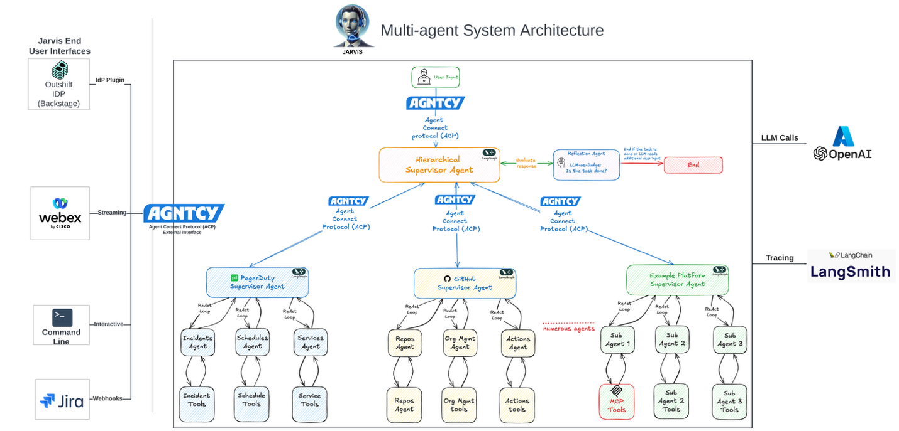

[Outshift](https://outshift.cisco.com/?ref=blog.langchain.com) is the incubation engine at Cisco, driving innovation in emerging technologies such as the Internet of Agents, Quantum, and next-generation infrastructure. The Platform Engineering team at Outshift offers foundational platform services to accelerate various incubation projects.

Platform Engineers manage complex, distributed cloud-native SaaS environments involving multiple heterogeneous systems. Monitoring and diagnosing issues in these systems often requires rapidly locating information across these runtime environments, telemetry systems, and documentation sites.

The small and mighty team of Platform engineers at Outshift had to context-switch and service frequent developer requests, ranging from access management to infrastructure provisioning, while developing new features to advance the platform. This led to:

- **Long wait times** for request fulfillment of simple and frequent requests, often taking days to complete.
- **Increased cognitive load** due to constant context switching between tools and workflows.
- **Operational inefficiencies**, where high-value engineering tasks were deprioritized in favor of routine platform maintenance.

# JARVIS: The AI Platform Engineer

To unlock a **10x productivity boost**, the Cisco Outshift Platform Engineering team developed [JARVIS](https://outshift.cisco.com/blog/jarvis-agentic-platform-engineering-outshift?ref=blog.langchain.com), an AI Platform Engineer designed as a **distributed Multi-Agent System (MAS)**.

JARVIS is orchestrated using [LangGraph](https://www.langchain.com/langgraph?ref=blog.langchain.com) for scalable and deterministic agent workflows and connected through the [AGNTCY Agent Connect Protocol (ACP),](https://docs.agntcy.org/pages/syntactic_sdk/connect.html?ref=blog.langchain.com) an open source standard protocol, to enable seamless agent-to-agent collaboration across systems.

### Key Features of JARVIS

**Knowledge Management**

JARVIS integrates with platform knowledge bases — including documentation, policies, Jira, and code repositories — using **Retrieval-Augmented Generation (RAG)** for unstructured data and **GraphRAG** for structured data to extract actionable insights from platform information.

**Self-Service Capabilities**

JARVIS automates many commonly requested developer tasks such as CI/CD onboarding, cloud resource provisioning, and developer sandbox environment setup — dramatically reducing turnaround times.

**Code Generation**

JARVIS simplifies Kubernetes deployments by translating natural language inputs into K8s manifests and infrastructure templates through a hybrid machine learning approach.

**Seamless UX Integration**

JARVIS surfaces agentic AI capabilities directly into familiar developer interfaces — including Jira, Backstage, Webex, and CLI — allowing developers to interact with autonomous workflows without changing their existing tools or habits.

## Agentic Blueprint Behind JARVIS

The development of JARVIS was grounded in [AGNTCY’s Four-Phase approach](https://outshift.cisco.com/blog/four-phases-for-development-of-multi-agent-apps?ref=blog.langchain.com) to building resilient multi-agent systems on the Internet of Agents, an open, interoperable platform for agent-to-agent collaboration:

**1\. Discover**

We mapped critical platform workflows with specialized first- and third-party agents, laying the foundation for multi-agentic system.

**2\. Compose**

Using LangGraph and the AGNTCY Agent Connect Protocol, we designed flexible, modular workflows where agents collaborate seamlessly across distributed environments.

**3\. Deploy**

JARVIS was operationalized across our cloud-native ecosystem, powered by the AGNTCY Workflow Server for scalable execution and coordination.

**4\. Evaluate**

Through continuous tracing, benchmarking, and feedback loops with LangSmith and agentevals, we refined agent behavior to drive consistent improvements over time.

This approach made JARVIS modular, scalable, and ready to evolve with our growing platform needs.

# How Developers Use JARVIS: Real Interfaces in Action

To maximize accessibility and adoption, JARVIS was integrated across multiple developer interfaces:

- **Jira**: Developers can assign tasks directly to the JARVIS AI Platform Engineer via Jira tickets. JARVIS autonomously executes the request and reaches out for additional input if needed.
- **Backstage**: A chat-based assistant embedded within our internal developer portal allows developers to trigger workflows and retrieve platform services seamlessly.
- **Webex**: A secure, conversational interface that delivers real-time notifications, task updates, and direct messaging interactions with JARVIS.
- **CLI**: Developers interact with JARVIS via the command line to provision sandbox applications, deploy infrastructure, and automate repetitive tasks with ease.

By meeting developers where they already work, JARVIS drives adoption while enhancing platform usability and responsiveness.

Below are some examples of JARVIS in action:

### _Assigning Jira task to JARVIS AI Engineer_

#### _Internal Developer Portal Chat Interface: User requesting an LLM Key using JARIVS_

#### _LangGraph Studio Demonstration of multi-agent tool calling_

## Impact of JARVIS at Outshift

JARVIS is  delivering significant productivity gains for Platform Engineering at Outshift:

- Tasks that previously took a week, such as setting up CI/CD pipelines, can now be completed **in under an hour**.
- **Provisioning resources** (e.g., S3 buckets, EC2 instances, LLM access keys) is now **instantaneous**, reducing what used to be half-day tasks to just **seconds**.
- Back-and-forth communication between developers and Platform Engineering for routine tasks has been **eliminated**, thanks to JARVIS’s ability to autonomously guide developers and retrieve needed information.
- **The organization now handles a significantly higher volume of requests** with the same team size, while also reducing burnout and improving overall efficiency.

## Key Learnings in Building JARVIS AI Platform Engineer

1. [Internet of Agents](https://outshift.cisco.com/the-internet-of-agents?ref=blog.langchain.com)(IoA) unlocks the true potential of Multi-Agent Systems: The future of platform engineering lies in multi-agent systems, where the seamless integration of first-party and third-party distributed agents automate complex platform workflows.
2. Open standards like the [AGNTCY Agent Connect Protocol (ACP)](https://docs.agntcy.org/pages/syntactic_sdk/connect.html?ref=blog.langchain.com) enable reliable agent-to-agent communication across heterogeneous systems, while frameworks like **LangGraph** provide scalable, deterministic workflow orchestration
3. Structuring multi-agent systems around the [Four Phases](https://outshift.cisco.com/blog/four-phases-for-development-of-multi-agent-apps?ref=blog.langchain.com) — Discover, Compose, Deploy, and Evaluate — enables agent discoverability, promotes agent-to-agent collaboration, drives reuse, and simplifies the creation of complex, deterministic multi-agent systems.
4. **Seamless UX Integration is essential for agentic workflows.** Embedding agentic capabilities directly into existing developer tools — Jira, CLI, developer portals — is critical for adoption. Combining GenAI-driven agent outputs with traditional interfaces ensures users can interact intuitively with complex workflows without changing their daily routines.
5. **Continuous evaluation and benchmarking ensure reliability,** Delivering trustworthy agentic systems requires continuous tracing, monitoring, and performance evaluation. Using tracing solutions like **LangSmith** and evaluation frameworks like **agentevals** allows teams to analyze agent reasoning patterns, detect inconsistencies, and refine system performance to ensure high accuracy at scale.

* * *

**The Future of Agentic AI in Platform Engineering**

Outshift is pioneering the integration of agentic AI into platform engineering — building ecosystems where AI agents amplify human potential, enhance collaboration, and accelerate innovation. Their work with **JARVIS** is just the beginning. They're pushing the boundaries of what’s possible with AI-powered platforms, creating new foundations for the Internet of Agents.

To see how the broader ecosystem is evolving, visit [**agntcy.org**](https://agntcy.org/?ref=blog.langchain.com) — where the Outshift team is helping to build the collaboration layer that will let AI agents work together seamlessly.

[_Explore how Outshift is driving the future of AI in platform engineering._](https://outshift.cisco.com/blog/topic/platform-engineering?ref=blog.langchain.com)

[_Learn more about Outshift Incubations_](https://outshift.cisco.com/?ref=blog.langchain.com)

### Tags

[Case Studies](https://blog.langchain.com/tag/case-studies/)

[**monday Service + LangSmith: Building a Code-First Evaluation Strategy from Day 1**](https://blog.langchain.com/customers-monday/)

[Case Studies](https://blog.langchain.com/tag/case-studies/) 8 min read

[**How Remote uses LangChain and LangGraph to onboard thousands of customers with AI**](https://blog.langchain.com/customers-remote/)

[Case Studies](https://blog.langchain.com/tag/case-studies/) 5 min read

[**Fastweb + Vodafone: Transforming Customer Experience with AI Agents using LangGraph and LangSmith**](https://blog.langchain.com/customers-vodafone-italy/)

[Case Studies](https://blog.langchain.com/tag/case-studies/) 7 min read

[**How Jimdo empower solopreneurs with AI-powered business assistance**](https://blog.langchain.com/customers-jimdo/)

[Case Studies](https://blog.langchain.com/tag/case-studies/) 4 min read

[**How ServiceNow uses LangSmith to get visibility into its customer success agents**](https://blog.langchain.com/customers-servicenow/)

[Case Studies](https://blog.langchain.com/tag/case-studies/) 4 min read

[**Monte Carlo: Building Data + AI Observability Agents with LangGraph and LangSmith**](https://blog.langchain.com/customers-monte-carlo/)

[Case Studies](https://blog.langchain.com/tag/case-studies/) 4 min read