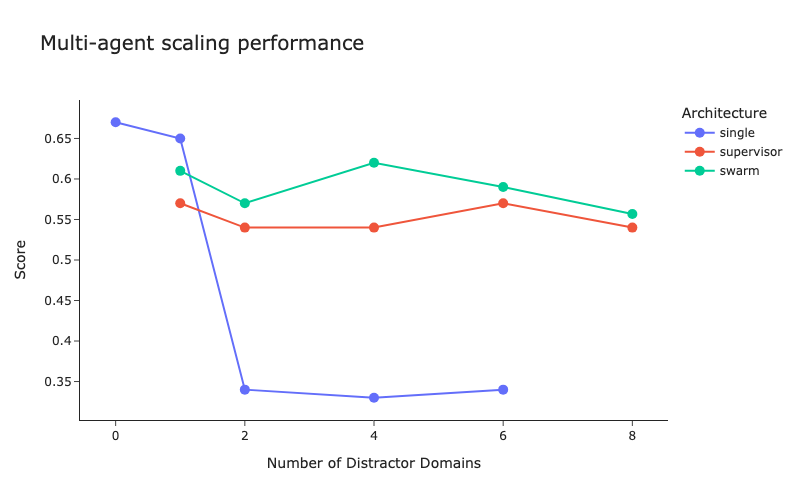
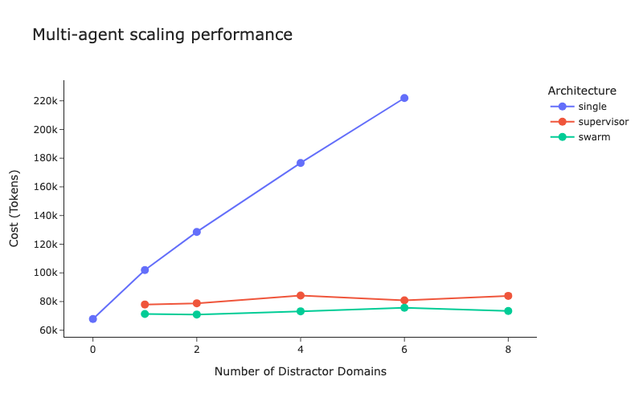
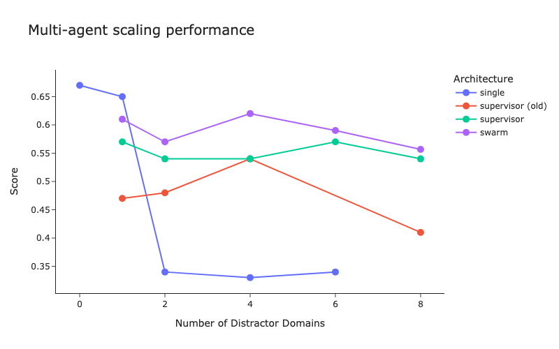

By Will Fu-Hinthorn

In this blog, we explore a few common multi-agent architectures. We discuss both the motivations and constraints of different architectures. We benchmark their performance on a variant of the Tau-bench dataset. Finally, we discuss improvements we made to our [“supervisor” implementation](https://github.com/langchain-ai/langgraph-supervisor-py?ref=blog.langchain.com) that yielded a nearly 50% increase in performance on this benchmark.

# Motivators for multi-agent systems

A few months ago, we [benchmarked how well a single agent architecture](https://blog.langchain.com/react-agent-benchmarking/) scaled with increasing tool count and other context-size. We found a significant decrease in performance with increased context-size, even if that context was irrelevant to the target task. Scaling a system to handle more tools & contexts is one common motivation for multi-agent systems.

Another motivator for multi-agent systems is to follow engineering best practices. Many teams we talk to prefer to design separate agents as they are more modular, which makes them easier to update, evaluate, maintain, and parallelize.

A final motivator for multi-agent systems is that many agents will be developed by different developers and teams. In this case, a naive single agent architecture may not be feasible. If each agent is able to contribute something unique, an effective multi-agent system can achieve more than a given agent in isolation.

For these reasons, we think multi-agent architectures will become more prevalent.

# Generic vs custom architectures

Today, most of the teams building multi-agent architectures do so for vertical-specific applications. The majority of the multi-agent architectures we see today are pretty custom in nature. This is because custom cognitive architectures - when thought through carefully - yield better results for that specific domain than generic ones.

Still, generic multi-agent architectures are interesting for a few reasons.

**Ease of getting started.** Generic multi-agent architectures make it easier to get started with multi-agent systems. A simple agent architecture where all communication is done via “tool-calling” is often less _performant_ than an application-specific workflow, but it’s much easier to use as a starting point.

**“Bring your own agents”**. If you are building a general-purpose agent, you may want others to “bring your own agent”. Connecting to these would require a pretty generic architecture. We’ve seen this pattern play out with connections to standard APIs through MCP (”bring your own tool”). The way that clients (Claude, Cursor, etc) use MCP tools is generic. We imagine a similar thing happening with agents.

So - what is the best generic multi-agent architecture?

## Data

We ran experiments over a modified version of **τ-bench, by Yao, et. al.** ( [link](https://arxiv.org/abs/2406.12045?ref=blog.langchain.com)). τ-bench was designed to test different _single-agent_ cognitive architectures / prompting strategies on real-world scenarios (such as retail customer support, flight booking, etc.). Our modified version of the dataset and experiment code can be found in the [multi-agent bench repo here](https://github.com/hinthornw/mabench?ref=blog.langchain.com).

To more effectively test how multi-agent systems scale to handle more complicated domains, we added 6 additional environments to the dataset: home improvement, tech support, pharmacy, automotive, restaurant, and Spotify playlist management. Each environment had a corresponding 19 distinct tools to facilitate interactions over the respective domain as well as a “wiki” containing instructions related to the domain. None of these synthetic domains are required (or useful) for the completion of any of the tasks in the original dataset. These environments were designed purely as realistic “distractors”, testing how well each agent setup could perform when other (unrelated) tools and instruction sets are provided “just in case”.

We ran experiments over the first 100 examples from **τ-bench’s** retail domain’s test split, providing increasing number of distractor environments to the agent to show how each system balances the additional context. This tests the “best-case performance” for how common agent systems can scale. We call this “best-case” since the auxiliary domains are not required to successfully complete each task. Very little coordination is required in practice to pass a test case, apart from filtering out irrelevant tools and instructions from the total set of actions the system could theoretically take.

# Experiments

We experimented with three different architectures. We used `gpt-4o` as the model for all these experiments.

Note: depending on your application’s constraints, some of these architectures may be infeasible. We always recommend starting from your goals (definitions of success) and constraints when picking a design pattern.

**Single Agent**

This is a tool-calling agent with a single prompt and access to tools and instructions from all domains. This is the baseline upon which we want to improve.

For the implementation we used the LangGraph `create_react_agent` implementation.

Note: this architecture may not feasible in all cases. For example, if you want one of the sub-domains to be handled by a third-party agent, you by definition cannot have a single agent.

**Swarm**

In this architecture, each sub-agent is aware of and can hand-off any other agent in the group (or swarm). If an agent responds, that is sent directly to the user. When an agent is active, it will remain active until it hands off to a different agent. Only one agent can be active at any given time.

For the implementation we used the LangGraph `langgraph-swarm` package.

Note: this architecture may not feasible in all cases. This requires each sub-agent knowing all other agents in the architecture. If you are working with third-party agents, this likely will not be the case. You also likely won’t want third-party agents to remain “active” when interacting with your user.

**Supervisor**

In this architecture, a single “supervisor” agent receives user input and delegates work to sub-agents. When the sub-agent responds, control is handed back to the supervisor agent. Only the supervisor agent can respond to the user.

For the implementation we used the LangGraph `langgraph-supervisor` package.

Note: this architecture places very little assumptions on the sub agents, and so should be feasible for all multi-agent scenarios.

# Results & Analysis

We show results across two dimensions:

- Score: as measured by XYZ, which Tau Bench uses
- Cost (Tokens): number of tokens used for each experiment

## Score

We see that the single agent baseline falls off sharply when there are two or more distractor domains. When there is only a single distractor domain the single agent performs slightly better.

We see that the swarm architecture slightly outperforms supervisor architecture across the board. Looking at the data, the drop in performance arises due to the “translation” the supervisor is doing. This occurs because the sub agents cannot respond to the user directly in the supervisor architecture, while in the swarm architecture they can. If you’ve ever played a game of “telephone”, you’re already familiar with this problem!

## Cost (Tokens)

We see that the single agent uses consistently more tokens as the number of distractor domains grows, while supervisor and swarm remain flat.

We can see that supervisor consistently uses more tokens than swarm. This is once again due to the “translation” that the supervisor does. This occurs because the sub agents cannot respond to the user directly in the supervisor architecture, while in the swarm architecture they can.

# Improvements to supervisor

When we initially tested the supervisor approach it performed quite poorly. It was only after a few changes that it started to perform better.

Here is a chart with the old supervisor implementation included:

Most of the performance issues for the supervisor architecture came from the “translation” occurring when the supervisor agent had to play telephone between the sub agents and the user. Most of the changes we made to bridge the gap were designed to remove the impact of that game of telephone.

Note: all of these changes are included as options in the newest version of `langgraph_supervisor`.

**Removing handoff messages**

Remove the handoff messages from the sub-agent’s state so the assigned agent doesn’t have to view the supervisor’s routing logic. This de-clutters the sub-agent’s context window and lets it perform it’s task better. Even with recent models, clutter in the context can have outsized impacts on agent reliability.

**Forwarding messages**

Give the supervisor access to a `forward_message` tool. This tool lets it “forward” the sub agent’s response directly to the user without re-generating the full content. This reduced errors caused by the supervisor agent paraphrasing the sub agent incorrectly.

**Tool naming**

Test different framings for the tool name that the supervisor agent would call to handoff to a sub agent (”delegate\_to\_<agent>” vs “transfer\_to\_<agent>”)

# Future work

There are several next steps we would like to explore.

**Multi-hop across agents**

Right now, all questions only require a single sub agent to respond. We would like to explore performance on questions that require multiple sub agents.

**Matching single agent performance**

Why don’t swarm and supervisor perform as well as single agent when there is a single distractor domain? Most of the main errors were due to “translation” mistakes and degraded performance with additional context (from the handoffs). We managed to reduce them somewhat, but performance still lags behind single agent. What can be done to increase performance to that level?

**Skipping the “translation” layer**

Most of the mistakes of supervisor happen because of the “translation” layer, where only the supervisor agent is allowed to respond to the user. Is there some way to skip this translation layer more effectively, while still properly delegating work and ensuring responses are made with the full task context?

**Other architectures**

Are the other architectures out there that may yield better results? How does this compare to “agents-as-tools”?

# Conclusion

We think multi-agent systems will become more prevalent. While most successful multi-agent systems today have a relatively custom architecture, we think that as models improve, generic architectures will become sufficiently reliable for their benefits of ease of development outweigh their performance weaknesses. The `supervisor` architecture is the most generic one (in that it makes the fewest assumptions about the underlying agents), but a naive implementation of the supervisor architecture may have worse results. Using improvements in how information is passed between sub-agents and the user (and in how context is managed) can help the system perform better while retaining an ability to scale across many domains. You can use the ones we’ve made available in the [`langgraph-supervisor`](https://github.com/langchain-ai/langgraph-supervisor-py?ref=blog.langchain.com) and evaluate your system on your data using a tool like [LangSmith](https://smith.langchain.com/?ref=blog.langchain.com).

If you want to try out the supervisor architecture easily (including all the improvements we made as a result of this research) you can easily do so with [`langgraph-supervisor`](https://github.com/langchain-ai/langgraph-supervisor-py?ref=blog.langchain.com).