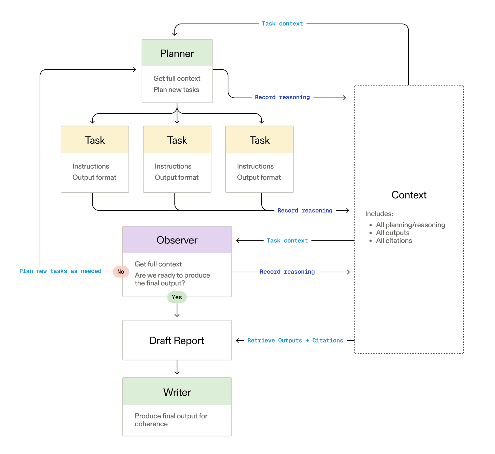
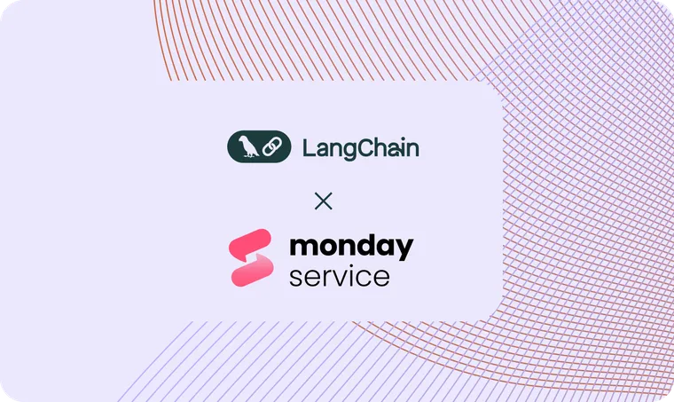

[Exa](https://exa.ai/?ref=blog.langchain.com), known for their high-quality search API, recently launched their most ambitious product yet: a deep research agent that can autonomously explore the web until it finds the structured information users need.

This case study explores how Exa's engineering team leveraged LangGraph to build a production-ready multi-agent system that processes hundreds of research queries daily, delivering structured results in 15 seconds to 3 minutes, depending on complexity.

## The evolution to agentic search

Exa didn't begin with agentic search, but evolved into it. The company started with a search API, then progressed to an answers endpoint that combined LLM reasoning with search results. Finally, they've now arrived at their deep research agent: their first truly agentic search API.

This reflects a broader trend across the industry: LLM applications are becoming more agentic and long-running over time. For example, we see this in research-related tasks – where what started as RAG has evolved into Deep Research. We see this in coding as well, shifting from simple auto-complete to question-answering, and now to asynchronous, long-running coding agents.

This evolution is also reshaping how teams think about and utilize frameworks and tools. We've long been close partners with the Exa team via a [popular open-source integration](https://python.langchain.com/docs/integrations/tools/exa_search/?ref=blog.langchain.com), but hadn't collaborated with them on a product until now. Their original answers endpoint didn't rely on framework, but as they transitioned to a more complex deep-research architecture, they reevaluated their options and chose to use LangGraph. This again mimics a common trend we see — as architectures get more complex, LangGraph increasingly becomes the framework of choice for building systems.

## Multi-agent architecture design

Exa's research agent follows a sophisticated multi-agent pattern built entirely on LangGraph:

1. **Planner**: Analyzes the research query and dynamically generates multiple parallel tasks
2. **Tasks**: Independent research units that can use specialized tools and reasoning
3. **Observer**: Maintains full context across all planning, reasoning, outputs, and citations

A key insight in Exa's architecture is its intentional context engineering. While the observer maintains full visibility across all components, individual tasks only receive the final cleaned outputs from other tasks, not intermediate reasoning states.

Unlike rigid workflows, Exa's system dynamically adjusts the number of research tasks to spin up based on the complexity of the query. Each task receives:

- Specific task instructions
- A required output format (always JSON schema)
- Access to specialized Exa API tools

This flexibility allows the system to scale from simple single-task queries to complex, multi-faceted research requiring numerous parallel investigations.

## Evolving the agent blueprint

Many of Exa's design choices mirror those in the [Anthropic Deep Research system](https://www.anthropic.com/engineering/built-multi-agent-research-system?ref=blog.langchain.com). This is intentional. Like us, the Exa team read that blog post, thought it was fantastic, and drew many learnings from it.

Here are a few key of their insights and decisions that build on top of those learnings:

### Search Snippets vs Full Results

One of the most interesting examples of context engineering in Exa's system is how it handles search content. Rather than automatically crawling full page content, the system first attempts reasoning on search snippets.

This approach significantly reduces token usage while preserving research quality, as the agent only requests full content when snippet-level reasoning proves insufficient. This ability to swap between search snippets and full results is powered by the Exa API.

### Structured Output

Unlike many research systems that produce unstructured reports, Exa's agent maintains structured JSON output at every level. The output format can be specified at runtime.

This design choice was driven by how Exa expects the agent to be used. Unlike consumer-facing research tools, they designed their system specifically for API consumption. When being used as an API, having a reliable output format is more critical. This structured output is generated via function calling.

## Gaining observability with LangSmith

For Exa, one of the most critical LangSmith features was observability, especially around token usage.

> "The observability – understanding the token usage – that LangSmith provided was really important. It was also super easy to set up." – Mark Pekala, Software Engineer at Exa.

This visibility into token consumption, caching rates, and reasoning token usage proved essential for informing Exa's production pricing models and ensuring cost-effective performance at scale.

## Conclusion

Exa's deep research agent demonstrates how LangGraph enables sophisticated multi-agent systems in production. By leveraging LangGraph's coordination capabilities and LangSmith's observability features, Exa built a system that processes real customer queries with impressive speed and reliability.

The key takeaways for teams building similar systems:

1. **Start with observability**: Token tracking and system visibility are critical for production deployment
2. **Design for reusability**: Well-architected agent flows can power multiple products
3. **Prioritize structured output**: API consumers need reliable, parseable results
4. **Dynamic task generation**: Flexible task creation scales better than rigid workflows

As the agent ecosystem continues to evolve, Exa's implementation provides a compelling example of how to build production-ready agentic systems that deliver real business value.

* * *

_To learn more about building multi-agent systems with LangGraph, visit our documentation at_ [_langchain-ai.github.io/langgraph_](https://langchain-ai.github.io/langgraph?ref=blog.langchain.com) _. To try Exa's deep research API, visit_ [_exa.ai_](https://exa.ai/?ref=blog.langchain.com) _._

### Tags

[Case Studies](https://blog.langchain.com/tag/case-studies/)

[**monday Service + LangSmith: Building a Code-First Evaluation Strategy from Day 1**](https://blog.langchain.com/customers-monday/)

[Case Studies](https://blog.langchain.com/tag/case-studies/) 8 min read

[**How Remote uses LangChain and LangGraph to onboard thousands of customers with AI**](https://blog.langchain.com/customers-remote/)

[Case Studies](https://blog.langchain.com/tag/case-studies/) 5 min read

[**Fastweb + Vodafone: Transforming Customer Experience with AI Agents using LangGraph and LangSmith**](https://blog.langchain.com/customers-vodafone-italy/)

[Case Studies](https://blog.langchain.com/tag/case-studies/) 7 min read

[**How Jimdo empower solopreneurs with AI-powered business assistance**](https://blog.langchain.com/customers-jimdo/)

[Case Studies](https://blog.langchain.com/tag/case-studies/) 4 min read

[**How ServiceNow uses LangSmith to get visibility into its customer success agents**](https://blog.langchain.com/customers-servicenow/)

[Case Studies](https://blog.langchain.com/tag/case-studies/) 4 min read

[**Monte Carlo: Building Data + AI Observability Agents with LangGraph and LangSmith**](https://blog.langchain.com/customers-monte-carlo/)

[Case Studies](https://blog.langchain.com/tag/case-studies/) 4 min read